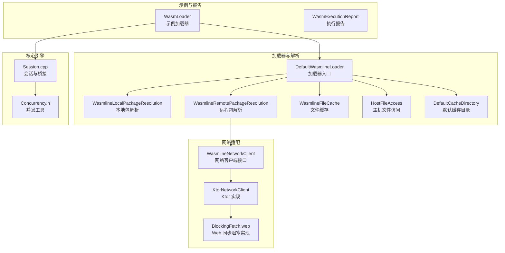
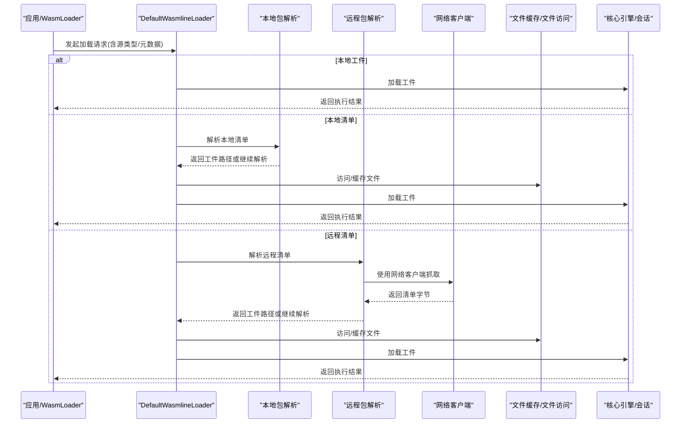
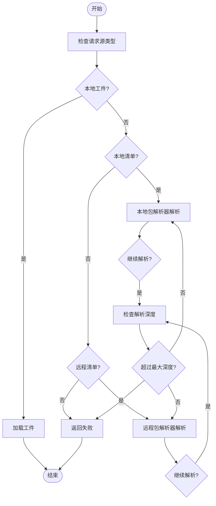
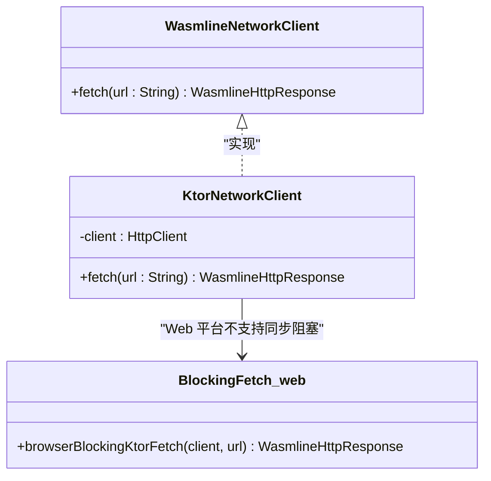
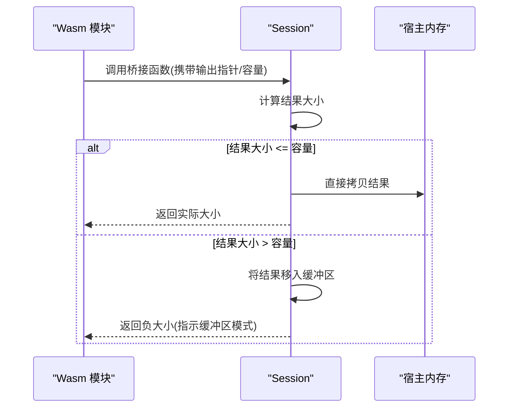
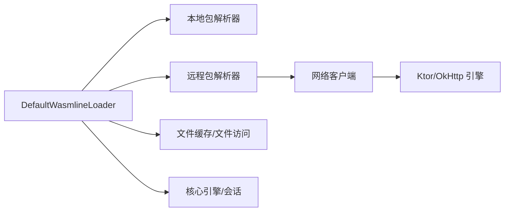

# 集成测试

<cite>
**本文引用的文件**
- [DefaultWasmlineLoader.kt](file://wasmline-multiplatform/wasmline-loader/src/hostMain/kotlin/crow/wasmline/loader/DefaultWasmlineLoader.kt)
- [WasmlineRemotePackageResolutionTest.kt](file://wasmline-multiplatform/wasmline-loader/src/jvmTest/kotlin/crow/wasmline/loader/WasmlineRemotePackageResolutionTest.kt)
- [DefaultWasmlineLoaderTest.kt](file://wasmline-multiplatform/wasmline-loader/src/jvmTest/kotlin/crow/wasmline/loader/DefaultWasmlineLoaderTest.kt)
- [WasmlineNetworkClient.kt](file://wasmline-multiplatform/wasmline/src/commonMain/kotlin/crow/wasmline/WasmlineNetworkClient.kt)
- [KtorNetworkClient.kt](file://wasmline-multiplatform/wasmline-network-ktor/src/commonMain/kotlin/crow/wasmline/network/ktor/KtorNetworkClient.kt)
- [BlockingFetch.web.kt](file://wasmline-multiplatform/wasmline-network-ktor/src/webMain/kotlin/crow/wasmline/network/ktor/BlockingFetch.web.kt)
- [WasmLoader.kt](file://wasmline-samples/kotlin/sample-apps/multiplatform/shared/src/commonMain/kotlin/crow/wasmline/sample/WasmLoader.kt)
- [Concurrency.h](file://wasmline-core/include/extensions/Concurrency.h)
- [Session.cpp](file://wasmline-core/src/Session.cpp)
- [WasmlineLocalPackageResolution.kt](file://wasmline-multiplatform/wasmline-loader/src/hostMain/kotlin/crow/wasmline/loader/internal/WasmlineLocalPackageResolution.kt)
- [WasmlineRemotePackageResolution.kt](file://wasmline-multiplatform/wasmline-loader/src/hostMain/kotlin/crow/wasmline/loader/internal/WasmlineRemotePackageResolution.kt)
- [DefaultCacheDirectory.kt](file://wasmline-multiplatform/wasmline-loader/src/hostMain/kotlin/crow/wasmline/loader/internal/DefaultCacheDirectory.kt)
- [HostFileAccess.kt](file://wasmline-multiplatform/wasmline-loader/src/hostMain/kotlin/crow/wasmline/loader/internal/HostFileAccess.kt)
- [WasmlineFileCache.kt](file://wasmline-multiplatform/wasmline-loader/src/hostMain/kotlin/crow/wasmline/loader/internal/WasmlineFileCache.kt)
- [WasmExecutionReport](file://wasmline-samples/kotlin/sample-apps/multiplatform/shared/src/commonMain/kotlin/crow/wasmline/sample/WasmLoader.kt)
</cite>

## 目录
1. [引言](#引言)
2. [项目结构](#项目结构)
3. [核心组件](#核心组件)
4. [架构总览](#架构总览)
5. [详细组件分析](#详细组件分析)
6. [依赖关系分析](#依赖关系分析)
7. [性能考虑](#性能考虑)
8. [故障排查指南](#故障排查指南)
9. [结论](#结论)
10. [附录](#附录)

## 引言
本文件面向测试工程师，提供 Wasmline 集成测试的完整指导。内容覆盖加载器系统的远程包解析、本地包解析与默认加载器测试；跨组件交互测试（网络客户端、文件系统、外部依赖）；测试环境搭建（测试数据库、模拟服务、外部系统依赖）；测试数据管理与环境隔离策略；以及性能与并发集成测试方法。目标是帮助团队建立稳定、可维护且可扩展的集成测试体系。

## 项目结构
Wasmline 采用多模块的多平台架构，集成测试主要围绕以下模块展开：
- wasmline-loader：加载器与包解析链路的核心实现与测试
- wasmline-network-ktor / wasmline-network-okhttp：网络客户端适配层
- wasmline-core：底层引擎与会话交互（C++）
- wasmline-samples：示例应用与执行报告（用于端到端验证）

下图给出与集成测试相关的关键模块与文件关系概览：

图表来源
- [DefaultWasmlineLoader.kt:1-46](file://wasmline-multiplatform/wasmline-loader/src/hostMain/kotlin/crow/wasmline/loader/DefaultWasmlineLoader.kt#L1-L46)
- [WasmlineLocalPackageResolution.kt](file://wasmline-multiplatform/wasmline-loader/src/hostMain/kotlin/crow/wasmline/loader/internal/WasmlineLocalPackageResolution.kt)
- [WasmlineRemotePackageResolution.kt](file://wasmline-multiplatform/wasmline-loader/src/hostMain/kotlin/crow/wasmline/loader/internal/WasmlineRemotePackageResolution.kt)
- [WasmlineFileCache.kt](file://wasmline-multiplatform/wasmline-loader/src/hostMain/kotlin/crow/wasmline/loader/internal/WasmlineFileCache.kt)
- [HostFileAccess.kt](file://wasmline-multiplatform/wasmline-loader/src/hostMain/kotlin/crow/wasmline/loader/internal/HostFileAccess.kt)
- [DefaultCacheDirectory.kt](file://wasmline-multiplatform/wasmline-loader/src/hostMain/kotlin/crow/wasmline/loader/internal/DefaultCacheDirectory.kt)
- [WasmlineNetworkClient.kt:1-41](file://wasmline-multiplatform/wasmline/src/commonMain/kotlin/crow/wasmline/WasmlineNetworkClient.kt#L1-L41)
- [KtorNetworkClient.kt:1-43](file://wasmline-multiplatform/wasmline-network-ktor/src/commonMain/kotlin/crow/wasmline/network/ktor/KtorNetworkClient.kt#L1-L43)
- [BlockingFetch.web.kt:1-11](file://wasmline-multiplatform/wasmline-network-ktor/src/webMain/kotlin/crow/wasmline/network/ktor/BlockingFetch.web.kt#L1-L11)
- [Concurrency.h:1-33](file://wasmline-core/include/extensions/Concurrency.h#L1-L33)
- [Session.cpp:531-566](file://wasmline-core/src/Session.cpp#L531-L566)
- [WasmLoader.kt:37-241](file://wasmline-samples/kotlin/sample-apps/multiplatform/shared/src/commonMain/kotlin/crow/wasmline/sample/WasmLoader.kt#L37-L241)

章节来源
- [DefaultWasmlineLoader.kt:1-46](file://wasmline-multiplatform/wasmline-loader/src/hostMain/kotlin/crow/wasmline/loader/DefaultWasmlineLoader.kt#L1-L46)
- [WasmlineNetworkClient.kt:1-41](file://wasmline-multiplatform/wasmline/src/commonMain/kotlin/crow/wasmline/WasmlineNetworkClient.kt#L1-L41)

## 核心组件
- 默认加载器 DefaultWasmlineLoader：负责根据请求源类型（本地工件、本地清单、远程清单）进行解析与加载，并在超深解析时返回失败状态，避免循环或无限递归。
- 远程包解析 WasmlineRemotePackageResolution：在未配置自定义解析器时，优先使用网络客户端抓取远程清单；若无网络客户端也无自定义解析器，则返回失败。
- 本地包解析 WasmlineLocalPackageResolution：用于将本地清单路径解析为具体工件路径，当前测试表明顶层请求直接使用本地清单尚未实现，需通过解析器链路委托。
- 网络客户端接口 WasmlineNetworkClient：统一的阻塞式 HTTP 抓取抽象，Ktor 与 OkHttp 提供多平台实现；Web 平台不支持同步阻塞调用。
- 文件系统与缓存：HostFileAccess、WasmlineFileCache、DefaultCacheDirectory 提供主机文件访问与缓存能力，保障加载器在不同平台的一致行为。
- 示例加载器 WasmLoader 与执行报告 WasmExecutionReport：用于端到端验证加载与调用流程，输出耗时与日志等指标。

章节来源
- [DefaultWasmlineLoader.kt:1-46](file://wasmline-multiplatform/wasmline-loader/src/hostMain/kotlin/crow/wasmline/loader/DefaultWasmlineLoader.kt#L1-L46)
- [WasmlineRemotePackageResolution.kt](file://wasmline-multiplatform/wasmline-loader/src/hostMain/kotlin/crow/wasmline/loader/internal/WasmlineRemotePackageResolution.kt)
- [WasmlineLocalPackageResolution.kt](file://wasmline-multiplatform/wasmline-loader/src/hostMain/kotlin/crow/wasmline/loader/internal/WasmlineLocalPackageResolution.kt)
- [WasmlineNetworkClient.kt:1-41](file://wasmline-multiplatform/wasmline/src/commonMain/kotlin/crow/wasmline/WasmlineNetworkClient.kt#L1-L41)
- [HostFileAccess.kt](file://wasmline-multiplatform/wasmline-loader/src/hostMain/kotlin/crow/wasmline/loader/internal/HostFileAccess.kt)
- [WasmlineFileCache.kt](file://wasmline-multiplatform/wasmline-loader/src/hostMain/kotlin/crow/wasmline/loader/internal/WasmlineFileCache.kt)
- [DefaultCacheDirectory.kt](file://wasmline-multiplatform/wasmline-loader/src/hostMain/kotlin/crow/wasmline/loader/internal/DefaultCacheDirectory.kt)
- [WasmLoader.kt:37-241](file://wasmline-samples/kotlin/sample-apps/multiplatform/shared/src/commonMain/kotlin/crow/wasmline/sample/WasmLoader.kt#L37-L241)

## 架构总览
下图展示从应用发起加载请求到最终执行服务的端到端流程，包括加载器、网络客户端、文件系统与核心引擎之间的交互。

图表来源
- [DefaultWasmlineLoader.kt:1-46](file://wasmline-multiplatform/wasmline-loader/src/hostMain/kotlin/crow/wasmline/loader/DefaultWasmlineLoader.kt#L1-L46)
- [WasmlineRemotePackageResolution.kt](file://wasmline-multiplatform/wasmline-loader/src/hostMain/kotlin/crow/wasmline/loader/internal/WasmlineRemotePackageResolution.kt)
- [WasmlineLocalPackageResolution.kt](file://wasmline-multiplatform/wasmline-loader/src/hostMain/kotlin/crow/wasmline/loader/internal/WasmlineLocalPackageResolution.kt)
- [WasmlineNetworkClient.kt:1-41](file://wasmline-multiplatform/wasmline/src/commonMain/kotlin/crow/wasmline/WasmlineNetworkClient.kt#L1-L41)
- [WasmLoader.kt:37-241](file://wasmline-samples/kotlin/sample-apps/multiplatform/shared/src/commonMain/kotlin/crow/wasmline/sample/WasmLoader.kt#L37-L241)
- [Session.cpp:531-566](file://wasmline-core/src/Session.cpp#L531-L566)

## 详细组件分析

### 加载器系统：远程包解析与默认加载器测试
- 远程包解析测试要点
  - 无网络客户端且无自定义解析器时，应返回失败，提示缺少远程解析器或网络客户端。
  - 自定义远程解析器优先于网络客户端；若提供自定义解析器，不应调用网络客户端。
  - 解析链深度超过阈值时，返回失败，防止循环或过深解析。
- 默认加载器测试要点
  - 顶层请求直接使用本地清单路径时，当前实现会拒绝该输入，提示需要通过解析器链路委托。
  - 本地清单可通过本地包解析器转换为本地工件路径，随后加载。
  - 远程清单可通过远程解析器下载清单并继续解析为本地工件路径，随后加载。
  - 失败场景包括：解析器缺失、工件不存在、解析深度超限等。

图表来源
- [DefaultWasmlineLoader.kt:1-46](file://wasmline-multiplatform/wasmline-loader/src/hostMain/kotlin/crow/wasmline/loader/DefaultWasmlineLoader.kt#L1-L46)
- [WasmlineRemotePackageResolutionTest.kt:67-86](file://wasmline-multiplatform/wasmline-loader/src/jvmTest/kotlin/crow/wasmline/loader/WasmlineRemotePackageResolutionTest.kt#L67-L86)
- [DefaultWasmlineLoaderTest.kt:1-100](file://wasmline-multiplatform/wasmline-loader/src/jvmTest/kotlin/crow/wasmline/loader/DefaultWasmlineLoaderTest.kt#L1-L100)

章节来源
- [DefaultWasmlineLoader.kt:1-46](file://wasmline-multiplatform/wasmline-loader/src/hostMain/kotlin/crow/wasmline/loader/DefaultWasmlineLoader.kt#L1-L46)
- [WasmlineRemotePackageResolutionTest.kt:67-86](file://wasmline-multiplatform/wasmline-loader/src/jvmTest/kotlin/crow/wasmline/loader/WasmlineRemotePackageResolutionTest.kt#L67-L86)
- [DefaultWasmlineLoaderTest.kt:1-100](file://wasmline-multiplatform/wasmline-loader/src/jvmTest/kotlin/crow/wasmline/loader/DefaultWasmlineLoaderTest.kt#L1-L100)

### 网络客户端集成测试
- 接口契约
  - WasmlineNetworkClient 是阻塞式 HTTP 抓取抽象，要求实现同步阻塞 GET。
  - KtorNetworkClient 提供多平台实现，默认选择各平台引擎；Web 平台不支持同步阻塞，抛出异常并建议使用异步解析器。
- 测试策略
  - 单元测试：对 KtorNetworkClient 的平台分发进行断言，确保在非 Web 平台正确桥接为阻塞调用。
  - 集成测试：结合远程包解析测试，验证自定义解析器优先级高于网络客户端；当提供自定义解析器时，网络客户端不应被调用。
  - Web 平台：由于同步阻塞不可用，应通过自定义远程解析器提供异步逻辑并通过测试断言其行为。

图表来源
- [WasmlineNetworkClient.kt:1-41](file://wasmline-multiplatform/wasmline/src/commonMain/kotlin/crow/wasmline/WasmlineNetworkClient.kt#L1-L41)
- [KtorNetworkClient.kt:1-43](file://wasmline-multiplatform/wasmline-network-ktor/src/commonMain/kotlin/crow/wasmline/network/ktor/KtorNetworkClient.kt#L1-L43)
- [BlockingFetch.web.kt:1-11](file://wasmline-multiplatform/wasmline-network-ktor/src/webMain/kotlin/crow/wasmline/network/ktor/BlockingFetch.web.kt#L1-L11)

章节来源
- [WasmlineNetworkClient.kt:1-41](file://wasmline-multiplatform/wasmline/src/commonMain/kotlin/crow/wasmline/WasmlineNetworkClient.kt#L1-L41)
- [KtorNetworkClient.kt:1-43](file://wasmline-multiplatform/wasmline-network-ktor/src/commonMain/kotlin/crow/wasmline/network/ktor/KtorNetworkClient.kt#L1-L43)
- [BlockingFetch.web.kt:1-11](file://wasmline-multiplatform/wasmline-network-ktor/src/webMain/kotlin/crow/wasmline/network/ktor/BlockingFetch.web.kt#L1-L11)

### 文件系统访问与缓存测试
- 关键组件
  - HostFileAccess：主机平台上的文件访问封装。
  - WasmlineFileCache：文件缓存机制，减少重复下载与解析。
  - DefaultCacheDirectory：默认缓存目录策略，保证跨平台一致性。
- 测试关注点
  - 缓存命中与未命中路径的行为差异。
  - 文件权限与路径合法性校验。
  - 不同平台（JVM/Android/iOS/Web/Wasm）下的行为一致性与边界条件。

章节来源
- [HostFileAccess.kt](file://wasmline-multiplatform/wasmline-loader/src/hostMain/kotlin/crow/wasmline/loader/internal/HostFileAccess.kt)
- [WasmlineFileCache.kt](file://wasmline-multiplatform/wasmline-loader/src/hostMain/kotlin/crow/wasmline/loader/internal/WasmlineFileCache.kt)
- [DefaultCacheDirectory.kt](file://wasmline-multiplatform/wasmline-loader/src/hostMain/kotlin/crow/wasmline/loader/internal/DefaultCacheDirectory.kt)

### 外部依赖测试（核心引擎与并发）
- 核心引擎交互
  - Session.cpp 中的桥接函数负责将 Wasm 侧调用结果回传至宿主内存，支持快慢路径以优化大响应拷贝。
- 并发工具
  - Concurrency.h 提供通用的线程同步 RAII 守护类，确保在任何执行路径下清理状态并通知等待线程。
- 集成测试要点
  - 在多线程环境下验证加载与调用的原子性与一致性。
  - 检查响应缓冲区在快慢路径下的行为差异与内存安全。

图表来源
- [Session.cpp:531-566](file://wasmline-core/src/Session.cpp#L531-L566)
- [Concurrency.h:1-33](file://wasmline-core/include/extensions/Concurrency.h#L1-L33)

章节来源
- [Session.cpp:531-566](file://wasmline-core/src/Session.cpp#L531-L566)
- [Concurrency.h:1-33](file://wasmline-core/include/extensions/Concurrency.h#L1-L33)

### 端到端执行与报告（示例应用）
- WasmLoader 负责组织加载、执行与统计，生成 WasmExecutionReport，包含加载耗时、调用耗时、总耗时、输入输出负载与日志等。
- 集成测试中可基于此报告进行端到端验证，确保从加载到服务调用的完整链路正常工作。

章节来源
- [WasmLoader.kt:37-241](file://wasmline-samples/kotlin/sample-apps/multiplatform/shared/src/commonMain/kotlin/crow/wasmline/sample/WasmLoader.kt#L37-L241)
- [WasmExecutionReport:37-241](file://wasmline-samples/kotlin/sample-apps/multiplatform/shared/src/commonMain/kotlin/crow/wasmline/sample/WasmLoader.kt#L37-L241)

## 依赖关系分析
- 组件耦合
  - DefaultWasmlineLoader 对本地/远程解析器与网络客户端存在条件依赖；当解析器缺失时，必须提供网络客户端或自定义解析器。
  - 网络客户端实现与平台分发紧密相关，Web 平台需通过自定义解析器规避同步阻塞限制。
  - 文件系统与缓存组件为加载器提供稳定的本地访问能力，降低对外部依赖的敏感度。
- 外部依赖
  - Ktor/OkHttp 引擎版本与平台选择影响同步阻塞桥接策略。
  - 核心引擎（Wasmtime）与宿主内存交互的稳定性直接影响大响应处理性能。

图表来源
- [DefaultWasmlineLoader.kt:1-46](file://wasmline-multiplatform/wasmline-loader/src/hostMain/kotlin/crow/wasmline/loader/DefaultWasmlineLoader.kt#L1-L46)
- [WasmlineRemotePackageResolution.kt](file://wasmline-multiplatform/wasmline-loader/src/hostMain/kotlin/crow/wasmline/loader/internal/WasmlineRemotePackageResolution.kt)
- [WasmlineNetworkClient.kt:1-41](file://wasmline-multiplatform/wasmline/src/commonMain/kotlin/crow/wasmline/WasmlineNetworkClient.kt#L1-L41)
- [KtorNetworkClient.kt:1-43](file://wasmline-multiplatform/wasmline-network-ktor/src/commonMain/kotlin/crow/wasmline/network/ktor/KtorNetworkClient.kt#L1-L43)

章节来源
- [DefaultWasmlineLoader.kt:1-46](file://wasmline-multiplatform/wasmline-loader/src/hostMain/kotlin/crow/wasmline/loader/DefaultWasmlineLoader.kt#L1-L46)
- [WasmlineNetworkClient.kt:1-41](file://wasmline-multiplatform/wasmline/src/commonMain/kotlin/crow/wasmline/WasmlineNetworkClient.kt#L1-L41)

## 性能考虑
- 解析深度控制：默认加载器对解析链深度进行上限保护，避免深层递归导致的资源浪费与超时。
- 响应缓冲与拷贝优化：核心引擎在快慢路径间切换，减少大响应的重复拷贝，提升吞吐。
- 缓存策略：通过 WasmlineFileCache 与 DefaultCacheDirectory 降低重复下载与解析成本。
- 并发与同步：使用 Concurrency.h 的 RAII 守护类确保线程安全与状态一致性，避免竞态条件。
- 网络阻塞桥接：Ktor/OkHttp 在各平台桥接为阻塞调用，保持加载器解析链的同步语义；Web 平台需采用异步解析器以避免阻塞。

章节来源
- [DefaultWasmlineLoader.kt:1-46](file://wasmline-multiplatform/wasmline-loader/src/hostMain/kotlin/crow/wasmline/loader/DefaultWasmlineLoader.kt#L1-L46)
- [Session.cpp:531-566](file://wasmline-core/src/Session.cpp#L531-L566)
- [WasmlineFileCache.kt](file://wasmline-multiplatform/wasmline-loader/src/hostMain/kotlin/crow/wasmline/loader/internal/WasmlineFileCache.kt)
- [DefaultCacheDirectory.kt](file://wasmline-multiplatform/wasmline-loader/src/hostMain/kotlin/crow/wasmline/loader/internal/DefaultCacheDirectory.kt)
- [Concurrency.h:1-33](file://wasmline-core/include/extensions/Concurrency.h#L1-L33)

## 故障排查指南
- 远程包加载失败
  - 现象：提示缺少远程解析器或网络客户端。
  - 排查：确认是否提供了自定义远程解析器或配置了网络客户端；Web 平台需提供异步解析器。
- 本地包加载失败
  - 现象：顶层请求直接使用本地清单路径被拒绝。
  - 排查：通过本地包解析器将清单路径转换为工件路径后再加载。
- 工件不存在
  - 现象：解析得到的工件路径无法找到。
  - 排查：检查文件缓存与主机文件访问权限，确认路径拼接与平台差异。
- 解析深度超限
  - 现象：解析链过深导致失败。
  - 排查：检查解析器链是否存在循环或过度嵌套，适当调整解析策略。
- Web 平台同步阻塞异常
  - 现象：调用同步阻塞网络客户端抛出异常。
  - 排查：改用自定义远程解析器提供异步逻辑，或在浏览器端通过其他方式提供清单。

章节来源
- [DefaultWasmlineLoaderTest.kt:1-100](file://wasmline-multiplatform/wasmline-loader/src/jvmTest/kotlin/crow/wasmline/loader/DefaultWasmlineLoaderTest.kt#L1-L100)
- [WasmlineRemotePackageResolutionTest.kt:67-86](file://wasmline-multiplatform/wasmline-loader/src/jvmTest/kotlin/crow/wasmline/loader/WasmlineRemotePackageResolutionTest.kt#L67-L86)
- [BlockingFetch.web.kt:1-11](file://wasmline-multiplatform/wasmline-network-ktor/src/webMain/kotlin/crow/wasmline/network/ktor/BlockingFetch.web.kt#L1-L11)

## 结论
通过以上设计与测试策略，Wasmline 的集成测试能够覆盖加载器的三大核心路径（本地工件、本地包、远程包），并在网络、文件系统与外部依赖方面提供稳健的验证手段。配合性能与并发优化，可确保在多平台环境下的一致性与可靠性。建议持续完善解析器链路与平台适配，强化 Web 平台异步解析器的测试覆盖，并将端到端执行报告纳入回归测试基线。

## 附录
- 测试环境搭建建议
  - 使用 JVM/Android 平台运行默认网络客户端与文件系统测试；Web 平台仅进行解析器优先级与异常路径测试。
  - 为远程包测试准备可控制的本地镜像服务，便于断言下载与解析行为。
  - 使用临时目录作为缓存根目录，确保测试隔离与可清理性。
- 测试数据管理
  - 使用最小化清单与工件样本，避免过大体积影响测试效率。
  - 为不同平台准备差异化样本，覆盖路径分隔符、大小写敏感等差异。
- 并发与性能测试
  - 在多线程环境下重复触发加载与调用，观察响应缓冲与内存拷贝行为。
  - 通过 WasmExecutionReport 的耗时字段评估加载与调用性能变化。