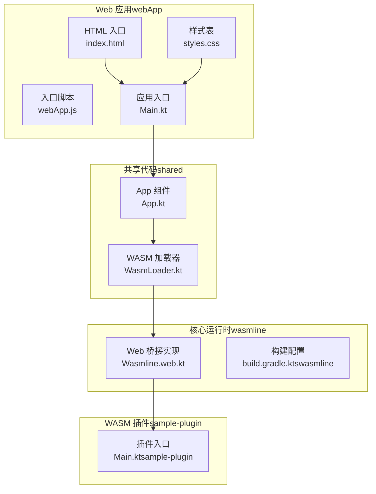
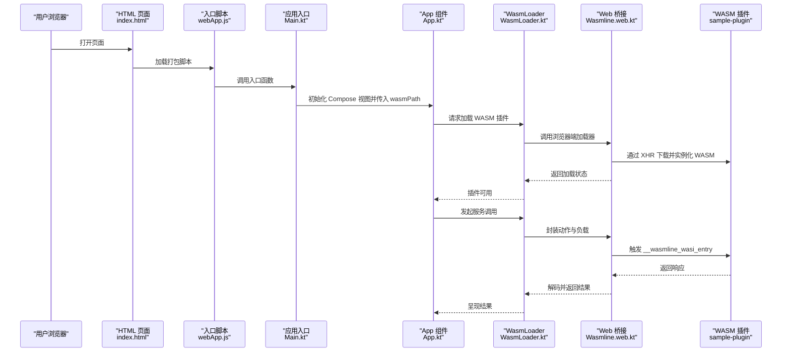
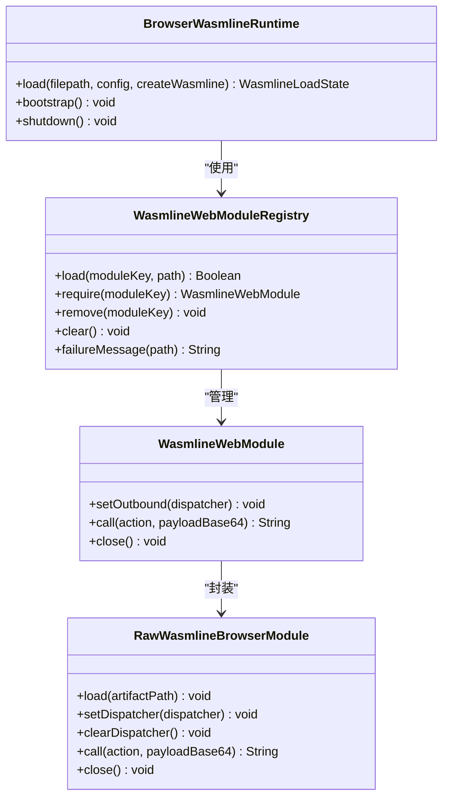
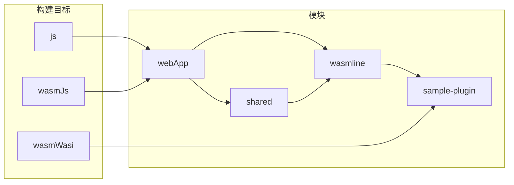

# Web 应用示例

<cite>
**本文引用的文件**
- [Main.kt](file://wasmline-samples/kotlin/sample-apps/multiplatform/webApp/src/webMain/kotlin/crow/wasmline/sample/Main.kt)
- [index.html](file://wasmline-samples/kotlin/sample-apps/multiplatform/webApp/src/webMain/resources/index.html)
- [styles.css](file://wasmline-samples/kotlin/sample-apps/multiplatform/webApp/src/webMain/resources/styles.css)
- [Wasmline.web.kt](file://wasmline-multiplatform/wasmline/src/webMain/kotlin/crow/wasmline/Wasmline.web.kt)
- [build.gradle.kts（wasmline）](file://wasmline-multiplatform/wasmline/build.gradle.kts)
- [App.kt](file://wasmline-samples/kotlin/sample-apps/multiplatform/shared/src/commonMain/kotlin/crow/wasmline/sample/App.kt)
- [WasmLoader.kt](file://wasmline-samples/kotlin/sample-apps/multiplatform/shared/src/commonMain/kotlin/crow/wasmline/sample/WasmLoader.kt)
- [Main.kt（sample-plugin）](file://wasmline-samples/kotlin/sample-plugin/src/wasmWasiMain/kotlin/crow/wasmline/sample/Main.kt)
</cite>

## 目录
1. [简介](#简介)
2. [项目结构](#项目结构)
3. [核心组件](#核心组件)
4. [架构总览](#架构总览)
5. [详细组件分析](#详细组件分析)
6. [依赖关系分析](#依赖关系分析)
7. [性能与兼容性](#性能与兼容性)
8. [开发与调试指南](#开发与调试指南)
9. [构建与部署策略](#构建与部署策略)
10. [故障排查](#故障排查)
11. [结论](#结论)

## 简介
本指南面向希望在 Web 环境中集成 Wasmline 插件的开发者，系统讲解如何在 HTML 页面中加载并运行 WASM 插件、如何组织静态资源、如何通过 JavaScript 与 WASM 进行双向通信，以及如何在多平台共享代码中完成 Web 特定实现。文档覆盖启动流程、插件加载机制、异步处理策略、浏览器兼容性、性能优化与安全注意事项，并提供从开发到生产的完整实践建议。

## 项目结构
该示例采用 Kotlin Multiplatform 的多模块组织方式，Web 应用示例位于 sample-apps/multiplatform/webApp，核心运行时与桥接逻辑位于 wasmline-multiplatform/wasmline 模块，公共业务逻辑位于 shared 模块，WASM 插件示例位于 sample-plugin。

图表来源
- [index.html:1-13](file://wasmline-samples/kotlin/sample-apps/multiplatform/webApp/src/webMain/resources/index.html#L1-L13)
- [styles.css:1-13](file://wasmline-samples/kotlin/sample-apps/multiplatform/webApp/src/webMain/resources/styles.css#L1-L13)
- [Main.kt:1-18](file://wasmline-samples/kotlin/sample-apps/multiplatform/webApp/src/webMain/kotlin/crow/wasmline/sample/Main.kt#L1-L18)
- [App.kt](file://wasmline-samples/kotlin/sample-apps/multiplatform/shared/src/commonMain/kotlin/crow/wasmline/sample/App.kt)
- [WasmLoader.kt](file://wasmline-samples/kotlin/sample-apps/multiplatform/shared/src/commonMain/kotlin/crow/wasmline/sample/WasmLoader.kt)
- [Wasmline.web.kt:1-367](file://wasmline-multiplatform/wasmline/src/webMain/kotlin/crow/wasmline/Wasmline.web.kt#L1-L367)
- [build.gradle.kts（wasmline）:1-159](file://wasmline-multiplatform/wasmline/build.gradle.kts#L1-L159)
- [Main.kt（sample-plugin）](file://wasmline-samples/kotlin/sample-plugin/src/wasmWasiMain/kotlin/crow/wasmline/sample/Main.kt)

章节来源
- [Main.kt:1-18](file://wasmline-samples/kotlin/sample-apps/multiplatform/webApp/src/webMain/kotlin/crow/wasmline/sample/Main.kt#L1-L18)
- [index.html:1-13](file://wasmline-samples/kotlin/sample-apps/multiplatform/webApp/src/webMain/resources/index.html#L1-L13)
- [styles.css:1-13](file://wasmline-samples/kotlin/sample-apps/multiplatform/webApp/src/webMain/resources/styles.css#L1-L13)
- [build.gradle.kts（wasmline）:1-159](file://wasmline-multiplatform/wasmline/build.gradle.kts#L1-L159)

## 核心组件
- Web 应用入口与页面模板：HTML 页面负责引入打包后的 JS 脚本与样式；入口函数初始化 Compose 视图并传入 WASM 插件路径。
- 共享 App 组件：在多平台共享层定义 UI 与业务逻辑，注入 WASM 加载器以完成插件生命周期管理。
- WASM 加载器：封装 WASM 插件的加载、调用与关闭流程，屏蔽底层差异。
- Web 桥接实现：在浏览器端实现 WASM 与宿主之间的内存读写、导入导出、主机回调等桥接逻辑。

章节来源
- [Main.kt:9-17](file://wasmline-samples/kotlin/sample-apps/multiplatform/webApp/src/webMain/kotlin/crow/wasmline/sample/Main.kt#L9-L17)
- [App.kt](file://wasmline-samples/kotlin/sample-apps/multiplatform/shared/src/commonMain/kotlin/crow/wasmline/sample/App.kt)
- [WasmLoader.kt](file://wasmline-samples/kotlin/sample-apps/multiplatform/shared/src/commonMain/kotlin/crow/wasmline/sample/WasmLoader.kt)
- [Wasmline.web.kt:24-80](file://wasmline-multiplatform/wasmline/src/webMain/kotlin/crow/wasmline/Wasmline.web.kt#L24-L80)

## 架构总览
下图展示了 Web 应用从页面加载到 WASM 插件执行的关键步骤与组件交互：

图表来源
- [index.html:10-10](file://wasmline-samples/kotlin/sample-apps/multiplatform/webApp/src/webMain/resources/index.html#L10-L10)
- [Main.kt:11-16](file://wasmline-samples/kotlin/sample-apps/multiplatform/webApp/src/webMain/kotlin/crow/wasmline/sample/Main.kt#L11-L16)
- [App.kt](file://wasmline-samples/kotlin/sample-apps/multiplatform/shared/src/commonMain/kotlin/crow/wasmline/sample/App.kt)
- [WasmLoader.kt](file://wasmline-samples/kotlin/sample-apps/multiplatform/shared/src/commonMain/kotlin/crow/wasmline/sample/WasmLoader.kt)
- [Wasmline.web.kt:37-73](file://wasmline-multiplatform/wasmline/src/webMain/kotlin/crow/wasmline/Wasmline.web.kt#L37-L73)
- [Main.kt（sample-plugin）](file://wasmline-samples/kotlin/sample-plugin/src/wasmWasiMain/kotlin/crow/wasmline/sample/Main.kt)

## 详细组件分析

### Web 应用入口与页面模板
- HTML 页面负责引入打包产物中的 JS 脚本与样式，确保资源路径正确。
- 入口函数初始化 Compose 视图，并将 WASM 插件路径作为参数传递给 App 组件。

章节来源
- [index.html:1-13](file://wasmline-samples/kotlin/sample-apps/multiplatform/webApp/src/webMain/resources/index.html#L1-L13)
- [Main.kt:11-17](file://wasmline-samples/kotlin/sample-apps/multiplatform/webApp/src/webMain/kotlin/crow/wasmline/sample/Main.kt#L11-L17)

### App 组件与 WASM 加载器
- App 组件在多平台共享层定义 UI 与业务逻辑，接收 wasmPath 并交由 WasmLoader 管理。
- WasmLoader 负责插件生命周期管理：加载、调用、关闭，并对异常进行统一处理。

章节来源
- [App.kt](file://wasmline-samples/kotlin/sample-apps/multiplatform/shared/src/commonMain/kotlin/crow/wasmline/sample/App.kt)
- [WasmLoader.kt](file://wasmline-samples/kotlin/sample-apps/multiplatform/shared/src/commonMain/kotlin/crow/wasmline/sample/WasmLoader.kt)

### Web 桥接实现（Wasmline.web.kt）
- 浏览器端运行时负责：
  - 校验并发加载限制（当前不支持并发）。
  - 通过本地预编译桥接加载 WASM 文件。
  - 提供模块注册表，管理已加载模块与失败信息。
  - 实现与 WASM 的内存交互、文本编码、主机回调分发。
  - 提供同步加载与关闭能力。
- 关键点：
  - 使用 XMLHttpRequest 同步拉取 WASM 字节流。
  - 通过 WebAssembly.Module/Instance 实例化插件。
  - 导入 Wasi 快照与自定义 env 桥接函数，实现日志、随机数、时间、主机回调等能力。
  - 通过 __wasmline_wasi_init 与 __wasmline_wasi_entry 触发插件初始化与调用。

图表来源
- [Wasmline.web.kt:24-80](file://wasmline-multiplatform/wasmline/src/webMain/kotlin/crow/wasmline/Wasmline.web.kt#L24-L80)
- [Wasmline.web.kt:91-138](file://wasmline-multiplatform/wasmline/src/webMain/kotlin/crow/wasmline/Wasmline.web.kt#L91-L138)
- [Wasmline.web.kt:140-166](file://wasmline-multiplatform/wasmline/src/webMain/kotlin/crow/wasmline/Wasmline.web.kt#L140-L166)
- [Wasmline.web.kt:168-174](file://wasmline-multiplatform/wasmline/src/webMain/kotlin/crow/wasmline/Wasmline.web.kt#L168-L174)

章节来源
- [Wasmline.web.kt:24-80](file://wasmline-multiplatform/wasmline/src/webMain/kotlin/crow/wasmline/Wasmline.web.kt#L24-L80)
- [Wasmline.web.kt:91-138](file://wasmline-multiplatform/wasmline/src/webMain/kotlin/crow/wasmline/Wasmline.web.kt#L91-L138)
- [Wasmline.web.kt:140-166](file://wasmline-multiplatform/wasmline/src/webMain/kotlin/crow/wasmline/Wasmline.web.kt#L140-L166)
- [Wasmline.web.kt:168-174](file://wasmline-multiplatform/wasmline/src/webMain/kotlin/crow/wasmline/Wasmline.web.kt#L168-L174)

### WASM 插件入口（sample-plugin）
- 插件入口位于 wasmWasiMain，遵循 WASI 接口约定，与浏览器桥接通过 __wasmline_wasi_init/__wasmline_wasi_entry 协作。

章节来源
- [Main.kt（sample-plugin）](file://wasmline-samples/kotlin/sample-plugin/src/wasmWasiMain/kotlin/crow/wasmline/sample/Main.kt)

## 依赖关系分析
- 构建目标与平台：
  - wasmline 模块启用 js、wasmJs、wasmWasi 等目标，并在 webMain 中组织 Web 特定实现。
  - webApp 依赖 shared 与 wasmline，通过 Compose 在浏览器中渲染 UI。
- 依赖链：
  - webApp.Main.kt -> shared.App.kt -> shared.WasmLoader.kt -> wasmline.Wasmline.web.kt -> sample-plugin.Main.kt

图表来源
- [build.gradle.kts（wasmline）:26-37](file://wasmline-multiplatform/wasmline/build.gradle.kts#L26-L37)
- [Main.kt:1-18](file://wasmline-samples/kotlin/sample-apps/multiplatform/webApp/src/webMain/kotlin/crow/wasmline/sample/Main.kt#L1-L18)
- [App.kt](file://wasmline-samples/kotlin/sample-apps/multiplatform/shared/src/commonMain/kotlin/crow/wasmline/sample/App.kt)
- [WasmLoader.kt](file://wasmline-samples/kotlin/sample-apps/multiplatform/shared/src/commonMain/kotlin/crow/wasmline/sample/WasmLoader.kt)
- [Wasmline.web.kt:1-367](file://wasmline-multiplatform/wasmline/src/webMain/kotlin/crow/wasmline/Wasmline.web.kt#L1-L367)
- [Main.kt（sample-plugin）](file://wasmline-samples/kotlin/sample-plugin/src/wasmWasiMain/kotlin/crow/wasmline/sample/Main.kt)

章节来源
- [build.gradle.kts（wasmline）:19-103](file://wasmline-multiplatform/wasmline/build.gradle.kts#L19-L103)

## 性能与兼容性
- 性能优化建议
  - 预加载与缓存：在应用启动阶段预热 WASM 模块，减少首次调用延迟；利用浏览器缓存策略提升重复加载速度。
  - 分包与懒加载：按需加载插件，避免一次性加载多个大型 WASM 模块。
  - 内存与 GC：合理释放模块与实例，避免内存泄漏；在长会话场景中定期清理无用模块。
  - 编解码优化：在桥接层尽量减少字符串与二进制转换次数，批量传输数据。
- 浏览器兼容性
  - WebAssembly 支持：确保目标浏览器支持标准 WebAssembly 与 WASI 快照接口。
  - XMLHttpRequest 同步请求：当前实现使用同步 XHR，可能阻塞主线程；建议在可接受范围内评估异步替代方案或在后台线程中执行。
  - 文本编码与 Base64：依赖浏览器内置的 TextEncoder/TextDecoder 与 btoa/atob，确保字符集与二进制互操作稳定。
- 安全考虑
  - 来源校验：仅加载可信来源的 WASM 插件，结合内容安全策略（CSP）限制脚本与资源加载。
  - 输入验证：对来自插件的输出进行严格解析与白名单校验，防止注入攻击。
  - 最小权限原则：插件仅暴露必要接口，避免过度授权。

## 开发与调试指南
- 开发环境搭建
  - 安装 JDK 21+、Kotlin Multiplatform 工具链与 Gradle。
  - 在根目录执行构建脚本，生成 webApp 打包产物与 WASM 插件。
- 调试技巧
  - 启用浏览器开发者工具，观察网络面板中的 WASM 下载与状态码。
  - 在桥接层设置断点，检查内存指针、字节数组与 Base64 编解码过程。
  - 利用控制台日志查看 WASI 导入函数的输出（如随机数、时间戳）。
  - 对比同步与异步加载行为，评估阻塞影响。
- 常见问题定位
  - 插件未加载：检查路径是否正确、HTTP 状态码、MIME 类型与跨域策略。
  - 调用无响应：确认 __wasmline_wasi_entry 是否被触发、主机回调是否绑定。
  - 内存错误：核对内存初始化、指针偏移与数组越界访问。

## 构建与部署策略
- 构建流程
  - 多平台构建：在 wasmline 模块中启用 js/browser 与 wasmJs/browser 目标，生成浏览器可用的 JS 包与 WASM 文件。
  - Web 应用打包：webApp 产出 HTML、CSS 与 JS，确保资源路径与插件路径一致。
  - 插件构建：sample-plugin 生成 .wasm 文件，放置于 webApp 的 plugin 目录以便运行时加载。
- 部署建议
  - 静态托管：将构建产物部署至 CDN 或静态服务器，确保 .wasm 与 JS 正确缓存。
  - 反向代理：通过 Nginx/Apache 配置合适的 MIME 类型与缓存头，提升加载性能。
  - 环境隔离：区分开发、测试与生产环境，分别配置插件路径与日志级别。
- 版本与签名
  - 对插件进行版本管理与完整性校验，确保线上一致性与可回滚性。

章节来源
- [build.gradle.kts（wasmline）:26-33](file://wasmline-multiplatform/wasmline/build.gradle.kts#L26-L33)
- [index.html:7-10](file://wasmline-samples/kotlin/sample-apps/multiplatform/webApp/src/webMain/resources/index.html#L7-L10)
- [Main.kt:9-9](file://wasmline-samples/kotlin/sample-apps/multiplatform/webApp/src/webMain/kotlin/crow/wasmline/sample/Main.kt#L9-L9)

## 故障排查
- 加载失败
  - 检查插件路径与服务器响应状态码；确认 MIME 类型为二进制或 text/plain。
  - 查看模块注册表中的失败消息，定位具体错误原因。
- 调用异常
  - 确认主机回调已绑定且签名匹配；检查动作名称与负载格式。
  - 核对内存缓冲区大小与响应长度，避免截断或溢出。
- 性能问题
  - 分析首屏加载时间，优化预热与懒加载策略；减少不必要的编解码与字符串拼接。

章节来源
- [Wasmline.web.kt:130-137](file://wasmline-multiplatform/wasmline/src/webMain/kotlin/crow/wasmline/Wasmline.web.kt#L130-L137)
- [Wasmline.web.kt:316-328](file://wasmline-multiplatform/wasmline/src/webMain/kotlin/crow/wasmline/Wasmline.web.kt#L316-L328)
- [Wasmline.web.kt:288-304](file://wasmline-multiplatform/wasmline/src/webMain/kotlin/crow/wasmline/Wasmline.web.kt#L288-L304)

## 结论
通过本指南，您可以在 Web 环境中高效集成 Wasmline 插件：从页面模板与入口函数开始，借助共享层的 App 与 WasmLoader 管理插件生命周期，最终由浏览器端桥接实现与 WASM 插件进行稳定通信。结合性能优化、兼容性与安全策略，可构建高性能、可维护的 Web 应用示例。