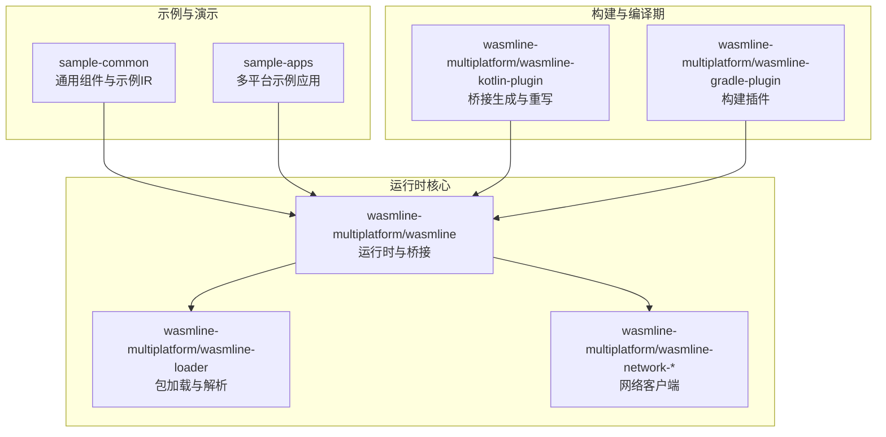
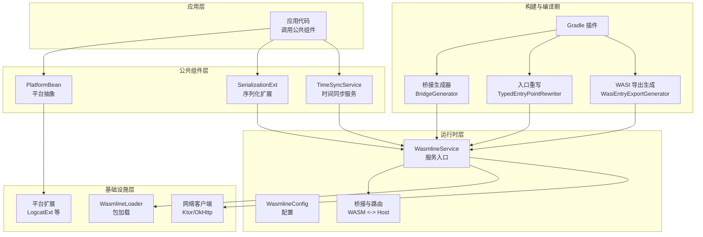
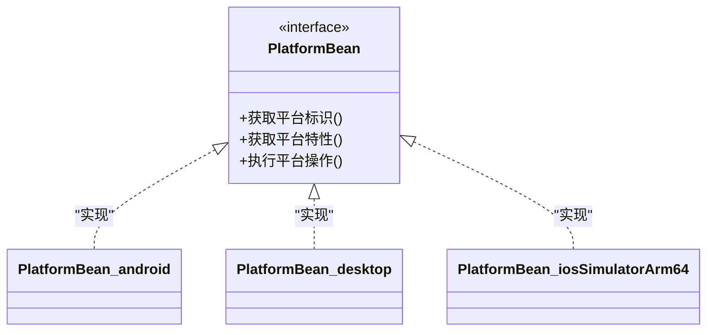
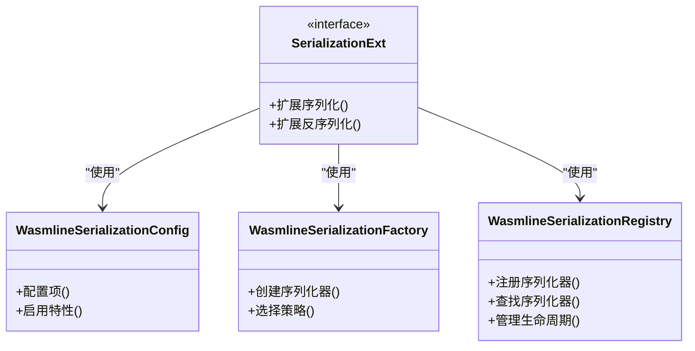
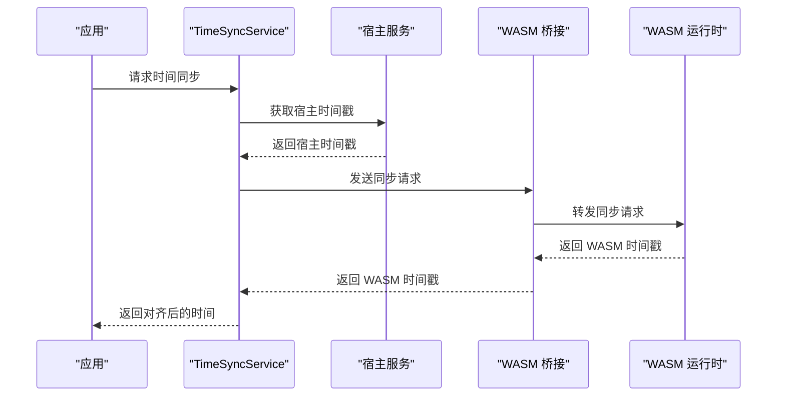
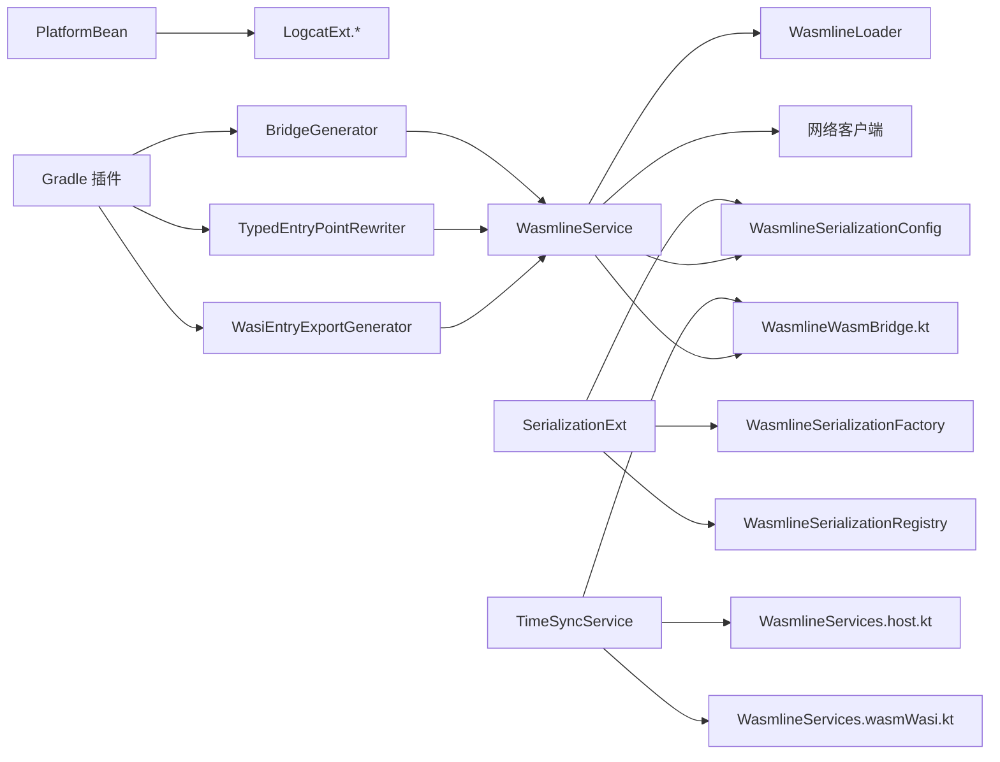

# 公共组件库

<cite>
**本文引用的文件**
- [PlatformBean.kt](file://wasmline-samples/kotlin/sample-common/src/commonMain/kotlin/crow/wasmline/sample/bean/PlatformBean.kt)
- [SerialiazationExt.kt](file://wasmline-samples/kotlin/sample-common/src/commonMain/kotlin/crow/wasmline/sample/extensions/SerialiazationExt.kt)
- [TimeSyncService.kt](file://wasmline-samples/kotlin/sample-common/src/commonMain/kotlin/crow/wasmline/sample/ir/TimeSyncService.kt)
- [LogcatExt.kt](file://wasmline-samples/kotlin/sample-common/src/commonMain/kotlin/crow/wasmline/sample/extensions/LogcatExt.kt)
- [PlatformBean.android.kt](file://wasmline-samples/kotlin/sample-apps/multiplatform/shared/src/androidMain/kotlin/crow/wasmline/sample/extensions/PlatformBean.android.kt)
- [PlatformBean.desktop.kt](file://wasmline-samples/kotlin/sample-apps/multiplatform/shared/src/desktopMain/kotlin/crow/wasmline/sample/extensions/PlatformBean.desktop.kt)
- [PlatformBean.iosSimulatorArm64.kt](file://wasmline-samples/kotlin/sample-apps/multiplatform/shared/src/iosSimulatorArm64Main/kotlin/crow/wasmline/sample/extensions/PlatformBean.iosSimulatorArm64.kt)
- [LogcatExt.android.kt](file://wasmline-samples/kotlin/sample-apps/multiplatform/shared/src/androidMain/kotlin/crow/wasmline/sample/extensions/LogcatExt.android.kt)
- [LogcatExt.desktop.kt](file://wasmline-samples/kotlin/sample-apps/multiplatform/shared/src/desktopMain/kotlin/crow/wasmline/sample/extensions/LogcatExt.desktop.kt)
- [LogcatExt.iosSimulatorArm64.kt](file://wasmline-samples/kotlin/sample-apps/multiplatform/shared/src/iosSimulatorArm64Main/kotlin/crow/wasmline/sample/extensions/LogcatExt.iosSimulatorArm64.kt)
- [WasmlineSerializationConfig.kt](file://wasmline-multiplatform/wasmline/src/commonMain/kotlin/crow/wasmline/serialization/WasmlineSerializationConfig.kt)
- [WasmlineSerializationFactory.kt](file://wasmline-multiplatform/wasmline/src/commonMain/kotlin/crow/wasmline/serialization/WasmlineSerializationFactory.kt)
- [WasmlineSerializationRegistry.kt](file://wasmline-multiplatform/wasmline/src/commonMain/kotlin/crow/wasmline/serialization/WasmlineSerializationRegistry.kt)
- [WasmlineBridgeGenerator.kt](file://wasmline-multiplatform/wasmline-kotlin-plugin/src/main/kotlin/crow/wasmline/kotlin/WasmlineBridgeGenerator.kt)
- [WasmlineTypedEntryPointRewriter.kt](file://wasmline-multiplatform/wasmline-kotlin-plugin/src/main/kotlin/crow/wasmline/kotlin/WasmlineTypedEntryPointRewriter.kt)
- [WasmlineWasiEntryExportGenerator.kt](file://wasmline-multiplatform/wasmline-kotlin-plugin/src/main/kotlin/crow/wasmline/kotlin/WasmlineWasiEntryExportGenerator.kt)
- [WasmlinePlugin.kt](file://wasmline-multiplatform/wasmline-gradle-plugin/src/main/kotlin/crow/wasmline/gradle/WasmlinePlugin.kt)
- [WasmlineLoader.kt](file://wasmline-multiplatform/wasmline-loader/src/commonMain/kotlin/crow/wasmline/loader/WasmlineLoader.kt)
- [DefaultWasmlineLoader.kt](file://wasmline-multiplatform/wasmline-loader/src/hostMain/kotlin/crow/wasmline/loader/DefaultWasmlineLoader.kt)
- [KtorNetworkClient.kt](file://wasmline-multiplatform/wasmline-network-ktor/src/commonMain/kotlin/crow/wasmline/network/ktor/KtorNetworkClient.kt)
- [OkHttpNetworkClient.kt](file://wasmline-multiplatform/wasmline-network-okhttp/src/commonMain/kotlin/crow/wasmline/network/okhttp/OkHttpNetworkClient.kt)
- [WasmlineService.kt](file://wasmline-multiplatform/wasmline/src/commonMain/kotlin/crow/wasmline/WasmlineService.kt)
- [WasmlineConfig.kt](file://wasmline-multiplatform/wasmline/src/commonMain/kotlin/crow/wasmline/WasmlineConfig.kt)
- [Wasmline.kt](file://wasmline-multiplatform/wasmline/src/hostMain/kotlin/crow/wasmline/Wasmline.kt)
- [WasmMain.kt](file://wasmline-multiplatform/wasmline/src/wasmWasiMain/kotlin/crow/wasmline/WasmMain.kt)
- [WasmlineRouter.kt](file://wasmline-multiplatform/wasmline/src/wasmWasiMain/kotlin/crow/wasmline/WasmlineRouter.kt)
- [WasmlineWasmBridge.kt](file://wasmline-multiplatform/wasmline/src/wasmWasiMain/kotlin/crow/wasmline/WasmlineWasmBridge.kt)
- [WasmlineServices.wasmWasi.kt](file://wasmline-multiplatform/wasmline/src/wasmWasiMain/kotlin/crow/wasmline/WasmlineServices.wasmWasi.kt)
- [WasmlineServices.host.kt](file://wasmline-multiplatform/wasmline/src/hostMain/kotlin/crow/wasmline/WasmlineServices.host.kt)
- [WasmlineSerializationConfigTest.kt](file://wasmline-multiplatform/wasmline/src/commonTest/kotlin/crow/wasmline/WasmlineSerializationConfigTest.kt)
- [WasmlineServiceRuntimeTest.kt](file://wasmline-multiplatform/wasmline/src/commonTest/kotlin/crow/wasmline/WasmlineServiceRuntimeTest.kt)
- [WasmlineHostApiCompileTest.kt](file://wasmline-multiplatform/wasmline/src/hostTest/kotlin/crow/wasmline/WasmlineHostApiCompileTest.kt)
- [WasmlineTrustedKeysTest.kt](file://wasmline-multiplatform/wasmline-loader/src/commonTest/kotlin/crow/wasmline/loader/WasmlineTrustedKeysTest.kt)
- [ManifestTest.kt](file://wasmline-multiplatform/wasmline-loader/src/commonTest/kotlin/crow/wasmline/ManifestTest.kt)
- [DefaultWasmlineLoaderTest.kt](file://wasmline-multiplatform/wasmline-loader/src/jvmTest/kotlin/crow/wasmline/loader/DefaultWasmlineLoaderTest.kt)
- [WasmlineRemotePackageResolutionTest.kt](file://wasmline-multiplatform/wasmline-loader/src/jvmTest/kotlin/crow/wasmline/loader/WasmlineRemotePackageResolutionTest.kt)
- [WasmlineLocalPackageResolutionTest.kt](file://wasmline-multiplatform/wasmline-loader/src/jvmTest/kotlin/crow/wasmline/loader/WasmlineLocalPackageResolutionTest.kt)
- [EchoService.kt](file://wasmline-samples/kotlin/sample-common/src/commonMain/kotlin/crow/wasmline/sample/ir/EchoService.kt)
- [WebBridgeService.kt](file://wasmline-samples/kotlin/sample-common/src/commonMain/kotlin/crow/wasmline/sample/ir/WebBridgeService.kt)
- [WasmError.kt](file://wasmline-multiplatform/wasmline/src/wasmWasiMain/kotlin/crow/wasmline/model/WasmError.kt)
</cite>

## 目录
1. [简介](#简介)
2. [项目结构](#项目结构)
3. [核心组件](#核心组件)
4. [架构总览](#架构总览)
5. [组件详解](#组件详解)
6. [依赖关系分析](#依赖关系分析)
7. [性能考量](#性能考量)
8. [故障排查指南](#故障排查指南)
9. [结论](#结论)
10. [附录](#附录)

## 简介
本指南面向多平台 Kotlin 项目，系统性介绍 Wasmline 公共组件库中的共享能力与设计理念，重点覆盖以下三类组件：
- 平台抽象：通过 PlatformBean 在多平台间统一平台信息与行为接口，屏蔽平台差异。
- 序列化扩展：通过 SerializationExt 提供跨平台的序列化扩展能力，并结合 Wasmline 的序列化配置与工厂体系实现可插拔的序列化策略。
- 时间同步服务：通过 TimeSyncService 提供跨平台的时间同步能力，支持在宿主与 WASM 运行时之间进行高精度时间对齐。

文档将从设计模式、数据流、依赖关系、测试策略、性能与维护建议等维度，帮助你在多平台项目中高效复用这些组件，并理解各平台的具体实现差异。

## 项目结构
Wasmline 多平台模块由“运行时核心”“序列化框架”“加载器与网络层”“Gradle 插件与编译期生成”“示例与测试”等部分组成。公共组件库的核心位于 sample-common 与 wasmline-multiplatform/wasmline 中，分别提供通用的业务组件与运行时基础设施。

图示来源
- [WasmlineService.kt](file://wasmline-multiplatform/wasmline/src/commonMain/kotlin/crow/wasmline/WasmlineService.kt)
- [WasmlineLoader.kt](file://wasmline-multiplatform/wasmline-loader/src/commonMain/kotlin/crow/wasmline/loader/WasmlineLoader.kt)
- [KtorNetworkClient.kt](file://wasmline-multiplatform/wasmline-network-ktor/src/commonMain/kotlin/crow/wasmline/network/ktor/KtorNetworkClient.kt)
- [OkHttpNetworkClient.kt](file://wasmline-multiplatform/wasmline-network-okhttp/src/commonMain/kotlin/crow/wasmline/network/okhttp/OkHttpNetworkClient.kt)
- [WasmlineBridgeGenerator.kt](file://wasmline-multiplatform/wasmline-kotlin-plugin/src/main/kotlin/crow/wasmline/kotlin/WasmlineBridgeGenerator.kt)
- [WasmlinePlugin.kt](file://wasmline-multiplatform/wasmline-gradle-plugin/src/main/kotlin/crow/wasmline/gradle/WasmlinePlugin.kt)

章节来源
- [WasmlineService.kt](file://wasmline-multiplatform/wasmline/src/commonMain/kotlin/crow/wasmline/WasmlineService.kt)
- [WasmlineLoader.kt](file://wasmline-multiplatform/wasmline-loader/src/commonMain/kotlin/crow/wasmline/loader/WasmlineLoader.kt)

## 核心组件
本节聚焦于三个关键共享组件：PlatformBean（平台抽象）、SerializationExt（序列化扩展）与 TimeSyncService（时间同步服务）。它们共同支撑了跨平台的一致体验与可复用能力。

- PlatformBean：在 commonMain 定义平台抽象接口，在各平台源集（androidMain、desktop、iosSimulatorArm64 等）提供具体实现，统一暴露平台能力（如日志、资源访问、时间等）。
- SerializationExt：在 commonMain 提供序列化扩展能力，结合 Wasmline 的序列化配置、工厂与注册表，形成可扩展的序列化策略。
- TimeSyncService：在 commonMain 定义跨平台时间同步接口，结合宿主与 WASM 运行时的桥接与路由，实现高精度时间对齐。

章节来源
- [PlatformBean.kt](file://wasmline-samples/kotlin/sample-common/src/commonMain/kotlin/crow/wasmline/sample/bean/PlatformBean.kt)
- [SerialiazationExt.kt](file://wasmline-samples/kotlin/sample-common/src/commonMain/kotlin/crow/wasmline/sample/extensions/SerialiazationExt.kt)
- [TimeSyncService.kt](file://wasmline-samples/kotlin/sample-common/src/commonMain/kotlin/crow/wasmline/sample/ir/TimeSyncService.kt)

## 架构总览
下图展示了公共组件与运行时、加载器、网络层及构建插件之间的交互关系，体现跨平台组件的分层与职责划分。

图示来源
- [PlatformBean.kt](file://wasmline-samples/kotlin/sample-common/src/commonMain/kotlin/crow/wasmline/sample/bean/PlatformBean.kt)
- [SerialiazationExt.kt](file://wasmline-samples/kotlin/sample-common/src/commonMain/kotlin/crow/wasmline/sample/extensions/SerialiazationExt.kt)
- [TimeSyncService.kt](file://wasmline-samples/kotlin/sample-common/src/commonMain/kotlin/crow/wasmline/sample/ir/TimeSyncService.kt)
- [WasmlineService.kt](file://wasmline-multiplatform/wasmline/src/commonMain/kotlin/crow/wasmline/WasmlineService.kt)
- [WasmlineLoader.kt](file://wasmline-multiplatform/wasmline-loader/src/commonMain/kotlin/crow/wasmline/loader/WasmlineLoader.kt)
- [KtorNetworkClient.kt](file://wasmline-multiplatform/wasmline-network-ktor/src/commonMain/kotlin/crow/wasmline/network/ktor/KtorNetworkClient.kt)
- [OkHttpNetworkClient.kt](file://wasmline-multiplatform/wasmline-network-okhttp/src/commonMain/kotlin/crow/wasmline/network/okhttp/OkHttpNetworkClient.kt)
- [WasmlineBridgeGenerator.kt](file://wasmline-multiplatform/wasmline-kotlin-plugin/src/main/kotlin/crow/wasmline/kotlin/WasmlineBridgeGenerator.kt)
- [WasmlineTypedEntryPointRewriter.kt](file://wasmline-multiplatform/wasmline-kotlin-plugin/src/main/kotlin/crow/wasmline/kotlin/WasmlineTypedEntryPointRewriter.kt)
- [WasmlineWasiEntryExportGenerator.kt](file://wasmline-multiplatform/wasmline-kotlin-plugin/src/main/kotlin/crow/wasmline/kotlin/WasmlineWasiEntryExportGenerator.kt)
- [WasmlinePlugin.kt](file://wasmline-multiplatform/wasmline-gradle-plugin/src/main/kotlin/crow/wasmline/gradle/WasmlinePlugin.kt)

## 组件详解

### PlatformBean：平台抽象机制
PlatformBean 在 commonMain 定义统一的平台抽象接口，各平台源集提供具体实现，用于屏蔽平台差异并统一行为。

- 设计要点
  - 接口定义集中在 commonMain，确保跨平台一致性。
  - 各平台源集（androidMain、desktop、iosSimulatorArm64 等）提供实现，注入平台特定的日志、资源访问、时间等能力。
  - 通过扩展函数（如 LogcatExt）在各平台实现一致的调用方式。

- 使用示例与配置
  - 在应用侧通过 PlatformBean 获取平台能力，无需关心底层实现。
  - 可结合 Wasmline 配置与服务初始化流程，统一设置平台相关参数。

- 平台差异
  - Android：通过 Logcat 扩展输出日志；AndroidLogger.cpp 提供原生日志桥接。
  - Desktop：控制台日志输出；ConsoleLogger.cpp 提供原生日志桥接。
  - iOS 模拟器：IosLogger.cpp 提供原生日志桥接。
  - JS/Web：浏览器日志桥接；webMain 提供前端环境适配。
  - WASM/WASI：WasmMain、WasmlineWasmBridge、WasmlineRouter 提供 WASM 环境下的桥接与路由。

图示来源
- [PlatformBean.kt](file://wasmline-samples/kotlin/sample-common/src/commonMain/kotlin/crow/wasmline/sample/bean/PlatformBean.kt)
- [PlatformBean.android.kt](file://wasmline-samples/kotlin/sample-apps/multiplatform/shared/src/androidMain/kotlin/crow/wasmline/sample/extensions/PlatformBean.android.kt)
- [PlatformBean.desktop.kt](file://wasmline-samples/kotlin/sample-apps/multiplatform/shared/src/desktopMain/kotlin/crow/wasmline/sample/extensions/PlatformBean.desktop.kt)
- [PlatformBean.iosSimulatorArm64.kt](file://wasmline-samples/kotlin/sample-apps/multiplatform/shared/src/iosSimulatorArm64Main/kotlin/crow/wasmline/sample/extensions/PlatformBean.iosSimulatorArm64.kt)

章节来源
- [PlatformBean.kt](file://wasmline-samples/kotlin/sample-common/src/commonMain/kotlin/crow/wasmline/sample/bean/PlatformBean.kt)
- [LogcatExt.kt](file://wasmline-samples/kotlin/sample-common/src/commonMain/kotlin/crow/wasmline/sample/extensions/LogcatExt.kt)
- [LogcatExt.android.kt](file://wasmline-samples/kotlin/sample-apps/multiplatform/shared/src/androidMain/kotlin/crow/wasmline/sample/extensions/LogcatExt.android.kt)
- [LogcatExt.desktop.kt](file://wasmline-samples/kotlin/sample-apps/multiplatform/shared/src/desktopMain/kotlin/crow/wasmline/sample/extensions/LogcatExt.desktop.kt)
- [LogcatExt.iosSimulatorArm64.kt](file://wasmline-samples/kotlin/sample-apps/multiplatform/shared/src/iosSimulatorArm64Main/kotlin/crow/wasmline/sample/extensions/LogcatExt.iosSimulatorArm64.kt)
- [Wasmline.kt](file://wasmline-multiplatform/wasmline/src/hostMain/kotlin/crow/wasmline/Wasmline.kt)
- [WasmMain.kt](file://wasmline-multiplatform/wasmline/src/wasmWasiMain/kotlin/crow/wasmline/WasmMain.kt)
- [WasmlineWasmBridge.kt](file://wasmline-multiplatform/wasmline/src/wasmWasiMain/kotlin/crow/wasmline/WasmlineWasmBridge.kt)
- [WasmlineRouter.kt](file://wasmline-multiplatform/wasmline/src/wasmWasiMain/kotlin/crow/wasmline/WasmlineRouter.kt)

### SerializationExt：序列化扩展
SerializationExt 在 commonMain 提供序列化扩展能力，结合 Wasmline 的序列化配置、工厂与注册表，形成可扩展的序列化策略。

- 设计要点
  - 通过 WasmlineSerializationConfig 定义序列化配置项，支持自定义序列化策略。
  - WasmlineSerializationFactory 负责根据配置创建序列化实例。
  - WasmlineSerializationRegistry 管理序列化器注册与查找，支持多类型序列化器共存。
  - 编译期通过 BridgeGenerator、TypedEntryPointRewriter、WasiEntryExportGenerator 生成桥接与导出，保证序列化在 WASM/WASI 环境可用。

- 使用示例与配置
  - 在应用初始化阶段配置 WasmlineSerializationConfig，并注册所需序列化器到 WasmlineSerializationRegistry。
  - 通过 SerializationExt 扩展对象的序列化/反序列化能力，确保跨平台一致性。

- 扩展方法
  - 新增序列化器：实现序列化接口并注册到 Registry。
  - 自定义工厂：扩展 WasmlineSerializationFactory 以支持新的序列化策略或上下文。

图示来源
- [SerialiazationExt.kt](file://wasmline-samples/kotlin/sample-common/src/commonMain/kotlin/crow/wasmline/sample/extensions/SerialiazationExt.kt)
- [WasmlineSerializationConfig.kt](file://wasmline-multiplatform/wasmline/src/commonMain/kotlin/crow/wasmline/serialization/WasmlineSerializationConfig.kt)
- [WasmlineSerializationFactory.kt](file://wasmline-multiplatform/wasmline/src/commonMain/kotlin/crow/wasmline/serialization/WasmlineSerializationFactory.kt)
- [WasmlineSerializationRegistry.kt](file://wasmline-multiplatform/wasmline/src/commonMain/kotlin/crow/wasmline/serialization/WasmlineSerializationRegistry.kt)
- [WasmlineBridgeGenerator.kt](file://wasmline-multiplatform/wasmline-kotlin-plugin/src/main/kotlin/crow/wasmline/kotlin/WasmlineBridgeGenerator.kt)
- [WasmlineTypedEntryPointRewriter.kt](file://wasmline-multiplatform/wasmline-kotlin-plugin/src/main/kotlin/crow/wasmline/kotlin/WasmlineTypedEntryPointRewriter.kt)
- [WasmlineWasiEntryExportGenerator.kt](file://wasmline-multiplatform/wasmline-kotlin-plugin/src/main/kotlin/crow/wasmline/kotlin/WasmlineWasiEntryExportGenerator.kt)

章节来源
- [SerialiazationExt.kt](file://wasmline-samples/kotlin/sample-common/src/commonMain/kotlin/crow/wasmline/sample/extensions/SerialiazationExt.kt)
- [WasmlineSerializationConfig.kt](file://wasmline-multiplatform/wasmline/src/commonMain/kotlin/crow/wasmline/serialization/WasmlineSerializationConfig.kt)
- [WasmlineSerializationFactory.kt](file://wasmline-multiplatform/wasmline/src/commonMain/kotlin/crow/wasmline/serialization/WasmlineSerializationFactory.kt)
- [WasmlineSerializationRegistry.kt](file://wasmline-multiplatform/wasmline/src/commonMain/kotlin/crow/wasmline/serialization/WasmlineSerializationRegistry.kt)

### TimeSyncService：时间同步服务
TimeSyncService 在 commonMain 定义跨平台时间同步接口，结合宿主与 WASM 运行时的桥接与路由，实现高精度时间对齐。

- 设计要点
  - 在宿主与 WASM 之间建立时间基准，通过桥接与路由组件进行时间戳交换与校准。
  - 支持在多线程与异步场景下保持时间一致性，避免平台差异导致的偏差。

- 使用示例与配置
  - 在应用初始化阶段启动 TimeSyncService，并将其集成到业务逻辑中，确保所有涉及时间的操作基于统一时间源。
  - 结合 EchoService 或 WebBridgeService 进行端到端验证与调试。

- 平台差异
  - 宿主环境：通过 WasmlineServices.host.kt 提供宿主侧时间同步实现。
  - WASM/WASI 环境：通过 WasmlineServices.wasmWasi.kt 与 WasmlineWasmBridge.kt 实现桥接与路由。

图示来源
- [TimeSyncService.kt](file://wasmline-samples/kotlin/sample-common/src/commonMain/kotlin/crow/wasmline/sample/ir/TimeSyncService.kt)
- [WasmlineServices.host.kt](file://wasmline-multiplatform/wasmline/src/hostMain/kotlin/crow/wasmline/WasmlineServices.host.kt)
- [WasmlineServices.wasmWasi.kt](file://wasmline-multiplatform/wasmline/src/wasmWasiMain/kotlin/crow/wasmline/WasmlineServices.wasmWasi.kt)
- [WasmlineWasmBridge.kt](file://wasmline-multiplatform/wasmline/src/wasmWasiMain/kotlin/crow/wasmline/WasmlineWasmBridge.kt)

章节来源
- [TimeSyncService.kt](file://wasmline-samples/kotlin/sample-common/src/commonMain/kotlin/crow/wasmline/sample/ir/TimeSyncService.kt)
- [WasmlineServices.host.kt](file://wasmline-multiplatform/wasmline/src/hostMain/kotlin/crow/wasmline/WasmlineServices.host.kt)
- [WasmlineServices.wasmWasi.kt](file://wasmline-multiplatform/wasmline/src/wasmWasiMain/kotlin/crow/wasmline/WasmlineServices.wasmWasi.kt)

## 依赖关系分析
下图展示公共组件与运行时、加载器、网络层及构建插件之间的依赖关系，帮助理解组件耦合与协作方式。

图示来源
- [PlatformBean.kt](file://wasmline-samples/kotlin/sample-common/src/commonMain/kotlin/crow/wasmline/sample/bean/PlatformBean.kt)
- [LogcatExt.kt](file://wasmline-samples/kotlin/sample-common/src/commonMain/kotlin/crow/wasmline/sample/extensions/LogcatExt.kt)
- [SerialiazationExt.kt](file://wasmline-samples/kotlin/sample-common/src/commonMain/kotlin/crow/wasmline/sample/extensions/SerialiazationExt.kt)
- [WasmlineSerializationConfig.kt](file://wasmline-multiplatform/wasmline/src/commonMain/kotlin/crow/wasmline/serialization/WasmlineSerializationConfig.kt)
- [WasmlineSerializationFactory.kt](file://wasmline-multiplatform/wasmline/src/commonMain/kotlin/crow/wasmline/serialization/WasmlineSerializationFactory.kt)
- [WasmlineSerializationRegistry.kt](file://wasmline-multiplatform/wasmline/src/commonMain/kotlin/crow/wasmline/serialization/WasmlineSerializationRegistry.kt)
- [TimeSyncService.kt](file://wasmline-samples/kotlin/sample-common/src/commonMain/kotlin/crow/wasmline/sample/ir/TimeSyncService.kt)
- [WasmlineServices.host.kt](file://wasmline-multiplatform/wasmline/src/hostMain/kotlin/crow/wasmline/WasmlineServices.host.kt)
- [WasmlineServices.wasmWasi.kt](file://wasmline-multiplatform/wasmline/src/wasmWasiMain/kotlin/crow/wasmline/WasmlineServices.wasmWasi.kt)
- [WasmlineWasmBridge.kt](file://wasmline-multiplatform/wasmline/src/wasmWasiMain/kotlin/crow/wasmline/WasmlineWasmBridge.kt)
- [WasmlineService.kt](file://wasmline-multiplatform/wasmline/src/commonMain/kotlin/crow/wasmline/WasmlineService.kt)
- [WasmlineLoader.kt](file://wasmline-multiplatform/wasmline-loader/src/commonMain/kotlin/crow/wasmline/loader/WasmlineLoader.kt)
- [KtorNetworkClient.kt](file://wasmline-multiplatform/wasmline-network-ktor/src/commonMain/kotlin/crow/wasmline/network/ktor/KtorNetworkClient.kt)
- [OkHttpNetworkClient.kt](file://wasmline-multiplatform/wasmline-network-okhttp/src/commonMain/kotlin/crow/wasmline/network/okhttp/OkHttpNetworkClient.kt)
- [WasmlineBridgeGenerator.kt](file://wasmline-multiplatform/wasmline-kotlin-plugin/src/main/kotlin/crow/wasmline/kotlin/WasmlineBridgeGenerator.kt)
- [WasmlineTypedEntryPointRewriter.kt](file://wasmline-multiplatform/wasmline-kotlin-plugin/src/main/kotlin/crow/wasmline/kotlin/WasmlineTypedEntryPointRewriter.kt)
- [WasmlineWasiEntryExportGenerator.kt](file://wasmline-multiplatform/wasmline-kotlin-plugin/src/main/kotlin/crow/wasmline/kotlin/WasmlineWasiEntryExportGenerator.kt)
- [WasmlinePlugin.kt](file://wasmline-multiplatform/wasmline-gradle-plugin/src/main/kotlin/crow/wasmline/gradle/WasmlinePlugin.kt)

章节来源
- [WasmlineService.kt](file://wasmline-multiplatform/wasmline/src/commonMain/kotlin/crow/wasmline/WasmlineService.kt)
- [WasmlineLoader.kt](file://wasmline-multiplatform/wasmline-loader/src/commonMain/kotlin/crow/wasmline/loader/WasmlineLoader.kt)
- [KtorNetworkClient.kt](file://wasmline-multiplatform/wasmline-network-ktor/src/commonMain/kotlin/crow/wasmline/network/ktor/KtorNetworkClient.kt)
- [OkHttpNetworkClient.kt](file://wasmline-multiplatform/wasmline-network-okhttp/src/commonMain/kotlin/crow/wasmline/network/okhttp/OkHttpNetworkClient.kt)

## 性能考量
- 平台抽象开销
  - PlatformBean 的实现应尽量避免在热路径上进行昂贵的系统调用；优先使用轻量级日志与缓存策略。
  - 各平台扩展（如 LogcatExt）应避免重复初始化与阻塞操作，必要时采用异步或延迟初始化。

- 序列化性能
  - 通过 WasmlineSerializationConfig 合理配置序列化策略，减少不必要的反射与装箱。
  - 在高频序列化场景下，优先使用已注册的高性能序列化器，并避免频繁创建工厂实例。

- 时间同步性能
  - TimeSyncService 的同步频率应与业务需求匹配，避免过度同步造成性能损耗。
  - 在 WASM/WASI 环境中，注意桥接与路由的往返延迟，合理设置超时与重试策略。

- 加载与网络
  - WasmlineLoader 的缓存策略与网络客户端的选择（Ktor/OkHttp）直接影响加载性能；建议在开发与生产环境采用不同的缓存与并发策略。

## 故障排查指南
- 常见问题与定位
  - 序列化失败：检查 WasmlineSerializationConfig 是否正确配置，确认序列化器已在 WasmlineSerializationRegistry 注册。
  - 平台日志异常：核对 LogcatExt 在目标平台的实现是否正确加载，确认原生日志桥接（AndroidLogger.cpp、ConsoleLogger.cpp、IosLogger.cpp）是否可用。
  - 时间同步不准确：检查宿主与 WASM 间的桥接与路由是否正常，确认 WasmlineWasmBridge 与 WasmlineRouter 的状态。
  - 包加载失败：检查 WasmlineLoader 的缓存目录与权限，确认网络客户端可用性与证书信任链。

- 测试策略
  - 单元测试：针对序列化配置、服务运行时与主机 API 编译期测试，确保关键路径稳定。
  - 集成测试：覆盖本地与远程包解析、信任密钥验证、网络客户端行为等。
  - 平台测试：在各平台源集运行平台特定测试，验证扩展函数与原生桥接的正确性。

章节来源
- [WasmlineSerializationConfigTest.kt](file://wasmline-multiplatform/wasmline/src/commonTest/kotlin/crow/wasmline/WasmlineSerializationConfigTest.kt)
- [WasmlineServiceRuntimeTest.kt](file://wasmline-multiplatform/wasmline/src/commonTest/kotlin/crow/wasmline/WasmlineServiceRuntimeTest.kt)
- [WasmlineHostApiCompileTest.kt](file://wasmline-multiplatform/wasmline/src/hostTest/kotlin/crow/wasmline/WasmlineHostApiCompileTest.kt)
- [WasmlineTrustedKeysTest.kt](file://wasmline-multiplatform/wasmline-loader/src/commonTest/kotlin/crow/wasmline/loader/WasmlineTrustedKeysTest.kt)
- [ManifestTest.kt](file://wasmline-multiplatform/wasmline-loader/src/commonTest/kotlin/crow/wasmline/ManifestTest.kt)
- [DefaultWasmlineLoaderTest.kt](file://wasmline-multiplatform/wasmline-loader/src/jvmTest/kotlin/crow/wasmline/loader/DefaultWasmlineLoaderTest.kt)
- [WasmlineRemotePackageResolutionTest.kt](file://wasmline-multiplatform/wasmline-loader/src/jvmTest/kotlin/crow/wasmline/loader/WasmlineRemotePackageResolutionTest.kt)
- [WasmlineLocalPackageResolutionTest.kt](file://wasmline-multiplatform/wasmline-loader/src/jvmTest/kotlin/crow/wasmline/loader/WasmlineLocalPackageResolutionTest.kt)

## 结论
Wasmline 公共组件库通过 PlatformBean、SerializationExt 与 TimeSyncService，实现了跨平台的一致性与可复用性。借助编译期生成与运行时桥接，这些组件能够在 Android、iOS、桌面、JS/Web、WASM/WASI 等多平台上无缝工作。建议在实际项目中：
- 将平台抽象与序列化策略作为初始化流程的关键步骤，确保配置正确与扩展可用。
- 在高频路径上关注性能与缓存策略，避免不必要的开销。
- 通过完善的测试策略覆盖单元、集成与平台测试，保障稳定性与可维护性。

## 附录
- 示例 IR 服务
  - EchoService：用于回显测试与端到端验证。
  - WebBridgeService：用于 Web 环境下的桥接与通信。
- 错误模型
  - WasmError：在 WASM/WASI 环境中统一错误表示与处理。

章节来源
- [EchoService.kt](file://wasmline-samples/kotlin/sample-common/src/commonMain/kotlin/crow/wasmline/sample/ir/EchoService.kt)
- [WebBridgeService.kt](file://wasmline-samples/kotlin/sample-common/src/commonMain/kotlin/crow/wasmline/sample/ir/WebBridgeService.kt)
- [WasmError.kt](file://wasmline-multiplatform/wasmline/src/wasmWasiMain/kotlin/crow/wasmline/model/WasmError.kt)