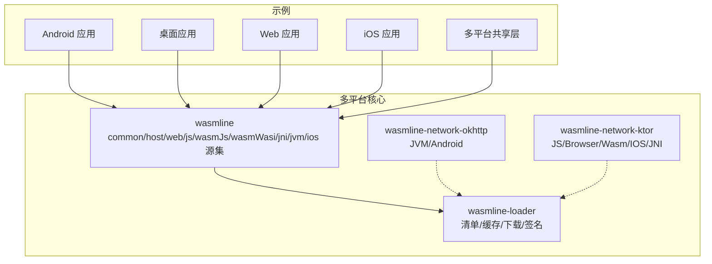
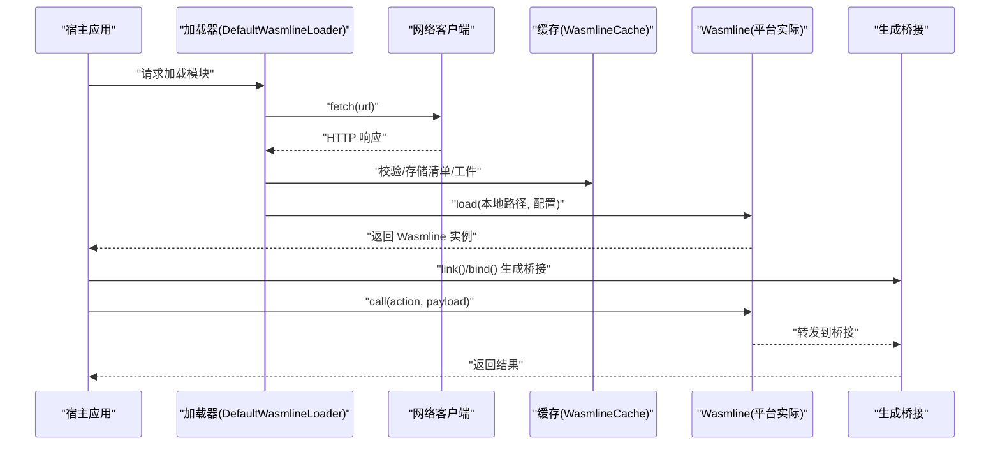
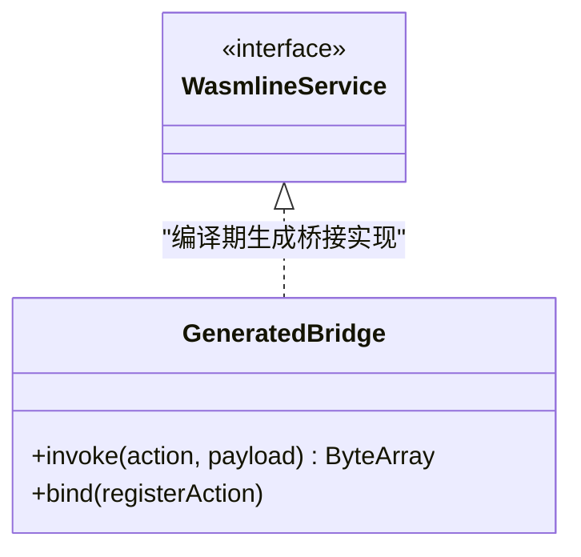
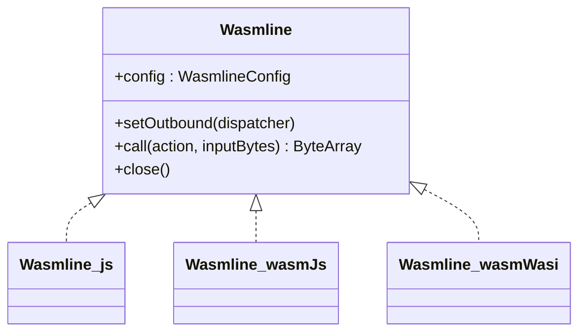
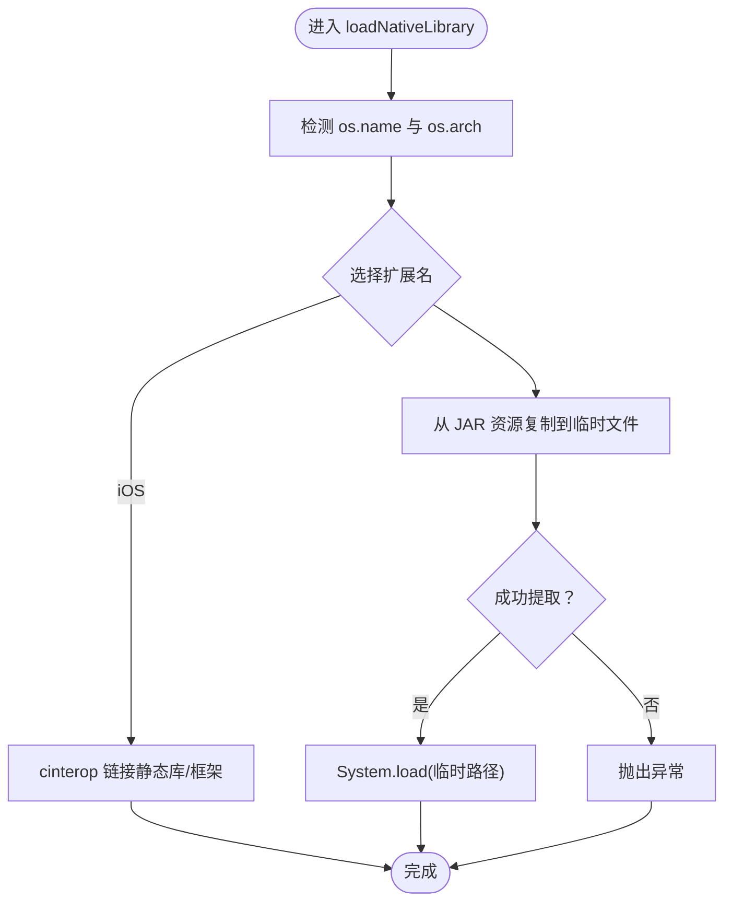
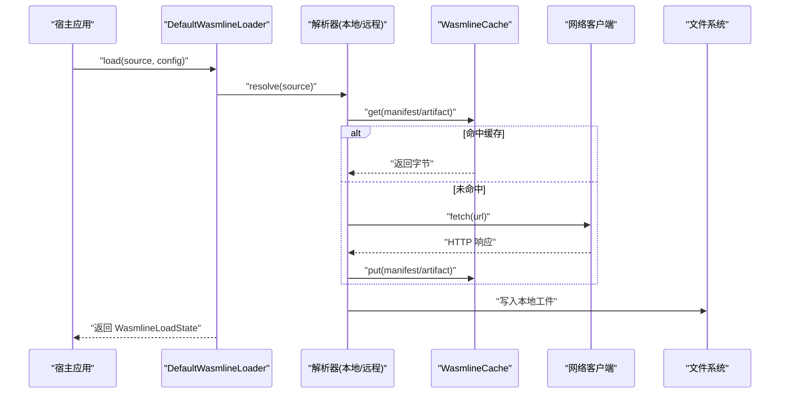
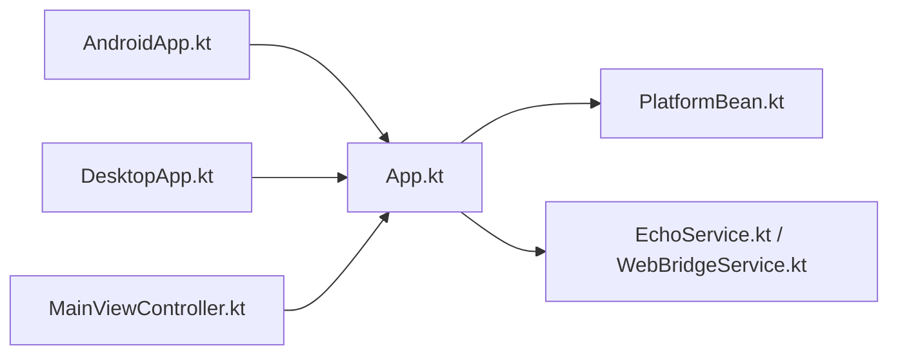
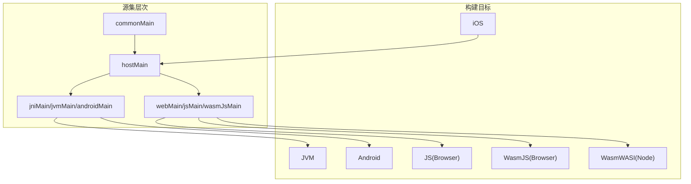

# 多平台应用示例

<cite>
**本文引用的文件**
- [wasmline/build.gradle.kts](file://wasmline-multiplatform/wasmline/build.gradle.kts)
- [settings.gradle.kts](file://wasmline-multiplatform/settings.gradle.kts)
- [WasmlineService.kt](file://wasmline-multiplatform/wasmline/src/commonMain/kotlin/crow/wasmline/WasmlineService.kt)
- [WasmlineConfig.kt](file://wasmline-multiplatform/wasmline/src/commonMain/kotlin/crow/wasmline/WasmlineConfig.kt)
- [WasmlineCache.kt](file://wasmline-multiplatform/wasmline/src/commonMain/kotlin/crow/wasmline/WasmlineCache.kt)
- [WasmlineNetworkClient.kt](file://wasmline-multiplatform/wasmline/src/commonMain/kotlin/crow/wasmline/WasmlineNetworkClient.kt)
- [GeneratedBridge.kt](file://wasmline-multiplatform/wasmline/src/commonMain/kotlin/crow/wasmline/internal/bridge/GeneratedBridge.kt)
- [WasmlineLoader.kt](file://wasmline-multiplatform/wasmline/src/hostMain/kotlin/crow/wasmline/WasmlineLoader.kt)
- [Wasmline.kt](file://wasmline-multiplatform/wasmline/src/hostMain/kotlin/crow/wasmline/Wasmline.kt)
- [Wasmline.js.kt](file://wasmline-multiplatform/wasmline/src/jsMain/kotlin/crow/wasmline/Wasmline.js.kt)
- [Wasmline.wasmJs.kt](file://wasmline-multiplatform/wasmline/src/wasmJsMain/kotlin/crow/wasmline/Wasmline.wasmJs.kt)
- [Wasmline.wasmWasi.kt](file://wasmline-multiplatform/wasmline/src/wasmWasiMain/kotlin/crow/wasmline/Wasmline.wasmWasi.kt)
- [NativeLoaderExt.jvm.kt](file://wasmline-multiplatform/wasmline/src/jvmMain/kotlin/crow/wasmline/extensions/NativeLoaderExt.jvm.kt)
- [NativeLoaderExt.android.kt](file://wasmline-multiplatform/wasmline/src/androidMain/kotlin/crow/wasmline/extensions/NativeLoaderExt.android.kt)
- [NativeLoaderExt.ios.kt](file://wasmline-multiplatform/wasmline/src/iosMain/kotlin/crow/wasmline/extensions/NativeLoaderExt.ios.kt)
- [KtorNetworkClient.kt](file://wasmline-multiplatform/wasmline-network-ktor/src/commonMain/kotlin/crow/wasmline/network/ktor/KtorNetworkClient.kt)
- [OkHttpNetworkClient.kt](file://wasmline-multiplatform/wasmline-network-okhttp/src/commonMain/kotlin/crow/wasmline/network/okhttp/OkHttpNetworkClient.kt)
- [BlockingFetch.js.kt](file://wasmline-multiplatform/wasmline-network-ktor/src/jsMain/kotlin/crow/wasmline/network/ktor/BlockingFetch.js.kt)
- [BlockingFetch.ios.kt](file://wasmline-multiplatform/wasmline-network-ktor/src/iosMain/kotlin/crow/wasmline/network/ktor/BlockingFetch.ios.kt)
- [BlockingFetch.jni.kt](file://wasmline-multiplatform/wasmline-network-ktor/src/jniMain/kotlin/crow/wasmline/network/ktor/BlockingFetch.jni.kt)
- [BlockingFetch.wasmJs.kt](file://wasmline-multiplatform/wasmline-network-ktor/src/wasmJsMain/kotlin/crow/wasmline/network/ktor/BlockingFetch.wasmJs.kt)
- [BlockingFetch.web.kt](file://wasmline-multiplatform/wasmline-network-ktor/src/webMain/kotlin/crow/wasmline/network/ktor/BlockingFetch.web.kt)
- [DefaultWasmlineLoader.kt](file://wasmline-multiplatform/wasmline-loader/src/hostMain/kotlin/crow/wasmline/loader/DefaultWasmlineLoader.kt)
- [WasmlineLoader.kt](file://wasmline-multiplatform/wasmline-loader/src/hostMain/kotlin/crow/wasmline/loader/WasmlineLoader.kt)
- [Manifest.kt](file://wasmline-multiplatform/wasmline-loader/src/commonMain/kotlin/crow/wasmline/loader/model/Manifest.kt)
- [sample-apps/android/src/androidMain/kotlin/crow/wasmline/sample/MainActivity.kt](file://wasmline-samples/kotlin/sample-apps/android/src/androidMain/kotlin/crow/wasmline/sample/MainActivity.kt)
- [sample-apps/desktopApp/src/main/kotlin/crow/wasmline/sample/Main.kt](file://wasmline-samples/kotlin/sample-apps/desktopApp/src/main/kotlin/crow/wasmline/sample/Main.kt)
- [sample-apps/multiplatform/shared/src/androidMain/kotlin/crow/wasmline/sample/AndroidApp.kt](file://wasmline-samples/kotlin/sample-apps/multiplatform/shared/src/androidMain/kotlin/crow/wasmline/sample/AndroidApp.kt)
- [sample-apps/multiplatform/shared/src/desktopMain/kotlin/crow/wasmline/sample/DesktopApp.kt](file://wasmline-samples/kotlin/sample-apps/multiplatform/shared/src/desktopMain/kotlin/crow/wasmline/sample/DesktopApp.kt)
- [sample-apps/multiplatform/shared/src/iosSimulatorArm64Main/kotlin/crow/wasmline/sample/MainViewController.kt](file://wasmline-samples/kotlin/sample-apps/multiplatform/shared/src/iosSimulatorArm64Main/kotlin/crow/wasmline/sample/MainViewController.kt)
- [sample-apps/multiplatform/shared/src/commonMain/kotlin/crow/wasmline/sample/App.kt](file://wasmline-samples/kotlin/sample-apps/multiplatform/shared/src/commonMain/kotlin/crow/wasmline/sample/App.kt)
- [sample-common/src/commonMain/kotlin/crow/wasmline/sample/bean/PlatformBean.kt](file://wasmline-samples/kotlin/sample-common/src/commonMain/kotlin/crow/wasmline/sample/bean/PlatformBean.kt)
- [sample-common/src/commonMain/kotlin/crow/wasmline/sample/ir/EchoService.kt](file://wasmline-samples/kotlin/sample-common/src/commonMain/kotlin/crow/wasmline/sample/ir/EchoService.kt)
- [sample-common/src/commonMain/kotlin/crow/wasmline/sample/ir/WebBridgeService.kt](file://wasmline-samples/kotlin/sample-apps/multiplatform/shared/src/commonMain/kotlin/crow/wasmline/sample/ir/WebBridgeService.kt)
</cite>

## 目录
1. 引言
2. 项目结构
3. 核心组件
4. 架构总览
5. 组件详解
6. 依赖关系分析
7. 性能与优化
8. 故障排查
9. 结论
10. 附录

## 引言
本指南面向希望使用 Kotlin Multiplatform 构建跨 Android、iOS、Web（JS/Browser）与桌面（JVM）平台应用的开发者。围绕 Wasmline 多平台示例，我们将系统讲解共享代码设计原则、平台适配层组织方式、依赖注入策略、构建配置与发布流程，并提供调试与性能优化建议。文档中的所有技术结论均来自仓库源码与构建脚本，确保可追溯与可复现。

## 项目结构
Wasmline 采用“核心运行时 + 平台适配 + 示例应用”的分层组织方式：
- 核心运行时模块：wasmline（含 common、host、web、js、wasmJs、wasmWasi、jni、jvm、ios 等源集）
- 加载器模块：wasmline-loader（负责清单解析、签名验证、缓存与下载）
- 网络适配：wasmline-network-okhttp（JVM/Android）、wasmline-network-ktor（JS/Browser/Wasm/IOS/JNI）
- 示例工程：wasmline-samples（Android、桌面、多平台共享、Web 等）

图示来源
- [settings.gradle.kts:69-77](file://wasmline-multiplatform/settings.gradle.kts#L69-L77)
- [wasmline/build.gradle.kts:19-103](file://wasmline-multiplatform/wasmline/build.gradle.kts#L19-L103)

章节来源
- [settings.gradle.kts:1-77](file://wasmline-multiplatform/settings.gradle.kts#L1-L77)
- [wasmline/build.gradle.kts:1-159](file://wasmline-multiplatform/wasmline/build.gradle.kts#L1-L159)

## 核心组件
- 服务契约接口：用于声明跨平台的服务接口，编译期由插件生成桥接代码并重写 link/bind 调用点。
- 运行时句柄与生命周期：host 侧通过 expect/actual 抽象统一的 Wasmline 类与启动/关闭/预热等函数。
- 配置与序列化：统一的 WasmlineConfig，支持 Protobuf/原始字节等序列化工厂选择。
- 缓存与网络：可插拔的 WasmlineCache 与 WasmlineNetworkClient 抽象，配合加载器完成远程包下载与本地缓存。
- 生成桥接：编译期生成的桥接类实现调用转发与绑定分发，未正确链接或绑定会快速失败。

章节来源
- [WasmlineService.kt:1-25](file://wasmline-multiplatform/wasmline/src/commonMain/kotlin/crow/wasmline/WasmlineService.kt#L1-L25)
- [Wasmline.kt:1-34](file://wasmline-multiplatform/wasmline/src/hostMain/kotlin/crow/wasmline/Wasmline.kt#L1-L34)
- [WasmlineConfig.kt:1-25](file://wasmline-multiplatform/wasmline/src/commonMain/kotlin/crow/wasmline/WasmlineConfig.kt#L1-L25)
- [WasmlineCache.kt:1-24](file://wasmline-multiplatform/wasmline/src/commonMain/kotlin/crow/wasmline/WasmlineCache.kt#L1-L24)
- [WasmlineNetworkClient.kt:1-42](file://wasmline-multiplatform/wasmline/src/commonMain/kotlin/crow/wasmline/WasmlineNetworkClient.kt#L1-L42)
- [GeneratedBridge.kt:1-45](file://wasmline-multiplatform/wasmline/src/commonMain/kotlin/crow/wasmline/internal/bridge/GeneratedBridge.kt#L1-L45)

## 架构总览
下图展示从宿主应用到 WASM 插件的调用链路：宿主通过加载器解析清单与缓存，按平台实际加载本地预编译产物，随后通过统一的 Wasmline 句柄进行动作调用；在 JS/Browser/Wasm 环境中，消息以 Base64 编解码在浏览器上下文内传递；在 JVM/Android 中，原生库通过 JNI 或打包资源动态加载。

图示来源
- [DefaultWasmlineLoader.kt](file://wasmline-multiplatform/wasmline-loader/src/hostMain/kotlin/crow/wasmline/loader/DefaultWasmlineLoader.kt)
- [WasmlineLoader.kt:1-67](file://wasmline-multiplatform/wasmline/src/hostMain/kotlin/crow/wasmline/WasmlineLoader.kt#L1-L67)
- [Wasmline.js.kt:1-31](file://wasmline-multiplatform/wasmline/src/jsMain/kotlin/crow/wasmline/Wasmline.js.kt#L1-L31)
- [Wasmline.wasmJs.kt:1-31](file://wasmline-multiplatform/wasmline/src/wasmJsMain/kotlin/crow/wasmline/Wasmline.wasmJs.kt#L1-L31)
- [Wasmline.wasmWasi.kt:1-60](file://wasmline-multiplatform/wasmline/src/wasmWasiMain/kotlin/crow/wasmline/Wasmline.wasmWasi.kt#L1-L60)

## 组件详解

### 1) 共享服务契约与桥接
- 设计原则
  - 使用接口定义服务契约，限制为公共函数、不支持重载/属性/泛型/挂起/默认参数/vararg 等，确保编译期可预测性与稳定桥接生成。
  - 编译期由插件生成每个契约对应的桥接类，并将 link()/bind() 调用点重写为对桥接实例的调用。
- 错误处理
  - 未链接桥接或未绑定实现时，桥接会在首次调用时快速失败，便于定位编译期绑定问题。

图示来源
- [WasmlineService.kt:1-25](file://wasmline-multiplatform/wasmline/src/commonMain/kotlin/crow/wasmline/WasmlineService.kt#L1-L25)
- [GeneratedBridge.kt:1-45](file://wasmline-multiplatform/wasmline/src/commonMain/kotlin/crow/wasmline/internal/bridge/GeneratedBridge.kt#L1-L45)

章节来源
- [WasmlineService.kt:1-25](file://wasmline-multiplatform/wasmline/src/commonMain/kotlin/crow/wasmline/WasmlineService.kt#L1-L25)
- [GeneratedBridge.kt:1-45](file://wasmline-multiplatform/wasmline/src/commonMain/kotlin/crow/wasmline/internal/bridge/GeneratedBridge.kt#L1-L45)

### 2) 运行时句柄与生命周期（expect/actual）
- host 侧抽象：通过 expect 类与函数定义统一接口，各平台 actual 提供具体实现。
- JS/Browser/Wasm：在浏览器环境通过委托对象进行 Base64 编解码与消息转发。
- JVM/Android：通过系统库加载或从资源提取原生库后 System.load。
- iOS：cinterop 集成 Wasmtime 并链接静态框架，提供 framework 形态。

图示来源
- [Wasmline.kt:1-34](file://wasmline-multiplatform/wasmline/src/hostMain/kotlin/crow/wasmline/Wasmline.kt#L1-L34)
- [Wasmline.js.kt:1-31](file://wasmline-multiplatform/wasmline/src/jsMain/kotlin/crow/wasmline/Wasmline.js.kt#L1-L31)
- [Wasmline.wasmJs.kt:1-31](file://wasmline-multiplatform/wasmline/src/wasmJsMain/kotlin/crow/wasmline/Wasmline.wasmJs.kt#L1-L31)
- [Wasmline.wasmWasi.kt:1-60](file://wasmline-multiplatform/wasmline/src/wasmWasiMain/kotlin/crow/wasmline/Wasmline.wasmWasi.kt#L1-L60)

章节来源
- [Wasmline.kt:1-34](file://wasmline-multiplatform/wasmline/src/hostMain/kotlin/crow/wasmline/Wasmline.kt#L1-L34)
- [Wasmline.js.kt:1-31](file://wasmline-multiplatform/wasmline/src/jsMain/kotlin/crow/wasmline/Wasmline.js.kt#L1-L31)
- [Wasmline.wasmJs.kt:1-31](file://wasmline-multiplatform/wasmline/src/wasmJsMain/kotlin/crow/wasmline/Wasmline.wasmJs.kt#L1-L31)
- [Wasmline.wasmWasi.kt:1-60](file://wasmline-multiplatform/wasmline/src/wasmWasiMain/kotlin/crow/wasmline/Wasmline.wasmWasi.kt#L1-L60)

### 3) 平台原生库加载策略
- JVM/Android：根据 os.name 与 os.arch 选择 so/dylib/dll 扩展名，从资源路径匹配候选架构，提取临时文件后 System.load。
- iOS：cinterop 定义头文件与链接参数，强制链接核心静态库与 Wasmtime 库，并链接系统框架。
- Android：System.loadLibrary 加载已打包的原生库。

图示来源
- [NativeLoaderExt.jvm.kt:1-53](file://wasmline-multiplatform/wasmline/src/jvmMain/kotlin/crow/wasmline/extensions/NativeLoaderExt.jvm.kt#L1-L53)
- [NativeLoaderExt.android.kt:1-5](file://wasmline-multiplatform/wasmline/src/androidMain/kotlin/crow/wasmline/extensions/NativeLoaderExt.android.kt#L1-L5)
- [wasmline/build.gradle.kts:48-102](file://wasmline-multiplatform/wasmline/build.gradle.kts#L48-L102)

章节来源
- [NativeLoaderExt.jvm.kt:1-53](file://wasmline-multiplatform/wasmline/src/jvmMain/kotlin/crow/wasmline/extensions/NativeLoaderExt.jvm.kt#L1-L53)
- [NativeLoaderExt.android.kt:1-5](file://wasmline-multiplatform/wasmline/src/androidMain/kotlin/crow/wasmline/extensions/NativeLoaderExt.android.kt#L1-L5)
- [NativeLoaderExt.ios.kt:1-5](file://wasmline-multiplatform/wasmline/src/iosMain/kotlin/crow/wasmline/extensions/NativeLoaderExt.ios.kt#L1-L5)
- [wasmline/build.gradle.kts:48-102](file://wasmline-multiplatform/wasmline/build.gradle.kts#L48-L102)

### 4) 加载器与远程下载
- 加载器职责：解析清单、签名验证、缓存命中、远程下载、本地工件加载。
- 网络适配：OkHttp（JVM/Android）与 Ktor（JS/Browser/Wasm/IOS/JNI）提供统一的阻塞式 fetch 接口。
- 缓存策略：可自定义 WasmlineCache，或使用空实现；键命名规范包含前缀区分清单与工件。

图示来源
- [DefaultWasmlineLoader.kt](file://wasmline-multiplatform/wasmline-loader/src/hostMain/kotlin/crow/wasmline/loader/DefaultWasmlineLoader.kt)
- [WasmlineLoader.kt](file://wasmline-multiplatform/wasmline-loader/src/hostMain/kotlin/crow/wasmline/loader/WasmlineLoader.kt)
- [Manifest.kt](file://wasmline-multiplatform/wasmline-loader/src/commonMain/kotlin/crow/wasmline/loader/model/Manifest.kt)
- [WasmlineCache.kt:1-24](file://wasmline-multiplatform/wasmline/src/commonMain/kotlin/crow/wasmline/WasmlineCache.kt#L1-L24)
- [WasmlineNetworkClient.kt:1-42](file://wasmline-multiplatform/wasmline/src/commonMain/kotlin/crow/wasmline/WasmlineNetworkClient.kt#L1-L42)
- [OkHttpNetworkClient.kt](file://wasmline-multiplatform/wasmline-network-okhttp/src/commonMain/kotlin/crow/wasmline/network/okhttp/OkHttpNetworkClient.kt)
- [KtorNetworkClient.kt](file://wasmline-multiplatform/wasmline-network-ktor/src/commonMain/kotlin/crow/wasmline/network/ktor/KtorNetworkClient.kt)

章节来源
- [DefaultWasmlineLoader.kt](file://wasmline-multiplatform/wasmline-loader/src/hostMain/kotlin/crow/wasmline/loader/DefaultWasmlineLoader.kt)
- [WasmlineLoader.kt](file://wasmline-multiplatform/wasmline-loader/src/hostMain/kotlin/crow/wasmline/loader/WasmlineLoader.kt)
- [Manifest.kt](file://wasmline-multiplatform/wasmline-loader/src/commonMain/kotlin/crow/wasmline/loader/model/Manifest.kt)
- [WasmlineCache.kt:1-24](file://wasmline-multiplatform/wasmline/src/commonMain/kotlin/crow/wasmline/WasmlineCache.kt#L1-L24)
- [WasmlineNetworkClient.kt:1-42](file://wasmline-multiplatform/wasmline/src/commonMain/kotlin/crow/wasmline/WasmlineNetworkClient.kt#L1-L42)
- [OkHttpNetworkClient.kt](file://wasmline-multiplatform/wasmline-network-okhttp/src/commonMain/kotlin/crow/wasmline/network/okhttp/OkHttpNetworkClient.kt)
- [KtorNetworkClient.kt](file://wasmline-multiplatform/wasmline-network-ktor/src/commonMain/kotlin/crow/wasmline/network/ktor/KtorNetworkClient.kt)

### 5) 平台适配层与示例入口
- Android：MainActivity 作为应用入口，集成共享层逻辑。
- 桌面：Main 作为 JVM 入口，初始化平台相关依赖。
- iOS：MainViewController 作为 SwiftUI 入口控制器，承载页面与生命周期。
- 多平台共享：App 与 PlatformBean 抽象跨平台行为，AndroidApp/DesktopApp 提供平台特化实现。

图示来源
- [sample-apps/android/src/androidMain/kotlin/crow/wasmline/sample/MainActivity.kt](file://wasmline-samples/kotlin/sample-apps/android/src/androidMain/kotlin/crow/wasmline/sample/MainActivity.kt)
- [sample-apps/desktopApp/src/main/kotlin/crow/wasmline/sample/Main.kt](file://wasmline-samples/kotlin/sample-apps/desktopApp/src/main/kotlin/crow/wasmline/sample/Main.kt)
- [sample-apps/multiplatform/shared/src/androidMain/kotlin/crow/wasmline/sample/AndroidApp.kt](file://wasmline-samples/kotlin/sample-apps/multiplatform/shared/src/androidMain/kotlin/crow/wasmline/sample/AndroidApp.kt)
- [sample-apps/multiplatform/shared/src/desktopMain/kotlin/crow/wasmline/sample/DesktopApp.kt](file://wasmline-samples/kotlin/sample-apps/multiplatform/shared/src/desktopMain/kotlin/crow/wasmline/sample/DesktopApp.kt)
- [sample-apps/multiplatform/shared/src/iosSimulatorArm64Main/kotlin/crow/wasmline/sample/MainViewController.kt](file://wasmline-samples/kotlin/sample-apps/multiplatform/shared/src/iosSimulatorArm64Main/kotlin/crow/wasmline/sample/MainViewController.kt)
- [sample-apps/multiplatform/shared/src/commonMain/kotlin/crow/wasmline/sample/App.kt](file://wasmline-samples/kotlin/sample-apps/multiplatform/shared/src/commonMain/kotlin/crow/wasmline/sample/App.kt)
- [sample-common/src/commonMain/kotlin/crow/wasmline/sample/bean/PlatformBean.kt](file://wasmline-samples/kotlin/sample-common/src/commonMain/kotlin/crow/wasmline/sample/bean/PlatformBean.kt)
- [sample-common/src/commonMain/kotlin/crow/wasmline/sample/ir/EchoService.kt](file://wasmline-samples/kotlin/sample-common/src/commonMain/kotlin/crow/wasmline/sample/ir/EchoService.kt)
- [sample-common/src/commonMain/kotlin/crow/wasmline/sample/ir/WebBridgeService.kt](file://wasmline-samples/kotlin/sample-apps/multiplatform/shared/src/commonMain/kotlin/crow/wasmline/sample/ir/WebBridgeService.kt)

章节来源
- [sample-apps/android/src/androidMain/kotlin/crow/wasmline/sample/MainActivity.kt](file://wasmline-samples/kotlin/sample-apps/android/src/androidMain/kotlin/crow/wasmline/sample/MainActivity.kt)
- [sample-apps/desktopApp/src/main/kotlin/crow/wasmline/sample/Main.kt](file://wasmline-samples/kotlin/sample-apps/desktopApp/src/main/kotlin/crow/wasmline/sample/Main.kt)
- [sample-apps/multiplatform/shared/src/androidMain/kotlin/crow/wasmline/sample/AndroidApp.kt](file://wasmline-samples/kotlin/sample-apps/multiplatform/shared/src/androidMain/kotlin/crow/wasmline/sample/AndroidApp.kt)
- [sample-apps/multiplatform/shared/src/desktopMain/kotlin/crow/wasmline/sample/DesktopApp.kt](file://wasmline-samples/kotlin/sample-apps/multiplatform/shared/src/desktopMain/kotlin/crow/wasmline/sample/DesktopApp.kt)
- [sample-apps/multiplatform/shared/src/iosSimulatorArm64Main/kotlin/crow/wasmline/sample/MainViewController.kt](file://wasmline-samples/kotlin/sample-apps/multiplatform/shared/src/iosSimulatorArm64Main/kotlin/crow/wasmline/sample/MainViewController.kt)
- [sample-apps/multiplatform/shared/src/commonMain/kotlin/crow/wasmline/sample/App.kt](file://wasmline-samples/kotlin/sample-apps/multiplatform/shared/src/commonMain/kotlin/crow/wasmline/sample/App.kt)
- [sample-common/src/commonMain/kotlin/crow/wasmline/sample/bean/PlatformBean.kt](file://wasmline-samples/kotlin/sample-common/src/commonMain/kotlin/crow/wasmline/sample/bean/PlatformBean.kt)
- [sample-common/src/commonMain/kotlin/crow/wasmline/sample/ir/EchoService.kt](file://wasmline-samples/kotlin/sample-common/src/commonMain/kotlin/crow/wasmline/sample/ir/EchoService.kt)
- [sample-common/src/commonMain/kotlin/crow/wasmline/sample/ir/WebBridgeService.kt](file://wasmline-samples/kotlin/sample-apps/multiplatform/shared/src/commonMain/kotlin/crow/wasmline/sample/ir/WebBridgeService.kt)

## 依赖关系分析
- 构建目标覆盖：JVM、Android、JS(Browser)、WasmJS(Browser)、WasmWASI(Node)、以及 iOS 模拟器/真机。
- 源集层次：common → host → web/js/wasmJs → jni/jvm/android；测试源集 hostTest → jvmTest。
- 网络适配：JVM/Android 使用 OkHttp；JS/Browser/Wasm/IOS/JNI 使用 Ktor 的 BlockingFetch 封装。
- 依赖注入：通过配置对象 WasmlineConfig 注入序列化工厂、网络客户端、缓存与可信密钥集合；在不同平台以 actual 扩展注入平台能力。

图示来源
- [wasmline/build.gradle.kts:19-103](file://wasmline-multiplatform/wasmline/build.gradle.kts#L19-L103)
- [settings.gradle.kts:69-77](file://wasmline-multiplatform/settings.gradle.kts#L69-L77)

章节来源
- [wasmline/build.gradle.kts:1-159](file://wasmline-multiplatform/wasmline/build.gradle.kts#L1-L159)
- [settings.gradle.kts:1-77](file://wasmline-multiplatform/settings.gradle.kts#L1-L77)

## 性能与优化
- 并发加载：通过 WasmlineConfig.supportConcurrent 在需要时启用内部互斥锁，避免竞态；否则保持无锁路径提升吞吐。
- 序列化选择：Protobuf 适合结构化数据，原始字节适合低开销场景；在插件侧与宿主侧分别配置序列化工厂以匹配。
- 缓存策略：优先使用持久化缓存减少网络与磁盘 IO；合理设置键空间与过期策略。
- 原生库加载：JVM/Android 预先提取并缓存原生库，避免重复 IO；iOS 使用 cinterop 静态链接减少运行时开销。
- 浏览器桥接：JS/Wasm 环境的消息编解码成本较低，注意避免频繁小包传输，合并调用批次。

章节来源
- [WasmlineConfig.kt:1-25](file://wasmline-multiplatform/wasmline/src/commonMain/kotlin/crow/wasmline/WasmlineConfig.kt#L1-L25)
- [WasmlineCache.kt:1-24](file://wasmline-multiplatform/wasmline/src/commonMain/kotlin/crow/wasmline/WasmlineCache.kt#L1-L24)
- [Wasmline.wasmJs.kt:1-31](file://wasmline-multiplatform/wasmline/src/wasmJsMain/kotlin/crow/wasmline/Wasmline.wasmJs.kt#L1-L31)
- [NativeLoaderExt.jvm.kt:1-53](file://wasmline-multiplatform/wasmline/src/jvmMain/kotlin/crow/wasmline/extensions/NativeLoaderExt.jvm.kt#L1-L53)

## 故障排查
- 未知动作/未绑定：当生成桥接未正确绑定实现或调用了未知动作，桥接会快速失败，检查编译期插件是否正确替换 link()/bind()。
- 未链接端点：若桥接未被链接到有效端点，调用会报错，确认加载器与平台实际是否正确创建 Wasmline 实例。
- 原生库加载失败：JVM/Android 场景需检查 os.name/os.arch 映射与资源路径；iOS 场景检查 cinterop 头文件与链接参数。
- 网络下载异常：确认网络客户端实现与证书/域名策略；必要时切换 OkHttp 或 Ktor 适配。
- 缓存一致性：当缓存键冲突或格式不一致导致加载失败，清理对应键或更换缓存实现。

章节来源
- [GeneratedBridge.kt:1-45](file://wasmline-multiplatform/wasmline/src/commonMain/kotlin/crow/wasmline/internal/bridge/GeneratedBridge.kt#L1-L45)
- [NativeLoaderExt.jvm.kt:1-53](file://wasmline-multiplatform/wasmline/src/jvmMain/kotlin/crow/wasmline/extensions/NativeLoaderExt.jvm.kt#L1-L53)
- [wasmline/build.gradle.kts:48-102](file://wasmline-multiplatform/wasmline/build.gradle.kts#L48-L102)
- [WasmlineNetworkClient.kt:1-42](file://wasmline-multiplatform/wasmline/src/commonMain/kotlin/crow/wasmline/WasmlineNetworkClient.kt#L1-L42)

## 结论
Wasmline 多平台示例通过 expect/actual 统一运行时接口、编译期桥接生成保证类型安全、加载器与网络适配实现远程包管理，结合平台特化的原生库加载策略，形成一套可维护、可扩展且高性能的跨平台解决方案。遵循本文的共享代码设计原则、依赖注入策略与故障排查方法，可高效构建 Android/iOS/Web/桌面四端一致的应用体验。

## 附录
- 开发工作流建议
  - 共享层：优先在 commonMain 定义服务契约与通用逻辑，避免平台耦合。
  - 平台适配：在对应 platformMain 中实现 actual 扩展与原生集成。
  - 构建与测试：使用 Gradle 多平台任务编译各目标，利用 hostTest/jvmTest 覆盖加载器与网络路径。
  - 发布：通过 Maven Publish 插件发布核心模块；示例应用独立打包发布。
- 最佳实践
  - 明确序列化工厂与版本兼容性，避免跨端反序列化失败。
  - 合理划分缓存键空间，避免冲突与污染。
  - 在 iOS 上尽量使用静态链接与 cinterop 预编译，减少运行时不确定性。
  - 在浏览器端避免频繁 Base64 编解码，聚合调用降低开销。