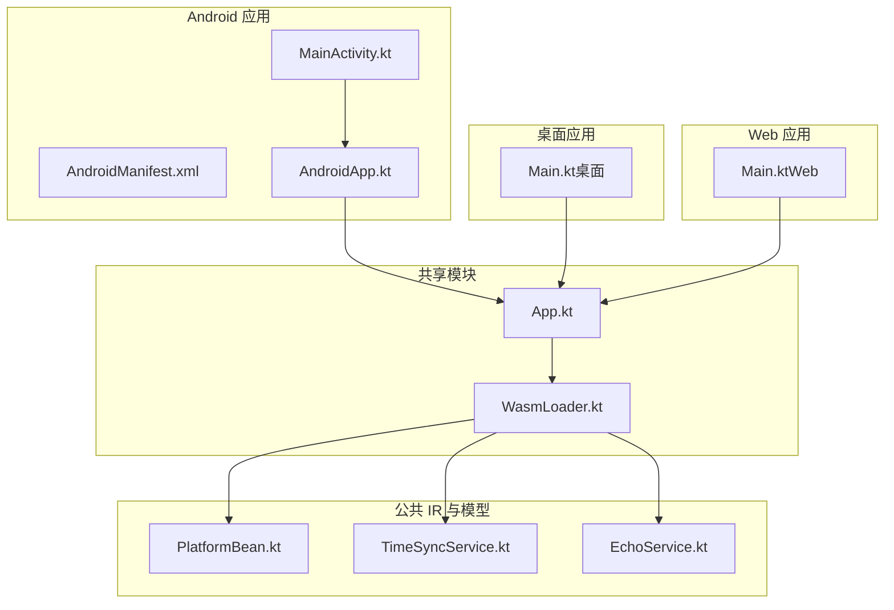
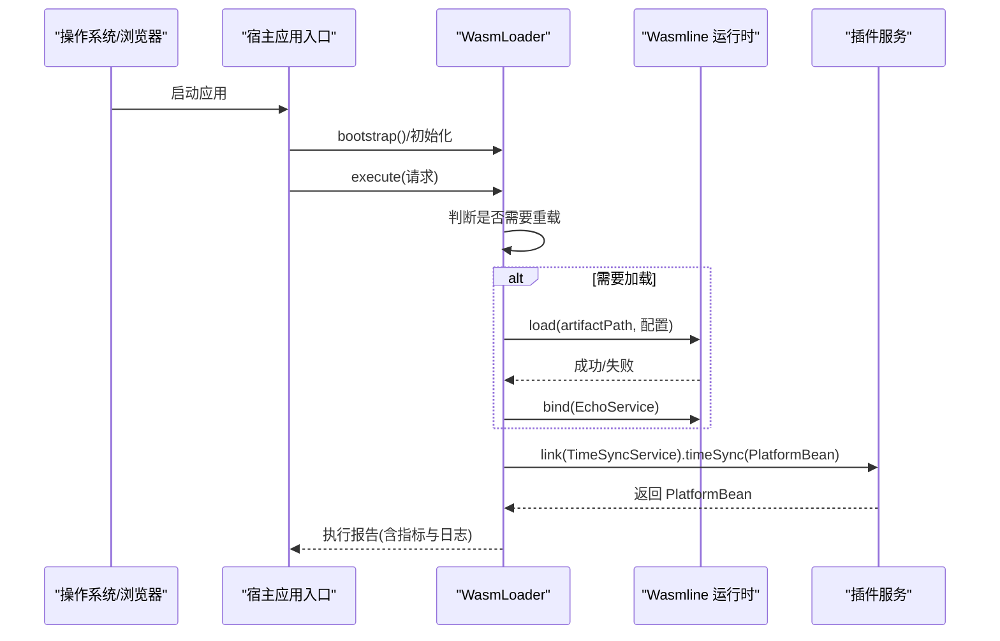
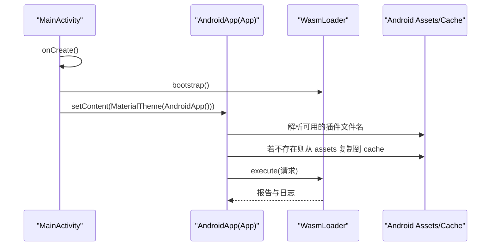
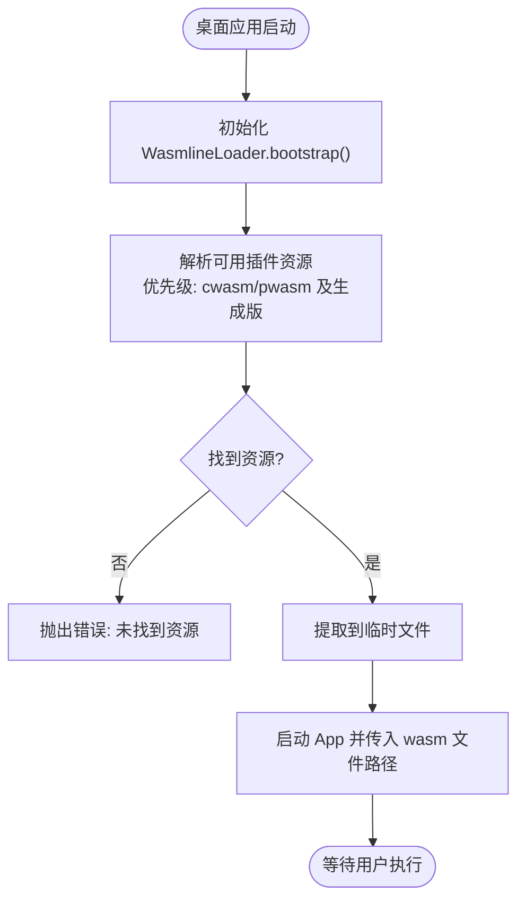
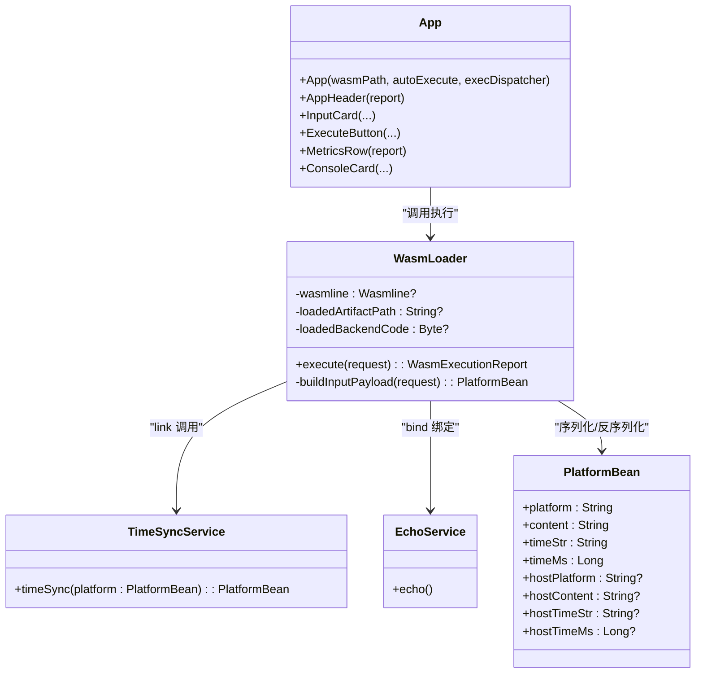
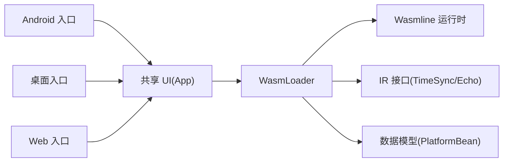

# 宿主应用示例

<cite>
**本文引用的文件**
- [MainActivity.kt](file://wasmline-samples/kotlin/sample-apps/android/src/androidMain/kotlin/crow/wasmline/MainActivity.kt)
- [AndroidManifest.xml](file://wasmline-samples/kotlin/sample-apps/android/src/androidMain/AndroidManifest.xml)
- [ApplicationWasmRunner.kt](file://wasmline-samples/kotlin/sample-apps/application/src/main/kotlin/ApplicationWasmRunner.kt)
- [Main.kt（桌面端）](file://wasmline-samples/kotlin/sample-apps/multiplatform/desktopApp/src/main/kotlin/crow/wasmline/sample/Main.kt)
- [Main.kt（Web 端）](file://wasmline-samples/kotlin/sample-apps/multiplatform/webApp/src/webMain/kotlin/crow/wasmline/sample/Main.kt)
- [App.kt（多平台共享 UI）](file://wasmline-samples/kotlin/sample-apps/multiplatform/shared/src/commonMain/kotlin/crow/wasmline/sample/App.kt)
- [WasmLoader.kt（多平台共享执行器）](file://wasmline-samples/kotlin/sample-apps/multiplatform/shared/src/commonMain/kotlin/crow/wasmline/sample/WasmLoader.kt)
- [AndroidApp.kt（Android 入口 Composable）](file://wasmline-samples/kotlin/sample-apps/multiplatform/shared/src/androidMain/kotlin/crow/wasmline/sample/AndroidApp.kt)
- [PlatformBean.kt（跨平台数据模型）](file://wasmline-samples/kotlin/sample-common/src/commonMain/kotlin/crow/wasmline/sample/bean/PlatformBean.kt)
- [TimeSyncService.kt（示例服务接口）](file://wasmline-samples/kotlin/sample-common/src/commonMain/kotlin/crow/wasmline/sample/ir/TimeSyncService.kt)
- [EchoService.kt（示例服务接口）](file://wasmline-samples/kotlin/sample-common/src/commonMain/kotlin/crow/wasmline/sample/ir/EchoService.kt)
</cite>

## 目录
1. [简介](#简介)
2. [项目结构](#项目结构)
3. [核心组件](#核心组件)
4. [架构总览](#架构总览)
5. [详细组件分析](#详细组件分析)
6. [依赖关系分析](#依赖关系分析)
7. [性能考虑](#性能考虑)
8. [故障排除指南](#故障排除指南)
9. [结论](#结论)
10. [附录：集成步骤与配置](#附录集成步骤与配置)

## 简介
本指南面向希望在多种平台（Android、桌面、Web/浏览器）集成 Wasmline 插件的宿主应用开发者。文档覆盖宿主应用初始化流程、插件加载机制、生命周期管理、宿主与插件间的通信模式、数据交换与状态同步策略，并提供可操作的集成步骤、配置选项与故障排除建议。

## 项目结构
该仓库采用 Kotlin Multiplatform 与 Gradle 组织，示例宿主应用位于 wasmline-samples/kotlin/sample-apps 下，按平台拆分；UI 与执行逻辑通过 shared 模块复用；公共 IR 接口与数据模型位于 sample-common。

图表来源
- [MainActivity.kt:15-32](file://wasmline-samples/kotlin/sample-apps/android/src/androidMain/kotlin/crow/wasmline/MainActivity.kt#L15-L32)
- [AndroidManifest.xml:14-22](file://wasmline-samples/kotlin/sample-apps/android/src/androidMain/AndroidManifest.xml#L14-L22)
- [AndroidApp.kt:14-34](file://wasmline-samples/kotlin/sample-apps/multiplatform/shared/src/androidMain/kotlin/crow/wasmline/sample/AndroidApp.kt#L14-L34)
- [Main.kt（桌面端）:96-105](file://wasmline-samples/kotlin/sample-apps/multiplatform/desktopApp/src/main/kotlin/crow/wasmline/sample/Main.kt#L96-L105)
- [Main.kt（Web 端）:11-17](file://wasmline-samples/kotlin/sample-apps/multiplatform/webApp/src/webMain/kotlin/crow/wasmline/sample/Main.kt#L11-L17)
- [App.kt（多平台共享 UI）:72-151](file://wasmline-samples/kotlin/sample-apps/multiplatform/shared/src/commonMain/kotlin/crow/wasmline/sample/App.kt#L72-L151)
- [WasmLoader.kt（多平台共享执行器）:99-222](file://wasmline-samples/kotlin/sample-apps/multiplatform/shared/src/commonMain/kotlin/crow/wasmline/sample/WasmLoader.kt#L99-L222)
- [PlatformBean.kt（跨平台数据模型）:5-15](file://wasmline-samples/kotlin/sample-common/src/commonMain/kotlin/crow/wasmline/sample/bean/PlatformBean.kt#L5-L15)
- [TimeSyncService.kt（示例服务接口）:6-8](file://wasmline-samples/kotlin/sample-common/src/commonMain/kotlin/crow/wasmline/sample/ir/TimeSyncService.kt#L6-L8)
- [EchoService.kt（示例服务接口）:15-17](file://wasmline-samples/kotlin/sample-common/src/commonMain/kotlin/crow/wasmline/sample/ir/EchoService.kt#L15-L17)

章节来源
- [MainActivity.kt:15-32](file://wasmline-samples/kotlin/sample-apps/android/src/androidMain/kotlin/crow/wasmline/MainActivity.kt#L15-L32)
- [AndroidManifest.xml:14-22](file://wasmline-samples/kotlin/sample-apps/android/src/androidMain/AndroidManifest.xml#L14-L22)
- [Main.kt（桌面端）:96-105](file://wasmline-samples/kotlin/sample-apps/multiplatform/desktopApp/src/main/kotlin/crow/wasmline/sample/Main.kt#L96-L105)
- [Main.kt（Web 端）:11-17](file://wasmline-samples/kotlin/sample-apps/multiplatform/webApp/src/webMain/kotlin/crow/wasmline/sample/Main.kt#L11-L17)
- [App.kt（多平台共享 UI）:72-151](file://wasmline-samples/kotlin/sample-apps/multiplatform/shared/src/commonMain/kotlin/crow/wasmline/sample/App.kt#L72-L151)
- [WasmLoader.kt（多平台共享执行器）:99-222](file://wasmline-samples/kotlin/sample-apps/multiplatform/shared/src/commonMain/kotlin/crow/wasmline/sample/WasmLoader.kt#L99-L222)

## 核心组件
- Android 主入口：负责初始化 Wasmline 运行时并在启动时渲染 Compose UI。
- 桌面端主入口：在桌面窗口中初始化 Wasmline 并加载插件资源。
- Web 端主入口：在浏览器中直接以静态路径加载插件。
- 多平台共享 UI：统一的交互界面，支持输入参数、执行按钮、指标展示与日志输出。
- 多平台共享执行器：封装 Wasmline 加载、绑定宿主服务、调用插件服务、缓存与重载逻辑。
- 公共 IR 与模型：定义宿主与插件间通信的服务接口与数据结构。

章节来源
- [MainActivity.kt:15-32](file://wasmline-samples/kotlin/sample-apps/android/src/androidMain/kotlin/crow/wasmline/MainActivity.kt#L15-L32)
- [Main.kt（桌面端）:96-105](file://wasmline-samples/kotlin/sample-apps/multiplatform/desktopApp/src/main/kotlin/crow/wasmline/sample/Main.kt#L96-L105)
- [Main.kt（Web 端）:11-17](file://wasmline-samples/kotlin/sample-apps/multiplatform/webApp/src/webMain/kotlin/crow/wasmline/sample/Main.kt#L11-L17)
- [App.kt（多平台共享 UI）:72-151](file://wasmline-samples/kotlin/sample-apps/multiplatform/shared/src/commonMain/kotlin/crow/wasmline/sample/App.kt#L72-L151)
- [WasmLoader.kt（多平台共享执行器）:99-222](file://wasmline-samples/kotlin/sample-apps/multiplatform/shared/src/commonMain/kotlin/crow/wasmline/sample/WasmLoader.kt#L99-L222)
- [PlatformBean.kt（跨平台数据模型）:5-15](file://wasmline-samples/kotlin/sample-common/src/commonMain/kotlin/crow/wasmline/sample/bean/PlatformBean.kt#L5-L15)
- [TimeSyncService.kt（示例服务接口）:6-8](file://wasmline-samples/kotlin/sample-common/src/commonMain/kotlin/crow/wasmline/sample/ir/TimeSyncService.kt#L6-L8)
- [EchoService.kt（示例服务接口）:15-17](file://wasmline-samples/kotlin/sample-common/src/commonMain/kotlin/crow/wasmline/sample/ir/EchoService.kt#L15-L17)

## 架构总览
下图展示了宿主应用在各平台上的初始化与执行路径，以及与 Wasmline 运行时、插件服务的交互。

图表来源
- [MainActivity.kt:17-18](file://wasmline-samples/kotlin/sample-apps/android/src/androidMain/kotlin/crow/wasmline/MainActivity.kt#L17-L18)
- [ApplicationWasmRunner.kt:81-134](file://wasmline-samples/kotlin/sample-apps/application/src/main/kotlin/ApplicationWasmRunner.kt#L81-L134)
- [Main.kt（桌面端）:96-105](file://wasmline-samples/kotlin/sample-apps/multiplatform/desktopApp/src/main/kotlin/crow/wasmline/sample/Main.kt#L96-L105)
- [Main.kt（Web 端）:11-17](file://wasmline-samples/kotlin/sample-apps/multiplatform/webApp/src/webMain/kotlin/crow/wasmline/sample/Main.kt#L11-L17)
- [WasmLoader.kt（多平台共享执行器）:104-222](file://wasmline-samples/kotlin/sample-apps/multiplatform/shared/src/commonMain/kotlin/crow/wasmline/sample/WasmLoader.kt#L104-L222)
- [TimeSyncService.kt（示例服务接口）:6-8](file://wasmline-samples/kotlin/sample-common/src/commonMain/kotlin/crow/wasmline/sample/ir/TimeSyncService.kt#L6-L8)
- [EchoService.kt（示例服务接口）:15-17](file://wasmline-samples/kotlin/sample-common/src/commonMain/kotlin/crow/wasmline/sample/ir/EchoService.kt#L15-L17)

## 详细组件分析

### Android 应用集成要点
- 启动流程：在 Activity 的 onCreate 中先进行 Wasmline 初始化，再设置 UI。
- UI 渲染：通过 Compose MaterialTheme 包裹 App，App 再委托共享的 WasmLoader 执行。
- 插件资源：Android 使用 assets 中的插件文件，首次运行时复制到 cache 目录供运行时加载。
- 生命周期：Activity 控制应用生命周期，插件运行时在宿主关闭或退出时应正确释放。

图表来源
- [MainActivity.kt:17-31](file://wasmline-samples/kotlin/sample-apps/android/src/androidMain/kotlin/crow/wasmline/MainActivity.kt#L17-L31)
- [AndroidManifest.xml:14-22](file://wasmline-samples/kotlin/sample-apps/android/src/androidMain/AndroidManifest.xml#L14-L22)
- [AndroidApp.kt:14-34](file://wasmline-samples/kotlin/sample-apps/multiplatform/shared/src/androidMain/kotlin/crow/wasmline/sample/AndroidApp.kt#L14-L34)
- [WasmLoader.kt（多平台共享执行器）:104-222](file://wasmline-samples/kotlin/sample-apps/multiplatform/shared/src/commonMain/kotlin/crow/wasmline/sample/WasmLoader.kt#L104-L222)

章节来源
- [MainActivity.kt:15-32](file://wasmline-samples/kotlin/sample-apps/android/src/androidMain/kotlin/crow/wasmline/MainActivity.kt#L15-L32)
- [AndroidManifest.xml:14-22](file://wasmline-samples/kotlin/sample-apps/android/src/androidMain/AndroidManifest.xml#L14-L22)
- [AndroidApp.kt:14-34](file://wasmline-samples/kotlin/sample-apps/multiplatform/shared/src/androidMain/kotlin/crow/wasmline/sample/AndroidApp.kt#L14-L34)

### 桌面应用集成要点
- 启动流程：桌面端 main 函数中初始化 Wasmline，解析并提取插件资源到临时文件，然后启动 UI。
- 资源选择：支持从 classpath 中选择 cwasm/pwasm 或其生成版本，优先级与错误处理明确。
- UI 与执行：与共享 UI 一致，通过 WasmLoader 执行并展示结果。

图表来源
- [Main.kt（桌面端）:96-105](file://wasmline-samples/kotlin/sample-apps/multiplatform/desktopApp/src/main/kotlin/crow/wasmline/sample/Main.kt#L96-L105)
- [Main.kt（桌面端）:174-198](file://wasmline-samples/kotlin/sample-apps/multiplatform/desktopApp/src/main/kotlin/crow/wasmline/sample/Main.kt#L174-L198)

章节来源
- [Main.kt（桌面端）:96-105](file://wasmline-samples/kotlin/sample-apps/multiplatform/desktopApp/src/main/kotlin/crow/wasmline/sample/Main.kt#L96-L105)
- [Main.kt（桌面端）:174-198](file://wasmline-samples/kotlin/sample-apps/multiplatform/desktopApp/src/main/kotlin/crow/wasmline/sample/Main.kt#L174-L198)

### Web 应用集成要点
- 启动流程：浏览器端直接在 ComposeViewport 中渲染 App，并指定插件 URL。
- 插件加载：通过静态资源路径加载插件，适合开发与演示场景。
- 与多平台 UI 一致：共享的 App 与 WasmLoader 提供统一体验。

章节来源
- [Main.kt（Web 端）:11-17](file://wasmline-samples/kotlin/sample-apps/multiplatform/webApp/src/webMain/kotlin/crow/wasmline/sample/Main.kt#L11-L17)
- [App.kt（多平台共享 UI）:72-151](file://wasmline-samples/kotlin/sample-apps/multiplatform/shared/src/commonMain/kotlin/crow/wasmline/sample/App.kt#L72-L151)

### 多平台共享 UI 与执行器
- App：提供输入卡片、执行按钮、指标行与控制台日志面板，支持自动执行与强制重载。
- WasmLoader：封装 Wasmline 加载、绑定宿主服务、调用插件服务、缓存与重载逻辑，记录加载与调用耗时，聚合日志输出。
- 数据模型：PlatformBean 作为宿主与插件间的标准传输对象，包含平台信息、内容与时间戳等字段。

图表来源
- [App.kt（多平台共享 UI）:72-151](file://wasmline-samples/kotlin/sample-apps/multiplatform/shared/src/commonMain/kotlin/crow/wasmline/sample/App.kt#L72-L151)
- [WasmLoader.kt（多平台共享执行器）:99-222](file://wasmline-samples/kotlin/sample-apps/multiplatform/shared/src/commonMain/kotlin/crow/wasmline/sample/WasmLoader.kt#L99-L222)
- [PlatformBean.kt（跨平台数据模型）:5-15](file://wasmline-samples/kotlin/sample-common/src/commonMain/kotlin/crow/wasmline/sample/bean/PlatformBean.kt#L5-L15)
- [TimeSyncService.kt（示例服务接口）:6-8](file://wasmline-samples/kotlin/sample-common/src/commonMain/kotlin/crow/wasmline/sample/ir/TimeSyncService.kt#L6-L8)
- [EchoService.kt（示例服务接口）:15-17](file://wasmline-samples/kotlin/sample-common/src/commonMain/kotlin/crow/wasmline/sample/ir/EchoService.kt#L15-L17)

章节来源
- [App.kt（多平台共享 UI）:72-151](file://wasmline-samples/kotlin/sample-apps/multiplatform/shared/src/commonMain/kotlin/crow/wasmline/sample/App.kt#L72-L151)
- [WasmLoader.kt（多平台共享执行器）:99-222](file://wasmline-samples/kotlin/sample-apps/multiplatform/shared/src/commonMain/kotlin/crow/wasmline/sample/WasmLoader.kt#L99-L222)
- [PlatformBean.kt（跨平台数据模型）:5-15](file://wasmline-samples/kotlin/sample-common/src/commonMain/kotlin/crow/wasmline/sample/bean/PlatformBean.kt#L5-L15)
- [TimeSyncService.kt（示例服务接口）:6-8](file://wasmline-samples/kotlin/sample-common/src/commonMain/kotlin/crow/wasmline/sample/ir/TimeSyncService.kt#L6-L8)
- [EchoService.kt（示例服务接口）:15-17](file://wasmline-samples/kotlin/sample-common/src/commonMain/kotlin/crow/wasmline/sample/ir/EchoService.kt#L15-L17)

### 宿主应用与插件的通信模式
- 服务绑定：宿主通过 bind 将本地实现注入到插件侧，供插件调用。
- 服务调用：宿主通过 link 获取插件暴露的服务接口，向插件发起调用。
- 数据交换：以 PlatformBean 为载体，通过 Wasmline 的序列化配置进行编解码。
- 状态同步：WasmLoader 维护加载状态与缓存，支持强制重载与复用，确保 UI 与日志实时反馈。

章节来源
- [ApplicationWasmRunner.kt:109-129](file://wasmline-samples/kotlin/sample-apps/application/src/main/kotlin/ApplicationWasmRunner.kt#L109-L129)
- [WasmLoader.kt（多平台共享执行器）:137-191](file://wasmline-samples/kotlin/sample-apps/multiplatform/shared/src/commonMain/kotlin/crow/wasmline/sample/WasmLoader.kt#L137-L191)
- [PlatformBean.kt（跨平台数据模型）:5-15](file://wasmline-samples/kotlin/sample-common/src/commonMain/kotlin/crow/wasmline/sample/bean/PlatformBean.kt#L5-L15)

## 依赖关系分析
- 平台入口依赖共享 UI 与执行器，保证行为一致性。
- 执行器依赖 Wasmline 运行时与网络客户端（桌面端示例使用 Ktor），以及公共 IR 接口与数据模型。
- Android 通过 assets 管理插件资源，桌面端通过 classpath 与临时文件管理，Web 端通过静态 URL 管理。

图表来源
- [MainActivity.kt:15-32](file://wasmline-samples/kotlin/sample-apps/android/src/androidMain/kotlin/crow/wasmline/MainActivity.kt#L15-L32)
- [Main.kt（桌面端）:96-105](file://wasmline-samples/kotlin/sample-apps/multiplatform/desktopApp/src/main/kotlin/crow/wasmline/sample/Main.kt#L96-L105)
- [Main.kt（Web 端）:11-17](file://wasmline-samples/kotlin/sample-apps/multiplatform/webApp/src/webMain/kotlin/crow/wasmline/sample/Main.kt#L11-L17)
- [App.kt（多平台共享 UI）:72-151](file://wasmline-samples/kotlin/sample-apps/multiplatform/shared/src/commonMain/kotlin/crow/wasmline/sample/App.kt#L72-L151)
- [WasmLoader.kt（多平台共享执行器）:99-222](file://wasmline-samples/kotlin/sample-apps/multiplatform/shared/src/commonMain/kotlin/crow/wasmline/sample/WasmLoader.kt#L99-L222)
- [TimeSyncService.kt（示例服务接口）:6-8](file://wasmline-samples/kotlin/sample-common/src/commonMain/kotlin/crow/wasmline/sample/ir/TimeSyncService.kt#L6-L8)
- [EchoService.kt（示例服务接口）:15-17](file://wasmline-samples/kotlin/sample-common/src/commonMain/kotlin/crow/wasmline/sample/ir/EchoService.kt#L15-L17)
- [PlatformBean.kt（跨平台数据模型）:5-15](file://wasmline-samples/kotlin/sample-common/src/commonMain/kotlin/crow/wasmline/sample/bean/PlatformBean.kt#L5-L15)

章节来源
- [App.kt（多平台共享 UI）:72-151](file://wasmline-samples/kotlin/sample-apps/multiplatform/shared/src/commonMain/kotlin/crow/wasmline/sample/App.kt#L72-L151)
- [WasmLoader.kt（多平台共享执行器）:99-222](file://wasmline-samples/kotlin/sample-apps/multiplatform/shared/src/commonMain/kotlin/crow/wasmline/sample/WasmLoader.kt#L99-L222)

## 性能考虑
- 缓存与复用：WasmLoader 在同一 artifactPath 且未强制重载时复用已加载的运行时，避免重复初始化开销。
- 异步执行：UI 层使用协程调度执行 WASM 调用，避免阻塞主线程。
- 序列化成本：示例使用 Protobuf 序列化配置，可在大数据量时评估性能影响。
- 资源拷贝：Android 与桌面端仅在首次运行时复制资源到缓存/临时目录，后续可直接复用。

章节来源
- [WasmLoader.kt（多平台共享执行器）:124-184](file://wasmline-samples/kotlin/sample-apps/multiplatform/shared/src/commonMain/kotlin/crow/wasmline/sample/WasmLoader.kt#L124-L184)
- [AndroidApp.kt:46-61](file://wasmline-samples/kotlin/sample-apps/multiplatform/shared/src/androidMain/kotlin/crow/wasmline/sample/AndroidApp.kt#L46-L61)
- [Main.kt（桌面端）:174-198](file://wasmline-samples/kotlin/sample-apps/multiplatform/desktopApp/src/main/kotlin/crow/wasmline/sample/Main.kt#L174-L198)

## 故障排除指南
- 无法找到插件资源
  - 现象：启动时报错“未找到资源”或“请求的格式不存在”。
  - 排查：确认 classpath 或 assets 中存在 cwasm/pwasm 及其生成版本；检查系统属性或环境变量是否设置了不支持的格式。
  - 参考
    - [ApplicationWasmRunner.kt:29-74](file://wasmline-samples/kotlin/sample-apps/application/src/main/kotlin/ApplicationWasmRunner.kt#L29-L74)
    - [Main.kt（桌面端）:48-93](file://wasmline-samples/kotlin/sample-apps/multiplatform/desktopApp/src/main/kotlin/crow/wasmline/sample/Main.kt#L48-L93)
    - [AndroidApp.kt:36-44](file://wasmline-samples/kotlin/sample-apps/multiplatform/shared/src/androidMain/kotlin/crow/wasmline/sample/AndroidApp.kt#L36-L44)
- 加载失败
  - 现象：Wasm 加载返回失败。
  - 排查：查看日志中的失败原因；确认 artifactPath 正确；尝试强制重载。
  - 参考
    - [WasmLoader.kt（多平台共享执行器）:146-181](file://wasmline-samples/kotlin/sample-apps/multiplatform/shared/src/commonMain/kotlin/crow/wasmline/sample/WasmLoader.kt#L146-L181)
- 插件调用异常
  - 现象：link 成功但调用抛错。
  - 排查：确认 IR 接口定义一致；检查序列化配置；核对 PlatformBean 字段映射。
  - 参考
    - [TimeSyncService.kt（示例服务接口）:6-8](file://wasmline-samples/kotlin/sample-common/src/commonMain/kotlin/crow/wasmline/sample/ir/TimeSyncService.kt#L6-L8)
    - [PlatformBean.kt（跨平台数据模型）:5-15](file://wasmline-samples/kotlin/sample-common/src/commonMain/kotlin/crow/wasmline/sample/bean/PlatformBean.kt#L5-L15)
- Android 权限与资源访问
  - 现象：assets 读取失败或复制到缓存失败。
  - 排查：确认 assets 中包含插件文件；检查运行时权限与存储空间。
  - 参考
    - [AndroidApp.kt:46-61](file://wasmline-samples/kotlin/sample-apps/multiplatform/shared/src/androidMain/kotlin/crow/wasmline/sample/AndroidApp.kt#L46-L61)
    - [AndroidManifest.xml:14-22](file://wasmline-samples/kotlin/sample-apps/android/src/androidMain/AndroidManifest.xml#L14-L22)

章节来源
- [ApplicationWasmRunner.kt:29-74](file://wasmline-samples/kotlin/sample-apps/application/src/main/kotlin/ApplicationWasmRunner.kt#L29-L74)
- [Main.kt（桌面端）:48-93](file://wasmline-samples/kotlin/sample-apps/multiplatform/desktopApp/src/main/kotlin/crow/wasmline/sample/Main.kt#L48-L93)
- [AndroidApp.kt:36-61](file://wasmline-samples/kotlin/sample-apps/multiplatform/shared/src/androidMain/kotlin/crow/wasmline/sample/AndroidApp.kt#L36-L61)
- [AndroidManifest.xml:14-22](file://wasmline-samples/kotlin/sample-apps/android/src/androidMain/AndroidManifest.xml#L14-L22)
- [WasmLoader.kt（多平台共享执行器）:146-181](file://wasmline-samples/kotlin/sample-apps/multiplatform/shared/src/commonMain/kotlin/crow/wasmline/sample/WasmLoader.kt#L146-L181)
- [TimeSyncService.kt（示例服务接口）:6-8](file://wasmline-samples/kotlin/sample-common/src/commonMain/kotlin/crow/wasmline/sample/ir/TimeSyncService.kt#L6-L8)
- [PlatformBean.kt（跨平台数据模型）:5-15](file://wasmline-samples/kotlin/sample-common/src/commonMain/kotlin/crow/wasmline/sample/bean/PlatformBean.kt#L5-L15)

## 结论
通过共享 UI 与执行器，Wasmline 宿主应用示例在 Android、桌面与 Web 平台上实现了统一的插件加载与调用体验。开发者只需关注平台特定的资源管理与入口初始化，即可快速集成 Wasmline 插件并实现稳定的宿主-插件通信。

## 附录：集成步骤与配置

### Android 应用集成步骤
1. 在 AndroidManifest 中声明 MainActivity。
2. 在 Activity 的 onCreate 中调用 Wasmline 初始化。
3. 使用 Compose 渲染 App，并在 App 中委托 WasmLoader 执行。
4. 确保 assets 中包含插件文件，首次运行时复制到缓存目录。

章节来源
- [AndroidManifest.xml:14-22](file://wasmline-samples/kotlin/sample-apps/android/src/androidMain/AndroidManifest.xml#L14-L22)
- [MainActivity.kt:17-31](file://wasmline-samples/kotlin/sample-apps/android/src/androidMain/kotlin/crow/wasmline/MainActivity.kt#L17-L31)
- [AndroidApp.kt:14-34](file://wasmline-samples/kotlin/sample-apps/multiplatform/shared/src/androidMain/kotlin/crow/wasmline/sample/AndroidApp.kt#L14-L34)

### 桌面应用集成步骤
1. 在 main 函数中调用 Wasmline 初始化。
2. 解析 classpath 中可用的插件资源，必要时复制到临时文件。
3. 启动 App 并传入 wasm 文件路径。

章节来源
- [Main.kt（桌面端）:96-105](file://wasmline-samples/kotlin/sample-apps/multiplatform/desktopApp/src/main/kotlin/crow/wasmline/sample/Main.kt#L96-L105)
- [Main.kt（桌面端）:174-198](file://wasmline-samples/kotlin/sample-apps/multiplatform/desktopApp/src/main/kotlin/crow/wasmline/sample/Main.kt#L174-L198)

### Web 应用集成步骤
1. 在浏览器中通过 ComposeViewport 渲染 App。
2. 指定插件 URL，确保静态资源可访问。

章节来源
- [Main.kt（Web 端）:11-17](file://wasmline-samples/kotlin/sample-apps/multiplatform/webApp/src/webMain/kotlin/crow/wasmline/sample/Main.kt#L11-L17)

### 通用配置与选项
- 艺术品格式选择（桌面/应用示例）
  - 支持通过系统属性或环境变量指定 pwasm 或 cwasm。
  - 若未指定，按优先级选择可用资源。
- 网络客户端（应用示例）
  - 桌面示例使用 KtorNetworkClient；其他平台可按需替换。
- 序列化配置
  - 示例使用 Protobuf 序列化配置，确保跨平台数据一致。

章节来源
- [ApplicationWasmRunner.kt:19-20](file://wasmline-samples/kotlin/sample-apps/application/src/main/kotlin/ApplicationWasmRunner.kt#L19-L20)
- [ApplicationWasmRunner.kt:99-102](file://wasmline-samples/kotlin/sample-apps/application/src/main/kotlin/ApplicationWasmRunner.kt#L99-L102)
- [WasmLoader.kt（多平台共享执行器）:139-142](file://wasmline-samples/kotlin/sample-apps/multiplatform/shared/src/commonMain/kotlin/crow/wasmline/sample/WasmLoader.kt#L139-L142)