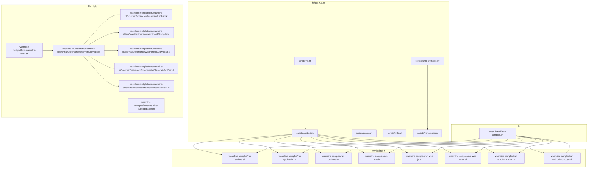
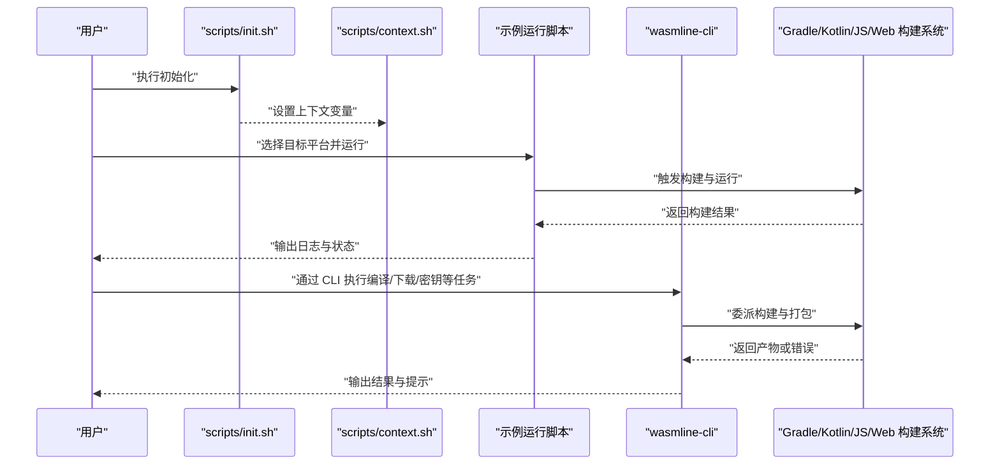
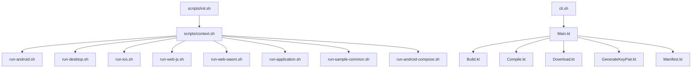

# 执行脚本与工具

<cite>
**本文引用的文件**
- [scripts/init.sh](file://scripts/init.sh)
- [scripts/context.sh](file://scripts/context.sh)
- [scripts/doctor.sh](file://scripts/doctor.sh)
- [scripts/style.sh](file://scripts/style.sh)
- [scripts/sync_versions.py](file://scripts/sync_versions.py)
- [scripts/versions.json](file://scripts/versions.json)
- [wasmline-ci/test-samples.sh](file://wasmline-ci/test-samples.sh)
- [wasmline-samples/run-android.sh](file://wasmline-samples/run-android.sh)
- [wasmline-samples/run-application.sh](file://wasmline-samples/run-application.sh)
- [wasmline-samples/run-desktop.sh](file://wasmline-samples/run-desktop.sh)
- [wasmline-samples/run-ios.sh](file://wasmline-samples/run-ios.sh)
- [wasmline-samples/run-web-js.sh](file://wasmline-samples/run-web-js.sh)
- [wasmline-samples/run-web-wasm.sh](file://wasmline-samples/run-web-wasm.sh)
- [wasmline-samples/run-sample-common.sh](file://wasmline-samples/run-sample-common.sh)
- [wasmline-samples/run-android-compose.sh](file://wasmline-samples/run-android-compose.sh)
- [wasmline-samples/sample-apps/android/src/androidMain/AndroidManifest.xml](file://wasmline-samples/sample-apps/android/AndroidManifest.xml)
- [wasmline-samples/sample-apps/multiplatform/desktopApp/build.gradle.kts](file://wasmline-samples/sample-apps/multiplatform/desktopApp/build.gradle.kts)
- [wasmline-samples/sample-apps/multiplatform/webApp/build.gradle.kts](file://wasmline-samples/sample-apps/multiplatform/webApp/build.gradle.kts)
- [wasmline-samples/sample-apps/application/application/build.gradle.kts](file://wasmline-samples/sample-apps/application/application/build.gradle.kts)
- [wasmline-multiplatform/wasmline-cli/cli.sh](file://wasmline-multiplatform/wasmline-cli/cli.sh)
- [wasmline-multiplatform/wasmline-cli/src/main/kotlin/crow/wasmline/cli/Main.kt](file://wasmline-multiplatform/wasmline-cli/src/main/kotlin/crow/wasmline/cli/Main.kt)
- [wasmline-multiplatform/wasmline-cli/src/main/kotlin/crow/wasmline/cli/Build.kt](file://wasmline-multiplatform/wasmline-cli/src/main/kotlin/crow/wasmline/cli/Build.kt)
- [wasmline-multiplatform/wasmline-cli/src/main/kotlin/crow/wasmline/cli/Compile.kt](file://wasmline-multiplatform/wasmline-cli/src/main/kotlin/crow/wasmline/cli/Compile.kt)
- [wasmline-multiplatform/wasmline-cli/src/main/kotlin/crow/wasmline/cli/Download.kt](file://wasmline-multiplatform/wasmline-cli/src/main/kotlin/crow/wasmline/cli/Download.kt)
- [wasmline-multiplatform/wasmline-cli/src/main/kotlin/crow/wasmline/cli/GenerateKeyPair.kt](file://wasmline-multiplatform/wasmline-cli/src/main/kotlin/crow/wasmline/cli/GenerateKeyPair.kt)
- [wasmline-multiplatform/wasmline-cli/src/main/kotlin/crow/wasmline/cli/Manifest.kt](file://wasmline-multiplatform/wasmline-cli/src/main/kotlin/crow/wasmline/cli/Manifest.kt)
- [wasmline-multiplatform/wasmline-cli/build.gradle.kts](file://wasmline-multiplatform/wasmline-cli/build.gradle.kts)
- [wasmline-multiplatform/wasmline-cli/build.md](file://wasmline-multiplatform/wasmline-cli/build.md)
- [wasmline-multiplatform/wasmline-cli/download.md](file://wasmline-multiplatform/wasmline-cli/download.md)
- [wasmline-multiplatform/wasmline-cli/keys.md](file://wasmline-multiplatform/wasmline-cli/keys.md)
- [wasmline-multiplatform/wasmline-cli/manifest.md](file://wasmline-multiplatform/wasmline-cli/manifest.md)
- [wasmline-multiplatform/wasmline-cli/compile.md](file://wasmline-multiplatform/wasmline-cli/compile.md)
</cite>

## 目录
1. [简介](#简介)
2. [项目结构](#项目结构)
3. [核心组件](#核心组件)
4. [架构总览](#架构总览)
5. [详细组件分析](#详细组件分析)
6. [依赖分析](#依赖分析)
7. [性能考虑](#性能考虑)
8. [故障排除指南](#故障排除指南)
9. [结论](#结论)
10. [附录](#附录)

## 简介
本指南聚焦 Wasmline 示例应用的执行脚本与工具，系统性说明各类运行脚本的功能、参数与适用场景，覆盖 Android 应用启动、桌面应用运行、Web 应用启动（JS/WASM）以及示例组件运行。文档同时解释脚本工作原理、依赖要求与环境配置，提供自定义与扩展方法，并给出跨平台使用注意事项、调试技巧、日志输出与故障排除建议，以及自动化构建、持续集成与批量执行的最佳实践。

## 项目结构
围绕“执行脚本与工具”的主题，仓库中与示例运行直接相关的脚本主要分布在以下位置：
- 根级脚本工具：初始化、上下文设置、健康检查、风格校验、版本同步等
- CI 脚本：用于测试样例的自动化执行
- 示例应用运行脚本：Android、桌面、iOS、Web（JS/WASM）、通用示例等
- CLI 工具：wasmline-cli 提供编译、下载、密钥生成、清单管理等功能

下图展示与“执行脚本与工具”相关的核心文件与模块关系：

图表来源
- [scripts/init.sh](file://scripts/init.sh)
- [scripts/context.sh](file://scripts/context.sh)
- [scripts/doctor.sh](file://scripts/doctor.sh)
- [scripts/style.sh](file://scripts/style.sh)
- [scripts/sync_versions.py](file://scripts/sync_versions.py)
- [scripts/versions.json](file://scripts/versions.json)
- [wasmline-ci/test-samples.sh](file://wasmline-ci/test-samples.sh)
- [wasmline-samples/run-android.sh](file://wasmline-samples/run-android.sh)
- [wasmline-samples/run-application.sh](file://wasmline-samples/run-application.sh)
- [wasmline-samples/run-desktop.sh](file://wasmline-samples/run-desktop.sh)
- [wasmline-samples/run-ios.sh](file://wasmline-samples/run-ios.sh)
- [wasmline-samples/run-web-js.sh](file://wasmline-samples/run-web-js.sh)
- [wasmline-samples/run-web-wasm.sh](file://wasmline-samples/run-web-wasm.sh)
- [wasmline-samples/run-sample-common.sh](file://wasmline-samples/run-sample-common.sh)
- [wasmline-samples/run-android-compose.sh](file://wasmline-samples/run-android-compose.sh)
- [wasmline-multiplatform/wasmline-cli/cli.sh](file://wasmline-multiplatform/wasmline-cli/cli.sh)
- [wasmline-multiplatform/wasmline-cli/src/main/kotlin/crow/wasmline/cli/Main.kt](file://wasmline-multiplatform/wasmline-cli/src/main/kotlin/crow/wasmline/cli/Main.kt)
- [wasmline-multiplatform/wasmline-cli/src/main/kotlin/crow/wasmline/cli/Build.kt](file://wasmline-multiplatform/wasmline-cli/src/main/kotlin/crow/wasmline/cli/Build.kt)
- [wasmline-multiplatform/wasmline-cli/src/main/kotlin/crow/wasmline/cli/Compile.kt](file://wasmline-multiplatform/wasmline-cli/src/main/kotlin/crow/wasmline/cli/Compile.kt)
- [wasmline-multiplatform/wasmline-cli/src/main/kotlin/crow/wasmline/cli/Download.kt](file://wasmline-multiplatform/wasmline-cli/src/main/kotlin/crow/wasmline/cli/Download.kt)
- [wasmline-multiplatform/wasmline-cli/src/main/kotlin/crow/wasmline/cli/GenerateKeyPair.kt](file://wasmline-multiplatform/wasmline-cli/src/main/kotlin/crow/wasmline/cli/GenerateKeyPair.kt)
- [wasmline-multiplatform/wasmline-cli/src/main/kotlin/crow/wasmline/cli/Manifest.kt](file://wasmline-multiplatform/wasmline-cli/src/main/kotlin/crow/wasmline/cli/Manifest.kt)
- [wasmline-multiplatform/wasmline-cli/build.gradle.kts](file://wasmline-multiplatform/wasmline-cli/build.gradle.kts)

章节来源
- [scripts/init.sh](file://scripts/init.sh)
- [scripts/context.sh](file://scripts/context.sh)
- [scripts/doctor.sh](file://scripts/doctor.sh)
- [scripts/style.sh](file://scripts/style.sh)
- [scripts/sync_versions.py](file://scripts/sync_versions.py)
- [scripts/versions.json](file://scripts/versions.json)
- [wasmline-ci/test-samples.sh](file://wasmline-ci/test-samples.sh)
- [wasmline-samples/run-android.sh](file://wasmline-samples/run-android.sh)
- [wasmline-samples/run-application.sh](file://wasmline-samples/run-application.sh)
- [wasmline-samples/run-desktop.sh](file://wasmline-samples/run-desktop.sh)
- [wasmline-samples/run-ios.sh](file://wasmline-samples/run-ios.sh)
- [wasmline-samples/run-web-js.sh](file://wasmline-samples/run-web-js.sh)
- [wasmline-samples/run-web-wasm.sh](file://wasmline-samples/run-web-wasm.sh)
- [wasmline-samples/run-sample-common.sh](file://wasmline-samples/run-sample-common.sh)
- [wasmline-samples/run-android-compose.sh](file://wasmline-samples/run-android-compose.sh)

## 核心组件
本节概述与“执行脚本与工具”直接相关的脚本与工具职责与交互方式。

- 根级脚本工具
  - 初始化与上下文：提供统一的环境初始化、路径与变量设置，确保后续脚本在一致的环境中运行
  - 健康检查：检测关键依赖是否就绪（如 Gradle、Android SDK、JDK、Node 等）
  - 风格校验：对代码风格进行一致性检查
  - 版本同步：维护与同步多语言/多模块版本信息

- CI 脚本
  - 自动化测试样例：按平台维度批量执行示例运行脚本，验证各平台可用性

- 示例运行脚本
  - Android：启动示例 Android 应用（含 Compose）
  - 桌面：运行跨平台桌面应用
  - iOS：启动 iOS 示例
  - Web：分别以 JS 与 WASM 运行 Web 示例
  - 通用示例：运行共享示例组件

- CLI 工具
  - 提供命令行入口，封装编译、下载、密钥生成、清单管理等能力，支持多平台打包与分发

章节来源
- [scripts/init.sh](file://scripts/init.sh)
- [scripts/context.sh](file://scripts/context.sh)
- [scripts/doctor.sh](file://scripts/doctor.sh)
- [scripts/style.sh](file://scripts/style.sh)
- [scripts/sync_versions.py](file://scripts/sync_versions.py)
- [scripts/versions.json](file://scripts/versions.json)
- [wasmline-ci/test-samples.sh](file://wasmline-ci/test-samples.sh)
- [wasmline-samples/run-android.sh](file://wasmline-samples/run-android.sh)
- [wasmline-samples/run-application.sh](file://wasmline-samples/run-application.sh)
- [wasmline-samples/run-desktop.sh](file://wasmline-samples/run-desktop.sh)
- [wasmline-samples/run-ios.sh](file://wasmline-samples/run-ios.sh)
- [wasmline-samples/run-web-js.sh](file://wasmline-samples/run-web-js.sh)
- [wasmline-samples/run-web-wasm.sh](file://wasmline-samples/run-web-wasm.sh)
- [wasmline-samples/run-sample-common.sh](file://wasmline-samples/run-sample-common.sh)
- [wasmline-samples/run-android-compose.sh](file://wasmline-samples/run-android-compose.sh)
- [wasmline-multiplatform/wasmline-cli/cli.sh](file://wasmline-multiplatform/wasmline-cli/cli.sh)

## 架构总览
下图展示了从用户调用到具体执行的端到端流程，涵盖脚本链路、CLI 工具与示例应用之间的协作关系。

图表来源
- [scripts/init.sh](file://scripts/init.sh)
- [scripts/context.sh](file://scripts/context.sh)
- [wasmline-samples/run-android.sh](file://wasmline-samples/run-android.sh)
- [wasmline-samples/run-application.sh](file://wasmline-samples/run-application.sh)
- [wasmline-samples/run-desktop.sh](file://wasmline-samples/run-desktop.sh)
- [wasmline-samples/run-ios.sh](file://wasmline-samples/run-ios.sh)
- [wasmline-samples/run-web-js.sh](file://wasmline-samples/run-web-js.sh)
- [wasmline-samples/run-web-wasm.sh](file://wasmline-samples/run-web-wasm.sh)
- [wasmline-samples/run-sample-common.sh](file://wasmline-samples/run-sample-common.sh)
- [wasmline-multiplatform/wasmline-cli/cli.sh](file://wasmline-multiplatform/wasmline-cli/cli.sh)

## 详细组件分析

### Android 应用启动脚本
- 功能与场景
  - 启动示例 Android 应用，支持传统 Activity 与 Jetpack Compose 两种 UI 形态
  - 适用于 Android 设备或模拟器，便于验证跨平台桥接与原生扩展在 Android 上的行为
- 工作原理
  - 通过 Gradle 任务构建并安装 APK/APP，随后启动主 Activity 或 Compose 主界面
  - 依赖 Android SDK、ADB、Gradle 等工具
- 参数与选项
  - 可通过脚本内部的构建参数控制变体、打包类型与安装行为
- 环境配置
  - 需要 Android SDK、NDK、JDK、Gradle 与可运行的设备/模拟器
- 使用步骤
  - 执行初始化与上下文设置后，运行对应 Android 启动脚本
- 自定义与扩展
  - 可在 Gradle 层面调整构建变体与依赖；可在脚本中添加额外的安装/启动参数
- 调试与日志
  - 关注构建日志与设备日志（如 logcat），定位加载与桥接问题
- 故障排除
  - 若安装失败，检查设备连接、签名配置与权限；若运行崩溃，查看日志并确认桥接库与资源加载路径

章节来源
- [wasmline-samples/run-android.sh](file://wasmline-samples/run-android.sh)
- [wasmline-samples/run-android-compose.sh](file://wasmline-samples/run-android-compose.sh)
- [wasmline-samples/sample-apps/android/AndroidManifest.xml](file://wasmline-samples/sample-apps/android/AndroidManifest.xml)

### 桌面应用运行脚本
- 功能与场景
  - 在桌面平台运行跨平台示例应用，验证 JVM/WasmWASI 等运行时桥接
- 工作原理
  - 通过 Gradle 任务构建桌面应用并运行主程序
- 环境配置
  - 需要 JDK、Gradle 与桌面运行环境
- 使用步骤
  - 执行初始化与上下文设置后，运行桌面运行脚本
- 自定义与扩展
  - 可在构建脚本中调整 JVM/WasmWASI 的运行参数与资源路径
- 调试与日志
  - 关注控制台输出与日志文件，定位加载与序列化问题
- 故障排除
  - 若无法启动，检查运行时依赖与资源路径；若出现桥接异常，核对服务注册与序列化配置

章节来源
- [wasmline-samples/run-desktop.sh](file://wasmline-samples/run-desktop.sh)
- [wasmline-samples/sample-apps/multiplatform/desktopApp/build.gradle.kts](file://wasmline-samples/sample-apps/multiplatform/desktopApp/build.gradle.kts)

### Web 应用启动脚本（JS 与 WASM）
- 功能与场景
  - 分别以 JS 与 WASM 方式运行 Web 示例，验证浏览器端桥接与资源加载
- 工作原理
  - 通过 Gradle/JS/Web 构建系统生成前端资源，启动本地开发服务器或静态页面
- 环境配置
  - 需要 Node.js、Yarn/npm、Gradle 与浏览器
- 使用步骤
  - 执行初始化与上下文设置后，运行对应 Web 启动脚本
- 自定义与扩展
  - 可在构建脚本中调整打包策略、资源注入与开发服务器参数
- 调试与日志
  - 关注浏览器控制台与网络面板，定位资源加载与跨语言调用问题
- 故障排除
  - 若页面空白，检查资源路径与跨域；若桥接失败，核对序列化与服务注册

章节来源
- [wasmline-samples/run-web-js.sh](file://wasmline-samples/run-web-js.sh)
- [wasmline-samples/run-web-wasm.sh](file://wasmline-samples/run-web-wasm.sh)
- [wasmline-samples/sample-apps/multiplatform/webApp/build.gradle.kts](file://wasmline-samples/sample-apps/multiplatform/webApp/build.gradle.kts)

### 应用程序示例运行脚本
- 功能与场景
  - 运行独立的应用程序示例，验证在不同平台上的加载与执行
- 工作原理
  - 通过 Gradle 任务构建并运行应用程序示例
- 环境配置
  - 需要 JDK/Gradle 等基础工具
- 使用步骤
  - 执行初始化与上下文设置后，运行应用程序示例脚本
- 自定义与扩展
  - 可在构建脚本中调整入口点与运行参数
- 调试与日志
  - 关注控制台输出与日志文件，定位加载与执行问题
- 故障排除
  - 若无法运行，检查入口类与依赖；若出现桥接异常，核对服务与序列化配置

章节来源
- [wasmline-samples/run-application.sh](file://wasmline-samples/run-application.sh)
- [wasmline-samples/sample-apps/application/application/build.gradle.kts](file://wasmline-samples/sample-apps/application/application/build.gradle.kts)

### iOS 示例运行脚本
- 功能与场景
  - 在 iOS 平台上运行示例应用，验证原生桥接与平台扩展
- 工作原理
  - 通过 Gradle/构建系统生成 iOS 应用并部署到模拟器或真机
- 环境配置
  - 需要 Xcode、CocoaPods/SwiftPM、Gradle 与 iOS 模拟器/设备
- 使用步骤
  - 执行初始化与上下文设置后，运行 iOS 启动脚本
- 自定义与扩展
  - 可在构建脚本中调整目标架构与部署参数
- 调试与日志
  - 关注 Xcode 控制台与设备日志，定位加载与桥接问题
- 故障排除
  - 若无法运行，检查签名、目标与依赖；若桥接异常，核对服务与序列化配置

章节来源
- [wasmline-samples/run-ios.sh](file://wasmline-samples/run-ios.sh)

### 示例组件运行脚本
- 功能与场景
  - 运行共享示例组件，验证跨平台组件复用与桥接行为
- 工作原理
  - 通过 Gradle 任务构建并运行共享组件示例
- 环境配置
  - 需要 JDK/Gradle 等基础工具
- 使用步骤
  - 执行初始化与上下文设置后，运行示例组件脚本
- 自定义与扩展
  - 可在构建脚本中调整组件入口与运行参数
- 调试与日志
  - 关注控制台输出与日志文件，定位加载与执行问题
- 故障排除
  - 若无法运行，检查组件入口与依赖；若出现桥接异常，核对服务与序列化配置

章节来源
- [wasmline-samples/run-sample-common.sh](file://wasmline-samples/run-sample-common.sh)

### CLI 工具（wasmline-cli）
- 功能与场景
  - 提供编译、下载、密钥生成、清单管理等命令行能力，支持多平台打包与分发
- 工作原理
  - 通过命令行入口委派到具体的子任务（构建、编译、下载、密钥生成、清单）
- 环境配置
  - 需要 JDK、Gradle、Node.js（视任务而定）等工具
- 使用步骤
  - 执行初始化与上下文设置后，通过 CLI 入口运行相应命令
- 自定义与扩展
  - 可在 CLI 子任务中扩展新的命令或参数；可在构建脚本中调整打包策略
- 调试与日志
  - 关注 CLI 输出与日志文件，定位任务执行问题
- 故障排除
  - 若命令失败，检查参数与依赖；若打包异常，核对清单与密钥配置

章节来源
- [wasmline-multiplatform/wasmline-cli/cli.sh](file://wasmline-multiplatform/wasmline-cli/cli.sh)
- [wasmline-multiplatform/wasmline-cli/src/main/kotlin/crow/wasmline/cli/Main.kt](file://wasmline-multiplatform/wasmline-cli/src/main/kotlin/crow/wasmline/cli/Main.kt)
- [wasmline-multiplatform/wasmline-cli/src/main/kotlin/crow/wasmline/cli/Build.kt](file://wasmline-multiplatform/wasmline-cli/src/main/kotlin/crow/wasmline/cli/Build.kt)
- [wasmline-multiplatform/wasmline-cli/src/main/kotlin/crow/wasmline/cli/Compile.kt](file://wasmline-multiplatform/wasmline-cli/src/main/kotlin/crow/wasmline/cli/Compile.kt)
- [wasmline-multiplatform/wasmline-cli/src/main/kotlin/crow/wasmline/cli/Download.kt](file://wasmline-multiplatform/wasmline-cli/src/main/kotlin/crow/wasmline/cli/Download.kt)
- [wasmline-multiplatform/wasmline-cli/src/main/kotlin/crow/wasmline/cli/GenerateKeyPair.kt](file://wasmline-multiplatform/wasmline-cli/src/main/kotlin/crow/wasmline/cli/GenerateKeyPair.kt)
- [wasmline-multiplatform/wasmline-cli/src/main/kotlin/crow/wasmline/cli/Manifest.kt](file://wasmline-multiplatform/wasmline-cli/src/main/kotlin/crow/wasmline/cli/Manifest.kt)
- [wasmline-multiplatform/wasmline-cli/build.gradle.kts](file://wasmline-multiplatform/wasmline-cli/build.gradle.kts)

## 依赖分析
- 脚本间耦合
  - 初始化与上下文脚本为其他脚本提供统一的环境变量与路径，降低重复配置成本
  - 示例运行脚本依赖 Gradle/Kotlin/JS/Web 构建系统完成构建与运行
  - CLI 工具作为统一入口，委派到具体子任务，提升可维护性
- 外部依赖
  - Android：Android SDK/NDK、JDK、Gradle、ADB
  - 桌面：JDK、Gradle
  - iOS：Xcode、CocoaPods/SwiftPM、Gradle
  - Web：Node.js、Yarn/npm、Gradle
  - CLI：JDK、Gradle、Node.js（视任务而定）

图表来源
- [scripts/init.sh](file://scripts/init.sh)
- [scripts/context.sh](file://scripts/context.sh)
- [wasmline-samples/run-android.sh](file://wasmline-samples/run-android.sh)
- [wasmline-samples/run-desktop.sh](file://wasmline-samples/run-desktop.sh)
- [wasmline-samples/run-ios.sh](file://wasmline-samples/run-ios.sh)
- [wasmline-samples/run-web-js.sh](file://wasmline-samples/run-web-js.sh)
- [wasmline-samples/run-web-wasm.sh](file://wasmline-samples/run-web-wasm.sh)
- [wasmline-samples/run-application.sh](file://wasmline-samples/run-application.sh)
- [wasmline-samples/run-sample-common.sh](file://wasmline-samples/run-sample-common.sh)
- [wasmline-samples/run-android-compose.sh](file://wasmline-samples/run-android-compose.sh)
- [wasmline-multiplatform/wasmline-cli/cli.sh](file://wasmline-multiplatform/wasmline-cli/cli.sh)
- [wasmline-multiplatform/wasmline-cli/src/main/kotlin/crow/wasmline/cli/Main.kt](file://wasmline-multiplatform/wasmline-cli/src/main/kotlin/crow/wasmline/cli/Main.kt)
- [wasmline-multiplatform/wasmline-cli/src/main/kotlin/crow/wasmline/cli/Build.kt](file://wasmline-multiplatform/wasmline-cli/src/main/kotlin/crow/wasmline/cli/Build.kt)
- [wasmline-multiplatform/wasmline-cli/src/main/kotlin/crow/wasmline/cli/Compile.kt](file://wasmline-multiplatform/wasmline-cli/src/main/kotlin/crow/wasmline/cli/Compile.kt)
- [wasmline-multiplatform/wasmline-cli/src/main/kotlin/crow/wasmline/cli/Download.kt](file://wasmline-multiplatform/wasmline-cli/src/main/kotlin/crow/wasmline/cli/Download.kt)
- [wasmline-multiplatform/wasmline-cli/src/main/kotlin/crow/wasmline/cli/GenerateKeyPair.kt](file://wasmline-multiplatform/wasmline-cli/src/main/kotlin/crow/wasmline/cli/GenerateKeyPair.kt)
- [wasmline-multiplatform/wasmline-cli/src/main/kotlin/crow/wasmline/cli/Manifest.kt](file://wasmline-multiplatform/wasmline-cli/src/main/kotlin/crow/wasmline/cli/Manifest.kt)

章节来源
- [scripts/init.sh](file://scripts/init.sh)
- [scripts/context.sh](file://scripts/context.sh)
- [wasmline-multiplatform/wasmline-cli/cli.sh](file://wasmline-multiplatform/wasmline-cli/cli.sh)
- [wasmline-multiplatform/wasmline-cli/src/main/kotlin/crow/wasmline/cli/Main.kt](file://wasmline-multiplatform/wasmline-cli/src/main/kotlin/crow/wasmline/cli/Main.kt)

## 性能考虑
- 构建缓存与增量编译
  - 利用 Gradle 的构建缓存与增量编译减少重复构建时间
- 资源优化
  - Web 平台可通过压缩与懒加载优化资源加载性能
- 日志级别控制
  - 在开发阶段使用详细日志，在生产阶段降低日志级别以减少开销
- 并行执行
  - 在 CI 中并行执行多平台测试，缩短整体耗时

## 故障排除指南
- 常见问题与定位
  - 构建失败：检查 JDK/Gradle 版本与依赖完整性
  - 设备/模拟器问题：确认连接状态、权限与目标平台兼容性
  - 浏览器问题：检查跨域、资源路径与控制台错误
  - CLI 任务失败：核对命令参数与依赖工具
- 日志与诊断
  - Android：使用 logcat 查看日志
  - iOS：使用 Xcode 控制台与设备日志
  - 桌面/Web：查看控制台输出与日志文件
- 快速修复
  - 清理构建缓存与临时文件
  - 更新依赖与工具版本
  - 核对清单与密钥配置

章节来源
- [scripts/doctor.sh](file://scripts/doctor.sh)
- [wasmline-samples/run-android.sh](file://wasmline-samples/run-android.sh)
- [wasmline-samples/run-desktop.sh](file://wasmline-samples/run-desktop.sh)
- [wasmline-samples/run-web-js.sh](file://wasmline-samples/run-web-js.sh)
- [wasmline-samples/run-web-wasm.sh](file://wasmline-samples/run-web-wasm.sh)
- [wasmline-samples/run-application.sh](file://wasmline-samples/run-application.sh)
- [wasmline-samples/run-sample-common.sh](file://wasmline-samples/run-sample-common.sh)
- [wasmline-samples/run-android-compose.sh](file://wasmline-samples/run-android-compose.sh)

## 结论
本文档系统梳理了 Wasmline 示例应用的执行脚本与工具，覆盖多平台运行场景、依赖与环境配置、调试与故障排除，并提供了自定义与扩展方法及自动化最佳实践。通过统一的初始化与上下文设置、清晰的脚本分工与 CLI 委派机制，开发者可以高效地在 Android、桌面、iOS、Web 等平台上验证与扩展示例应用。

## 附录
- 版本同步与一致性
  - 使用版本同步脚本与 JSON 文件维护多模块版本一致性
- CI 最佳实践
  - 在 CI 中批量执行示例运行脚本，结合缓存与并行策略提升效率
- 跨平台注意事项
  - 不同平台的工具链、权限与运行时差异较大，需在脚本中做好条件判断与降级处理

章节来源
- [scripts/sync_versions.py](file://scripts/sync_versions.py)
- [scripts/versions.json](file://scripts/versions.json)
- [wasmline-ci/test-samples.sh](file://wasmline-ci/test-samples.sh)