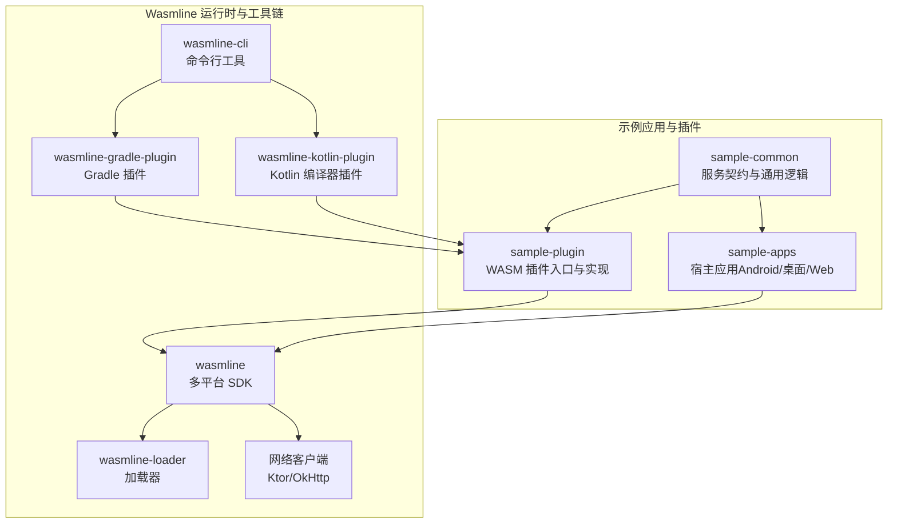
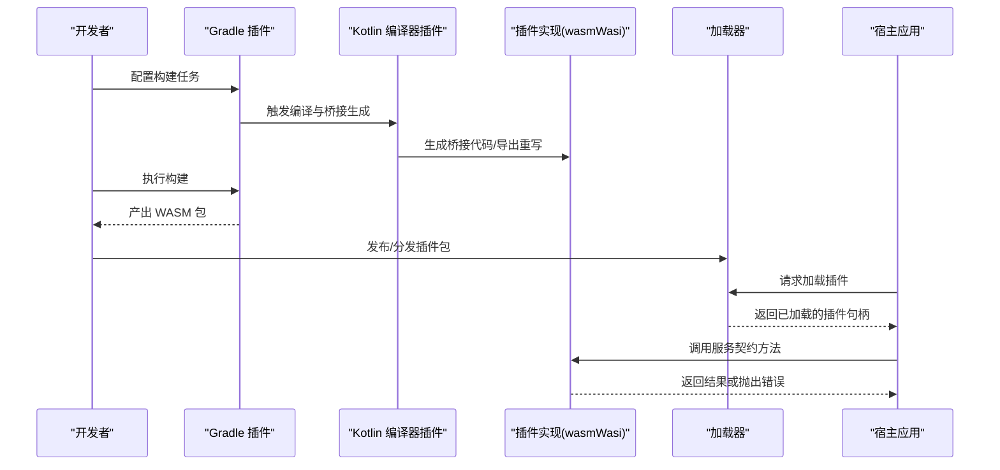
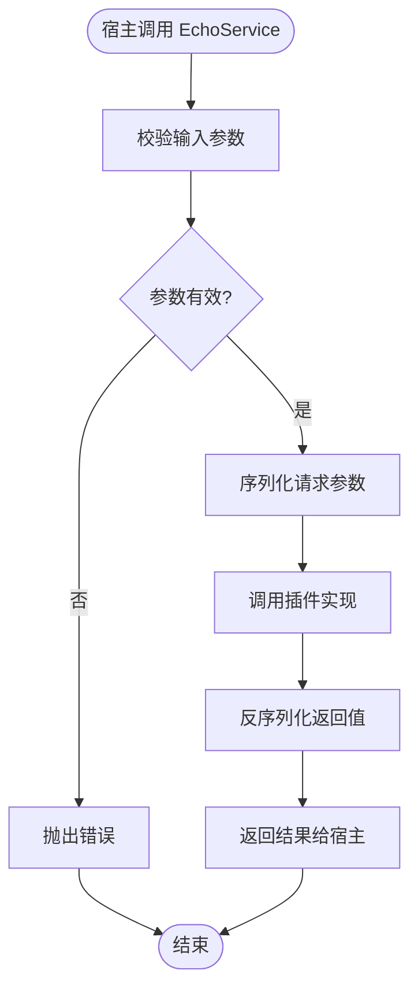
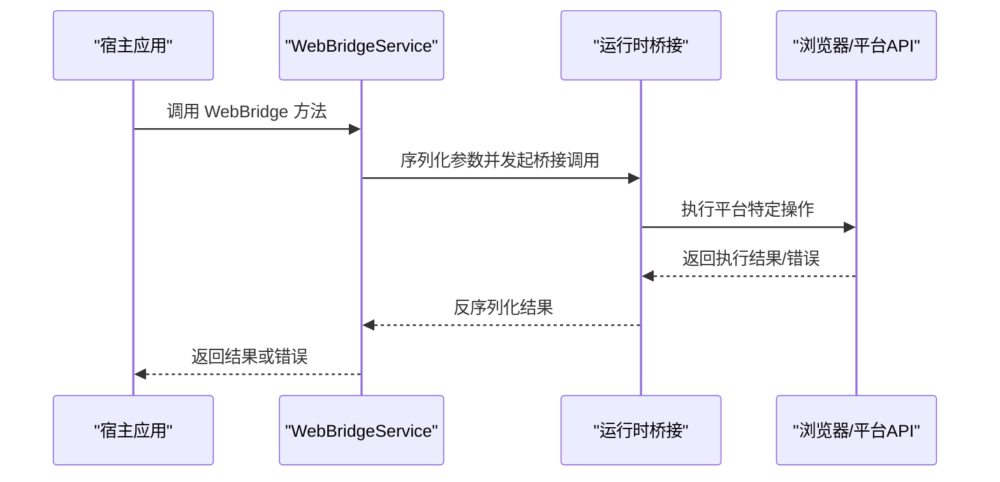
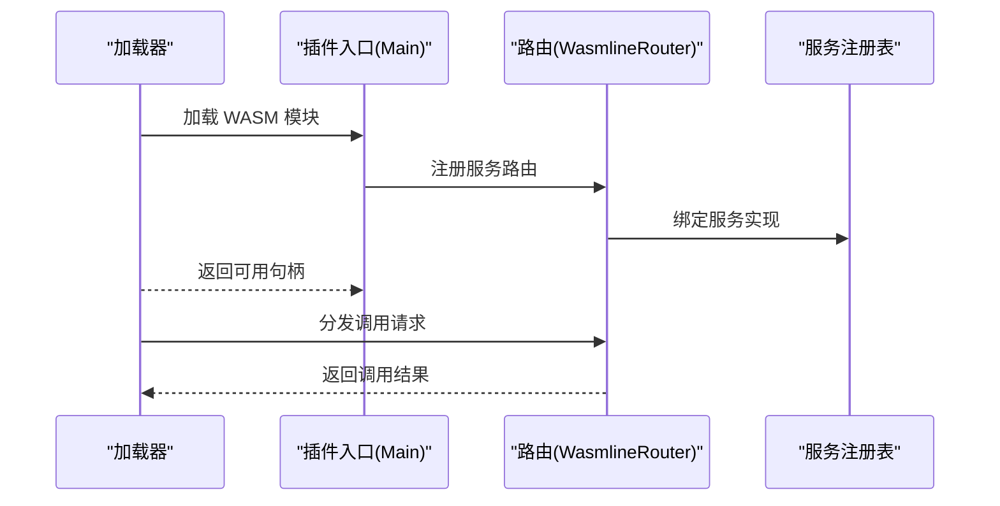
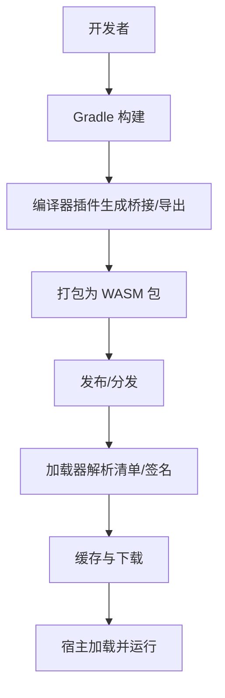
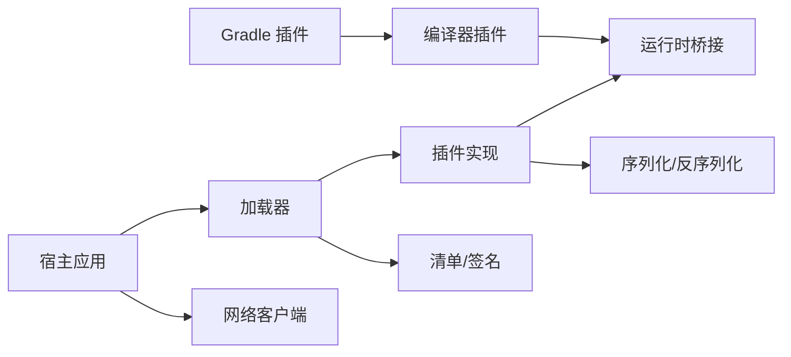

# 插件示例

<cite>
**本文引用的文件**
- [README.md](file://README.md)
- [EchoService.kt](file://wasmline-samples/kotlin/sample-common/src/commonMain/kotlin/crow/wasmline/sample/ir/EchoService.kt)
- [WebBridgeService.kt](file://wasmline-samples/kotlin/sample-common/src/commonMain/kotlin/crow/wasmline/sample/ir/WebBridgeService.kt)
- [TimeSyncService.kt](file://wasmline-samples/kotlin/sample-common/src/commonMain/kotlin/crow/wasmline/sample/ir/TimeSyncService.kt)
- [Main.kt（示例插件入口）](file://wasmline-samples/kotlin/sample-plugin/src/wasmWasiMain/kotlin/crow/wasmline/sample/Main.kt)
- [build.gradle.kts（示例插件构建脚本）](file://wasmline-samples/kotlin/sample-plugin/build.gradle.kts)
- [gradle-build.md（示例插件构建说明）](file://wasmline-samples/kotlin/sample-plugin/gradle-build.md)
- [WasmlineService.kt](file://wasmline-multiplatform/wasmline/src/commonMain/kotlin/crow/wasmline/WasmlineService.kt)
- [Wasmline.wasmWasi.kt](file://wasmline-multiplatform/wasmline/src/wasmWasiMain/kotlin/crow/wasmline/Wasmline.wasmWasi.kt)
- [WasmlineServices.wasmWasi.kt](file://wasmline-multiplatform/wasmline/src/wasmWasiMain/kotlin/crow/wasmline/WasmlineServices.wasmWasi.kt)
- [WasmlineWasmBridge.kt](file://wasmline-multiplatform/wasmline/src/wasmWasiMain/kotlin/crow/wasmline/WasmlineWasmBridge.kt)
- [WasmlineRouter.kt](file://wasmline-multiplatform/wasmline/src/wasmWasiMain/kotlin/crow/wasmline/WasmlineRouter.kt)
- [WasmError.kt](file://wasmline-multiplatform/wasmline/src/wasmWasiMain/kotlin/crow/wasmline/model/WasmError.kt)
- [WasmlineBridgeGenerator.kt](file://wasmline-multiplatform/wasmline-kotlin-plugin/src/main/kotlin/crow/wasmline/kotlin/WasmlineBridgeGenerator.kt)
- [WasmlineServiceContractValidator.kt](file://wasmline-multiplatform/wasmline-kotlin-plugin/src/main/kotlin/crow/wasmline/kotlin/WasmlineServiceContractValidator.kt)
- [WasmlineTypedEntryPointRewriter.kt](file://wasmline-multiplatform/wasmline-kotlin-plugin/src/main/kotlin/crow/wasmline/kotlin/WasmlineTypedEntryPointRewriter.kt)
- [WasmlineWasiEntryExportGenerator.kt](file://wasmline-multiplatform/wasmline-kotlin-plugin/src/main/kotlin/crow/wasmline/kotlin/WasmlineWasiEntryExportGenerator.kt)
- [WasmlinePlugin.kt](file://wasmline-multiplatform/wasmline-gradle-plugin/src/main/kotlin/crow/wasmline/WasmlinePlugin.kt)
- [Build.kt](file://wasmline-multiplatform/wasmline-cli/src/main/kotlin/crow/wasmline/cli/Build.kt)
- [Compile.kt](file://wasmline-multiplatform/wasmline-cli/src/main/kotlin/crow/wasmline/cli/Compile.kt)
- [Manifest.kt](file://wasmline-multiplatform/wasmline-cli/src/main/kotlin/crow/wasmline/cli/Manifest.kt)
- [DefaultWasmlineLoader.kt](file://wasmline-multiplatform/wasmline-loader/src/hostMain/kotlin/crow/wasmline/loader/DefaultWasmlineLoader.kt)
- [WasmlineSourceResolvers.kt](file://wasmline-multiplatform/wasmline-loader/src/commonMain/kotlin/crow/wasmline/loader/WasmlineSourceResolvers.kt)
- [KtorNetworkClient.kt](file://wasmline-multiplatform/wasmline-network-ktor/src/commonMain/kotlin/crow/wasmline/network/ktor/KtorNetworkClient.kt)
- [OkHttpNetworkClient.kt](file://wasmline-multiplatform/wasmline-network-okhttp/src/commonMain/kotlin/crow/wasmline/network/okhttp/OkHttpNetworkClient.kt)
</cite>

## 目录
1. [简介](#简介)
2. [项目结构](#项目结构)
3. [核心组件](#核心组件)
4. [架构总览](#架构总览)
5. [详细组件分析](#详细组件分析)
6. [依赖关系分析](#依赖关系分析)
7. [性能考虑](#性能考虑)
8. [故障排查指南](#故障排查指南)
9. [结论](#结论)
10. [附录](#附录)

## 简介
本指南面向希望基于 Wasmline 构建 WebAssembly 插件的开发者，系统讲解插件的定义、实现、编译、打包与部署全流程。重点围绕两个典型服务契约：EchoService（回声服务）与 WebBridgeService（Web 桥接服务），阐述其设计思想、实现原理与使用场景；同时覆盖插件与宿主应用的交互机制、数据序列化与反序列化、错误处理策略，以及最佳实践建议。

## 项目结构
Wasmline 示例工程采用多模块组织，核心与示例分离：
- wasmline-core：C++ 核心引擎与接口定义（用于底层桥接与运行时）
- wasmline-multiplatform：跨平台 SDK 与运行时（含 Kotlin 多平台实现）
- wasmline-samples/kotlin：Kotlin 示例应用与插件
- wasmline-ci：持续集成测试脚本

下图展示与插件开发相关的关键模块及其职责：

图表来源
- [WasmlineService.kt](file://wasmline-multiplatform/wasmline/src/commonMain/kotlin/crow/wasmline/WasmlineService.kt)
- [WasmlinePlugin.kt](file://wasmline-multiplatform/wasmline-gradle-plugin/src/main/kotlin/crow/wasmline/WasmlinePlugin.kt)
- [WasmlineBridgeGenerator.kt](file://wasmline-multiplatform/wasmline-kotlin-plugin/src/main/kotlin/crow/wasmline/kotlin/WasmlineBridgeGenerator.kt)
- [DefaultWasmlineLoader.kt](file://wasmline-multiplatform/wasmline-loader/src/hostMain/kotlin/crow/wasmline/loader/DefaultWasmlineLoader.kt)

章节来源
- [README.md](file://README.md)
- [build.gradle.kts（示例插件构建脚本）](file://wasmline-samples/kotlin/sample-plugin/build.gradle.kts)

## 核心组件
- 服务契约层：在 commonMain 中定义服务接口与数据模型，确保跨平台一致性。
- 插件实现层：在 wasmWasiMain 中实现具体业务逻辑，通过生成的桥接代码与宿主通信。
- 运行时与桥接：多平台 SDK 提供序列化、路由、桥接与错误模型，保障插件与宿主的数据交换。
- 工具链：Gradle 插件与 Kotlin 编译器插件负责桥接生成、合约校验与导出重写。
- 加载器与网络：统一的加载器负责解析清单、缓存与下载，网络客户端提供跨平台网络能力。

章节来源
- [EchoService.kt](file://wasmline-samples/kotlin/sample-common/src/commonMain/kotlin/crow/wasmline/sample/ir/EchoService.kt)
- [WebBridgeService.kt](file://wasmline-samples/kotlin/sample-common/src/commonMain/kotlin/crow/wasmline/sample/ir/WebBridgeService.kt)
- [WasmlineService.kt](file://wasmline-multiplatform/wasmline/src/commonMain/kotlin/crow/wasmline/WasmlineService.kt)
- [WasmlineWasmBridge.kt](file://wasmline-multiplatform/wasmline/src/wasmWasiMain/kotlin/crow/wasmline/WasmlineWasmBridge.kt)

## 架构总览
下图展示了插件从“服务契约定义”到“运行时加载”的端到端流程：

图表来源
- [WasmlinePlugin.kt](file://wasmline-multiplatform/wasmline-gradle-plugin/src/main/kotlin/crow/wasmline/WasmlinePlugin.kt)
- [WasmlineBridgeGenerator.kt](file://wasmline-multiplatform/wasmline-kotlin-plugin/src/main/kotlin/crow/wasmline/kotlin/WasmlineBridgeGenerator.kt)
- [DefaultWasmlineLoader.kt](file://wasmline-multiplatform/wasmline-loader/src/hostMain/kotlin/crow/wasmline/loader/DefaultWasmlineLoader.kt)

## 详细组件分析

### EchoService 实现与使用
EchoService 是一个典型的“请求-响应”型服务，常用于验证插件连通性与数据往返。其实现要点如下：
- 契约定义：在 commonMain 中声明方法签名与参数/返回值类型，确保序列化兼容。
- 插件实现：在 wasmWasiMain 中实现业务逻辑，调用运行时提供的序列化/反序列化工具进行数据转换。
- 宿主调用：宿主通过运行时桥接调用插件方法，接收返回值或异常。
- 错误处理：对输入参数校验、边界条件与序列化失败等情况进行捕获与包装。

图表来源
- [EchoService.kt](file://wasmline-samples/kotlin/sample-common/src/commonMain/kotlin/crow/wasmline/sample/ir/EchoService.kt)
- [WasmlineWasmBridge.kt](file://wasmline-multiplatform/wasmline/src/wasmWasiMain/kotlin/crow/wasmline/WasmlineWasmBridge.kt)

章节来源
- [EchoService.kt](file://wasmline-samples/kotlin/sample-common/src/commonMain/kotlin/crow/wasmline/sample/ir/EchoService.kt)
- [WasmlineWasmBridge.kt](file://wasmline-multiplatform/wasmline/src/wasmWasiMain/kotlin/crow/wasmline/WasmlineWasmBridge.kt)

### WebBridgeService 实现与使用
WebBridgeService 用于在 Web 环境中与浏览器 API 或 Web 平台特性进行交互，典型场景包括：
- 读取/写入本地存储
- 发起网络请求
- 访问设备信息或用户上下文
实现思路：
- 在 commonMain 中定义抽象方法，屏蔽平台差异。
- 在 wasmWasiMain 中实现具体逻辑，利用运行时提供的 Web 桥接能力。
- 通过序列化/反序列化保证数据在宿主与插件之间的正确传递。
- 对异步操作进行统一的错误封装与返回。

图表来源
- [WebBridgeService.kt](file://wasmline-samples/kotlin/sample-common/src/commonMain/kotlin/crow/wasmline/sample/ir/WebBridgeService.kt)
- [WasmlineWasmBridge.kt](file://wasmline-multiplatform/wasmline/src/wasmWasiMain/kotlin/crow/wasmline/WasmlineWasmBridge.kt)

章节来源
- [WebBridgeService.kt](file://wasmline-samples/kotlin/sample-common/src/commonMain/kotlin/crow/wasmline/sample/ir/WebBridgeService.kt)
- [WasmlineWasmBridge.kt](file://wasmline-multiplatform/wasmline/src/wasmWasiMain/kotlin/crow/wasmline/WasmlineWasmBridge.kt)

### 插件入口与生命周期
示例插件入口位于 wasmWasiMain，负责：
- 注册服务实现
- 初始化运行时环境
- 暴露可被宿主调用的方法

图表来源
- [Main.kt（示例插件入口）](file://wasmline-samples/kotlin/sample-plugin/src/wasmWasiMain/kotlin/crow/wasmline/sample/Main.kt)
- [WasmlineRouter.kt](file://wasmline-multiplatform/wasmline/src/wasmWasiMain/kotlin/crow/wasmline/WasmlineRouter.kt)
- [WasmlineServices.wasmWasi.kt](file://wasmline-multiplatform/wasmline/src/wasmWasiMain/kotlin/crow/wasmline/WasmlineServices.wasmWasi.kt)

章节来源
- [Main.kt（示例插件入口）](file://wasmline-samples/kotlin/sample-plugin/src/wasmWasiMain/kotlin/crow/wasmline/sample/Main.kt)
- [WasmlineRouter.kt](file://wasmline-multiplatform/wasmline/src/wasmWasiMain/kotlin/crow/wasmline/WasmlineRouter.kt)

### 编译、打包与部署流程
- 编译阶段：Gradle 插件触发 Kotlin 编译器插件，生成桥接代码、重写导出入口、校验服务契约。
- 打包阶段：Gradle 插件输出标准 WASM 包，CLI 工具可生成清单与密钥材料。
- 部署阶段：通过加载器解析清单、校验签名、缓存与下载，最终在宿主环境中加载并运行。

图表来源
- [WasmlinePlugin.kt](file://wasmline-multiplatform/wasmline-gradle-plugin/src/main/kotlin/crow/wasmline/WasmlinePlugin.kt)
- [WasmlineBridgeGenerator.kt](file://wasmline-multiplatform/wasmline-kotlin-plugin/src/main/kotlin/crow/wasmline/kotlin/WasmlineBridgeGenerator.kt)
- [Build.kt](file://wasmline-multiplatform/wasmline-cli/src/main/kotlin/crow/wasmline/cli/Build.kt)
- [DefaultWasmlineLoader.kt](file://wasmline-multiplatform/wasmline-loader/src/hostMain/kotlin/crow/wasmline/loader/DefaultWasmlineLoader.kt)

章节来源
- [build.gradle.kts（示例插件构建脚本）](file://wasmline-samples/kotlin/sample-plugin/build.gradle.kts)
- [gradle-build.md（示例插件构建说明）](file://wasmline-samples/kotlin/sample-plugin/gradle-build.md)
- [Compile.kt](file://wasmline-multiplatform/wasmline-cli/src/main/kotlin/crow/wasmline/cli/Compile.kt)
- [Manifest.kt](file://wasmline-multiplatform/wasmline-cli/src/main/kotlin/crow/wasmline/cli/Manifest.kt)

## 依赖关系分析
- 插件实现依赖于运行时桥接与序列化框架，确保跨平台一致的数据交换。
- Gradle 插件与编译器插件共同完成桥接生成与导出重写，降低手写样板代码成本。
- 加载器负责安全与可靠性，包括清单解析、签名验证与缓存管理。
- 网络客户端为宿主提供统一的网络访问能力，支持多平台适配。

图表来源
- [WasmlineBridgeGenerator.kt](file://wasmline-multiplatform/wasmline-kotlin-plugin/src/main/kotlin/crow/wasmline/kotlin/WasmlineBridgeGenerator.kt)
- [DefaultWasmlineLoader.kt](file://wasmline-multiplatform/wasmline-loader/src/hostMain/kotlin/crow/wasmline/loader/DefaultWasmlineLoader.kt)
- [KtorNetworkClient.kt](file://wasmline-multiplatform/wasmline-network-ktor/src/commonMain/kotlin/crow/wasmline/network/ktor/KtorNetworkClient.kt)
- [OkHttpNetworkClient.kt](file://wasmline-multiplatform/wasmline-network-okhttp/src/commonMain/kotlin/crow/wasmline/network/okhttp/OkHttpNetworkClient.kt)

章节来源
- [WasmlineBridgeGenerator.kt](file://wasmline-multiplatform/wasmline-kotlin-plugin/src/main/kotlin/crow/wasmline/kotlin/WasmlineBridgeGenerator.kt)
- [DefaultWasmlineLoader.kt](file://wasmline-multiplatform/wasmline-loader/src/commonMain/kotlin/crow/wasmline/loader/WasmlineSourceResolvers.kt)

## 性能考虑
- 数据序列化：优先使用结构化、紧凑的序列化格式，减少跨边界传输开销。
- 异步调用：在 Web 环境中尽量采用非阻塞式调用，避免阻塞主线程。
- 缓存策略：利用加载器的缓存能力，减少重复下载与初始化成本。
- 内存管理：在 wasmWasiMain 中注意内存分配与释放，避免泄漏。
- 并发控制：合理限制并发请求数量，防止资源争用。

## 故障排查指南
- 插件无法加载
  - 检查清单与签名是否匹配
  - 确认缓存路径与权限
  - 查看加载器日志与错误码
- 调用失败
  - 核对服务契约签名是否一致
  - 检查序列化/反序列化是否正确
  - 使用统一的错误模型进行包装与上报
- Web 环境异常
  - 确认浏览器兼容性与权限设置
  - 检查网络客户端配置与代理设置

章节来源
- [WasmError.kt](file://wasmline-multiplatform/wasmline/src/wasmWasiMain/kotlin/crow/wasmline/model/WasmError.kt)
- [DefaultWasmlineLoader.kt](file://wasmline-multiplatform/wasmline-loader/src/hostMain/kotlin/crow/wasmline/loader/DefaultWasmlineLoader.kt)
- [KtorNetworkClient.kt](file://wasmline-multiplatform/wasmline-network-ktor/src/commonMain/kotlin/crow/wasmline/network/ktor/KtorNetworkClient.kt)

## 结论
通过服务契约定义、编译器与 Gradle 插件生成、运行时桥接与加载器的协同，Wasmline 为 WebAssembly 插件提供了从开发到部署的一体化解决方案。EchoService 与 WebBridgeService 作为典型用例，展示了如何在不同场景下实现稳定、可维护的插件功能。遵循本文的最佳实践，可显著提升插件的开发效率与运行稳定性。

## 附录
- 快速开始步骤
  - 在 commonMain 中定义服务契约
  - 在 wasmWasiMain 中实现服务
  - 配置 Gradle 插件与构建脚本
  - 使用 CLI 生成清单与密钥
  - 通过加载器在宿主中加载并调用
- 推荐实践
  - 将服务契约与实现解耦，便于测试与演进
  - 使用统一的序列化配置与错误模型
  - 在 Web 环境中谨慎处理异步与权限问题
  - 利用缓存与增量更新优化加载性能