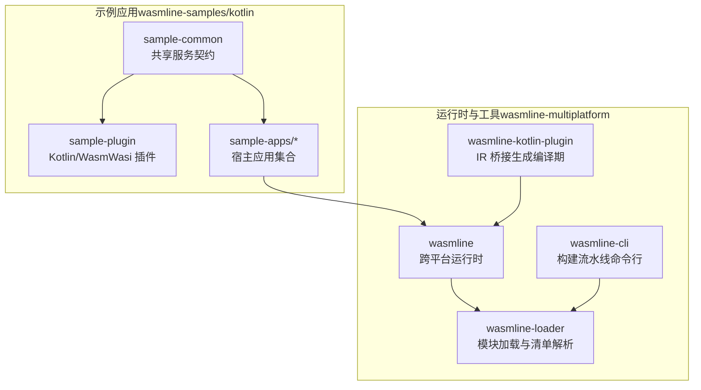
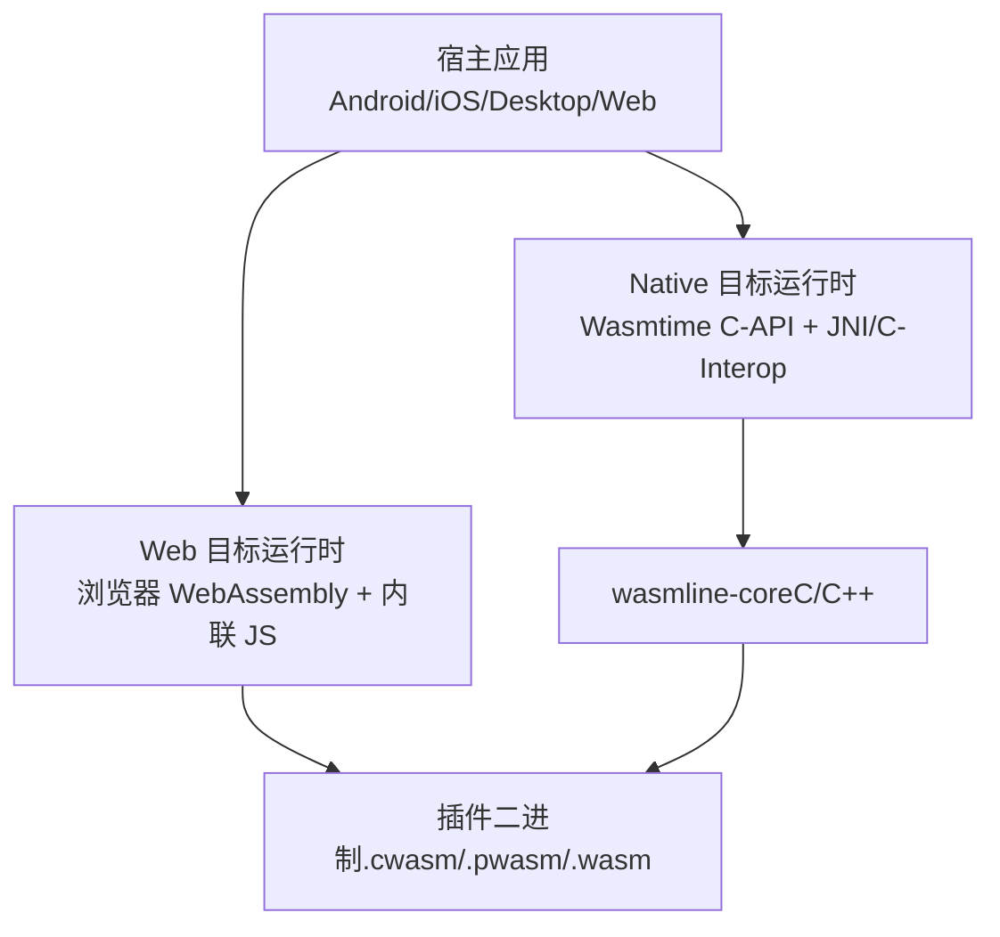
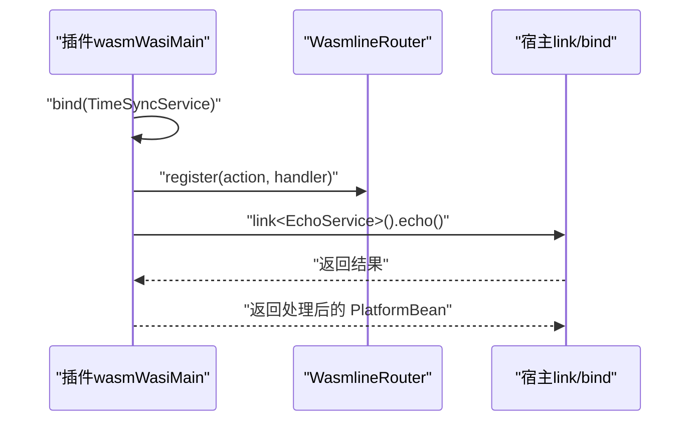
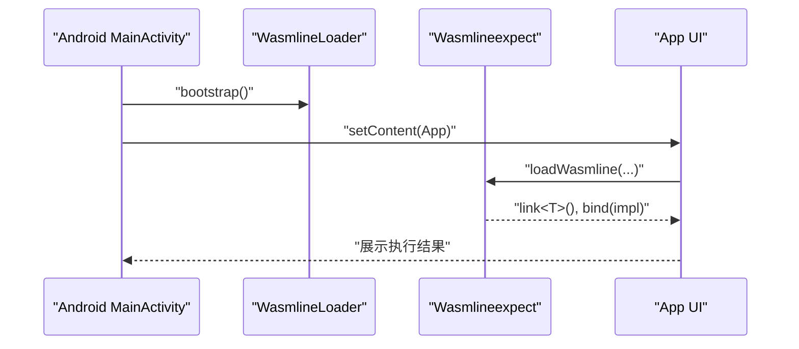
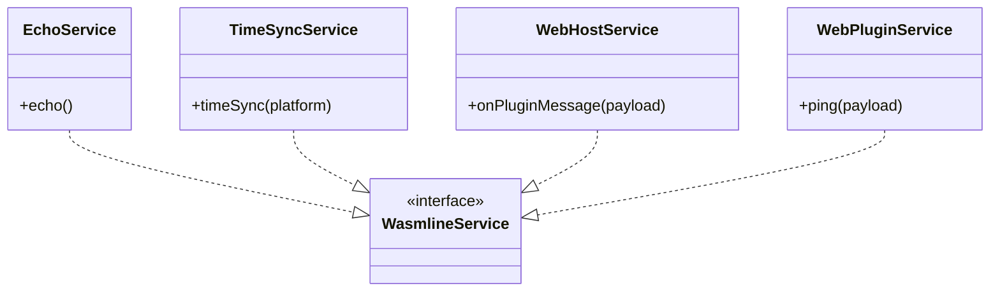
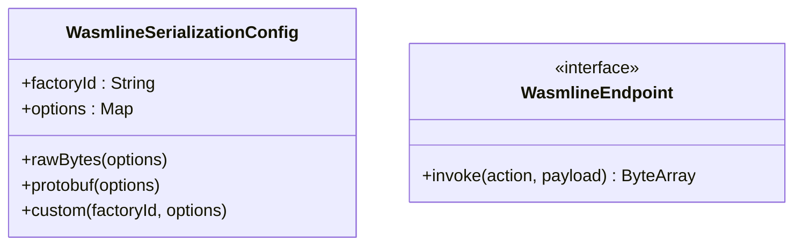
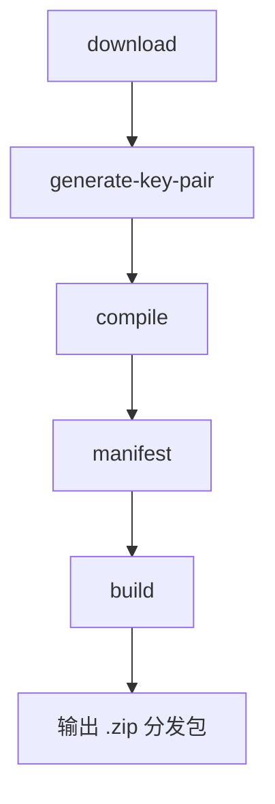
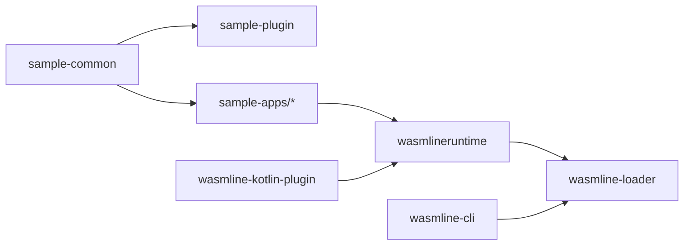

# 示例应用

<cite>
**本文引用的文件**
- [README.md](file://README.md)
- [EchoService.kt](file://wasmline-samples/kotlin/sample-common/src/commonMain/kotlin/crow/wasmline/sample/ir/EchoService.kt)
- [WebBridgeService.kt](file://wasmline-samples/kotlin/sample-common/src/commonMain/kotlin/crow/wasmline/sample/ir/WebBridgeService.kt)
- [TimeSyncService.kt](file://wasmline-samples/kotlin/sample-common/src/commonMain/kotlin/crow/wasmline/sample/ir/TimeSyncService.kt)
- [WasmlineService.kt](file://wasmline-multiplatform/wasmline/src/commonMain/kotlin/crow/wasmline/WasmlineService.kt)
- [Main.kt（插件）](file://wasmline-samples/kotlin/sample-plugin/src/wasmWasiMain/kotlin/crow/wasmline/sample/Main.kt)
- [MainActivity.kt（Android 主程序）](file://wasmline-samples/kotlin/sample-apps/android/src/androidMain/kotlin/crow/wasmline/MainActivity.kt)
- [Main.kt（桌面应用）](file://wasmline-samples/kotlin/sample-apps/application/src/main/kotlin/Main.kt)
- [App.kt（Compose 多平台共享 UI）](file://wasmline-samples/kotlin/sample-apps/multiplatform/shared/src/commonMain/kotlin/crow/wasmline/sample/App.kt)
- [Wasmline.kt（主机期望类）](file://wasmline-multiplatform/wasmline/src/hostMain/kotlin/crow/wasmline/Wasmline.kt)
- [WasmlineRouter.kt（插件路由）](file://wasmline-multiplatform/wasmline/src/wasmWasiMain/kotlin/crow/wasmline/WasmlineRouter.kt)
- [Endpoint.kt（桥接端点接口）](file://wasmline-multiplatform/wasmline/src/commonMain/kotlin/crow/wasmline/internal/bridge/Endpoint.kt)
- [WasmlineSerializationConfig.kt（序列化配置）](file://wasmline-multiplatform/wasmline/src/commonMain/kotlin/crow/wasmline/serialization/WasmlineSerializationConfig.kt)
- [Main.kt（CLI 入口）](file://wasmline-multiplatform/wasmline-cli/src/main/kotlin/crow/wasmline/cli/Main.kt)
</cite>

## 目录
1. [简介](#简介)
2. [项目结构](#项目结构)
3. [核心组件](#核心组件)
4. [架构总览](#架构总览)
5. [详细组件分析](#详细组件分析)
6. [依赖关系分析](#依赖关系分析)
7. [性能考量](#性能考量)
8. [故障排查指南](#故障排查指南)
9. [结论](#结论)
10. [附录：学习路径与扩展指南](#附录学习路径与扩展指南)

## 简介
本指南面向希望系统学习 Wasmline 示例应用的开发者，围绕“插件示例、宿主应用示例、多平台应用与 Web 应用”四类场景，逐层拆解实现思路与关键技术点，提供从简单 EchoService 到复杂多平台集成的完整学习路径，并总结最佳实践与设计模式。

## 项目结构
示例应用位于 wasmline-samples/kotlin 下，包含共享服务契约、插件实现与多套宿主应用（Android、桌面 JVM、Compose 多平台、Web）。同时，wasmline-multiplatform 提供跨平台运行时、加载器、CLI 工具链与编译期桥接生成能力。

图表来源
- [README.md:415-445](file://README.md#L415-L445)

章节来源
- [README.md:114-124](file://README.md#L114-L124)

## 核心组件
- 服务契约与编译期桥接
  - 通过 WasmlineService 标记接口，定义跨宿主/插件调用协议；编译期由 IR 插件生成桥接与调用重写，确保类型安全与零反射。
- 插件侧运行时
  - 在 wasmWasiMain 中注册服务实现并通过 link 调用宿主服务；通过 WasmlineRouter 维护动作到回调的映射。
- 宿主侧运行时
  - 通过 expect/actual 的 Wasmline 类在各平台暴露统一 API；宿主负责加载、绑定回调、发起调用。
- 序列化配置
  - 通过 WasmlineSerializationConfig 选择 Protobuf 或原生字节流等序列化工厂，影响跨边界数据编码。
- 加载器与 CLI
  - WasmlineLoader 解析 .wlm 清单、校验签名与版本；wasmline-cli 提供下载、编译、打包、签名等流水线命令。

章节来源
- [WasmlineService.kt:1-25](file://wasmline-multiplatform/wasmline/src/commonMain/kotlin/crow/wasmline/WasmlineService.kt#L1-L25)
- [WasmlineRouter.kt:1-17](file://wasmline-multiplatform/wasmline/src/wasmWasiMain/kotlin/crow/wasmline/WasmlineRouter.kt#L1-L17)
- [Wasmline.kt:1-34](file://wasmline-multiplatform/wasmline/src/hostMain/kotlin/crow/wasmline/Wasmline.kt#L1-L34)
- [WasmlineSerializationConfig.kt:1-40](file://wasmline-multiplatform/wasmline/src/commonMain/kotlin/crow/wasmline/serialization/WasmlineSerializationConfig.kt#L1-L40)
- [Endpoint.kt:1-8](file://wasmline-multiplatform/wasmline/src/commonMain/kotlin/crow/wasmline/internal/bridge/Endpoint.kt#L1-L8)

## 架构总览
Wasmline 采用“统一 API + 双栈执行”的架构：native 目标通过 Wasmtime C-API 执行，Web 目标通过浏览器 WebAssembly 与内联 JS 运行时执行。编译期 IR 插件将 link/bind 调用重写为合成桥接，降低运行时开销并保证类型安全。

图表来源
- [README.md:340-403](file://README.md#L340-L403)

章节来源
- [README.md:340-403](file://README.md#L340-L403)

## 详细组件分析

### 插件示例：Kotlin/WasmWasi
- 实现要点
  - 插件在 main 中通过 bind 注册服务实现；在实现中可 link 宿主服务进行双向调用。
  - 使用 WasmlineRouter 维护动作到回调的映射，插件侧通过注册动作完成与宿主的交互。
- 关键流程
  - 插件启动后注册实现，随后在调用链中通过 link 获取宿主代理，完成跨边界调用。
- 最佳实践
  - 将业务逻辑集中在插件实现中，避免在插件中直接依赖宿主平台细节。
  - 明确序列化工厂配置，确保与宿主一致。

图表来源
- [Main.kt（插件）:18-39](file://wasmline-samples/kotlin/sample-plugin/src/wasmWasiMain/kotlin/crow/wasmline/sample/Main.kt#L18-L39)
- [WasmlineRouter.kt:10-17](file://wasmline-multiplatform/wasmline/src/wasmWasiMain/kotlin/crow/wasmline/WasmlineRouter.kt#L10-L17)

章节来源
- [Main.kt（插件）:1-40](file://wasmline-samples/kotlin/sample-plugin/src/wasmWasiMain/kotlin/crow/wasmline/sample/Main.kt#L1-L40)
- [WasmlineRouter.kt:1-17](file://wasmline-multiplatform/wasmline/src/wasmWasiMain/kotlin/crow/wasmline/WasmlineRouter.kt#L1-L17)

### 宿主应用示例：Android
- 实现要点
  - Activity 启动时初始化 WasmlineLoader 并渲染 Compose UI。
  - 通过 App 组件封装输入、执行按钮与控制台输出。
- 关键流程
  - 初始化引擎 → 加载模块 → 绑定宿主回调 → 调用插件服务 → 展示结果。

图表来源
- [MainActivity.kt（Android 主程序）:17-31](file://wasmline-samples/kotlin/sample-apps/android/src/androidMain/kotlin/crow/wasmline/MainActivity.kt#L17-L31)
- [App.kt（Compose 多平台共享 UI）:72-151](file://wasmline-samples/kotlin/sample-apps/multiplatform/shared/src/commonMain/kotlin/crow/wasmline/sample/App.kt#L72-L151)
- [Wasmline.kt:15-34](file://wasmline-multiplatform/wasmline/src/hostMain/kotlin/crow/wasmline/Wasmline.kt#L15-L34)

章节来源
- [MainActivity.kt（Android 主程序）:1-33](file://wasmline-samples/kotlin/sample-apps/android/src/androidMain/kotlin/crow/wasmline/MainActivity.kt#L1-L33)
- [App.kt（Compose 多平台共享 UI）:1-568](file://wasmline-samples/kotlin/sample-apps/multiplatform/shared/src/commonMain/kotlin/crow/wasmline/sample/App.kt#L1-L568)
- [Wasmline.kt:1-34](file://wasmline-multiplatform/wasmline/src/hostMain/kotlin/crow/wasmline/Wasmline.kt#L1-L34)

### 宿主应用示例：桌面 JVM
- 实现要点
  - 以 headless 方式运行，入口函数负责执行示例流程。
- 关键流程
  - 初始化序列化工厂 → 加载模块 → 绑定回调 → 调用插件服务 → 输出结果。

章节来源
- [Main.kt（桌面应用）:1-17](file://wasmline-samples/kotlin/sample-apps/application/src/main/kotlin/Main.kt#L1-L17)

### 宿主应用示例：多平台（Compose）
- 实现要点
  - 通过 App 组件在 commonMain 中统一 UI 逻辑，支持 Android、iOS、桌面与 Web。
  - 支持自动执行、强制重载、指标展示与日志输出。
- 关键流程
  - 用户输入 → 触发执行 → 加载模块 → 执行插件 → 更新控制台与指标。

章节来源
- [App.kt（Compose 多平台共享 UI）:1-568](file://wasmline-samples/kotlin/sample-apps/multiplatform/shared/src/commonMain/kotlin/crow/wasmline/sample/App.kt#L1-L568)

### Web 应用（概念说明）
- 实现要点
  - Web 目标不依赖 Wasmtime，直接通过浏览器 WebAssembly 与内联 JS 运行时执行插件。
  - 通过同步 XHR 拉取 .wasm，使用 Base64 编码在 Kotlin/JS 线性内存边界间传递数据。
- 关键流程
  - 加载 .wasm → 初始化内联 JS 运行时 → 注册 WASI 预览 1 与桥接导入 → 执行插件动作。

章节来源
- [README.md:636-701](file://README.md#L636-L701)

### 共享服务契约与编译期桥接
- EchoService/TimeSyncService/WebBridgeService
  - 基于 WasmlineService 的接口定义，作为编译期桥接生成的输入。
- 编译期 IR 插件
  - 发现接口 → 校验约束 → 合成桥接类 → 重写 link/bind 调用点。
- 关键点
  - 方法可见性、参数数量与类型、是否 suspend 等约束需满足编译期校验。

图表来源
- [WasmlineService.kt:20-24](file://wasmline-multiplatform/wasmline/src/commonMain/kotlin/crow/wasmline/WasmlineService.kt#L20-L24)
- [EchoService.kt:15-21](file://wasmline-samples/kotlin/sample-common/src/commonMain/kotlin/crow/wasmline/sample/ir/EchoService.kt#L15-L21)
- [TimeSyncService.kt:6-8](file://wasmline-samples/kotlin/sample-common/src/commonMain/kotlin/crow/wasmline/sample/ir/TimeSyncService.kt#L6-L8)
- [WebBridgeService.kt:5-11](file://wasmline-samples/kotlin/sample-common/src/commonMain/kotlin/crow/wasmline/sample/ir/WebBridgeService.kt#L5-L11)

章节来源
- [EchoService.kt:1-23](file://wasmline-samples/kotlin/sample-common/src/commonMain/kotlin/crow/wasmline/sample/ir/EchoService.kt#L1-L23)
- [TimeSyncService.kt:1-10](file://wasmline-samples/kotlin/sample-common/src/commonMain/kotlin/crow/wasmline/sample/ir/TimeSyncService.kt#L1-L10)
- [WebBridgeService.kt:1-12](file://wasmline-samples/kotlin/sample-common/src/commonMain/kotlin/crow/wasmline/sample/ir/WebBridgeService.kt#L1-L12)
- [WasmlineService.kt:1-25](file://wasmline-multiplatform/wasmline/src/commonMain/kotlin/crow/wasmline/WasmlineService.kt#L1-L25)

### 序列化与桥接端点
- 序列化配置
  - 通过 WasmlineSerializationConfig 选择工厂 ID 与选项，影响请求/响应的编码方式。
- 桥接端点
  - WasmlineEndpoint 抽象了动作与载荷的传输通道，由生成的桥接代码使用。

图表来源
- [WasmlineSerializationConfig.kt:11-39](file://wasmline-multiplatform/wasmline/src/commonMain/kotlin/crow/wasmline/serialization/WasmlineSerializationConfig.kt#L11-L39)
- [Endpoint.kt:4-7](file://wasmline-multiplatform/wasmline/src/commonMain/kotlin/crow/wasmline/internal/bridge/Endpoint.kt#L4-L7)

章节来源
- [WasmlineSerializationConfig.kt:1-40](file://wasmline-multiplatform/wasmline/src/commonMain/kotlin/crow/wasmline/serialization/WasmlineSerializationConfig.kt#L1-L40)
- [Endpoint.kt:1-8](file://wasmline-multiplatform/wasmline/src/commonMain/kotlin/crow/wasmline/internal/bridge/Endpoint.kt#L1-L8)

### CLI 构建流水线
- 命令集
  - download、generate-key-pair、compile、manifest、build。
- 流水线执行
  - 下载 Wasmtime → 生成密钥对 → 编译产物 → 生成清单 → 打包分发。

图表来源
- [README.md:266-293](file://README.md#L266-L293)
- [Main.kt（CLI 入口）:10-25](file://wasmline-multiplatform/wasmline-cli/src/main/kotlin/crow/wasmline/cli/Main.kt#L10-L25)

章节来源
- [README.md:256-315](file://README.md#L256-L315)
- [Main.kt（CLI 入口）:1-25](file://wasmline-multiplatform/wasmline-cli/src/main/kotlin/crow/wasmline/cli/Main.kt#L1-L25)

## 依赖关系分析
- 示例应用依赖共享契约与运行时；插件通过编译期 IR 插件与运行时桥接生成实现跨边界调用。
- CLI 与加载器分别负责构建与加载阶段，形成“构建 → 分发 → 加载 → 执行”的闭环。

图表来源
- [README.md:404-414](file://README.md#L404-L414)

章节来源
- [README.md:404-414](file://README.md#L404-L414)

## 性能考量
- 选择合适的模块格式
  - 原始 .wasm：无版本耦合，但加载时 JIT；.cwasm：平台特定 AOT，吞吐高；.pwasm：Pulley 解释器，跨平台通用。
- 预热与缓存
  - 在已知目标上预热运行时，减少首次调用开销。
- 序列化成本
  - Protobuf 编解码有额外开销，原生字节流更轻量；根据数据规模与复杂度选择合适工厂。
- Web 目标
  - 仅支持原始 .wasm，避免 AOT 产物；注意 Base64 编解码与内存占用。

章节来源
- [README.md:658-701](file://README.md#L658-L701)

## 故障排查指南
- 编译期错误
  - 若未应用 wasmline-kotlin-plugin，link/bind 调用会在运行时报 UnsupportedOperationException；请确认 Gradle 插件已启用。
- 运行时加载失败
  - 检查 .wlm 清单签名与版本匹配；确认已下载对应平台的 Wasmtime 资源。
- Web 目标异常
  - 确认使用 .wasm 而非 .cwasm/.pwasm；检查同步 XHR 与 Base64 编解码路径。
- 平台差异
  - Android/iOS/macOS/Linux/Windows 使用 Wasmtime C-API；Web 使用浏览器原生 WebAssembly 与内联 JS 运行时。

章节来源
- [README.md:248-253](file://README.md#L248-L253)
- [README.md:636-701](file://README.md#L636-L701)

## 结论
通过本示例应用，开发者可以循序渐进地掌握 Wasmline 的核心能力：以共享契约定义服务边界、利用编译期 IR 插件生成桥接、在多平台与 Web 上统一加载与执行插件。建议先从 EchoService 开始，再逐步引入 TimeSyncService 与 Web 桥接服务，最终完成多平台集成与 CLI 构建流水线的落地。

## 附录：学习路径与扩展指南

### 学习路径
- 第一步：理解服务契约与编译期桥接
  - 阅读共享契约文件，理解 WasmlineService 约束与 IR 插件工作原理。
- 第二步：编写最小 Echo 插件
  - 基于 EchoService，在 wasmWasiMain 中实现并注册服务。
- 第三步：引入双向调用
  - 在插件中通过 link 调用宿主服务，体验跨边界通信。
- 第四步：多平台宿主集成
  - 在 Android、桌面 JVM、Compose 多平台中加载插件并执行。
- 第五步：Web 目标适配
  - 使用浏览器 WebAssembly 与内联 JS 运行时，验证跨平台一致性。
- 第六步：构建与分发
  - 使用 wasmline-cli 完整流水线，生成清单与分发包。

章节来源
- [EchoService.kt:1-23](file://wasmline-samples/kotlin/sample-common/src/commonMain/kotlin/crow/wasmline/sample/ir/EchoService.kt#L1-L23)
- [Main.kt（插件）:1-40](file://wasmline-samples/kotlin/sample-plugin/src/wasmWasiMain/kotlin/crow/wasmline/sample/Main.kt#L1-L40)
- [WasmlineService.kt:1-25](file://wasmline-multiplatform/wasmline/src/commonMain/kotlin/crow/wasmline/WasmlineService.kt#L1-L25)
- [MainActivity.kt（Android 主程序）:1-33](file://wasmline-samples/kotlin/sample-apps/android/src/androidMain/kotlin/crow/wasmline/MainActivity.kt#L1-L33)
- [App.kt（Compose 多平台共享 UI）:1-568](file://wasmline-samples/kotlin/sample-apps/multiplatform/shared/src/commonMain/kotlin/crow/wasmline/sample/App.kt#L1-L568)
- [README.md:256-315](file://README.md#L256-L315)

### 最佳实践与设计模式
- 契约优先
  - 将服务契约放在 shared/commonMain，确保跨平台一致性。
- 编译期生成
  - 依赖 IR 插件自动生成桥接，避免手写序列化与反射。
- 平台隔离
  - 宿主与插件通过动作标识与序列化协议通信，尽量减少平台特有逻辑进入插件。
- 版本与签名
  - 使用 CLI 生成密钥对与 .wlm 清单，保障分发安全与版本一致性。
- Web 适配
  - Web 目标仅接受 .wasm，避免 AOT 产物；关注内存与编解码开销。

章节来源
- [README.md:175-253](file://README.md#L175-L253)
- [README.md:256-315](file://README.md#L256-L315)
- [WasmlineSerializationConfig.kt:1-40](file://wasmline-multiplatform/wasmline/src/commonMain/kotlin/crow/wasmline/serialization/WasmlineSerializationConfig.kt#L1-L40)

### 不同平台的实现差异与适配策略
- Native 目标（Android/iOS/macOS/Linux/Windows）
  - 通过 Wasmtime C-API 执行，支持 .cwasm/.pwasm；注意平台架构与 Wasmtime 资源准备。
- Web 目标（Kotlin/JS 与 Kotlin/WasmJS）
  - 仅支持 .wasm；通过内联 JS 运行时模拟 WASI 与桥接协议；注意同步 XHR 与 Base64 编解码。
- 适配策略
  - 在宿主侧统一加载与调用 API；在插件侧保持纯 WASI 行为，避免平台特有依赖。

章节来源
- [README.md:48-73](file://README.md#L48-L73)
- [README.md:340-403](file://README.md#L340-L403)

### 扩展与定制指南
- 新增服务契约
  - 在 shared/commonMain 定义新的 WasmlineService 接口，遵循编译期约束。
- 自定义序列化
  - 通过 WasmlineSerializationConfig 选择或扩展序列化工厂，确保宿主与插件一致。
- 宿主扩展
  - 在各平台 actual 中按需注入平台特定的初始化与日志能力。
- 插件扩展
  - 在 wasmWasiMain 中注册更多服务实现，或通过 link 调用更多宿主能力。

章节来源
- [WasmlineService.kt:1-25](file://wasmline-multiplatform/wasmline/src/commonMain/kotlin/crow/wasmline/WasmlineService.kt#L1-L25)
- [WasmlineSerializationConfig.kt:1-40](file://wasmline-multiplatform/wasmline/src/commonMain/kotlin/crow/wasmline/serialization/WasmlineSerializationConfig.kt#L1-L40)
- [WasmlineRouter.kt:1-17](file://wasmline-multiplatform/wasmline/src/wasmWasiMain/kotlin/crow/wasmline/WasmlineRouter.kt#L1-L17)