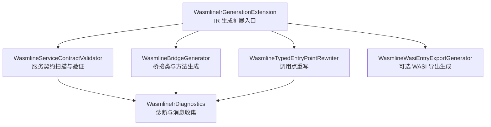
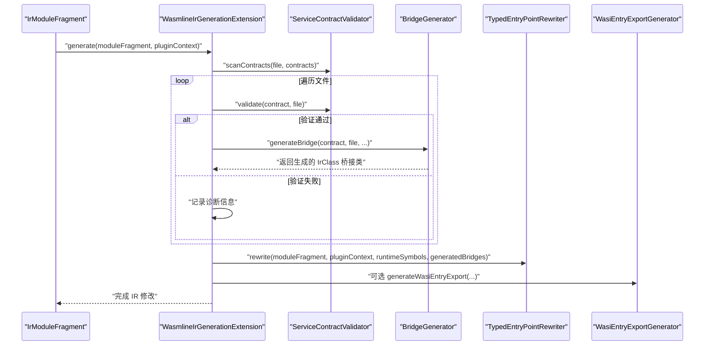
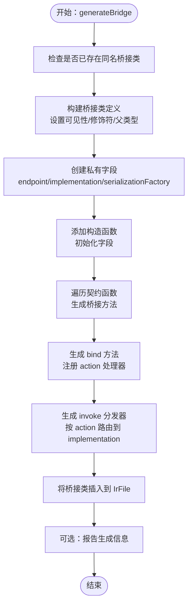
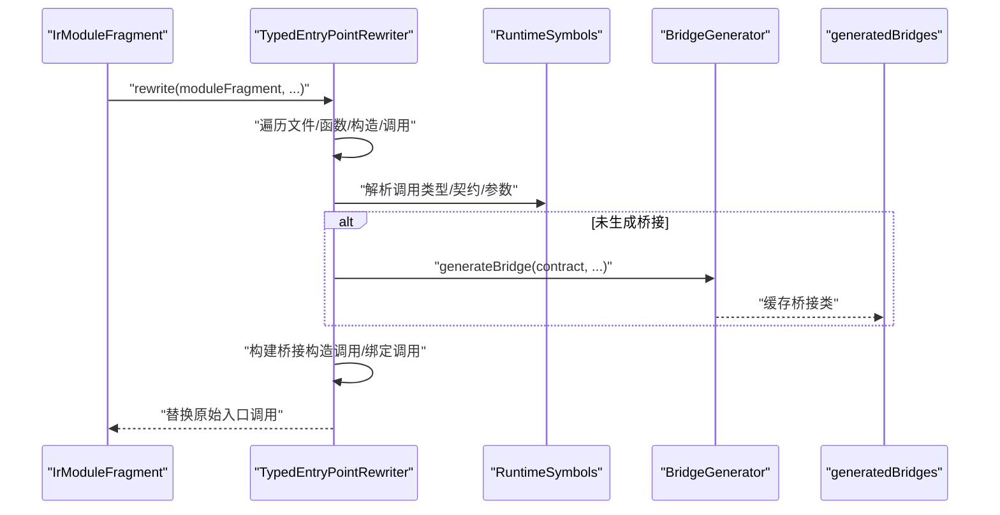
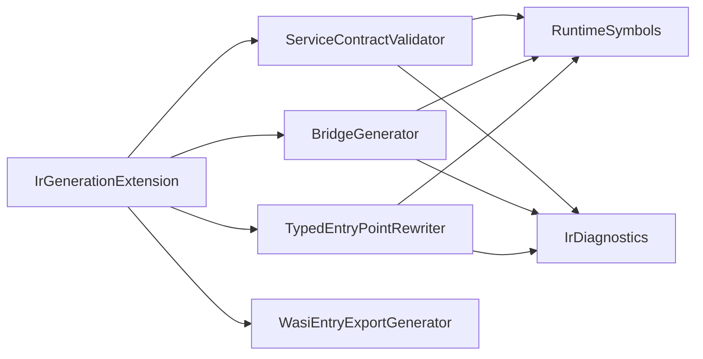

# IR 转换管道

<cite>
**本文引用的文件**
- [WasmlineIrGenerationExtension.kt](file://wasmline-multiplatform/wasmline-kotlin-plugin/src/main/kotlin/crow/wasmline/kotlin/WasmlineIrGenerationExtension.kt)
- [WasmlineIrDiagnostics.kt](file://wasmline-multiplatform/wasmline-kotlin-plugin/src/main/kotlin/crow/wasmline/kotlin/WasmlineIrDiagnostics.kt)
- [WasmlineBridgeGenerator.kt](file://wasmline-multiplatform/wasmline-kotlin-plugin/src/main/kotlin/crow/wasmline/kotlin/WasmlineBridgeGenerator.kt)
- [WasmlineServiceContractValidator.kt](file://wasmline-multiplatform/wasmline-kotlin-plugin/src/main/kotlin/crow/wasmline/kotlin/WasmlineServiceContractValidator.kt)
- [WasmlineTypedEntryPointRewriter.kt](file://wasmline-multiplatform/wasmline-kotlin-plugin/src/main/kotlin/crow/wasmline/kotlin/WasmlineTypedEntryPointRewriter.kt)
- [WasmlineRuntimeSymbols.kt](file://wasmline-multiplatform/wasmline-kotlin-plugin/src/main/kotlin/crow/wasmline/kotlin/WasmlineRuntimeSymbols.kt)
- [WasmlineWasiEntryExportGenerator.kt](file://wasmline-multiplatform/wasmline-kotlin-plugin/src/main/kotlin/crow/wasmline/kotlin/WasmlineWasiEntryExportGenerator.kt)
- [bindAsSelectsRequestedContract.fir.ir.txt](file://wasmline-multiplatform/wasmline-kotlin-plugin/testData/box/bindAsSelectsRequestedContract.fir.ir.txt)
- [linkSelectsGeneratedBridge.fir.ir.txt](file://wasmline-multiplatform/wasmline-kotlin-plugin/testData/box/linkSelectsGeneratedBridge.fir.ir.txt)
- [echoProxyRoundTrip.fir.ir.txt](file://wasmline-multiplatform/wasmline-kotlin-plugin/testData/box/echoProxyRoundTrip.fir.ir.txt)
- [zeroArgUnitBridgeRoundTrip.fir.ir.txt](file://wasmline-multiplatform/wasmline-kotlin-plugin/testData/box/zeroArgUnitBridgeRoundTrip.fir.ir.txt)
- [ambiguousBindImplementation.fir.txt](file://wasmline-multiplatform/wasmline-kotlin-plugin/testData/diagnostics/ambiguousBindImplementation.fir.txt)
</cite>

## 目录
1. [引言](#引言)
2. [项目结构](#项目结构)
3. [核心组件](#核心组件)
4. [架构总览](#架构总览)
5. [详细组件分析](#详细组件分析)
6. [依赖关系分析](#依赖关系分析)
7. [性能考量](#性能考量)
8. [故障排查指南](#故障排查指南)
9. [结论](#结论)
10. [附录](#附录)

## 引言
本文件系统性阐述 Wasmline IR 转换管道的实现与使用方法，面向编译器插件开发者与高级用户。文档聚焦于四个核心处理阶段：
- 发现阶段（Service Discovery）
- 验证阶段（Validation Phase）
- 桥接生成阶段（Bridge Generation Phase）
- 调用点重写阶段（Call Site Rewriting Phase）

我们将解释每个阶段的输入输出、处理逻辑、中间状态、IR 遍历策略、转换算法，并通过测试数据中的 IR 片段路径展示转换前后对比。同时给出错误诊断机制、调试信息收集方式、性能优化建议与内存管理注意事项。

## 项目结构
Wasmline 的 Kotlin 插件位于 wasmline-multiplatform/wasmline-kotlin-plugin 中，IR 管道由一组协作组件组成：
- 入口扩展：协调各阶段执行顺序
- 诊断工具：统一报告错误与信息
- 合同验证器：扫描并校验服务契约
- 桥接生成器：在 IR 层生成桥接类与方法
- 调用点重写器：将 link()/bind() 等入口改写为桥接调用
- 运行时符号解析：定位运行时类型与函数
- 可选导出器：为 Wasm/WASI 平台生成初始化导出

图表来源
- [WasmlineIrGenerationExtension.kt:16-58](file://wasmline-multiplatform/wasmline-kotlin-plugin/src/main/kotlin/crow/wasmline/kotlin/WasmlineIrGenerationExtension.kt#L16-L58)
- [WasmlineServiceContractValidator.kt:24-88](file://wasmline-multiplatform/wasmline-kotlin-plugin/src/main/kotlin/crow/wasmline/kotlin/WasmlineServiceContractValidator.kt#L24-L88)
- [WasmlineBridgeGenerator.kt:55-156](file://wasmline-multiplatform/wasmline-kotlin-plugin/src/main/kotlin/crow/wasmline/kotlin/WasmlineBridgeGenerator.kt#L55-L156)
- [WasmlineTypedEntryPointRewriter.kt:33-79](file://wasmline-multiplatform/wasmline-kotlin-plugin/src/main/kotlin/crow/wasmline/kotlin/WasmlineTypedEntryPointRewriter.kt#L33-L79)
- [WasmlineWasiEntryExportGenerator.kt](file://wasmline-multiplatform/wasmline-kotlin-plugin/src/main/kotlin/crow/wasmline/kotlin/WasmlineWasiEntryExportGenerator.kt)

章节来源
- [WasmlineIrGenerationExtension.kt:16-58](file://wasmline-multiplatform/wasmline-kotlin-plugin/src/main/kotlin/crow/wasmline/kotlin/WasmlineIrGenerationExtension.kt#L16-L58)

## 核心组件
- IR 生成扩展入口：负责组织整个 IR 管道，按序执行扫描、验证、桥接生成与调用点重写，并可选生成 WASI 初始化导出。
- 服务契约验证器：递归扫描 IR 文件容器，识别继承自 WasmlineService 的接口契约，执行严格的规则校验（如不支持泛型、不支持 suspend、不支持属性等）。
- 桥接生成器：为每个有效契约在 IR 层生成 concrete 桥接类，包含构造函数、代理转发方法、绑定方法与分发器方法。
- 调用点重写器：在模块范围内遍历 IR，将 link()/bind() 等入口调用替换为对生成桥接类的构造与绑定调用。
- 诊断工具：统一报告错误与信息，携带源码位置范围，便于 IDE 与构建系统集成。
- 运行时符号解析：解析桥接类名、Endpoint 类型、序列化工厂类型、运行时函数等符号，确保生成代码与运行时一致。

章节来源
- [WasmlineIrGenerationExtension.kt:21-58](file://wasmline-multiplatform/wasmline-kotlin-plugin/src/main/kotlin/crow/wasmline/kotlin/WasmlineIrGenerationExtension.kt#L21-L58)
- [WasmlineServiceContractValidator.kt:24-136](file://wasmline-multiplatform/wasmline-kotlin-plugin/src/main/kotlin/crow/wasmline/kotlin/WasmlineServiceContractValidator.kt#L24-L136)
- [WasmlineBridgeGenerator.kt:55-156](file://wasmline-multiplatform/wasmline-kotlin-plugin/src/main/kotlin/crow/wasmline/kotlin/WasmlineBridgeGenerator.kt#L55-L156)
- [WasmlineTypedEntryPointRewriter.kt:33-198](file://wasmline-multiplatform/wasmline-kotlin-plugin/src/main/kotlin/crow/wasmline/kotlin/WasmlineTypedEntryPointRewriter.kt#L33-L198)
- [WasmlineIrDiagnostics.kt:16-62](file://wasmline-multiplatform/wasmline-kotlin-plugin/src/main/kotlin/crow/wasmline/kotlin/WasmlineIrDiagnostics.kt#L16-L62)

## 架构总览
下图展示了 IR 管道的端到端流程：从模块级遍历开始，经过契约发现与验证，生成桥接类，再重写调用点，最终可选地生成 WASI 导出。

图表来源
- [WasmlineIrGenerationExtension.kt:21-58](file://wasmline-multiplatform/wasmline-kotlin-plugin/src/main/kotlin/crow/wasmline/kotlin/WasmlineIrGenerationExtension.kt#L21-L58)
- [WasmlineServiceContractValidator.kt:28-88](file://wasmline-multiplatform/wasmline-kotlin-plugin/src/main/kotlin/crow/wasmline/kotlin/WasmlineServiceContractValidator.kt#L28-L88)
- [WasmlineBridgeGenerator.kt:55-156](file://wasmline-multiplatform/wasmline-kotlin-plugin/src/main/kotlin/crow/wasmline/kotlin/WasmlineBridgeGenerator.kt#L55-L156)
- [WasmlineTypedEntryPointRewriter.kt:37-79](file://wasmline-multiplatform/wasmline-kotlin-plugin/src/main/kotlin/crow/wasmline/kotlin/WasmlineTypedEntryPointRewriter.kt#L37-L79)

## 详细组件分析

### 发现阶段（Service Discovery）
- 输入：IrModuleFragment 下的所有 IrFile 与声明容器
- 处理逻辑：
  - 递归扫描所有声明容器，识别标记为接口且继承自 WasmlineService 的 IrClass
  - 收集所有匹配的契约接口，供后续验证与桥接生成使用
- 输出：契约列表（IrClass 列表），用于验证与桥接生成
- 关键实现参考：
  - 扫描递归与接口判定逻辑
  - 契约类型判定工具函数

章节来源
- [WasmlineServiceContractValidator.kt:28-39](file://wasmline-multiplatform/wasmline-kotlin-plugin/src/main/kotlin/crow/wasmline/kotlin/WasmlineServiceContractValidator.kt#L28-L39)
- [WasmlineServiceContractValidator.kt:138-157](file://wasmline-multiplatform/wasmline-kotlin-plugin/src/main/kotlin/crow/wasmline/kotlin/WasmlineServiceContractValidator.kt#L138-L157)
- [WasmlineServiceContractValidator.kt:161-174](file://wasmline-multiplatform/wasmline-kotlin-plugin/src/main/kotlin/crow/wasmline/kotlin/WasmlineServiceContractValidator.kt#L161-L174)

### 验证阶段（Validation Phase）
- 输入：单个 IrClass 契约与其所在 IrFile
- 处理逻辑：
  - 报告“发现”信息
  - 拒绝泛型契约与方法
  - 拒绝属性（仅允许函数）
  - 拒绝重载函数（同名不同参）
  - 拒绝 suspend 函数
  - 拒绝扩展接收者参数
  - 拒绝默认参数与变长参数
  - 拒绝将服务契约作为参数或返回值
  - 限制最多一个常规参数
  - 仅允许 public 可见性
- 输出：布尔值表示是否通过验证；同时向 MessageCollector 报告错误与信息
- 关键实现参考：
  - 契约扫描与验证主流程
  - 方法级规则检查
  - 类型与可见性判断

章节来源
- [WasmlineServiceContractValidator.kt:42-88](file://wasmline-multiplatform/wasmline-kotlin-plugin/src/main/kotlin/crow/wasmline/kotlin/WasmlineServiceContractValidator.kt#L42-L88)
- [WasmlineServiceContractValidator.kt:90-136](file://wasmline-multiplatform/wasmline-kotlin-plugin/src/main/kotlin/crow/wasmline/kotlin/WasmlineServiceContractValidator.kt#L90-L136)

### 桥接生成阶段（Bridge Generation Phase）
- 输入：已验证的 IrClass 契约、IrFile、插件上下文、运行时符号、可选 MessageCollector
- 处理逻辑：
  - 生成桥接类名与 IR 类定义，设置可见性、修饰符与父类型（契约类型与 GeneratedBridge）
  - 创建私有字段：Endpoint、implementation、serializationFactory
  - 添加构造函数，委托初始化字段
  - 为契约中每个函数生成桥接方法：转发调用 Endpoint.invoke(action, payload)，必要时进行编码/解码
  - 生成 bind 方法：注册每个 action 对应的处理器
  - 生成 invoke 分发器：根据 action 名路由到 implementation 上的具体函数，进行解码/编码
- 输出：生成的 IrClass 桥接类被插入到原文件中
- 关键实现参考：
  - 生成桥接类与字段
  - 生成构造函数与初始化
  - 生成桥接方法与分发器
  - 生成绑定方法与处理器

图表来源
- [WasmlineBridgeGenerator.kt:55-156](file://wasmline-multiplatform/wasmline-kotlin-plugin/src/main/kotlin/crow/wasmline/kotlin/WasmlineBridgeGenerator.kt#L55-L156)
- [WasmlineBridgeGenerator.kt:159-189](file://wasmline-multiplatform/wasmline-kotlin-plugin/src/main/kotlin/crow/wasmline/kotlin/WasmlineBridgeGenerator.kt#L159-L189)
- [WasmlineBridgeGenerator.kt:192-268](file://wasmline-multiplatform/wasmline-kotlin-plugin/src/main/kotlin/crow/wasmline/kotlin/WasmlineBridgeGenerator.kt#L192-L268)
- [WasmlineBridgeGenerator.kt:271-311](file://wasmline-multiplatform/wasmline-kotlin-plugin/src/main/kotlin/crow/wasmline/kotlin/WasmlineBridgeGenerator.kt#L271-L311)
- [WasmlineBridgeGenerator.kt:366-426](file://wasmline-multiplatform/wasmline-kotlin-plugin/src/main/kotlin/crow/wasmline/kotlin/WasmlineBridgeGenerator.kt#L366-L426)

章节来源
- [WasmlineBridgeGenerator.kt:55-156](file://wasmline-multiplatform/wasmline-kotlin-plugin/src/main/kotlin/crow/wasmline/kotlin/WasmlineBridgeGenerator.kt#L55-L156)
- [WasmlineBridgeGenerator.kt:159-488](file://wasmline-multiplatform/wasmline-kotlin-plugin/src/main/kotlin/crow/wasmline/kotlin/WasmlineBridgeGenerator.kt#L159-L488)

### 调用点重写阶段（Call Site Rewriting Phase）
- 输入：IrModuleFragment、插件上下文、运行时符号、已生成的桥接映射
- 处理逻辑：
  - 在模块内遍历 IR，维护当前拥有者声明栈
  - 匹配 link()/bind() 等入口调用，解析其契约类型
  - 为未生成的契约生成桥接类并缓存
  - 将调用替换为对桥接类构造函数与绑定函数的调用
  - 解析序列化工厂表达式，注入到桥接构造参数
- 输出：模块 IR 中的入口调用被重写为桥接调用
- 关键实现参考：
  - 模块遍历与调用点匹配
  - 契约解析与桥接生成
  - 重写逻辑与参数装配

图表来源
- [WasmlineTypedEntryPointRewriter.kt:37-79](file://wasmline-multiplatform/wasmline-kotlin-plugin/src/main/kotlin/crow/wasmline/kotlin/WasmlineTypedEntryPointRewriter.kt#L37-L79)
- [WasmlineTypedEntryPointRewriter.kt:81-140](file://wasmline-multiplatform/wasmline-kotlin-plugin/src/main/kotlin/crow/wasmline/kotlin/WasmlineTypedEntryPointRewriter.kt#L81-L140)
- [WasmlineTypedEntryPointRewriter.kt:142-198](file://wasmline-multiplatform/wasmline-kotlin-plugin/src/main/kotlin/crow/wasmline/kotlin/WasmlineTypedEntryPointRewriter.kt#L142-L198)

章节来源
- [WasmlineTypedEntryPointRewriter.kt:37-198](file://wasmline-multiplatform/wasmline-kotlin-plugin/src/main/kotlin/crow/wasmline/kotlin/WasmlineTypedEntryPointRewriter.kt#L37-L198)

### IR 遍历策略与转换算法
- 遍历策略：
  - 使用 IrElementTransformerVoid 深度优先遍历模块文件树
  - 维护拥有者声明栈，确保在访问调用表达式时能获取到其所属函数/构造
- 转换算法：
  - 发现阶段：递归扫描容器，收集契约
  - 验证阶段：逐条规则检查，错误即刻报告
  - 桥接生成阶段：按契约函数逐一生成桥接方法与分发器分支
  - 调用点重写阶段：解析调用签名，生成桥接构造与绑定调用

章节来源
- [WasmlineTypedEntryPointRewriter.kt:44-78](file://wasmline-multiplatform/wasmline-kotlin-plugin/src/main/kotlin/crow/wasmline/kotlin/WasmlineTypedEntryPointRewriter.kt#L44-L78)
- [WasmlineServiceContractValidator.kt:28-39](file://wasmline-multiplatform/wasmline-kotlin-plugin/src/main/kotlin/crow/wasmline/kotlin/WasmlineServiceContractValidator.kt#L28-L39)

### IR 转换前后示例（基于测试数据）
以下示例展示典型 IR 转换前后的对比片段路径，帮助理解桥接生成与调用点重写的实际效果：

- 绑定指定契约的 link 示例
  - 转换前 IR 片段路径：[linkSelectsGeneratedBridge.fir.txt](file://wasmline-multiplatform/wasmline-kotlin-plugin/testData/box/linkSelectsGeneratedBridge.fir.txt)
  - 转换后 IR 片段路径：[linkSelectsGeneratedBridge.fir.ir.txt](file://wasmline-multiplatform/wasmline-kotlin-plugin/testData/box/linkSelectsGeneratedBridge.fir.ir.txt)

- 绑定请求指定契约的 bind 示例
  - 转换前 IR 片段路径：[bindAsSelectsRequestedContract.fir.txt](file://wasmline-multiplatform/wasmline-kotlin-plugin/testData/box/bindAsSelectsRequestedContract.fir.txt)
  - 转换后 IR 片段路径：[bindAsSelectsRequestedContract.fir.ir.txt](file://wasmline-multiplatform/wasmline-kotlin-plugin/testData/box/bindAsSelectsRequestedContract.fir.ir.txt)

- 回声代理往返示例（零参 Unit）
  - 转换前 IR 片段路径：[echoProxyRoundTrip.fir.txt](file://wasmline-multiplatform/wasmline-kotlin-plugin/testData/box/echoProxyRoundTrip.fir.txt)
  - 转换后 IR 片段路径：[echoProxyRoundTrip.fir.ir.txt](file://wasmline-multiplatform/wasmline-kotlin-plugin/testData/box/echoProxyRoundTrip.fir.ir.txt)

- 零参 Unit 桥接往返示例
  - 转换前 IR 片段路径：[zeroArgUnitBridgeRoundTrip.fir.txt](file://wasmline-multiplatform/wasmline-kotlin-plugin/testData/box/zeroArgUnitBridgeRoundTrip.fir.txt)
  - 转换后 IR 片段路径：[zeroArgUnitBridgeRoundTrip.fir.ir.txt](file://wasmline-multiplatform/wasmline-kotlin-plugin/testData/box/zeroArgUnitBridgeRoundTrip.fir.ir.txt)

章节来源
- [linkSelectsGeneratedBridge.fir.ir.txt](file://wasmline-multiplatform/wasmline-kotlin-plugin/testData/box/linkSelectsGeneratedBridge.fir.ir.txt)
- [bindAsSelectsRequestedContract.fir.ir.txt](file://wasmline-multiplatform/wasmline-kotlin-plugin/testData/box/bindAsSelectsRequestedContract.fir.ir.txt)
- [echoProxyRoundTrip.fir.ir.txt](file://wasmline-multiplatform/wasmline-kotlin-plugin/testData/box/echoProxyRoundTrip.fir.ir.txt)
- [zeroArgUnitBridgeRoundTrip.fir.ir.txt](file://wasmline-multiplatform/wasmline-kotlin-plugin/testData/box/zeroArgUnitBridgeRoundTrip.fir.ir.txt)

## 依赖关系分析
- 组件耦合：
  - IR 生成扩展是中枢，依赖验证器、桥接生成器、重写器与可选导出器
  - 验证器与桥接生成器共享运行时符号解析能力
  - 重写器依赖桥接生成结果与运行时符号
- 外部依赖：
  - Kotlin IR API（IrModuleFragment、IrClass、IrSimpleFunction 等）
  - 编译器消息收集器（MessageCollector）用于诊断
- 循环依赖：
  - 无直接循环；扩展通过回调与缓存避免循环生成

图表来源
- [WasmlineIrGenerationExtension.kt:21-58](file://wasmline-multiplatform/wasmline-kotlin-plugin/src/main/kotlin/crow/wasmline/kotlin/WasmlineIrGenerationExtension.kt#L21-L58)
- [WasmlineServiceContractValidator.kt:24-88](file://wasmline-multiplatform/wasmline-kotlin-plugin/src/main/kotlin/crow/wasmline/kotlin/WasmlineServiceContractValidator.kt#L24-L88)
- [WasmlineBridgeGenerator.kt:55-156](file://wasmline-multiplatform/wasmline-kotlin-plugin/src/main/kotlin/crow/wasmline/kotlin/WasmlineBridgeGenerator.kt#L55-L156)
- [WasmlineTypedEntryPointRewriter.kt:33-79](file://wasmline-multiplatform/wasmline-kotlin-plugin/src/main/kotlin/crow/wasmline/kotlin/WasmlineTypedEntryPointRewriter.kt#L33-L79)
- [WasmlineIrDiagnostics.kt:16-62](file://wasmline-multiplatform/wasmline-kotlin-plugin/src/main/kotlin/crow/wasmline/kotlin/WasmlineIrDiagnostics.kt#L16-L62)

章节来源
- [WasmlineIrGenerationExtension.kt:21-58](file://wasmline-multiplatform/wasmline-kotlin-plugin/src/main/kotlin/crow/wasmline/kotlin/WasmlineIrGenerationExtension.kt#L21-L58)

## 性能考量
- 遍历效率：
  - 使用深度优先遍历，保持常数级额外栈空间
  - 通过拥有者声明栈避免重复计算
- 生成成本：
  - 桥接类按需生成并缓存，避免重复 IR 构造
  - 字段与方法生成采用批量构建，减少中间对象
- 序列化：
  - 仅在必要时进行编码/解码（Unit 返回类型跳过编码）
- 内存管理：
  - IR 表达式与声明在构建后直接插入目标文件，避免多余拷贝
  - 使用不可变名称与类型查询，降低字符串与符号查找开销
- I/O 与诊断：
  - 诊断信息仅在验证失败或生成成功时输出，减少日志噪声

[本节为通用性能建议，无需特定文件引用]

## 故障排查指南
- 错误诊断机制：
  - 统一通过 reportError 与 report 输出，携带源码文件路径与行列号
  - 类型渲染与稳定名称用于诊断信息可读性
- 常见问题与提示：
  - 泛型契约/方法：不支持
  - suspend 方法：不支持
  - 属性：仅支持函数
  - 重载方法：不支持
  - 默认参数/变长参数：不支持
  - 传入/返回服务契约：不支持
  - bind(implementation) 不明确：提示使用 bind(Contract::class, implementation) 明确契约
- 调试信息收集：
  - 生成阶段会输出 INFO 级别的生成信息
  - 通过 MessageCollector 与源码范围定位问题位置
- 相关实现参考：
  - 诊断工具与类型渲染
  - 重写器中的绑定实现解析与错误报告

章节来源
- [WasmlineIrDiagnostics.kt:16-62](file://wasmline-multiplatform/wasmline-kotlin-plugin/src/main/kotlin/crow/wasmline/kotlin/WasmlineIrDiagnostics.kt#L16-L62)
- [WasmlineServiceContractValidator.kt:53-136](file://wasmline-multiplatform/wasmline-kotlin-plugin/src/main/kotlin/crow/wasmline/kotlin/WasmlineServiceContractValidator.kt#L53-L136)
- [WasmlineTypedEntryPointRewriter.kt:165-193](file://wasmline-multiplatform/wasmline-kotlin-plugin/src/main/kotlin/crow/wasmline/kotlin/WasmlineTypedEntryPointRewriter.kt#L165-L193)

## 结论
Wasmline IR 转换管道通过清晰的职责分离与严格的契约规则，实现了从服务契约到桥接类与调用点重写的完整链路。验证器确保契约符合当前约束，桥接生成器在 IR 层精确生成桥接代码，重写器将高层入口调用安全地替换为桥接调用。配合统一的诊断与消息收集机制，开发者可以高效定位问题并持续优化性能。

[本节为总结性内容，无需特定文件引用]

## 附录
- 运行时符号解析：
  - 提供桥接类名、Endpoint 类型、序列化工厂类型、运行时函数等符号解析
- WASI 导出生成：
  - 可选启用，为 Wasm/WASI 平台生成初始化导出

章节来源
- [WasmlineRuntimeSymbols.kt](file://wasmline-multiplatform/wasmline-kotlin-plugin/src/main/kotlin/crow/wasmline/kotlin/WasmlineRuntimeSymbols.kt)
- [WasmlineWasiEntryExportGenerator.kt](file://wasmline-multiplatform/wasmline-kotlin-plugin/src/main/kotlin/crow/wasmline/kotlin/WasmlineWasiEntryExportGenerator.kt)