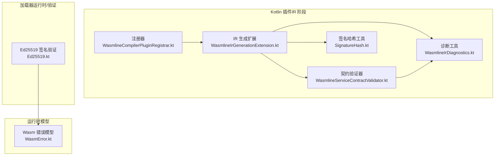
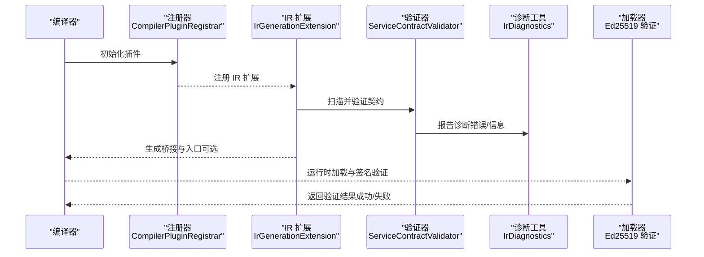
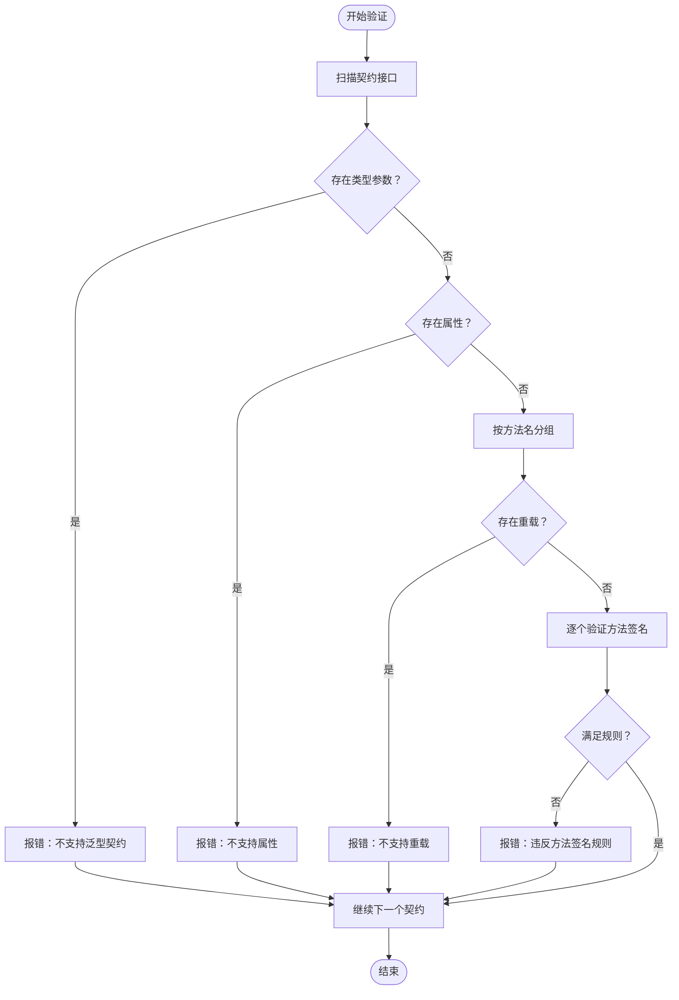
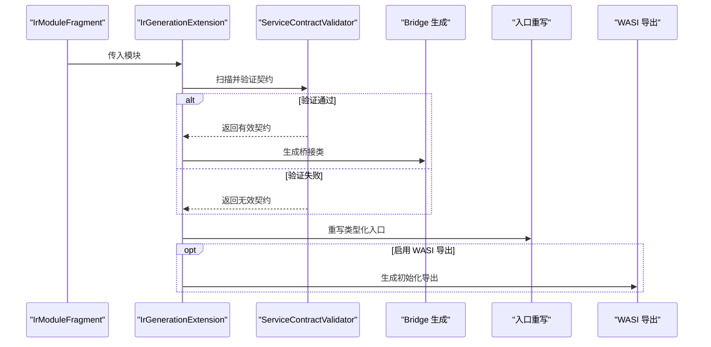
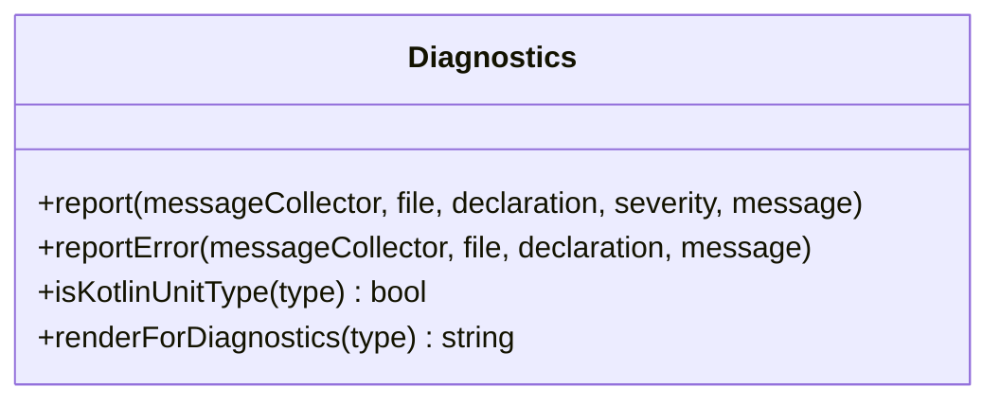
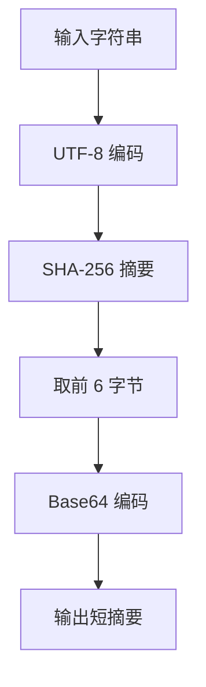
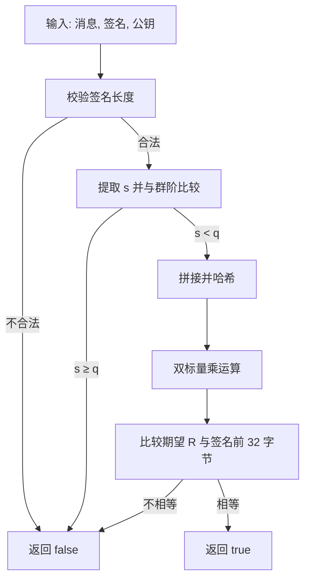
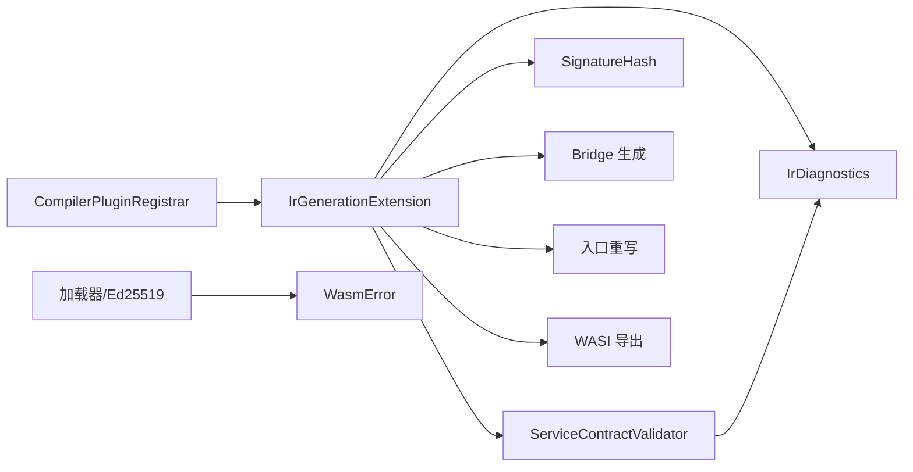

# 服务契约验证

<cite>
**本文引用的文件**
- [wasmline-multiplatform/wasmline-kotlin-plugin/src/main/kotlin/crow/wasmline/kotlin/WasmlineServiceContractValidator.kt](file://wasmline-multiplatform/wasmline-kotlin-plugin/src/main/kotlin/crow/wasmline/kotlin/WasmlineServiceContractValidator.kt)
- [wasmline-multiplatform/wasmline-kotlin-plugin/src/main/kotlin/crow/wasmline/kotlin/WasmlineIrGenerationExtension.kt](file://wasmline-multiplatform/wasmline-kotlin-plugin/src/main/kotlin/crow/wasmline/kotlin/WasmlineIrGenerationExtension.kt)
- [wasmline-multiplatform/wasmline-kotlin-plugin/src/main/kotlin/crow/wasmline/kotlin/WasmlineIrDiagnostics.kt](file://wasmline-multiplatform/wasmline-kotlin-plugin/src/main/kotlin/crow/wasmline/kotlin/WasmlineIrDiagnostics.kt)
- [wasmline-multiplatform/wasmline-kotlin-plugin/src/main/kotlin/crow/wasmline/kotlin/SignatureHash.kt](file://wasmline-multiplatform/wasmline-kotlin-plugin/src/main/kotlin/crow/wasmline/kotlin/SignatureHash.kt)
- [wasmline-multiplatform/wasmline-kotlin-plugin/src/main/kotlin/crow/wasmline/kotlin/WasmlineCompilerPluginRegistrar.kt](file://wasmline-multiplatform/wasmline-kotlin-plugin/src/main/kotlin/crow/wasmline/kotlin/WasmlineCompilerPluginRegistrar.kt)
- [wasmline-multiplatform/wasmline-loader/src/commonMain/kotlin/crow/wasmline/loader/internal/crypto/Ed25519.kt](file://wasmline-multiplatform/wasmline-loader/src/commonMain/kotlin/crow/wasmline/loader/internal/crypto/Ed25519.kt)
- [wasmline-multiplatform/wasmline/src/wasmWasiMain/kotlin/crow/wasmline/model/WasmError.kt](file://wasmline-multiplatform/wasmline/src/wasmWasiMain/kotlin/crow/wasmline/model/WasmError.kt)
- [wasmline-multiplatform/wasmline-kotlin-plugin/testData/diagnostics/ambiguousBindImplementation.kt](file://wasmline-multiplatform/wasmline-kotlin-plugin/testData/diagnostics/ambiguousBindImplementation.kt)
</cite>

## 目录
1. [引言](#引言)
2. [项目结构](#项目结构)
3. [核心组件](#核心组件)
4. [架构总览](#架构总览)
5. [详细组件分析](#详细组件分析)
6. [依赖关系分析](#依赖关系分析)
7. [性能考虑](#性能考虑)
8. [故障排查指南](#故障排查指南)
9. [结论](#结论)
10. [附录](#附录)

## 引言
本文件面向 Wasmline 服务契约验证系统，聚焦于“静态契约约束”的验证规则与算法实现，覆盖服务契约的语义检查、类型一致性验证、方法签名匹配、签名哈希计算与验证、错误示例与消息解释、失败处理与恢复策略、性能优化与缓存策略，以及与编译器诊断系统的集成方式，并为插件开发者提供扩展自定义验证规则的指导。

## 项目结构
Wasmline 的验证逻辑主要位于 Kotlin 编译器插件模块中，通过 IR 阶段扫描、校验、生成桥接代码；签名与验证在加载器侧采用 Ed25519 算法；运行时模型用于统一错误表达。

**图表来源**
- [wasmline-multiplatform/wasmline-kotlin-plugin/src/main/kotlin/crow/wasmline/kotlin/WasmlineCompilerPluginRegistrar.kt:26-44](file://wasmline-multiplatform/wasmline-kotlin-plugin/src/main/kotlin/crow/wasmline/kotlin/WasmlineCompilerPluginRegistrar.kt#L26-L44)
- [wasmline-multiplatform/wasmline-kotlin-plugin/src/main/kotlin/crow/wasmline/kotlin/WasmlineIrGenerationExtension.kt:16-58](file://wasmline-multiplatform/wasmline-kotlin-plugin/src/main/kotlin/crow/wasmline/kotlin/WasmlineIrGenerationExtension.kt#L16-L58)
- [wasmline-multiplatform/wasmline-kotlin-plugin/src/main/kotlin/crow/wasmline/kotlin/WasmlineServiceContractValidator.kt:24-88](file://wasmline-multiplatform/wasmline-kotlin-plugin/src/main/kotlin/crow/wasmline/kotlin/WasmlineServiceContractValidator.kt#L24-L88)
- [wasmline-multiplatform/wasmline-kotlin-plugin/src/main/kotlin/crow/wasmline/kotlin/WasmlineIrDiagnostics.kt:16-62](file://wasmline-multiplatform/wasmline-kotlin-plugin/src/main/kotlin/crow/wasmline/kotlin/WasmlineIrDiagnostics.kt#L16-L62)
- [wasmline-multiplatform/wasmline-kotlin-plugin/src/main/kotlin/crow/wasmline/kotlin/SignatureHash.kt:22-27](file://wasmline-multiplatform/wasmline-kotlin-plugin/src/main/kotlin/crow/wasmline/kotlin/SignatureHash.kt#L22-L27)
- [wasmline-multiplatform/wasmline-loader/src/commonMain/kotlin/crow/wasmline/loader/internal/crypto/Ed25519.kt:1755-1786](file://wasmline-multiplatform/wasmline-loader/src/commonMain/kotlin/crow/wasmline/loader/internal/crypto/Ed25519.kt#L1755-L1786)
- [wasmline-multiplatform/wasmline/src/wasmWasiMain/kotlin/crow/wasmline/model/WasmError.kt:1-6](file://wasmline-multiplatform/wasmline/src/wasmWasiMain/kotlin/crow/wasmline/model/WasmError.kt#L1-L6)

**章节来源**
- [wasmline-multiplatform/wasmline-kotlin-plugin/src/main/kotlin/crow/wasmline/kotlin/WasmlineCompilerPluginRegistrar.kt:26-44](file://wasmline-multiplatform/wasmline-kotlin-plugin/src/main/kotlin/crow/wasmline/kotlin/WasmlineCompilerPluginRegistrar.kt#L26-L44)
- [wasmline-multiplatform/wasmline-kotlin-plugin/src/main/kotlin/crow/wasmline/kotlin/WasmlineIrGenerationExtension.kt:16-58](file://wasmline-multiplatform/wasmline-kotlin-plugin/src/main/kotlin/crow/wasmline/kotlin/WasmlineIrGenerationExtension.kt#L16-L58)

## 核心组件
- 契约验证器：扫描并验证服务契约接口，确保符合静态约束（无泛型、无属性、无重载、参数限制等），并向编译器报告诊断信息。
- IR 生成扩展：协调扫描、验证、桥接生成与入口重写，按需生成 WASI 入口导出。
- 诊断工具：将诊断信息映射到源码位置，便于定位问题。
- 签名哈希工具：基于 SHA-256 计算短前缀 Base64 编码的签名摘要，用于契约标识与快速比对。
- 加载器签名验证：Ed25519 实现，用于运行时验证签名的有效性。
- 运行时错误模型：统一的错误承载结构，便于跨平台传递。

**章节来源**
- [wasmline-multiplatform/wasmline-kotlin-plugin/src/main/kotlin/crow/wasmline/kotlin/WasmlineServiceContractValidator.kt:24-136](file://wasmline-multiplatform/wasmline-kotlin-plugin/src/main/kotlin/crow/wasmline/kotlin/WasmlineServiceContractValidator.kt#L24-L136)
- [wasmline-multiplatform/wasmline-kotlin-plugin/src/main/kotlin/crow/wasmline/kotlin/WasmlineIrGenerationExtension.kt:21-58](file://wasmline-multiplatform/wasmline-kotlin-plugin/src/main/kotlin/crow/wasmline/kotlin/WasmlineIrGenerationExtension.kt#L21-L58)
- [wasmline-multiplatform/wasmline-kotlin-plugin/src/main/kotlin/crow/wasmline/kotlin/WasmlineIrDiagnostics.kt:16-62](file://wasmline-multiplatform/wasmline-kotlin-plugin/src/main/kotlin/crow/wasmline/kotlin/WasmlineIrDiagnostics.kt#L16-L62)
- [wasmline-multiplatform/wasmline-kotlin-plugin/src/main/kotlin/crow/wasmline/kotlin/SignatureHash.kt:22-27](file://wasmline-multiplatform/wasmline-kotlin-plugin/src/main/kotlin/crow/wasmline/kotlin/SignatureHash.kt#L22-L27)
- [wasmline-multiplatform/wasmline-loader/src/commonMain/kotlin/crow/wasmline/loader/internal/crypto/Ed25519.kt:1755-1786](file://wasmline-multiplatform/wasmline-loader/src/commonMain/kotlin/crow/wasmline/loader/internal/crypto/Ed25519.kt#L1755-L1786)
- [wasmline-multiplatform/wasmline/src/wasmWasiMain/kotlin/crow/wasmline/model/WasmError.kt:1-6](file://wasmline-multiplatform/wasmline/src/wasmWasiMain/kotlin/crow/wasmline/model/WasmError.kt#L1-L6)

## 架构总览
下图展示从编译期到运行时的关键交互：插件注册后在 IR 阶段执行扫描与验证，通过诊断系统输出错误；同时生成桥接与入口；运行时加载器使用 Ed25519 验证签名，错误以统一模型返回。

**图表来源**
- [wasmline-multiplatform/wasmline-kotlin-plugin/src/main/kotlin/crow/wasmline/kotlin/WasmlineCompilerPluginRegistrar.kt:26-44](file://wasmline-multiplatform/wasmline-kotlin-plugin/src/main/kotlin/crow/wasmline/kotlin/WasmlineCompilerPluginRegistrar.kt#L26-L44)
- [wasmline-multiplatform/wasmline-kotlin-plugin/src/main/kotlin/crow/wasmline/kotlin/WasmlineIrGenerationExtension.kt:21-58](file://wasmline-multiplatform/wasmline-kotlin-plugin/src/main/kotlin/crow/wasmline/kotlin/WasmlineIrGenerationExtension.kt#L21-L58)
- [wasmline-multiplatform/wasmline-kotlin-plugin/src/main/kotlin/crow/wasmline/kotlin/WasmlineServiceContractValidator.kt:42-88](file://wasmline-multiplatform/wasmline-kotlin-plugin/src/main/kotlin/crow/wasmline/kotlin/WasmlineServiceContractValidator.kt#L42-L88)
- [wasmline-multiplatform/wasmline-loader/src/commonMain/kotlin/crow/wasmline/loader/internal/crypto/Ed25519.kt:1755-1786](file://wasmline-multiplatform/wasmline-loader/src/commonMain/kotlin/crow/wasmline/loader/internal/crypto/Ed25519.kt#L1755-L1786)

## 详细组件分析

### 契约验证器（静态约束与签名匹配）
- 扫描与收集：递归遍历 IR 容器，收集所有继承自 WasmlineService 的接口声明。
- 语义检查：
  - 不支持泛型契约与方法。
  - 不支持属性，仅允许函数。
  - 不支持方法重载（同名多实现）。
  - 方法必须为公开可见。
  - 不支持挂起函数、扩展接收者、默认参数、变长参数。
  - 参数与返回值不得为服务契约类型（防止递归契约）。
  - 当前版本仅允许最多一个常规参数。
- 类型一致性与签名匹配：通过 IR 类型系统判断是否为 WasmlineService 类型，确保契约层级正确。
- 诊断输出：使用诊断工具将错误映射到源码范围，便于 IDE 与构建工具定位。

**图表来源**
- [wasmline-multiplatform/wasmline-kotlin-plugin/src/main/kotlin/crow/wasmline/kotlin/WasmlineServiceContractValidator.kt:28-136](file://wasmline-multiplatform/wasmline-kotlin-plugin/src/main/kotlin/crow/wasmline/kotlin/WasmlineServiceContractValidator.kt#L28-L136)

**章节来源**
- [wasmline-multiplatform/wasmline-kotlin-plugin/src/main/kotlin/crow/wasmline/kotlin/WasmlineServiceContractValidator.kt:24-136](file://wasmline-multiplatform/wasmline-kotlin-plugin/src/main/kotlin/crow/wasmline/kotlin/WasmlineServiceContractValidator.kt#L24-L136)

### IR 生成扩展（编排与桥接生成）
- 职责：在 IR 阶段协调扫描、验证、桥接生成、入口重写与 WASI 导出生成。
- 控制流：先扫描契约，再逐一验证，验证通过则生成桥接类；随后进行入口重写；如启用 WASI 初始化导出，则生成相应导出。

**图表来源**
- [wasmline-multiplatform/wasmline-kotlin-plugin/src/main/kotlin/crow/wasmline/kotlin/WasmlineIrGenerationExtension.kt:21-58](file://wasmline-multiplatform/wasmline-kotlin-plugin/src/main/kotlin/crow/wasmline/kotlin/WasmlineIrGenerationExtension.kt#L21-L58)

**章节来源**
- [wasmline-multiplatform/wasmline-kotlin-plugin/src/main/kotlin/crow/wasmline/kotlin/WasmlineIrGenerationExtension.kt:16-58](file://wasmline-multiplatform/wasmline-kotlin-plugin/src/main/kotlin/crow/wasmline/kotlin/WasmlineIrGenerationExtension.kt#L16-L58)

### 诊断系统（与编译器集成）
- 将诊断信息与源码位置绑定，支持 INFO/ERROR 等不同严重级别。
- 提供类型渲染与 Unit 类型判定，辅助生成更清晰的错误提示。

**图表来源**
- [wasmline-multiplatform/wasmline-kotlin-plugin/src/main/kotlin/crow/wasmline/kotlin/WasmlineIrDiagnostics.kt:16-62](file://wasmline-multiplatform/wasmline-kotlin-plugin/src/main/kotlin/crow/wasmline/kotlin/WasmlineIrDiagnostics.kt#L16-L62)

**章节来源**
- [wasmline-multiplatform/wasmline-kotlin-plugin/src/main/kotlin/crow/wasmline/kotlin/WasmlineIrDiagnostics.kt:16-62](file://wasmline-multiplatform/wasmline-kotlin-plugin/src/main/kotlin/crow/wasmline/kotlin/WasmlineIrDiagnostics.kt#L16-L62)

### 签名哈希计算（静态标识）
- 使用 UTF-8 编码后计算 SHA-256，取前 6 字节并 Base64 编码，作为短摘要用于契约标识或缓存键。
- 复杂度：O(n) 时间（n 为字符串长度），常数空间（固定前缀）。

**图表来源**
- [wasmline-multiplatform/wasmline-kotlin-plugin/src/main/kotlin/crow/wasmline/kotlin/SignatureHash.kt:22-27](file://wasmline-multiplatform/wasmline-kotlin-plugin/src/main/kotlin/crow/wasmline/kotlin/SignatureHash.kt#L22-L27)

**章节来源**
- [wasmline-multiplatform/wasmline-kotlin-plugin/src/main/kotlin/crow/wasmline/kotlin/SignatureHash.kt:22-27](file://wasmline-multiplatform/wasmline-kotlin-plugin/src/main/kotlin/crow/wasmline/kotlin/SignatureHash.kt#L22-L27)

### 运行时签名验证（Ed25519）
- 验证流程：校验签名长度、s 分量小于群阶、拼接数据后哈希、双标量乘运算、比较期望 R 分量。
- 复杂度：与曲线点运算相关，通常视为常数时间；整体为 O(1)。
- 失败原因：签名格式错误、s 超界、消息/公钥/签名不匹配。

**图表来源**
- [wasmline-multiplatform/wasmline-loader/src/commonMain/kotlin/crow/wasmline/loader/internal/crypto/Ed25519.kt:1755-1786](file://wasmline-multiplatform/wasmline-loader/src/commonMain/kotlin/crow/wasmline/loader/internal/crypto/Ed25519.kt#L1755-L1786)

**章节来源**
- [wasmline-multiplatform/wasmline-loader/src/commonMain/kotlin/crow/wasmline/loader/internal/crypto/Ed25519.kt:1755-1786](file://wasmline-multiplatform/wasmline-loader/src/commonMain/kotlin/crow/wasmline/loader/internal/crypto/Ed25519.kt#L1755-L1786)

### 错误示例与消息解释
- 多实现歧义绑定：当同一实现同时实现多个服务契约且未明确选择绑定目标时，触发诊断，提示需显式绑定。
- 示例路径参考：[ambiguousBindImplementation.kt:1-25](file://wasmline-multiplatform/wasmline-kotlin-plugin/testData/diagnostics/ambiguousBindImplementation.kt#L1-L25)

**章节来源**
- [wasmline-multiplatform/wasmline-kotlin-plugin/testData/diagnostics/ambiguousBindImplementation.kt:1-25](file://wasmline-multiplatform/wasmline-kotlin-plugin/testData/diagnostics/ambiguousBindImplementation.kt#L1-L25)

### 插件开发者扩展指导
- 新增验证规则建议：
  - 在契约验证器中添加新的检查分支，遵循现有“发现契约 → 扫描 → 逐条验证 → 报告诊断”的模式。
  - 使用诊断工具将错误映射到具体声明与源码范围，保证可追踪性。
  - 如需桥接生成阶段的变更，在 IR 生成扩展中新增步骤或调整现有流程。
  - 若涉及签名层面的扩展，可在签名哈希工具或加载器验证处补充新规则。
- 注意事项：
  - 保持规则的幂等性与可组合性，避免相互冲突。
  - 对于性能敏感的规则，优先在 IR 阶段完成静态检查，减少运行时负担。
  - 统一错误消息风格，便于用户理解与定位。

**章节来源**
- [wasmline-multiplatform/wasmline-kotlin-plugin/src/main/kotlin/crow/wasmline/kotlin/WasmlineServiceContractValidator.kt:42-88](file://wasmline-multiplatform/wasmline-kotlin-plugin/src/main/kotlin/crow/wasmline/kotlin/WasmlineServiceContractValidator.kt#L42-L88)
- [wasmline-multiplatform/wasmline-kotlin-plugin/src/main/kotlin/crow/wasmline/kotlin/WasmlineIrGenerationExtension.kt:21-58](file://wasmline-multiplatform/wasmline-kotlin-plugin/src/main/kotlin/crow/wasmline/kotlin/WasmlineIrGenerationExtension.kt#L21-L58)
- [wasmline-multiplatform/wasmline-kotlin-plugin/src/main/kotlin/crow/wasmline/kotlin/WasmlineIrDiagnostics.kt:16-62](file://wasmline-multiplatform/wasmline-kotlin-plugin/src/main/kotlin/crow/wasmline/kotlin/WasmlineIrDiagnostics.kt#L16-L62)

## 依赖关系分析
- 组件耦合：
  - IR 生成扩展依赖验证器与诊断工具，负责编排；与桥接生成与入口重写解耦。
  - 契约验证器依赖 IR 类型系统与诊断工具，独立性强。
  - 签名哈希工具与加载器验证分别服务于编译期与运行时，低耦合。
- 外部依赖：
  - 编译器 API（IR、MessageCollector）。
  - 加密库（Ed25519）用于运行时验证。

**图表来源**
- [wasmline-multiplatform/wasmline-kotlin-plugin/src/main/kotlin/crow/wasmline/kotlin/WasmlineCompilerPluginRegistrar.kt:26-44](file://wasmline-multiplatform/wasmline-kotlin-plugin/src/main/kotlin/crow/wasmline/kotlin/WasmlineCompilerPluginRegistrar.kt#L26-L44)
- [wasmline-multiplatform/wasmline-kotlin-plugin/src/main/kotlin/crow/wasmline/kotlin/WasmlineIrGenerationExtension.kt:21-58](file://wasmline-multiplatform/wasmline-kotlin-plugin/src/main/kotlin/crow/wasmline/kotlin/WasmlineIrGenerationExtension.kt#L21-L58)
- [wasmline-multiplatform/wasmline-kotlin-plugin/src/main/kotlin/crow/wasmline/kotlin/WasmlineServiceContractValidator.kt:24-88](file://wasmline-multiplatform/wasmline-kotlin-plugin/src/main/kotlin/crow/wasmline/kotlin/WasmlineServiceContractValidator.kt#L24-L88)
- [wasmline-multiplatform/wasmline-loader/src/commonMain/kotlin/crow/wasmline/loader/internal/crypto/Ed25519.kt:1755-1786](file://wasmline-multiplatform/wasmline-loader/src/commonMain/kotlin/crow/wasmline/loader/internal/crypto/Ed25519.kt#L1755-L1786)
- [wasmline-multiplatform/wasmline/src/wasmWasiMain/kotlin/crow/wasmline/model/WasmError.kt:1-6](file://wasmline-multiplatform/wasmline/src/wasmWasiMain/kotlin/crow/wasmline/model/WasmError.kt#L1-L6)

**章节来源**
- [wasmline-multiplatform/wasmline-kotlin-plugin/src/main/kotlin/crow/wasmline/kotlin/WasmlineIrGenerationExtension.kt:21-58](file://wasmline-multiplatform/wasmline-kotlin-plugin/src/main/kotlin/crow/wasmline/kotlin/WasmlineIrGenerationExtension.kt#L21-L58)
- [wasmline-multiplatform/wasmline-kotlin-plugin/src/main/kotlin/crow/wasmline/kotlin/WasmlineServiceContractValidator.kt:24-88](file://wasmline-multiplatform/wasmline-kotlin-plugin/src/main/kotlin/crow/wasmline/kotlin/WasmlineServiceContractValidator.kt#L24-L88)

## 性能考虑
- 静态检查优先：在 IR 阶段完成尽可能多的约束检查，避免运行时开销。
- 哈希短前缀：签名哈希仅取前 6 字节，降低存储与传输成本，适合缓存键使用。
- 无循环依赖：验证器与生成器职责分离，避免重复扫描与计算。
- 缓存策略建议：
  - 契约指纹缓存：以签名哈希为键缓存已验证契约的结果，避免重复验证。
  - 桥接类缓存：对已生成的桥接类进行模块级缓存，增量编译时复用。
  - 诊断缓存：对常见错误模板进行缓存，减少字符串构造与消息收集成本。

[本节为通用性能建议，无需特定文件引用]

## 故障排查指南
- 常见错误与处理：
  - 泛型契约/方法：移除类型参数或改为非泛型。
  - 属性定义：将属性改为函数。
  - 方法重载：合并为单一签名或改用不同名称。
  - 非公开方法：设为 public。
  - 挂起函数/扩展接收者/默认参数/变长参数：移除或替换为受支持形式。
  - 参数/返回值为服务契约类型：改为具体数据类型。
  - 多实现歧义绑定：明确指定绑定的服务契约。
- 运行时验证失败：
  - 检查签名长度与格式。
  - 确认 s 分量小于群阶。
  - 核对消息、公钥与签名是否一致。
- 恢复机制：
  - 修复源码后重新编译，插件会重新扫描与验证。
  - 清理增量缓存后重试，确保旧状态不影响当前构建。

**章节来源**
- [wasmline-multiplatform/wasmline-kotlin-plugin/src/main/kotlin/crow/wasmline/kotlin/WasmlineServiceContractValidator.kt:53-133](file://wasmline-multiplatform/wasmline-kotlin-plugin/src/main/kotlin/crow/wasmline/kotlin/WasmlineServiceContractValidator.kt#L53-L133)
- [wasmline-multiplatform/wasmline-loader/src/commonMain/kotlin/crow/wasmline/loader/internal/crypto/Ed25519.kt:1755-1786](file://wasmline-multiplatform/wasmline-loader/src/commonMain/kotlin/crow/wasmline/loader/internal/crypto/Ed25519.kt#L1755-L1786)
- [wasmline-multiplatform/wasmline/src/wasmWasiMain/kotlin/crow/wasmline/model/WasmError.kt:1-6](file://wasmline-multiplatform/wasmline/src/wasmWasiMain/kotlin/crow/wasmline/model/WasmError.kt#L1-L6)

## 结论
Wasmline 的服务契约验证体系通过编译期静态检查与运行时签名验证相结合，确保了跨平台服务调用的安全性与一致性。验证器严格限定契约与方法签名规则，IR 生成扩展负责编排与桥接生成，诊断系统提供精准的错误定位；加载器侧的 Ed25519 验证保障了运行时可信性。结合签名哈希与缓存策略，系统在安全性与性能之间取得平衡。对于插件开发者，建议在现有框架内扩展规则与流程，保持与编译器诊断系统的无缝集成。

## 附录
- 相关测试数据：多实现歧义绑定示例，可用于验证诊断行为与错误消息。
  
**章节来源**
- [wasmline-multiplatform/wasmline-kotlin-plugin/testData/diagnostics/ambiguousBindImplementation.kt:1-25](file://wasmline-multiplatform/wasmline-kotlin-plugin/testData/diagnostics/ambiguousBindImplementation.kt#L1-L25)