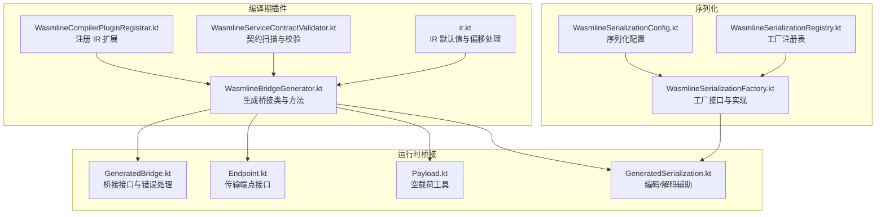
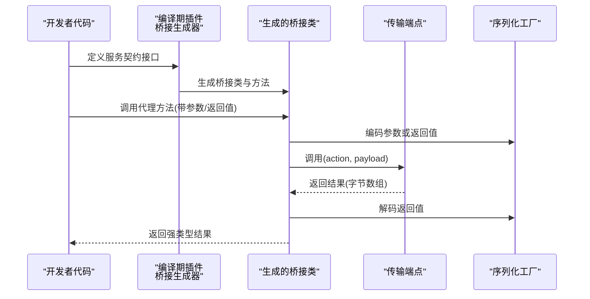
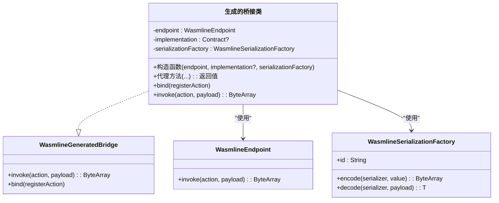
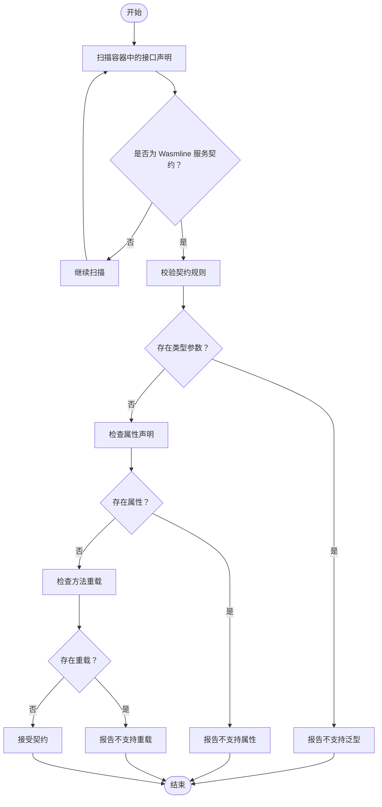
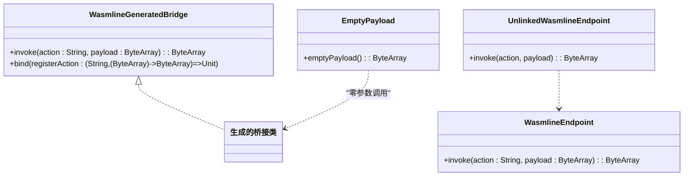
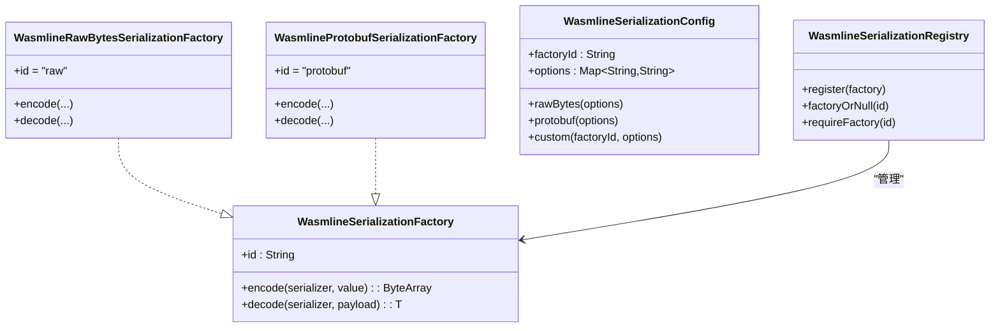
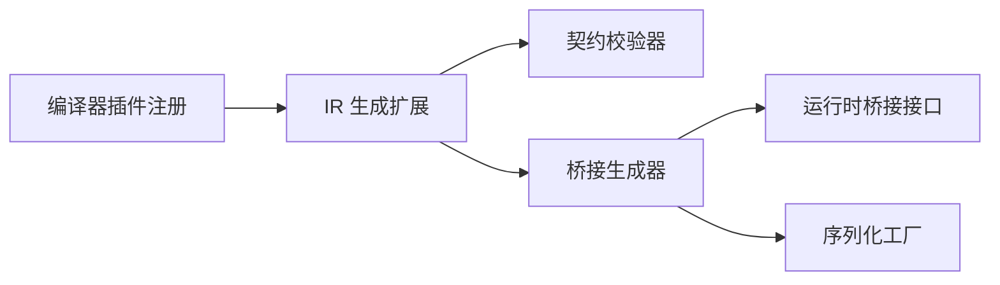

# 桥接代码生成

<cite>
**本文引用的文件**
- [WasmlineBridgeGenerator.kt](file://wasmline-multiplatform/wasmline-kotlin-plugin/src/main/kotlin/crow/wasmline/kotlin/WasmlineBridgeGenerator.kt)
- [GeneratedBridge.kt](file://wasmline-multiplatform/wasmline/src/commonMain/kotlin/crow/wasmline/internal/bridge/GeneratedBridge.kt)
- [GeneratedSerialization.kt](file://wasmline-multiplatform/wasmline/src/commonMain/kotlin/crow/wasmline/internal/bridge/GeneratedSerialization.kt)
- [Payload.kt](file://wasmline-multiplatform/wasmline/src/commonMain/kotlin/crow/wasmline/internal/bridge/Payload.kt)
- [Endpoint.kt](file://wasmline-multiplatform/wasmline/src/commonMain/kotlin/crow/wasmline/internal/bridge/Endpoint.kt)
- [WasmlineSerializationFactory.kt](file://wasmline-multiplatform/wasmline/src/commonMain/kotlin/crow/wasmline/serialization/WasmlineSerializationFactory.kt)
- [WasmlineSerializationConfig.kt](file://wasmline-multiplatform/wasmline/src/commonMain/kotlin/crow/wasmline/serialization/WasmlineSerializationConfig.kt)
- [WasmlineSerializationRegistry.kt](file://wasmline-multiplatform/wasmline/src/commonMain/kotlin/crow/wasmline/serialization/WasmlineSerializationRegistry.kt)
- [WasmlineServiceContractValidator.kt](file://wasmline-multiplatform/wasmline-kotlin-plugin/src/main/kotlin/crow/wasmline/kotlin/WasmlineServiceContractValidator.kt)
- [WasmlineCompilerPluginRegistrar.kt](file://wasmline-multiplatform/wasmline-kotlin-plugin/src/main/kotlin/crow/wasmline/kotlin/WasmlineCompilerPluginRegistrar.kt)
- [ir.kt](file://wasmline-multiplatform/wasmline-kotlin-plugin/src/main/kotlin/crow/wasmline/kotlin/ir.kt)
</cite>

## 目录
1. [引言](#引言)
2. [项目结构](#项目结构)
3. [核心组件](#核心组件)
4. [架构总览](#架构总览)
5. [详细组件分析](#详细组件分析)
6. [依赖关系分析](#依赖关系分析)
7. [性能考量](#性能考量)
8. [故障排查指南](#故障排查指南)
9. [结论](#结论)
10. [附录：示例与最佳实践](#附录示例与最佳实践)

## 引言
本文件面向 Wasmline 的桥接代码生成机制，系统阐述如何从服务契约（Service Contract）生成类型安全的代理代码。文档覆盖以下主题：
- 从接口到桥接类的生成流程与算法
- 方法签名提取、参数类型映射与返回值处理
- Kotlin IR 到目标语言的代码生成策略
- 序列化与反序列化的实现机制与工厂选择
- 类型系统兼容性与约束处理
- 性能优化与内存使用建议
- 插件开发者扩展与定制桥接生成的指导

## 项目结构
Wasmline 的桥接生成由 Kotlin 编译期插件在 IR 阶段完成，运行时由多平台共享的桥接与序列化基础设施支撑。关键模块如下：
- 编译期插件：扫描服务契约、校验规则、生成桥接类与绑定分发逻辑
- 运行时桥接：定义桥接接口、端点、空载荷工具与错误处理
- 序列化：工厂接口、配置与注册表，支持原生字节流与 Protobuf

图表来源
- [WasmlineBridgeGenerator.kt:55-156](file://wasmline-multiplatform/wasmline-kotlin-plugin/src/main/kotlin/crow/wasmline/kotlin/WasmlineBridgeGenerator.kt#L55-L156)
- [WasmlineServiceContractValidator.kt:24-88](file://wasmline-multiplatform/wasmline-kotlin-plugin/src/main/kotlin/crow/wasmline/kotlin/WasmlineServiceContractValidator.kt#L24-L88)
- [WasmlineCompilerPluginRegistrar.kt:26-44](file://wasmline-multiplatform/wasmline-kotlin-plugin/src/main/kotlin/crow/wasmline/kotlin/WasmlineCompilerPluginRegistrar.kt#L26-L44)
- [ir.kt:170-194](file://wasmline-multiplatform/wasmline-kotlin-plugin/src/main/kotlin/crow/wasmline/kotlin/ir.kt#L170-L194)
- [GeneratedBridge.kt:12-17](file://wasmline-multiplatform/wasmline/src/commonMain/kotlin/crow/wasmline/internal/bridge/GeneratedBridge.kt#L12-L17)
- [Endpoint.kt:5-7](file://wasmline-multiplatform/wasmline/src/commonMain/kotlin/crow/wasmline/internal/bridge/Endpoint.kt#L5-L7)
- [Payload.kt:6-8](file://wasmline-multiplatform/wasmline/src/commonMain/kotlin/crow/wasmline/internal/bridge/Payload.kt#L6-L8)
- [GeneratedSerialization.kt:8-22](file://wasmline-multiplatform/wasmline/src/commonMain/kotlin/crow/wasmline/internal/bridge/GeneratedSerialization.kt#L8-L22)
- [WasmlineSerializationFactory.kt:16-22](file://wasmline-multiplatform/wasmline/src/commonMain/kotlin/crow/wasmline/serialization/WasmlineSerializationFactory.kt#L16-L22)
- [WasmlineSerializationConfig.kt:12-15](file://wasmline-multiplatform/wasmline/src/commonMain/kotlin/crow/wasmline/serialization/WasmlineSerializationConfig.kt#L12-L15)
- [WasmlineSerializationRegistry.kt:3-19](file://wasmline-multiplatform/wasmline/src/commonMain/kotlin/crow/wasmline/serialization/WasmlineSerializationRegistry.kt#L3-L19)

章节来源
- [WasmlineBridgeGenerator.kt:55-156](file://wasmline-multiplatform/wasmline-kotlin-plugin/src/main/kotlin/crow/wasmline/kotlin/WasmlineBridgeGenerator.kt#L55-L156)
- [WasmlineServiceContractValidator.kt:24-88](file://wasmline-multiplatform/wasmline-kotlin-plugin/src/main/kotlin/crow/wasmline/kotlin/WasmlineServiceContractValidator.kt#L24-L88)
- [WasmlineCompilerPluginRegistrar.kt:26-44](file://wasmline-multiplatform/wasmline-kotlin-plugin/src/main/kotlin/crow/wasmline/kotlin/WasmlineCompilerPluginRegistrar.kt#L26-L44)
- [ir.kt:170-194](file://wasmline-multiplatform/wasmline-kotlin-plugin/src/main/kotlin/crow/wasmline/kotlin/ir.kt#L170-L194)

## 核心组件
- 服务契约扫描与校验：识别以 WasmlineService 为根的服务接口，过滤特殊/虚函数，禁止泛型与属性，确保方法名唯一
- 桥接类生成：为每个有效契约生成桥接类，包含端点字段、实现字段与序列化工厂字段，以及构造函数、代理方法、绑定方法与分发器
- 运行时桥接接口：统一的桥接调用与绑定协议，提供未链接与未知动作的快速失败保护
- 序列化工厂：支持原生字节流与 Protobuf，通过配置与注册表在运行时选择

章节来源
- [WasmlineServiceContractValidator.kt:24-88](file://wasmline-multiplatform/wasmline-kotlin-plugin/src/main/kotlin/crow/wasmline/kotlin/WasmlineServiceContractValidator.kt#L24-L88)
- [WasmlineBridgeGenerator.kt:55-156](file://wasmline-multiplatform/wasmline-kotlin-plugin/src/main/kotlin/crow/wasmline/kotlin/WasmlineBridgeGenerator.kt#L55-L156)
- [GeneratedBridge.kt:12-17](file://wasmline-multiplatform/wasmline/src/commonMain/kotlin/crow/wasmline/internal/bridge/GeneratedBridge.kt#L12-L17)
- [WasmlineSerializationFactory.kt:16-22](file://wasmline-multiplatform/wasmline/src/commonMain/kotlin/crow/wasmline/serialization/WasmlineSerializationFactory.kt#L16-L22)

## 架构总览
下图展示从服务契约到运行时调用的端到端流程：编译期生成桥接类与绑定分发，运行时通过端点进行跨边界通信，并使用序列化工厂完成参数与返回值的编解码。

图表来源
- [WasmlineBridgeGenerator.kt:192-268](file://wasmline-multiplatform/wasmline-kotlin-plugin/src/main/kotlin/crow/wasmline/kotlin/WasmlineBridgeGenerator.kt#L192-L268)
- [Endpoint.kt:5-7](file://wasmline-multiplatform/wasmline/src/commonMain/kotlin/crow/wasmline/internal/bridge/Endpoint.kt#L5-L7)
- [GeneratedSerialization.kt:8-22](file://wasmline-multiplatform/wasmline/src/commonMain/kotlin/crow/wasmline/internal/bridge/GeneratedSerialization.kt#L8-L22)

## 详细组件分析

### 组件一：桥接生成器（Kotlin IR）
桥接生成器负责：
- 接口分析：收集契约中的非特殊、非虚函数，构建方法集合
- 字段与构造：注入端点、实现与序列化工厂字段；初始化委托与实例初始化
- 代理方法：按契约签名生成同名方法，转发至端点，自动序列化参数与反序列化返回值
- 绑定方法：为每个 action 注册处理器，形成“action -> 分发器”的映射
- 分发器：根据 action 匹配，调用已绑定实现，执行参数解码与返回值编码

图表来源
- [WasmlineBridgeGenerator.kt:55-156](file://wasmline-multiplatform/wasmline-kotlin-plugin/src/main/kotlin/crow/wasmline/kotlin/WasmlineBridgeGenerator.kt#L55-L156)
- [GeneratedBridge.kt:12-17](file://wasmline-multiplatform/wasmline/src/commonMain/kotlin/crow/wasmline/internal/bridge/GeneratedBridge.kt#L12-L17)
- [Endpoint.kt:5-7](file://wasmline-multiplatform/wasmline/src/commonMain/kotlin/crow/wasmline/internal/bridge/Endpoint.kt#L5-L7)
- [WasmlineSerializationFactory.kt:16-22](file://wasmline-multiplatform/wasmline/src/commonMain/kotlin/crow/wasmline/serialization/WasmlineSerializationFactory.kt#L16-L22)

章节来源
- [WasmlineBridgeGenerator.kt:55-156](file://wasmline-multiplatform/wasmline-kotlin-plugin/src/main/kotlin/crow/wasmline/kotlin/WasmlineBridgeGenerator.kt#L55-L156)
- [WasmlineBridgeGenerator.kt:159-189](file://wasmline-multiplatform/wasmline-kotlin-plugin/src/main/kotlin/crow/wasmline/kotlin/WasmlineBridgeGenerator.kt#L159-L189)
- [WasmlineBridgeGenerator.kt:192-268](file://wasmline-multiplatform/wasmline-kotlin-plugin/src/main/kotlin/crow/wasmline/kotlin/WasmlineBridgeGenerator.kt#L192-L268)
- [WasmlineBridgeGenerator.kt:271-311](file://wasmline-multiplatform/wasmline-kotlin-plugin/src/main/kotlin/crow/wasmline/kotlin/WasmlineBridgeGenerator.kt#L271-L311)
- [WasmlineBridgeGenerator.kt:366-426](file://wasmline-multiplatform/wasmline-kotlin-plugin/src/main/kotlin/crow/wasmline/kotlin/WasmlineBridgeGenerator.kt#L366-L426)

### 组件二：服务契约校验器
- 契约发现：递归扫描容器，识别以 WasmlineService 为超类型的接口
- 规则校验：禁止泛型、属性、重载方法，确保方法名唯一
- 结果输出：对每个契约记录诊断信息，决定是否进入桥接生成阶段

图表来源
- [WasmlineServiceContractValidator.kt:24-88](file://wasmline-multiplatform/wasmline-kotlin-plugin/src/main/kotlin/crow/wasmline/kotlin/WasmlineServiceContractValidator.kt#L24-L88)

章节来源
- [WasmlineServiceContractValidator.kt:24-88](file://wasmline-multiplatform/wasmline-kotlin-plugin/src/main/kotlin/crow/wasmline/kotlin/WasmlineServiceContractValidator.kt#L24-L88)

### 组件三：运行时桥接与端点
- 桥接接口：统一的调用与绑定协议，要求实现 operator invoke 与 bind
- 端点接口：最小化传输抽象，仅暴露 action/payload 调用
- 错误处理：未链接端点、缺失实现、未知 action 的快速失败
- 空载荷：零参数调用使用空字节数组作为占位

图表来源
- [GeneratedBridge.kt:12-17](file://wasmline-multiplatform/wasmline/src/commonMain/kotlin/crow/wasmline/internal/bridge/GeneratedBridge.kt#L12-L17)
- [Endpoint.kt:5-7](file://wasmline-multiplatform/wasmline/src/commonMain/kotlin/crow/wasmline/internal/bridge/Endpoint.kt#L5-L7)
- [Payload.kt:6-8](file://wasmline-multiplatform/wasmline/src/commonMain/kotlin/crow/wasmline/internal/bridge/Payload.kt#L6-L8)

章节来源
- [GeneratedBridge.kt:12-17](file://wasmline-multiplatform/wasmline/src/commonMain/kotlin/crow/wasmline/internal/bridge/GeneratedBridge.kt#L12-L17)
- [Endpoint.kt:5-7](file://wasmline-multiplatform/wasmline/src/commonMain/kotlin/crow/wasmline/internal/bridge/Endpoint.kt#L5-L7)
- [Payload.kt:6-8](file://wasmline-multiplatform/wasmline/src/commonMain/kotlin/crow/wasmline/internal/bridge/Payload.kt#L6-L8)

### 组件四：序列化工厂与配置
- 工厂接口：统一 encode/decode 签名，暴露工厂 id
- 内置实现：原生字节流工厂（支持 ByteArray 与 Unit）、Protobuf 工厂
- 配置：通过配置对象携带工厂 id 与选项
- 注册表：集中管理工厂注册与查找

图表来源
- [WasmlineSerializationFactory.kt:16-22](file://wasmline-multiplatform/wasmline/src/commonMain/kotlin/crow/wasmline/serialization/WasmlineSerializationFactory.kt#L16-L22)
- [WasmlineSerializationFactory.kt:24-57](file://wasmline-multiplatform/wasmline/src/commonMain/kotlin/crow/wasmline/serialization/WasmlineSerializationFactory.kt#L24-L57)
- [WasmlineSerializationConfig.kt:12-39](file://wasmline-multiplatform/wasmline/src/commonMain/kotlin/crow/wasmline/serialization/WasmlineSerializationConfig.kt#L12-L39)
- [WasmlineSerializationRegistry.kt:3-19](file://wasmline-multiplatform/wasmline/src/commonMain/kotlin/crow/wasmline/serialization/WasmlineSerializationRegistry.kt#L3-L19)

章节来源
- [WasmlineSerializationFactory.kt:16-22](file://wasmline-multiplatform/wasmline/src/commonMain/kotlin/crow/wasmline/serialization/WasmlineSerializationFactory.kt#L16-L22)
- [WasmlineSerializationFactory.kt:24-57](file://wasmline-multiplatform/wasmline/src/commonMain/kotlin/crow/wasmline/serialization/WasmlineSerializationFactory.kt#L24-L57)
- [WasmlineSerializationConfig.kt:12-39](file://wasmline-multiplatform/wasmline/src/commonMain/kotlin/crow/wasmline/serialization/WasmlineSerializationConfig.kt#L12-L39)
- [WasmlineSerializationRegistry.kt:3-19](file://wasmline-multiplatform/wasmline/src/commonMain/kotlin/crow/wasmline/serialization/WasmlineSerializationRegistry.kt#L3-L19)

## 依赖关系分析
- 插件注册：编译器插件在注册阶段安装 IR 生成扩展
- 契约校验：在生成桥接前先进行契约合法性检查
- IR 生成：基于契约与运行时符号，生成桥接类与方法
- 运行时依赖：桥接类依赖端点与序列化工厂；运行时桥接接口与错误处理保障健壮性

图表来源
- [WasmlineCompilerPluginRegistrar.kt:26-44](file://wasmline-multiplatform/wasmline-kotlin-plugin/src/main/kotlin/crow/wasmline/kotlin/WasmlineCompilerPluginRegistrar.kt#L26-L44)
- [WasmlineServiceContractValidator.kt:24-88](file://wasmline-multiplatform/wasmline-kotlin-plugin/src/main/kotlin/crow/wasmline/kotlin/WasmlineServiceContractValidator.kt#L24-L88)
- [WasmlineBridgeGenerator.kt:55-156](file://wasmline-multiplatform/wasmline-kotlin-plugin/src/main/kotlin/crow/wasmline/kotlin/WasmlineBridgeGenerator.kt#L55-L156)

章节来源
- [WasmlineCompilerPluginRegistrar.kt:26-44](file://wasmline-multiplatform/wasmline-kotlin-plugin/src/main/kotlin/crow/wasmline/kotlin/WasmlineCompilerPluginRegistrar.kt#L26-L44)
- [WasmlineServiceContractValidator.kt:24-88](file://wasmline-multiplatform/wasmline-kotlin-plugin/src/main/kotlin/crow/wasmline/kotlin/WasmlineServiceContractValidator.kt#L24-L88)
- [WasmlineBridgeGenerator.kt:55-156](file://wasmline-multiplatform/wasmline-kotlin-plugin/src/main/kotlin/crow/wasmline/kotlin/WasmlineBridgeGenerator.kt#L55-L156)

## 性能考量
- IR 构建优化
  - 合理设置起止偏移，避免 UNDEFINED_OFFSET 导致后端代码生成失败
  - 使用合成偏移替代未定义偏移，减少后续 IR 处理开销
- 序列化选择
  - 原生字节流适合简单类型（如 ByteArray、Unit），避免额外编码开销
  - Protobuf 适合复杂结构体，权衡编码体积与 CPU 成本
- 调用路径
  - 代理方法直接转发至端点，避免多余包装
  - 分发器采用线性匹配，建议控制单桥接契约方法数量，必要时引入哈希索引
- 内存使用
  - 零参数调用复用空载荷，避免分配新数组
  - 返回值编码/解码尽量复用工厂实例，减少对象创建

章节来源
- [ir.kt:170-194](file://wasmline-multiplatform/wasmline-kotlin-plugin/src/main/kotlin/crow/wasmline/kotlin/ir.kt#L170-L194)
- [Payload.kt:6-8](file://wasmline-multiplatform/wasmline/src/commonMain/kotlin/crow/wasmline/internal/bridge/Payload.kt#L6-L8)
- [WasmlineSerializationFactory.kt:24-57](file://wasmline-multiplatform/wasmline/src/commonMain/kotlin/crow/wasmline/serialization/WasmlineSerializationFactory.kt#L24-L57)

## 故障排查指南
- 未链接端点
  - 现象：调用桥接代理时报错，提示未链接传输端点
  - 原因：link()/bind() 未被插件正确改写
  - 处理：确认插件启用、入口点改写生效
- 未绑定实现
  - 现象：分发器收到 action 但无实现可调用
  - 原因：bind() 未正确注册实现
  - 处理：检查 bind() 调用链与实现注入
- 未知 action
  - 现象：分发器无法识别 action
  - 原因：action 名称与契约签名不一致
  - 处理：核对契约方法名与 action 格式
- 序列化异常
  - 现象：编码/解码失败
  - 原因：工厂 id 不匹配或类型不支持
  - 处理：确认配置与注册表一致，类型满足工厂支持范围

章节来源
- [GeneratedBridge.kt:19-43](file://wasmline-multiplatform/wasmline/src/commonMain/kotlin/crow/wasmline/internal/bridge/GeneratedBridge.kt#L19-L43)
- [WasmlineSerializationFactory.kt:24-67](file://wasmline-multiplatform/wasmline/src/commonMain/kotlin/crow/wasmline/serialization/WasmlineSerializationFactory.kt#L24-L67)

## 结论
Wasmline 的桥接生成机制通过编译期 IR 改写与运行时桥接/序列化基础设施，实现了类型安全、可扩展且高性能的服务契约代理与分发。其关键优势在于：
- 明确的契约规则与严格的校验，保证生成质量
- 以端点为中心的传输抽象，便于移植到不同目标语言
- 可插拔的序列化工厂，兼顾灵活性与性能
- 快速失败的运行时保护，提升调试效率

## 附录：示例与最佳实践
- 示例参考路径
  - 代理方法生成与调用链：[WasmlineBridgeGenerator.kt:192-268](file://wasmline-multiplatform/wasmline-kotlin-plugin/src/main/kotlin/crow/wasmline/kotlin/WasmlineBridgeGenerator.kt#L192-L268)
  - 绑定与分发器：[WasmlineBridgeGenerator.kt:271-311](file://wasmline-multiplatform/wasmline-kotlin-plugin/src/main/kotlin/crow/wasmline/kotlin/WasmlineBridgeGenerator.kt#L271-L311), [WasmlineBridgeGenerator.kt:366-426](file://wasmline-multiplatform/wasmline-kotlin-plugin/src/main/kotlin/crow/wasmline/kotlin/WasmlineBridgeGenerator.kt#L366-L426)
  - 序列化辅助函数：[GeneratedSerialization.kt:8-22](file://wasmline-multiplatform/wasmline/src/commonMain/kotlin/crow/wasmline/internal/bridge/GeneratedSerialization.kt#L8-L22)
  - 契约校验规则：[WasmlineServiceContractValidator.kt:53-85](file://wasmline-multiplatform/wasmline-kotlin-plugin/src/main/kotlin/crow/wasmline/kotlin/WasmlineServiceContractValidator.kt#L53-L85)
- 最佳实践
  - 契约设计
    - 保持方法无重载、无属性、无泛型，确保编译期可推断
    - 使用简单可序列化类型，优先支持 ByteArray/Unit 或 Protobuf 支持的结构
  - 生成与链接
    - 确保 link()/bind() 在编译期被插件改写，避免手动绕过
    - 将实现注入到桥接类，使分发器可直接调用
  - 序列化选择
    - 对高频小数据使用原生字节流，对复杂结构使用 Protobuf
    - 在配置中显式指定工厂 id，并在运行时注册对应工厂
  - 性能优化
    - 控制单桥接契约方法数量，避免分发器分支过多
    - 复用序列化工厂与端点实例，减少对象分配
  - 可维护性
    - 为每个契约提供清晰的 action 标识（契约全名+方法名）
    - 在开发环境启用详细诊断，生产环境关注性能指标