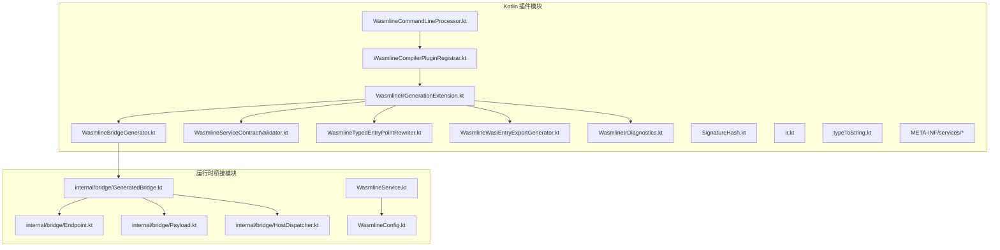
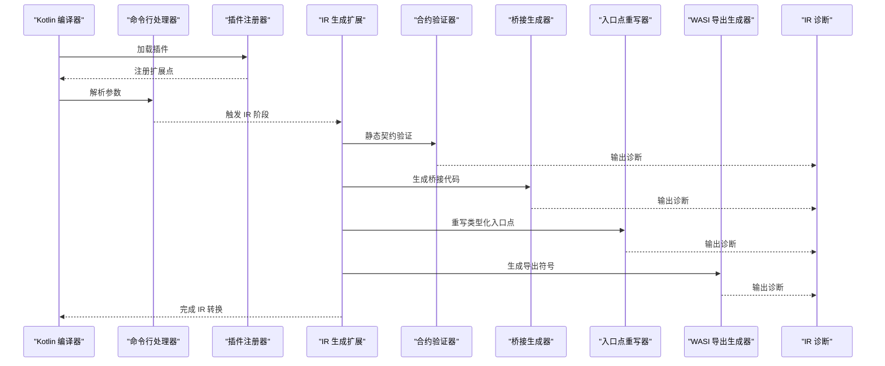
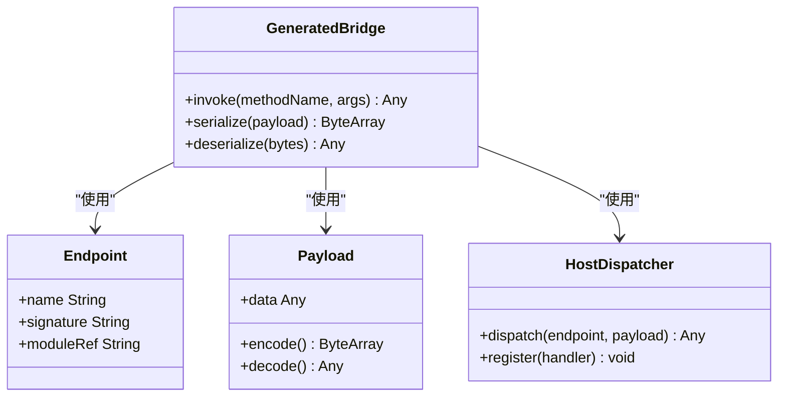
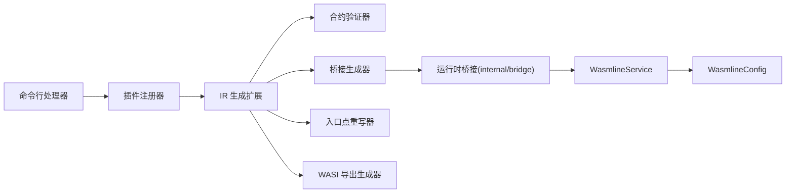

# 编译器插件系统

<cite>
**本文引用的文件**
- [WasmlineCommandLineProcessor.kt](file://wasmline-multiplatform/wasmline-kotlin-plugin/src/main/kotlin/crow/wasmline/kotlin/WasmlineCommandLineProcessor.kt)
- [WasmlineCompilerPluginRegistrar.kt](file://wasmline-multiplatform/wasmline-kotlin-plugin/src/main/kotlin/crow/wasmline/kotlin/WasmlineCompilerPluginRegistrar.kt)
- [WasmlineIrGenerationExtension.kt](file://wasmline-multiplatform/wasmline-kotlin-plugin/src/main/kotlin/crow/wasmline/kotlin/WasmlineIrGenerationExtension.kt)
- [WasmlineBridgeGenerator.kt](file://wasmline-multiplatform/wasmline-kotlin-plugin/src/main/kotlin/crow/wasmline/kotlin/WasmlineBridgeGenerator.kt)
- [WasmlineServiceContractValidator.kt](file://wasmline-multiplatform/wasmline-kotlin-plugin/src/main/kotlin/crow/wasmline/kotlin/WasmlineServiceContractValidator.kt)
- [WasmlineTypedEntryPointRewriter.kt](file://wasmline-multiplatform/wasmline-kotlin-plugin/src/main/kotlin/crow/wasmline/kotlin/WasmlineTypedEntryPointRewriter.kt)
- [WasmlineWasiEntryExportGenerator.kt](file://wasmline-multiplatform/wasmline-kotlin-plugin/src/main/kotlin/crow/wasmline/kotlin/WasmlineWasiEntryExportGenerator.kt)
- [WasmlineIrDiagnostics.kt](file://wasmline-multiplatform/wasmline-kotlin-plugin/src/main/kotlin/crow/wasmline/kotlin/WasmlineIrDiagnostics.kt)
- [SignatureHash.kt](file://wasmline-multiplatform/wasmline-kotlin-plugin/src/main/kotlin/crow/wasmline/kotlin/SignatureHash.kt)
- [ir.kt](file://wasmline-multiplatform/wasmline-kotlin-plugin/src/main/kotlin/crow/wasmline/kotlin/ir.kt)
- [typeToString.kt](file://wasmline-multiplatform/wasmline-kotlin-plugin/src/main/kotlin/crow/wasmline/kotlin/typeToString.kt)
- [META-INF/services/org.jetbrains.kotlin.compiler.plugin.CommandLineProcessor](file://wasmline-multiplatform/wasmline-kotlin-plugin/src/main/resources/META-INF/services/org.jetbrains.kotlin.compiler.plugin.CommandLineProcessor)
- [META-INF/services/org.jetbrains.kotlin.compiler.plugin.CompilerPluginRegistrar](file://wasmline-multiplatform/wasmline-kotlin-plugin/src/main/resources/META-INF/services/org.jetbrains.kotlin.compiler.plugin.CompilerPluginRegistrar)
- [WasmlineBridge.kt](file://wasmline-multiplatform/wasmline/src/commonMain/kotlin/crow/wasmline/internal/bridge/GeneratedBridge.kt)
- [Endpoint.kt](file://wasmline-multiplatform/wasmline/src/commonMain/kotlin/crow/wasmline/internal/bridge/Endpoint.kt)
- [Payload.kt](file://wasmline-multiplatform/wasmline/src/commonMain/kotlin/crow/wasmline/internal/bridge/Payload.kt)
- [HostDispatcher.kt](file://wasmline-multiplatform/wasmline/src/commonMain/kotlin/crow/wasmline/internal/bridge/HostDispatcher.kt)
- [WasmlineService.kt](file://wasmline-multiplatform/wasmline/src/commonMain/kotlin/crow/wasmline/WasmlineService.kt)
- [WasmlineConfig.kt](file://wasmline-multiplatform/wasmline/src/commonMain/kotlin/crow/wasmline/WasmlineConfig.kt)
- [WasmlineRuntimeSymbols.kt](file://wasmline-multiplatform/wasmline-kotlin-plugin/src/main/kotlin/crow/wasmline/kotlin/WasmlineRuntimeSymbols.kt)
</cite>

## 目录
1. [引言](#引言)
2. [项目结构](#项目结构)
3. [核心组件](#核心组件)
4. [架构总览](#架构总览)
5. [详细组件分析](#详细组件分析)
6. [依赖关系分析](#依赖关系分析)
7. [性能考量](#性能考量)
8. [故障排查指南](#故障排查指南)
9. [结论](#结论)
10. [附录](#附录)

## 引言
本文件面向 Wasmline 编译器插件系统的开发者与维护者，系统性阐述 Kotlin IR 编译器插件的架构设计与实现原理，重点覆盖 IR 转换管道的四个阶段：发现、验证、桥接生成、调用点重写；解释桥接代码生成机制（从服务契约到类型安全代理）；详述静态契约约束的验证规则与错误处理；给出扩展点与自定义机制；说明与 Kotlin 编译器的集成方式与调试技巧；并提供性能优化与内存使用建议。

## 项目结构
Wasmline 的编译器插件位于 wasmline-multiplatform/wasmline-kotlin-plugin 模块中，采用 Kotlin 多平台工程组织，核心插件类集中在 src/main/kotlin/crow/wasmline/kotlin 目录下，并通过 META-INF/services 注册为 Kotlin 编译器插件。运行时桥接代码位于 wasmline-multiplatform/wasmline 模块的 internal/bridge 包中，供生成的桥接代码在运行时使用。

图表来源
- [WasmlineCommandLineProcessor.kt](file://wasmline-multiplatform/wasmline-kotlin-plugin/src/main/kotlin/crow/wasmline/kotlin/WasmlineCommandLineProcessor.kt)
- [WasmlineCompilerPluginRegistrar.kt](file://wasmline-multiplatform/wasmline-kotlin-plugin/src/main/kotlin/crow/wasmline/kotlin/WasmlineCompilerPluginRegistrar.kt)
- [WasmlineIrGenerationExtension.kt](file://wasmline-multiplatform/wasmline-kotlin-plugin/src/main/kotlin/crow/wasmline/kotlin/WasmlineIrGenerationExtension.kt)
- [WasmlineBridgeGenerator.kt](file://wasmline-multiplatform/wasmline-kotlin-plugin/src/main/kotlin/crow/wasmline/kotlin/WasmlineBridgeGenerator.kt)
- [WasmlineServiceContractValidator.kt](file://wasmline-multiplatform/wasmline-kotlin-plugin/src/main/kotlin/crow/wasmline/kotlin/WasmlineServiceContractValidator.kt)
- [WasmlineTypedEntryPointRewriter.kt](file://wasmline-multiplatform/wasmline-kotlin-plugin/src/main/kotlin/crow/wasmline/kotlin/WasmlineTypedEntryPointRewriter.kt)
- [WasmlineWasiEntryExportGenerator.kt](file://wasmline-multiplatform/wasmline-kotlin-plugin/src/main/kotlin/crow/wasmline/kotlin/WasmlineWasiEntryExportGenerator.kt)
- [WasmlineIrDiagnostics.kt](file://wasmline-multiplatform/wasmline-kotlin-plugin/src/main/kotlin/crow/wasmline/kotlin/WasmlineIrDiagnostics.kt)
- [WasmlineBridge.kt](file://wasmline-multiplatform/wasmline/src/commonMain/kotlin/crow/wasmline/internal/bridge/GeneratedBridge.kt)
- [Endpoint.kt](file://wasmline-multiplatform/wasmline/src/commonMain/kotlin/crow/wasmline/internal/bridge/Endpoint.kt)
- [Payload.kt](file://wasmline-multiplatform/wasmline/src/commonMain/kotlin/crow/wasmline/internal/bridge/Payload.kt)
- [HostDispatcher.kt](file://wasmline-multiplatform/wasmline/src/commonMain/kotlin/crow/wasmline/internal/bridge/HostDispatcher.kt)
- [WasmlineService.kt](file://wasmline-multiplatform/wasmline/src/commonMain/kotlin/crow/wasmline/WasmlineService.kt)
- [WasmlineConfig.kt](file://wasmline-multiplatform/wasmline/src/commonMain/kotlin/crow/wasmline/WasmlineConfig.kt)

章节来源
- [WasmlineCommandLineProcessor.kt](file://wasmline-multiplatform/wasmline-kotlin-plugin/src/main/kotlin/crow/wasmline/kotlin/WasmlineCommandLineProcessor.kt)
- [WasmlineCompilerPluginRegistrar.kt](file://wasmline-multiplatform/wasmline-kotlin-plugin/src/main/kotlin/crow/wasmline/kotlin/WasmlineCompilerPluginRegistrar.kt)
- [META-INF/services/org.jetbrains.kotlin.compiler.plugin.CommandLineProcessor](file://wasmline-multiplatform/wasmline-kotlin-plugin/src/main/resources/META-INF/services/org.jetbrains.kotlin.compiler.plugin.CommandLineProcessor)
- [META-INF/services/org.jetbrains.kotlin.compiler.plugin.CompilerPluginRegistrar](file://wasmline-multiplatform/wasmline-kotlin-plugin/src/main/resources/META-INF/services/org.jetbrains.kotlin.compiler.plugin.CompilerPluginRegistrar)

## 核心组件
- 命令行处理器：负责解析插件参数，驱动后续 IR 阶段执行。
- 插件注册器：向 Kotlin 编译器注册插件入口与扩展点。
- IR 生成扩展：统一协调发现、验证、桥接生成、调用点重写等阶段。
- 桥接生成器：基于服务契约生成类型安全的桥接代理与序列化代码。
- 合约验证器：对服务契约进行静态约束检查与诊断报告。
- 入口点重写器：重写类型化的入口点以适配运行时调用约定。
- WASI 导出生成器：为 WASI 平台生成必要的导出符号。
- IR 诊断：收集与输出编译期诊断信息。
- 运行时桥接：生成的桥接代码在运行时使用的端点、载荷与分发器。

章节来源
- [WasmlineCommandLineProcessor.kt](file://wasmline-multiplatform/wasmline-kotlin-plugin/src/main/kotlin/crow/wasmline/kotlin/WasmlineCommandLineProcessor.kt)
- [WasmlineCompilerPluginRegistrar.kt](file://wasmline-multiplatform/wasmline-kotlin-plugin/src/main/kotlin/crow/wasmline/kotlin/WasmlineCompilerPluginRegistrar.kt)
- [WasmlineIrGenerationExtension.kt](file://wasmline-multiplatform/wasmline-kotlin-plugin/src/main/kotlin/crow/wasmline/kotlin/WasmlineIrGenerationExtension.kt)
- [WasmlineBridgeGenerator.kt](file://wasmline-multiplatform/wasmline-kotlin-plugin/src/main/kotlin/crow/wasmline/kotlin/WasmlineBridgeGenerator.kt)
- [WasmlineServiceContractValidator.kt](file://wasmline-multiplatform/wasmline-kotlin-plugin/src/main/kotlin/crow/wasmline/kotlin/WasmlineServiceContractValidator.kt)
- [WasmlineTypedEntryPointRewriter.kt](file://wasmline-multiplatform/wasmline-kotlin-plugin/src/main/kotlin/crow/wasmline/kotlin/WasmlineTypedEntryPointRewriter.kt)
- [WasmlineWasiEntryExportGenerator.kt](file://wasmline-multiplatform/wasmline-kotlin-plugin/src/main/kotlin/crow/wasmline/kotlin/WasmlineWasiEntryExportGenerator.kt)
- [WasmlineIrDiagnostics.kt](file://wasmline-multiplatform/wasmline-kotlin-plugin/src/main/kotlin/crow/wasmline/kotlin/WasmlineIrDiagnostics.kt)

## 架构总览
编译器插件通过命令行处理器与注册器接入 Kotlin 编译器，随后由 IR 生成扩展统一调度各子阶段。桥接生成器与合约验证器分别负责“生成”和“校验”，入口点重写器与 WASI 导出生成器负责目标平台适配，IR 诊断负责问题反馈。最终生成的桥接代码在运行时与 Wasmline 运行时协作。

图表来源
- [WasmlineCommandLineProcessor.kt](file://wasmline-multiplatform/wasmline-kotlin-plugin/src/main/kotlin/crow/wasmline/kotlin/WasmlineCommandLineProcessor.kt)
- [WasmlineCompilerPluginRegistrar.kt](file://wasmline-multiplatform/wasmline-kotlin-plugin/src/main/kotlin/crow/wasmline/kotlin/WasmlineCompilerPluginRegistrar.kt)
- [WasmlineIrGenerationExtension.kt](file://wasmline-multiplatform/wasmline-kotlin-plugin/src/main/kotlin/crow/wasmline/kotlin/WasmlineIrGenerationExtension.kt)
- [WasmlineServiceContractValidator.kt](file://wasmline-multiplatform/wasmline-kotlin-plugin/src/main/kotlin/crow/wasmline/kotlin/WasmlineServiceContractValidator.kt)
- [WasmlineBridgeGenerator.kt](file://wasmline-multiplatform/wasmline-kotlin-plugin/src/main/kotlin/crow/wasmline/kotlin/WasmlineBridgeGenerator.kt)
- [WasmlineTypedEntryPointRewriter.kt](file://wasmline-multiplatform/wasmline-kotlin-plugin/src/main/kotlin/crow/wasmline/kotlin/WasmlineTypedEntryPointRewriter.kt)
- [WasmlineWasiEntryExportGenerator.kt](file://wasmline-multiplatform/wasmline-kotlin-plugin/src/main/kotlin/crow/wasmline/kotlin/WasmlineWasiEntryExportGenerator.kt)
- [WasmlineIrDiagnostics.kt](file://wasmline-multiplatform/wasmline-kotlin-plugin/src/main/kotlin/crow/wasmline/kotlin/WasmlineIrDiagnostics.kt)

## 详细组件分析

### 发现阶段
- 作用：在 IR 阶段扫描并识别被 @WasmlineService 标注的服务声明，提取其签名、参数、返回值与可见性等元数据。
- 关键点：通过 IR 访问器遍历模块，匹配标注与接口/抽象类声明，构建服务契约模型。
- 与运行时的关系：为后续桥接生成提供输入数据结构。

章节来源
- [WasmlineIrGenerationExtension.kt](file://wasmline-multiplatform/wasmline-kotlin-plugin/src/main/kotlin/crow/wasmline/kotlin/WasmlineIrGenerationExtension.kt)
- [WasmlineServiceContractValidator.kt](file://wasmline-multiplatform/wasmline-kotlin-plugin/src/main/kotlin/crow/wasmline/kotlin/WasmlineServiceContractValidator.kt)

### 验证阶段
- 作用：对服务契约施加静态约束，如参数与返回值的可序列化性、方法签名一致性、跨平台兼容性等。
- 错误处理：将违反约束的点记录为诊断项，包含位置信息与错误码，便于定位修复。
- 与诊断系统：通过 IR 诊断模块统一输出，支持 IDE 与命令行展示。

章节来源
- [WasmlineServiceContractValidator.kt](file://wasmline-multiplatform/wasmline-kotlin-plugin/src/main/kotlin/crow/wasmline/kotlin/WasmlineServiceContractValidator.kt)
- [WasmlineIrDiagnostics.kt](file://wasmline-multiplatform/wasmline-kotlin-plugin/src/main/kotlin/crow/wasmline/kotlin/WasmlineIrDiagnostics.kt)

### 桥接生成阶段
- 作用：根据服务契约生成类型安全的桥接代理与序列化/反序列化逻辑，确保调用点与运行时桥接一致。
- 生成内容：包含桥接类、端点定义、载荷封装、主机分发器等。
- 运行时协作：生成的桥接代码依赖 internal/bridge 下的 Endpoint、Payload、HostDispatcher 等运行时构件。

图表来源
- [WasmlineBridgeGenerator.kt](file://wasmline-multiplatform/wasmline-kotlin-plugin/src/main/kotlin/crow/wasmline/kotlin/WasmlineBridgeGenerator.kt)
- [WasmlineBridge.kt](file://wasmline-multiplatform/wasmline/src/commonMain/kotlin/crow/wasmline/internal/bridge/GeneratedBridge.kt)
- [Endpoint.kt](file://wasmline-multiplatform/wasmline/src/commonMain/kotlin/crow/wasmline/internal/bridge/Endpoint.kt)
- [Payload.kt](file://wasmline-multiplatform/wasmline/src/commonMain/kotlin/crow/wasmline/internal/bridge/Payload.kt)
- [HostDispatcher.kt](file://wasmline-multiplatform/wasmline/src/commonMain/kotlin/crow/wasmline/internal/bridge/HostDispatcher.kt)

章节来源
- [WasmlineBridgeGenerator.kt](file://wasmline-multiplatform/wasmline-kotlin-plugin/src/main/kotlin/crow/wasmline/kotlin/WasmlineBridgeGenerator.kt)
- [WasmlineBridge.kt](file://wasmline-multiplatform/wasmline/src/commonMain/kotlin/crow/wasmline/internal/bridge/GeneratedBridge.kt)
- [Endpoint.kt](file://wasmline-multiplatform/wasmline/src/commonMain/kotlin/crow/wasmline/internal/bridge/Endpoint.kt)
- [Payload.kt](file://wasmline-multiplatform/wasmline/src/commonMain/kotlin/crow/wasmline/internal/bridge/Payload.kt)
- [HostDispatcher.kt](file://wasmline-multiplatform/wasmline/src/commonMain/kotlin/crow/wasmline/internal/bridge/HostDispatcher.kt)

### 调用点重写阶段
- 作用：将服务调用点改写为类型化入口，使编译后调用与运行时桥接一致，保证类型安全与性能。
- 实现要点：替换调用指令、注入桥接调用包装、保留语义与异常传播。

章节来源
- [WasmlineTypedEntryPointRewriter.kt](file://wasmline-multiplatform/wasmline-kotlin-plugin/src/main/kotlin/crow/wasmline/kotlin/WasmlineTypedEntryPointRewriter.kt)

### WASI 平台导出生成
- 作用：为 WASI 平台生成必要的导出符号，确保服务在该平台上可被宿主环境正确调用。
- 适用场景：WebAssembly/WASI 目标下的服务暴露与链接。

章节来源
- [WasmlineWasiEntryExportGenerator.kt](file://wasmline-multiplatform/wasmline-kotlin-plugin/src/main/kotlin/crow/wasmline/kotlin/WasmlineWasiEntryExportGenerator.kt)

### 插件注册与命令行集成
- 通过 META-INF/services 机制注册 CommandLineProcessor 与 CompilerPluginRegistrar，使 Kotlin 编译器在启动时自动加载插件。
- 命令行处理器负责解析参数并驱动插件执行流程。

章节来源
- [META-INF/services/org.jetbrains.kotlin.compiler.plugin.CommandLineProcessor](file://wasmline-multiplatform/wasmline-kotlin-plugin/src/main/resources/META-INF/services/org.jetbrains.kotlin.compiler.plugin.CommandLineProcessor)
- [META-INF/services/org.jetbrains.kotlin.compiler.plugin.CompilerPluginRegistrar](file://wasmline-multiplatform/wasmline-kotlin-plugin/src/main/resources/META-INF/services/org.jetbrains.kotlin.compiler.plugin.CompilerPluginRegistrar)
- [WasmlineCommandLineProcessor.kt](file://wasmline-multiplatform/wasmline-kotlin-plugin/src/main/kotlin/crow/wasmline/kotlin/WasmlineCommandLineProcessor.kt)
- [WasmlineCompilerPluginRegistrar.kt](file://wasmline-multiplatform/wasmline-kotlin-plugin/src/main/kotlin/crow/wasmline/kotlin/WasmlineCompilerPluginRegistrar.kt)

### 类型工具与 IR 辅助
- typeToString：将 Kotlin 类型转为字符串表示，用于签名计算与诊断信息。
- ir.kt：IR 相关工具函数，辅助遍历与转换。
- SignatureHash：计算签名哈希，用于去重与缓存。

章节来源
- [typeToString.kt](file://wasmline-multiplatform/wasmline-kotlin-plugin/src/main/kotlin/crow/wasmline/kotlin/typeToString.kt)
- [ir.kt](file://wasmline-multiplatform/wasmline-kotlin-plugin/src/main/kotlin/crow/wasmline/kotlin/ir.kt)
- [SignatureHash.kt](file://wasmline-multiplatform/wasmline-kotlin-plugin/src/main/kotlin/crow/wasmline/kotlin/SignatureHash.kt)

## 依赖关系分析
- 插件入口依赖：CommandLineProcessor -> CompilerPluginRegistrar -> IR 生成扩展。
- IR 阶段依赖：IR 生成扩展 -> 验证器、桥接生成器、入口点重写器、WASI 导出生成器。
- 运行时依赖：生成的桥接代码依赖 internal/bridge 的 Endpoint、Payload、HostDispatcher。
- 诊断依赖：所有阶段通过 IR 诊断模块统一输出。

图表来源
- [WasmlineCommandLineProcessor.kt](file://wasmline-multiplatform/wasmline-kotlin-plugin/src/main/kotlin/crow/wasmline/kotlin/WasmlineCommandLineProcessor.kt)
- [WasmlineCompilerPluginRegistrar.kt](file://wasmline-multiplatform/wasmline-kotlin-plugin/src/main/kotlin/crow/wasmline/kotlin/WasmlineCompilerPluginRegistrar.kt)
- [WasmlineIrGenerationExtension.kt](file://wasmline-multiplatform/wasmline-kotlin-plugin/src/main/kotlin/crow/wasmline/kotlin/WasmlineIrGenerationExtension.kt)
- [WasmlineServiceContractValidator.kt](file://wasmline-multiplatform/wasmline-kotlin-plugin/src/main/kotlin/crow/wasmline/kotlin/WasmlineServiceContractValidator.kt)
- [WasmlineBridgeGenerator.kt](file://wasmline-multiplatform/wasmline-kotlin-plugin/src/main/kotlin/crow/wasmline/kotlin/WasmlineBridgeGenerator.kt)
- [WasmlineTypedEntryPointRewriter.kt](file://wasmline-multiplatform/wasmline-kotlin-plugin/src/main/kotlin/crow/wasmline/kotlin/WasmlineTypedEntryPointRewriter.kt)
- [WasmlineWasiEntryExportGenerator.kt](file://wasmline-multiplatform/wasmline-kotlin-plugin/src/main/kotlin/crow/wasmline/kotlin/WasmlineWasiEntryExportGenerator.kt)
- [WasmlineBridge.kt](file://wasmline-multiplatform/wasmline/src/commonMain/kotlin/crow/wasmline/internal/bridge/GeneratedBridge.kt)
- [Endpoint.kt](file://wasmline-multiplatform/wasmline/src/commonMain/kotlin/crow/wasmline/internal/bridge/Endpoint.kt)
- [Payload.kt](file://wasmline-multiplatform/wasmline/src/commonMain/kotlin/crow/wasmline/internal/bridge/Payload.kt)
- [HostDispatcher.kt](file://wasmline-multiplatform/wasmline/src/commonMain/kotlin/crow/wasmline/internal/bridge/HostDispatcher.kt)
- [WasmlineService.kt](file://wasmline-multiplatform/wasmline/src/commonMain/kotlin/crow/wasmline/WasmlineService.kt)
- [WasmlineConfig.kt](file://wasmline-multiplatform/wasmline/src/commonMain/kotlin/crow/wasmline/WasmlineConfig.kt)

章节来源
- [WasmlineIrGenerationExtension.kt](file://wasmline-multiplatform/wasmline-kotlin-plugin/src/main/kotlin/crow/wasmline/kotlin/WasmlineIrGenerationExtension.kt)
- [WasmlineBridgeGenerator.kt](file://wasmline-multiplatform/wasmline-kotlin-plugin/src/main/kotlin/crow/wasmline/kotlin/WasmlineBridgeGenerator.kt)
- [WasmlineServiceContractValidator.kt](file://wasmline-multiplatform/wasmline-kotlin-plugin/src/main/kotlin/crow/wasmline/kotlin/WasmlineServiceContractValidator.kt)
- [WasmlineTypedEntryPointRewriter.kt](file://wasmline-multiplatform/wasmline-kotlin-plugin/src/main/kotlin/crow/wasmline/kotlin/WasmlineTypedEntryPointRewriter.kt)
- [WasmlineWasiEntryExportGenerator.kt](file://wasmline-multiplatform/wasmline-kotlin-plugin/src/main/kotlin/crow/wasmline/kotlin/WasmlineWasiEntryExportGenerator.kt)

## 性能考量
- IR 遍历与匹配：尽量减少不必要的 IR 节点访问，优先按注解标记快速筛选候选声明。
- 生成代码最小化：仅生成必要桥接与序列化逻辑，避免冗余包装层。
- 缓存与去重：利用签名哈希与类型字符串缓存，降低重复计算成本。
- 诊断聚合：集中输出诊断，减少多次 IO 与格式化开销。
- 内存使用：控制中间模型大小，及时释放临时对象；在桥接生成中避免大对象复制。

## 故障排查指南
- 诊断信息定位：通过 IR 诊断模块输出的错误码与位置信息快速定位问题。
- 常见问题
  - 契约不满足：参数或返回值不可序列化、签名不一致、跨平台类型不兼容。
  - 生成失败：桥接类名冲突、导入缺失、平台导出符号未生成。
  - 运行时调用异常：桥接调用点未正确重写、端点签名不匹配。
- 调试技巧
  - 启用详细日志与诊断输出，结合 IDE 插件查看 FIR/IR 可视化。
  - 使用测试样例对比生成的 IR 与桥接代码，逐步缩小问题范围。
  - 分阶段验证：先验证契约，再验证桥接生成，最后验证调用点重写。

章节来源
- [WasmlineIrDiagnostics.kt](file://wasmline-multiplatform/wasmline-kotlin-plugin/src/main/kotlin/crow/wasmline/kotlin/WasmlineIrDiagnostics.kt)
- [WasmlineServiceContractValidator.kt](file://wasmline-multiplatform/wasmline-kotlin-plugin/src/main/kotlin/crow/wasmline/kotlin/WasmlineServiceContractValidator.kt)
- [WasmlineBridgeGenerator.kt](file://wasmline-multiplatform/wasmline-kotlin-plugin/src/main/kotlin/crow/wasmline/kotlin/WasmlineBridgeGenerator.kt)
- [WasmlineTypedEntryPointRewriter.kt](file://wasmline-multiplatform/wasmline-kotlin-plugin/src/main/kotlin/crow/wasmline/kotlin/WasmlineTypedEntryPointRewriter.kt)

## 结论
Wasmline 编译器插件通过清晰的阶段划分与模块化设计，在 Kotlin IR 层面实现了服务契约的静态验证与桥接代码生成，并针对不同平台（尤其是 WASI）提供了导出适配。配合完善的诊断与运行时桥接，插件在保证类型安全的同时兼顾了性能与可维护性。开发者可通过扩展点与自定义机制进一步增强功能。

## 附录
- 扩展点与自定义
  - 新增验证规则：在合约验证器中添加新规则与诊断项。
  - 自定义桥接模板：在桥接生成器中扩展生成逻辑。
  - 平台适配：在 WASI 导出生成器中增加平台特定导出。
- 与 Kotlin 编译器集成
  - 通过 META-INF/services 注册插件，确保编译器自动加载。
  - 在命令行处理器中扩展参数解析，支持更多配置选项。
- 调试与测试
  - 使用测试数据集（testData）验证各阶段行为。
  - 对照生成的 FIR/IR 文件与桥接代码，核对语义一致性。