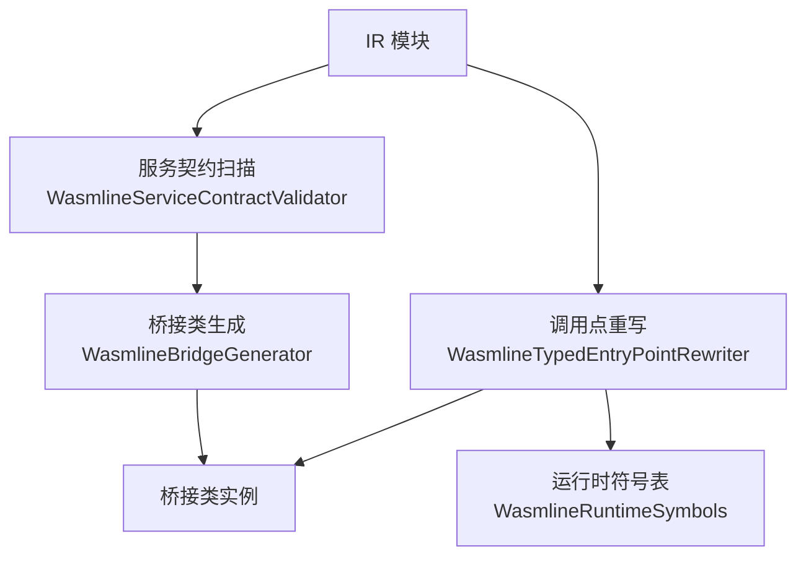
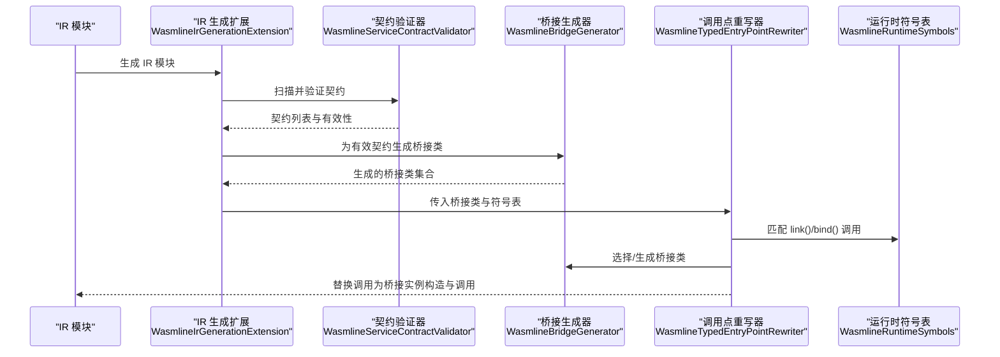
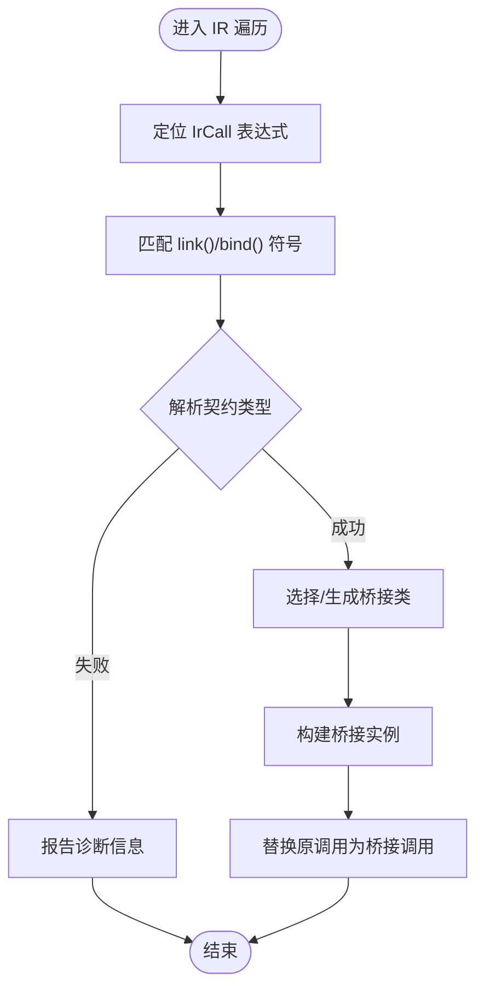
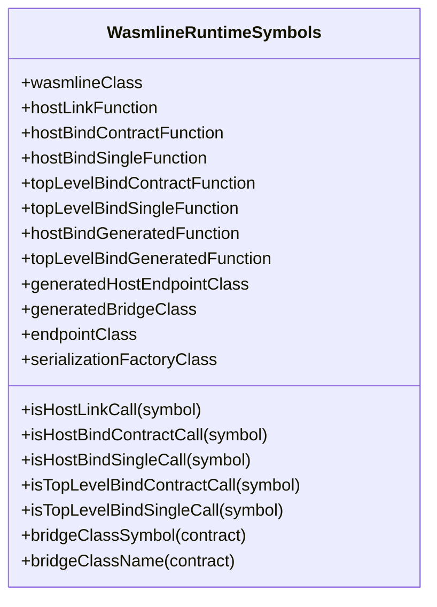
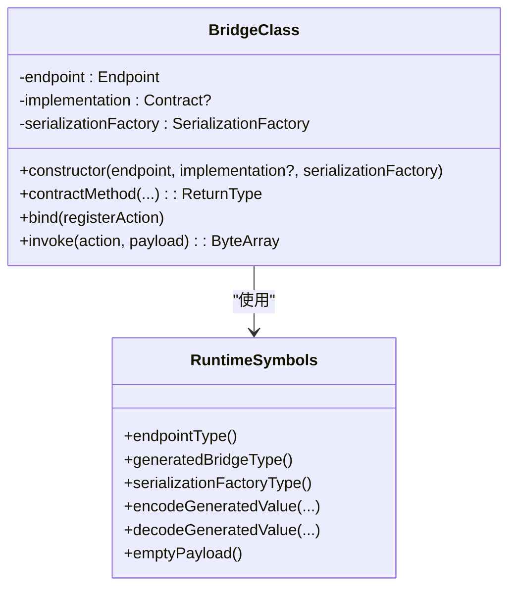
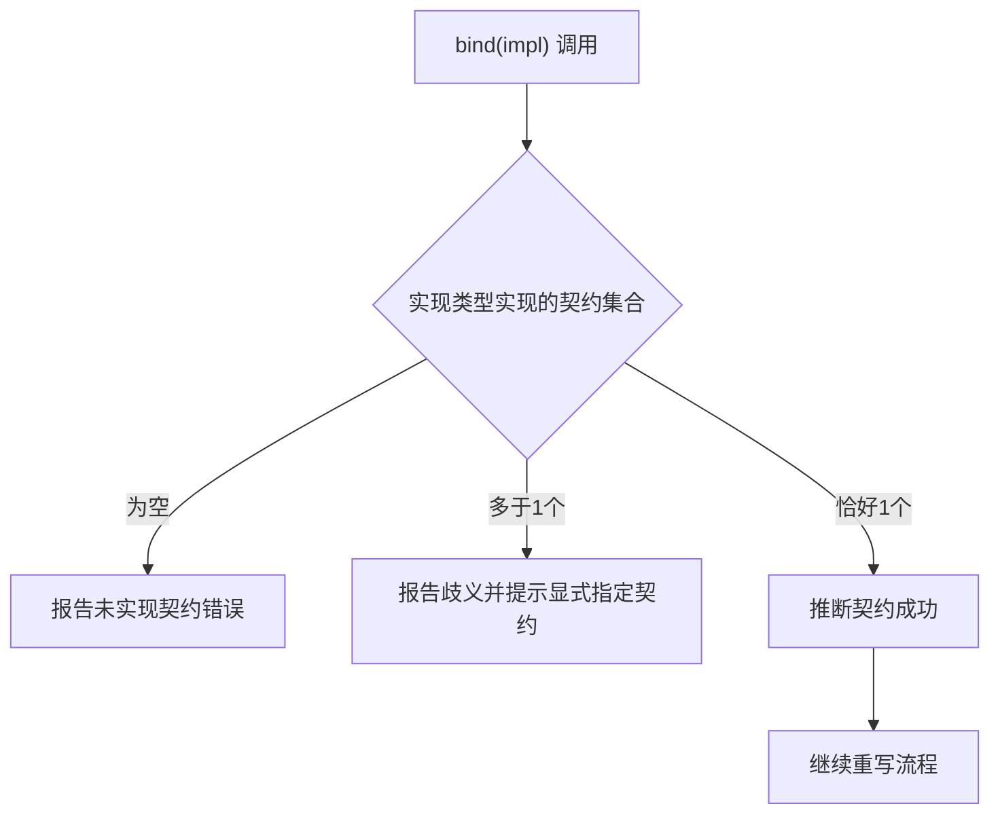
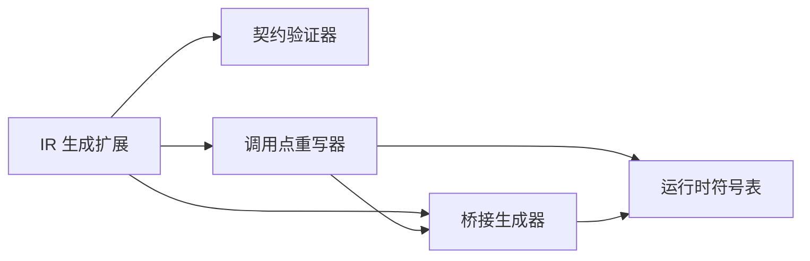

# 调用点重写

<cite>
**本文引用的文件**
- [WasmlineTypedEntryPointRewriter.kt](file://wasmline-multiplatform/wasmline-kotlin-plugin/src/main/kotlin/crow/wasmline/kotlin/WasmlineTypedEntryPointRewriter.kt)
- [WasmlineIrGenerationExtension.kt](file://wasmline-multiplatform/wasmline-kotlin-plugin/src/main/kotlin/crow/wasmline/kotlin/WasmlineIrGenerationExtension.kt)
- [WasmlineRuntimeSymbols.kt](file://wasmline-multiplatform/wasmline-kotlin-plugin/src/main/kotlin/crow/wasmline/kotlin/WasmlineRuntimeSymbols.kt)
- [WasmlineBridgeGenerator.kt](file://wasmline-multiplatform/wasmline-kotlin-plugin/src/main/kotlin/crow/wasmline/kotlin/WasmlineBridgeGenerator.kt)
- [WasmlineServiceContractValidator.kt](file://wasmline-multiplatform/wasmline-kotlin-plugin/src/main/kotlin/crow/wasmline/kotlin/WasmlineServiceContractValidator.kt)
- [linkSelectsGeneratedBridge.fir.ir.txt](file://wasmline-multiplatform/wasmline-kotlin-plugin/testData/box/linkSelectsGeneratedBridge.fir.ir.txt)
- [linkSelectsGeneratedBridge.kt](file://wasmline-multiplatform/wasmline-kotlin-plugin/testData/box/linkSelectsGeneratedBridge.kt)
- [echoProxyRoundTrip.fir.ir.txt](file://wasmline-multiplatform/wasmline-kotlin-plugin/testData/box/echoProxyRoundTrip.fir.ir.txt)
- [echoProxyRoundTrip.kt](file://wasmline-multiplatform/wasmline-kotlin-plugin/testData/box/echoProxyRoundTrip.kt)
- [bindAsSelectsRequestedContract.fir.ir.txt](file://wasmline-multiplatform/wasmline-kotlin-plugin/testData/box/bindAsSelectsRequestedContract.fir.ir.txt)
- [bindAsSelectsRequestedContract.kt](file://wasmline-multiplatform/wasmline-kotlin-plugin/testData/box/bindAsSelectsRequestedContract.kt)
- [zeroArgUnitBridgeRoundTrip.fir.ir.txt](file://wasmline-multiplatform/wasmline-kotlin-plugin/testData/box/zeroArgUnitBridgeRoundTrip.fir.ir.txt)
- [zeroArgUnitBridgeRoundTrip.kt](file://wasmline-multiplatform/wasmline-kotlin-plugin/testData/box/zeroArgUnitBridgeRoundTrip.kt)
- [ambiguousBindImplementation.fir.ir.txt](file://wasmline-multiplatform/wasmline-kotlin-plugin/testData/diagnostics/ambiguousBindImplementation.fir.ir.txt)
- [ambiguousBindImplementation.kt](file://wasmline-multiplatform/wasmline-kotlin-plugin/testData/diagnostics/ambiguousBindImplementation.kt)
</cite>

## 目录
1. [引言](#引言)
2. [项目结构](#项目结构)
3. [核心组件](#核心组件)
4. [架构总览](#架构总览)
5. [详细组件分析](#详细组件分析)
6. [依赖关系分析](#依赖关系分析)
7. [性能考量](#性能考量)
8. [故障排查指南](#故障排查指南)
9. [结论](#结论)
10. [附录](#附录)

## 引言
本文件系统性阐述 Wasmline 在 Kotlin 编译期的“调用点重写”机制：如何将原始的 link<T>()、bind(...) 等类型化入口调用，重写为对已生成桥接类的类型安全代理调用。文档覆盖以下关键主题：
- 调用点分析算法与重写策略
- 运行时符号表的作用与管理
- 类型推断与约束检查
- IR 变换前后的对比示例
- 与编译器优化阶段的交互
- 性能影响与优化建议
- 面向编译器插件开发者的实现指导与调试技巧

## 项目结构
Wasmline Kotlin 插件在 IR 阶段完成服务契约扫描、桥接类生成与调用点重写。核心文件与职责如下：
- WasmlineIrGenerationExtension：IR 管道协调者，串联验证、桥接生成与重写。
- WasmlineServiceContractValidator：扫描并校验服务契约接口，确保符合桥接规则。
- WasmlineRuntimeSymbols：集中管理运行时符号（函数、类、扩展），用于识别与匹配调用点。
- WasmlineBridgeGenerator：按契约生成具体桥接类，包含构造、转发、绑定与分发逻辑。
- WasmlineTypedEntryPointRewriter：遍历 IR，识别并重写 link()/bind() 调用为桥接实例构造与调用。

图表来源
- [WasmlineIrGenerationExtension.kt:21-48](file://wasmline-multiplatform/wasmline-kotlin-plugin/src/main/kotlin/crow/wasmline/kotlin/WasmlineIrGenerationExtension.kt#L21-L48)
- [WasmlineServiceContractValidator.kt:28-88](file://wasmline-multiplatform/wasmline-kotlin-plugin/src/main/kotlin/crow/wasmline/kotlin/WasmlineServiceContractValidator.kt#L28-L88)
- [WasmlineBridgeGenerator.kt:55-156](file://wasmline-multiplatform/wasmline-kotlin-plugin/src/main/kotlin/crow/wasmline/kotlin/WasmlineBridgeGenerator.kt#L55-L156)
- [WasmlineTypedEntryPointRewriter.kt:37-79](file://wasmline-multiplatform/wasmline-kotlin-plugin/src/main/kotlin/crow/wasmline/kotlin/WasmlineTypedEntryPointRewriter.kt#L37-L79)
- [WasmlineRuntimeSymbols.kt:26-131](file://wasmline-multiplatform/wasmline-kotlin-plugin/src/main/kotlin/crow/wasmline/kotlin/WasmlineRuntimeSymbols.kt#L26-L131)

章节来源
- [WasmlineIrGenerationExtension.kt:16-58](file://wasmline-multiplatform/wasmline-kotlin-plugin/src/main/kotlin/crow/wasmline/kotlin/WasmlineIrGenerationExtension.kt#L16-L58)

## 核心组件
- 服务契约扫描与校验
  - 扫描所有接口，筛选继承自 WasmlineService 的契约接口；对方法可见性、泛型、挂起、默认参数、可变参数等进行严格约束。
- 桥接类生成
  - 为每个有效契约生成桥接类，包含三类成员：代理转发方法、bind 注册方法、invoke 分发方法；构造函数接受 endpoint、implementation、serializationFactory。
- 运行时符号表
  - 统一解析与匹配 link()/bind()/bindGenerated 等函数及其扩展接收者、参数个数与类型，确保重写目标精确无误。
- 调用点重写
  - 遍历 IR，定位 link()/bind() 调用，解析契约类型，选择或生成桥接类，构建桥接实例并替换原调用为类型安全的桥接调用。

章节来源
- [WasmlineServiceContractValidator.kt:27-136](file://wasmline-multiplatform/wasmline-kotlin-plugin/src/main/kotlin/crow/wasmline/kotlin/WasmlineServiceContractValidator.kt#L27-L136)
- [WasmlineBridgeGenerator.kt:55-156](file://wasmline-multiplatform/wasmline-kotlin-plugin/src/main/kotlin/crow/wasmline/kotlin/WasmlineBridgeGenerator.kt#L55-L156)
- [WasmlineRuntimeSymbols.kt:26-131](file://wasmline-multiplatform/wasmline-kotlin-plugin/src/main/kotlin/crow/wasmline/kotlin/WasmlineRuntimeSymbols.kt#L26-L131)
- [WasmlineTypedEntryPointRewriter.kt:37-140](file://wasmline-multiplatform/wasmline-kotlin-plugin/src/main/kotlin/crow/wasmline/kotlin/WasmlineTypedEntryPointRewriter.kt#L37-L140)

## 架构总览
下图展示从 IR 生成到调用点重写的整体流程与组件交互：

图表来源
- [WasmlineIrGenerationExtension.kt:21-48](file://wasmline-multiplatform/wasmline-kotlin-plugin/src/main/kotlin/crow/wasmline/kotlin/WasmlineIrGenerationExtension.kt#L21-L48)
- [WasmlineTypedEntryPointRewriter.kt:37-79](file://wasmline-multiplatform/wasmline-kotlin-plugin/src/main/kotlin/crow/wasmline/kotlin/WasmlineTypedEntryPointRewriter.kt#L37-L79)
- [WasmlineRuntimeSymbols.kt:132-172](file://wasmline-multiplatform/wasmline-kotlin-plugin/src/main/kotlin/crow/wasmline/kotlin/WasmlineRuntimeSymbols.kt#L132-L172)

## 详细组件分析

### 调用点分析与重写策略
- 分析范围
  - 遍历模块内所有文件与声明，维护当前拥有者栈，以便在函数/构造体内定位调用点。
- 调用识别
  - 使用运行时符号表判断是否为 link()/bind()/bindGenerated 等目标调用，支持扩展接收者与顶层两种形态。
- 契约解析
  - 对于 link<T>() 通过类型参数提取契约；对于 bind(Contract::class, impl)/bind(impl) 通过参数与实现类型推断契约。
  - 当 bind(impl) 无法唯一确定契约时，报告歧义错误并引导显式指定契约。
- 桥接选择与生成
  - 若已存在对应桥接类则直接复用；否则按契约生成新桥接类，并缓存以避免重复生成。
- 重写实现
  - 构造桥接实例：根据调用上下文注入 endpoint、implementation、serializationFactory。
  - 将原调用替换为对桥接实例的构造与后续调用，保证类型安全与语义一致。

图表来源
- [WasmlineTypedEntryPointRewriter.kt:64-140](file://wasmline-multiplatform/wasmline-kotlin-plugin/src/main/kotlin/crow/wasmline/kotlin/WasmlineTypedEntryPointRewriter.kt#L64-L140)
- [WasmlineRuntimeSymbols.kt:132-172](file://wasmline-multiplatform/wasmline-kotlin-plugin/src/main/kotlin/crow/wasmline/kotlin/WasmlineRuntimeSymbols.kt#L132-L172)

章节来源
- [WasmlineTypedEntryPointRewriter.kt:37-197](file://wasmline-multiplatform/wasmline-kotlin-plugin/src/main/kotlin/crow/wasmline/kotlin/WasmlineTypedEntryPointRewriter.kt#L37-L197)

### 运行时符号表：作用与管理
- 作用
  - 统一解析与匹配 link()/bind()/bindGenerated 等函数与其扩展接收者、参数数量与类型，确保重写目标精确。
  - 提供桥接类名推导、endpoint/bridge/invoke 等运行时对象的符号引用。
- 管理机制
  - 在构造时一次性解析所需符号，提供 isXxxCall 系列方法进行快速判定。
  - 通过 referenceClass/referenceTopLevelFunction 等工具方法安全地从 IR 上下文中获取符号，缺失时给出明确错误提示。

图表来源
- [WasmlineRuntimeSymbols.kt:26-131](file://wasmline-multiplatform/wasmline-kotlin-plugin/src/main/kotlin/crow/wasmline/kotlin/WasmlineRuntimeSymbols.kt#L26-L131)

章节来源
- [WasmlineRuntimeSymbols.kt:26-348](file://wasmline-multiplatform/wasmline-kotlin-plugin/src/main/kotlin/crow/wasmline/kotlin/WasmlineRuntimeSymbols.kt#L26-L348)

### 桥接类生成：类型安全代理的基石
- 结构组成
  - 字段：endpoint、implementation、serializationFactory。
  - 方法：代理转发方法（按契约函数逐个生成）、bind 注册方法、invoke 分发方法。
- 生成策略
  - 依据契约接口的公开函数逐一生成桥接方法，处理空参与单参场景，分别使用空载荷或编码载荷。
  - bind 方法为每个动作注册一个 lambda 处理器，内部委托给桥接 invoke。
  - invoke 方法按动作字符串分发至对应实现调用，返回编码后的结果或空载荷。
- 类型与序列化
  - 通过运行时提供的 encode/decode 工具函数完成参数与返回值的序列化/反序列化。

图表来源
- [WasmlineBridgeGenerator.kt:55-156](file://wasmline-multiplatform/wasmline-kotlin-plugin/src/main/kotlin/crow/wasmline/kotlin/WasmlineBridgeGenerator.kt#L55-L156)
- [WasmlineRuntimeSymbols.kt:189-199](file://wasmline-multiplatform/wasmline-kotlin-plugin/src/main/kotlin/crow/wasmline/kotlin/WasmlineRuntimeSymbols.kt#L189-L199)

章节来源
- [WasmlineBridgeGenerator.kt:55-488](file://wasmline-multiplatform/wasmline-kotlin-plugin/src/main/kotlin/crow/wasmline/kotlin/WasmlineBridgeGenerator.kt#L55-L488)

### 类型推断与约束检查
- 类型推断
  - link<T>()：从类型参数 T 中提取契约类型。
  - bind(Contract::class, impl)/bind(impl)：前者直接从 class literal 解析契约；后者从实现类型收集所有实现的契约，若唯一则推断成功，否则报歧义。
- 约束检查
  - 契约接口必须为非泛型、非 suspend、无扩展接收者、无默认参数/可变参数；方法名不可重载；仅允许最多一个常规参数且返回类型不能是契约。
  - bind(impl) 的歧义错误会提示使用 bind(Contract::class, impl) 显式指定。

图表来源
- [WasmlineTypedEntryPointRewriter.kt:158-193](file://wasmline-multiplatform/wasmline-kotlin-plugin/src/main/kotlin/crow/wasmline/kotlin/WasmlineTypedEntryPointRewriter.kt#L158-L193)
- [WasmlineServiceContractValidator.kt:90-136](file://wasmline-multiplatform/wasmline-kotlin-plugin/src/main/kotlin/crow/wasmline/kotlin/WasmlineServiceContractValidator.kt#L90-L136)

章节来源
- [WasmlineTypedEntryPointRewriter.kt:142-197](file://wasmline-multiplatform/wasmline-kotlin-plugin/src/main/kotlin/crow/wasmline/kotlin/WasmlineTypedEntryPointRewriter.kt#L142-L197)
- [WasmlineServiceContractValidator.kt:42-136](file://wasmline-multiplatform/wasmline-kotlin-plugin/src/main/kotlin/crow/wasmline/kotlin/WasmlineServiceContractValidator.kt#L42-L136)

### IR 变换前后对比示例
以下示例来自测试数据，展示了调用点重写的关键 IR 变换效果（仅展示路径，不直接粘贴代码）：
- 示例一：link<T>() 选择生成桥接类
  - 输入：调用 link<Service>()。
  - 输出：构造桥接类实例并注入 endpoint/serializationFactory，随后以桥接方法替代原调用。
  - 参考路径：
    - [linkSelectsGeneratedBridge.kt](file://wasmline-multiplatform/wasmline-kotlin-plugin/testData/box/linkSelectsGeneratedBridge.kt)
    - [linkSelectsGeneratedBridge.fir.ir.txt](file://wasmline-multiplatform/wasmline-kotlin-plugin/testData/box/linkSelectsGeneratedBridge.fir.ir.txt)
- 示例二：bind(...) 选择请求的契约
  - 输入：调用 bind(Contract::class, impl)。
  - 输出：构造桥接实例并注入 implementation/serializationFactory，随后以桥接 bind/register 流程替代原调用。
  - 参考路径：
    - [bindAsSelectsRequestedContract.kt](file://wasmline-multiplatform/wasmline-kotlin-plugin/testData/box/bindAsSelectsRequestedContract.kt)
    - [bindAsSelectsRequestedContract.fir.ir.txt](file://wasmline-multiplatform/wasmline-kotlin-plugin/testData/box/bindAsSelectsRequestedContract.fir.ir.txt)
- 示例三：零参单位返回的桥接往返
  - 输入：调用零参返回 Unit 的服务方法。
  - 输出：使用空载荷编码/解码，桥接转发后返回空载荷。
  - 参考路径：
    - [zeroArgUnitBridgeRoundTrip.kt](file://wasmline-multiplatform/wasmline-kotlin-plugin/testData/box/zeroArgUnitBridgeRoundTrip.kt)
    - [zeroArgUnitBridgeRoundTrip.fir.ir.txt](file://wasmline-multiplatform/wasmline-kotlin-plugin/testData/box/zeroArgUnitBridgeRoundTrip.fir.ir.txt)
- 示例四：回环往返（echo）
  - 输入：调用带参的 echo 服务方法。
  - 输出：参数经序列化后传输，返回值经反序列化还原。
  - 参考路径：
    - [echoProxyRoundTrip.kt](file://wasmline-multiplatform/wasmline-kotlin-plugin/testData/box/echoProxyRoundTrip.kt)
    - [echoProxyRoundTrip.fir.ir.txt](file://wasmline-multiplatform/wasmline-kotlin-plugin/testData/box/echoProxyRoundTrip.fir.ir.txt)

章节来源
- [linkSelectsGeneratedBridge.kt](file://wasmline-multiplatform/wasmline-kotlin-plugin/testData/box/linkSelectsGeneratedBridge.kt)
- [linkSelectsGeneratedBridge.fir.ir.txt](file://wasmline-multiplatform/wasmline-kotlin-plugin/testData/box/linkSelectsGeneratedBridge.fir.ir.txt)
- [bindAsSelectsRequestedContract.kt](file://wasmline-multiplatform/wasmline-kotlin-plugin/testData/box/bindAsSelectsRequestedContract.kt)
- [bindAsSelectsRequestedContract.fir.ir.txt](file://wasmline-multiplatform/wasmline-kotlin-plugin/testData/box/bindAsSelectsRequestedContract.fir.ir.txt)
- [zeroArgUnitBridgeRoundTrip.kt](file://wasmline-multiplatform/wasmline-kotlin-plugin/testData/box/zeroArgUnitBridgeRoundTrip.kt)
- [zeroArgUnitBridgeRoundTrip.fir.ir.txt](file://wasmline-multiplatform/wasmline-kotlin-plugin/testData/box/zeroArgUnitBridgeRoundTrip.fir.ir.txt)
- [echoProxyRoundTrip.kt](file://wasmline-multiplatform/wasmline-kotlin-plugin/testData/box/echoProxyRoundTrip.kt)
- [echoProxyRoundTrip.fir.ir.txt](file://wasmline-multiplatform/wasmline-kotlin-plugin/testData/box/echoProxyRoundTrip.fir.ir.txt)

### 与编译器优化阶段的交互与协作
- 时机
  - IR 生成扩展在 IR 构建完成后执行，先完成契约扫描与桥接生成，再进行调用点重写，确保重写时桥接类已可用。
- 协作
  - 重写器依赖符号表进行精确匹配；桥接生成器负责产出桥接类；验证器保证契约满足桥接约束。
- 优化影响
  - 重写后调用变为对桥接类的直接构造与方法调用，减少运行时反射开销；序列化/反序列化由桥接方法内联完成，利于后续常量折叠与内联优化。

章节来源
- [WasmlineIrGenerationExtension.kt:21-58](file://wasmline-multiplatform/wasmline-kotlin-plugin/src/main/kotlin/crow/wasmline/kotlin/WasmlineIrGenerationExtension.kt#L21-L58)
- [WasmlineTypedEntryPointRewriter.kt:37-79](file://wasmline-multiplatform/wasmline-kotlin-plugin/src/main/kotlin/crow/wasmline/kotlin/WasmlineTypedEntryPointRewriter.kt#L37-L79)

## 依赖关系分析
- 组件耦合
  - IR 生成扩展作为编排者，依赖验证器、生成器与重写器；重写器依赖符号表与生成的桥接类；生成器依赖符号表与契约元信息。
- 外部依赖
  - 通过 IR 工厂与符号引用 API 访问 Kotlin 编译器 IR 元素，确保与编译器版本兼容。
- 循环依赖
  - 无循环依赖：验证 → 生成 → 重写，顺序清晰，数据单向流动。

图表来源
- [WasmlineIrGenerationExtension.kt:21-48](file://wasmline-multiplatform/wasmline-kotlin-plugin/src/main/kotlin/crow/wasmline/kotlin/WasmlineIrGenerationExtension.kt#L21-L48)
- [WasmlineTypedEntryPointRewriter.kt:40-41](file://wasmline-multiplatform/wasmline-kotlin-plugin/src/main/kotlin/crow/wasmline/kotlin/WasmlineTypedEntryPointRewriter.kt#L40-L41)

章节来源
- [WasmlineIrGenerationExtension.kt:21-48](file://wasmline-multiplatform/wasmline-kotlin-plugin/src/main/kotlin/crow/wasmline/kotlin/WasmlineIrGenerationExtension.kt#L21-L48)
- [WasmlineTypedEntryPointRewriter.kt:40-41](file://wasmline-multiplatform/wasmline-kotlin-plugin/src/main/kotlin/crow/wasmline/kotlin/WasmlineTypedEntryPointRewriter.kt#L40-L41)

## 性能考量
- 重写收益
  - 类型安全代理调用避免运行时反射与动态调度，降低调用开销。
  - 桥接方法内联友好，配合编译器优化可进一步消除中间对象与边界拷贝。
- 生成成本
  - 契约扫描与桥接生成在编译期一次性完成，运行时不产生额外开销。
- 序列化成本
  - 参数与返回值的编码/解码在桥接方法内完成，建议结合运行时序列化工厂的实现选择高效序列化策略。
- 内存占用
  - 每个契约生成独立桥接类，字段包含 endpoint、implementation、serializationFactory；可通过共享 serializationFactory 降低重复分配。

## 故障排查指南
- 常见诊断
  - bind(impl) 无法解析契约：当实现类型未实现任何契约或实现多个契约时触发歧义错误，需改用 bind(Contract::class, impl) 明确契约。
  - 契约不符合规范：泛型、suspend、扩展接收者、默认参数、可变参数、属性、方法重载等情况均会被拒绝。
- 定位手段
  - 查看 IR 变换前后的 fir.ir.txt 文件差异，确认重写是否发生以及桥接类是否生成。
  - 使用测试数据中的 .kt 与 .fir.ir.txt 对照，复现问题并缩小范围。
- 相关文件
  - [ambiguousBindImplementation.kt](file://wasmline-multiplatform/wasmline-kotlin-plugin/testData/diagnostics/ambiguousBindImplementation.kt)
  - [ambiguousBindImplementation.fir.ir.txt](file://wasmline-multiplatform/wasmline-kotlin-plugin/testData/diagnostics/ambiguousBindImplementation.fir.ir.txt)

章节来源
- [WasmlineTypedEntryPointRewriter.kt:162-191](file://wasmline-multiplatform/wasmline-kotlin-plugin/src/main/kotlin/crow/wasmline/kotlin/WasmlineTypedEntryPointRewriter.kt#L162-L191)
- [WasmlineServiceContractValidator.kt:53-136](file://wasmline-multiplatform/wasmline-kotlin-plugin/src/main/kotlin/crow/wasmline/kotlin/WasmlineServiceContractValidator.kt#L53-L136)

## 结论
Wasmline 的调用点重写机制通过“契约扫描 → 桥接生成 → 调用重写”的编译期流水线，将 link<T>() 与 bind(...) 等类型化入口转换为类型安全、高性能的代理调用。运行时符号表确保调用识别的准确性，类型推断与约束检查保障契约的正确性与可桥接性。IR 变换后的桥接类以最小开销提供跨端通信能力，同时为后续编译器优化留出空间。

## 附录
- 实现指导（面向插件开发者）
  - 在 IR 生成扩展中保持职责单一：只负责编排，验证、生成、重写交由专门组件完成。
  - 使用运行时符号表统一解析函数与类符号，避免硬编码字符串导致的脆弱性。
  - 在重写器中维护调用者栈，确保在正确的声明上下文中构造桥接实例。
  - 对 bind(impl) 场景提前进行契约推断与歧义检测，尽早报告诊断信息。
  - 生成桥接类时遵循“最小必要字段与方法”，避免过度设计导致的 IR 膨胀。
- 调试技巧
  - 对比 fir 与 fir.ir 文本差异，观察重写前后调用形态变化。
  - 利用测试数据中的 .kt 与 .fir.ir.txt 快速复现与回归。
  - 在符号表解析失败时，优先检查包名、类名与函数签名是否与运行时保持一致。