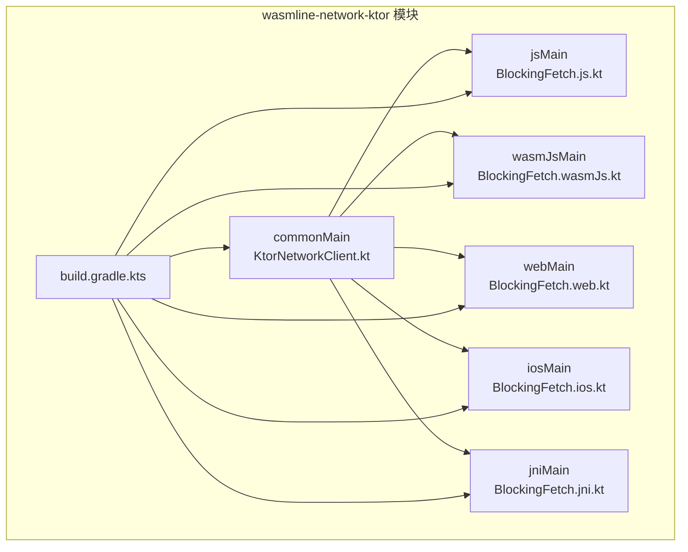
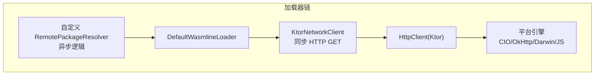
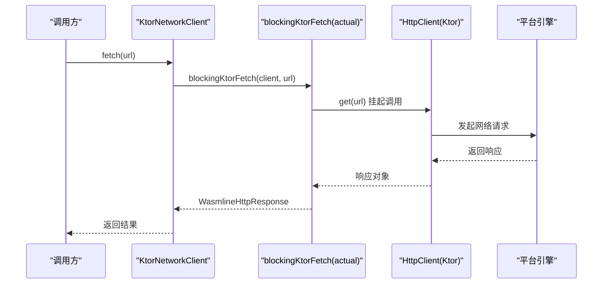
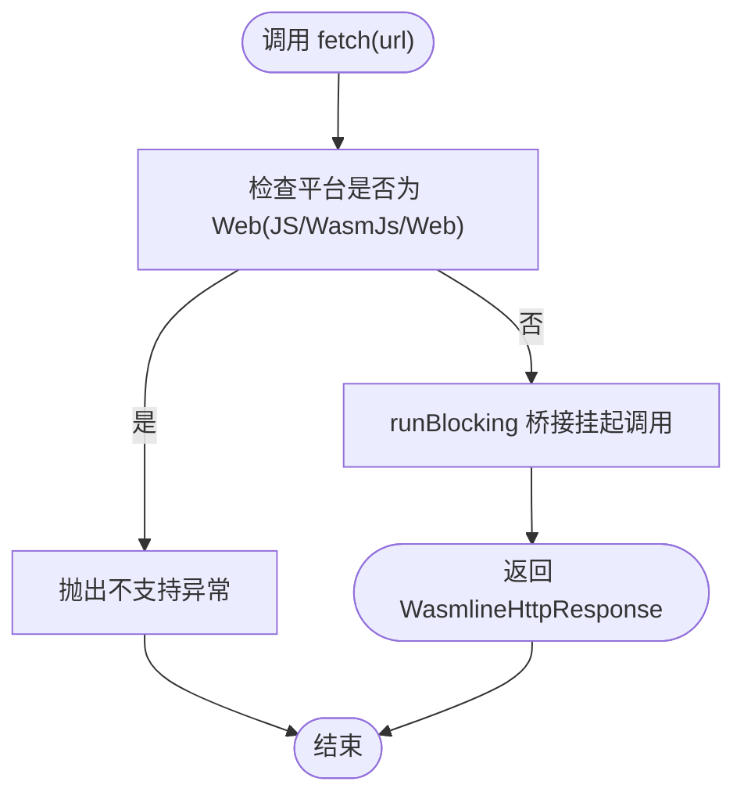
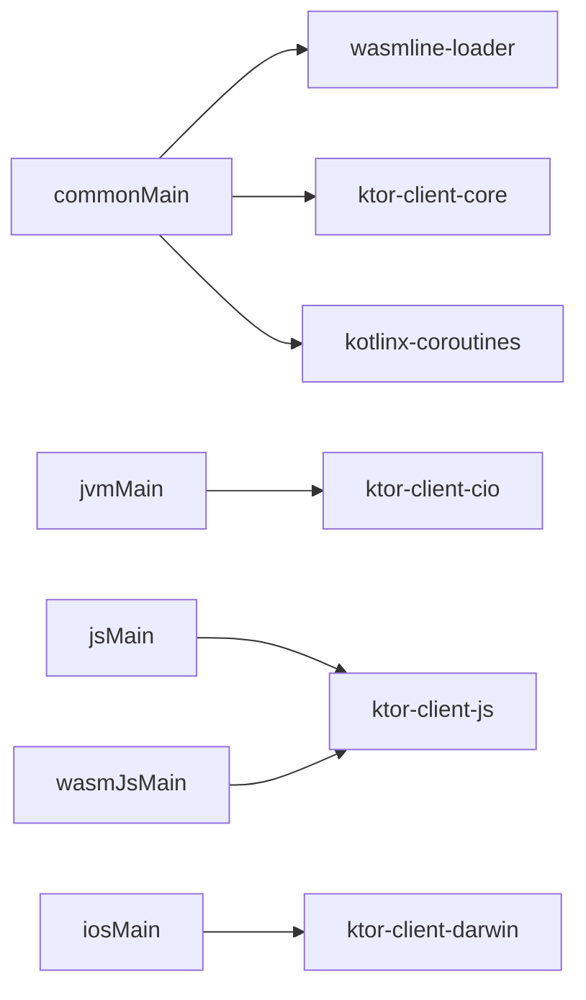

# Ktor 网络客户端

<cite>
**本文引用的文件**
- [wasmline-network-ktor/src/commonMain/kotlin/crow/wasmline/network/ktor/KtorNetworkClient.kt](file://wasmline-multiplatform/wasmline-network-ktor/src/commonMain/kotlin/crow/wasmline/network/ktor/KtorNetworkClient.kt)
- [wasmline-network-ktor/src/jsMain/kotlin/crow/wasmline/network/ktor/BlockingFetch.js.kt](file://wasmline-multiplatform/wasmline-network-ktor/src/jsMain/kotlin/crow/wasmline/network/ktor/BlockingFetch.js.kt)
- [wasmline-network-ktor/src/wasmJsMain/kotlin/crow/wasmline/network/ktor/BlockingFetch.wasmJs.kt](file://wasmline-multiplatform/wasmline-network-ktor/src/wasmJsMain/kotlin/crow/wasmline/network/ktor/BlockingFetch.wasmJs.kt)
- [wasmline-network-ktor/src/webMain/kotlin/crow/wasmline/network/ktor/BlockingFetch.web.kt](file://wasmline-multiplatform/wasmline-network-ktor/src/webMain/kotlin/crow/wasmline/network/ktor/BlockingFetch.web.kt)
- [wasmline-network-ktor/src/iosMain/kotlin/crow/wasmline/network/ktor/BlockingFetch.ios.kt](file://wasmline-multiplatform/wasmline-network-ktor/src/iosMain/kotlin/crow/wasmline/network/ktor/BlockingFetch.ios.kt)
- [wasmline-network-ktor/src/jniMain/kotlin/crow/wasmline/network/ktor/BlockingFetch.jni.kt](file://wasmline-multiplatform/wasmline-network-ktor/src/jniMain/kotlin/crow/wasmline/network/ktor/BlockingFetch.jni.kt)
- [wasmline-network-ktor/build.gradle.kts](file://wasmline-multiplatform/wasmline-network-ktor/build.gradle.kts)
- [wasmline-multiplatform/wasmline/src/commonMain/kotlin/crow/wasmline/WasmlineNetworkClient.kt](file://wasmline-multiplatform/wasmline/src/commonMain/kotlin/crow/wasmline/WasmlineNetworkClient.kt)
- [wasmline-multiplatform/wasmline/src/hostMain/kotlin/crow/wasmline/WasmlineServices.host.kt](file://wasmline-multiplatform/wasmline/src/hostMain/kotlin/crow/wasmline/WasmlineServices.host.kt)
- [wasmline-multiplatform/wasmline/src/hostMain/kotlin/crow/wasmline/WasmlineLoader.kt](file://wasmline-multiplatform/wasmline/src/hostMain/kotlin/crow/wasmline/WasmlineLoader.kt)
- [wasmline-multiplatform/wasmline/src/hostMain/kotlin/crow/wasmline/BrowserPayloadEncoding.kt](file://wasmline-multiplatform/wasmline/src/hostMain/kotlin/crow/wasmline/BrowserPayloadEncoding.kt)
- [wasmline-multiplatform/wasmline/src/webMain/kotlin/crow/wasmline/Wasmline.web.kt](file://wasmline-multiplatform/wasmline/src/webMain/kotlin/crow/wasmline/Wasmline.web.kt)
- [wasmline-multiplatform/wasmline/src/jsMain/kotlin/crow/wasmline/Wasmline.js.kt](file://wasmline-multiplatform/wasmline/src/jsMain/kotlin/crow/wasmline/Wasmline.js.kt)
- [wasmline-multiplatform/wasmline/src/wasmWasiMain/kotlin/crow/wasmline/WasmlineWasmBridge.kt](file://wasmline-multiplatform/wasmline/src/wasmWasiMain/kotlin/crow/wasmline/WasmlineWasmBridge.kt)
- [wasmline-multiplatform/wasmline/src/wasmWasiMain/kotlin/crow/wasmline/WasmlineRouter.kt](file://wasmline-multiplatform/wasmline/src/wasmWasiMain/kotlin/crow/wasmline/WasmlineRouter.kt)
- [wasmline-multiplatform/wasmline/src/wasmWasiMain/kotlin/crow/wasmline/model/WasmError.kt](file://wasmline-multiplatform/wasmline/src/wasmWasiMain/kotlin/crow/wasmline/model/WasmError.kt)
- [wasmline-multiplatform/wasmline/src/wasmWasiMain/kotlin/crow/wasmline/WasmlineServices.wasmWasi.kt](file://wasmline-multiplatform/wasmline/src/wasmWasiMain/kotlin/crow/wasmline/WasmlineServices.wasmWasi.kt)
- [wasmline-multiplatform/wasmline/src/wasmWasiMain/kotlin/crow/wasmline/Wasmline.wasmWasi.kt](file://wasmline-multiplatform/wasmline/src/wasmWasiMain/kotlin/crow/wasmline/Wasmline.wasmWasi.kt)
- [wasmline-multiplatform/wasmline/src/wasmWasiMain/kotlin/crow/wasmline/WasmMain.kt](file://wasmline-multiplatform/wasmline/src/wasmWasiMain/kotlin/crow/wasmline/WasmMain.kt)
- [wasmline-multiplatform/wasmline/src/wasmWasiMain/kotlin/crow/wasmline/WasmlineLoadState.kt](file://wasmline-multiplatform/wasmline/src/wasmWasiMain/kotlin/crow/wasmline/WasmlineLoadState.kt)
- [wasmline-multiplatform/wasmline/src/wasmWasiMain/kotlin/crow/wasmline/WasmlineLoadResult.kt](file://wasmline-multiplatform/wasmline/src/wasmWasiMain/kotlin/crow/wasmline/WasmlineLoadResult.kt)
- [wasmline-multiplatform/wasmline/src/wasmWasiMain/kotlin/crow/wasmline/Wasmline.kt](file://wasmline-multiplatform/wasmline/src/wasmWasiMain/kotlin/crow/wasmline/Wasmline.kt)
- [wasmline-multiplatform/wasmline/src/hostMain/kotlin/crow/wasmline/Wasmline.kt](file://wasmline-multiplatform/wasmline/src/hostMain/kotlin/crow/wasmline/Wasmline.kt)
- [wasmline-multiplatform/wasmline/src/hostMain/kotlin/crow/wasmline/WasmlineWarmupMode.kt](file://wasmline-multiplatform/wasmline/src/hostMain/kotlin/crow/wasmline/WasmlineWarmupMode.kt)
- [wasmline-multiplatform/wasmline/src/hostMain/kotlin/crow/wasmline/extensions/NativeLoaderExt.kt](file://wasmline-multiplatform/wasmline/src/hostMain/kotlin/crow/wasmline/extensions/NativeLoaderExt.kt)
- [wasmline-multiplatform/wasmline/src/hostMain/kotlin/crow/wasmline/extensions/LogcatExt.kt](file://wasmline-multiplatform/wasmline/src/hostMain/kotlin/crow/wasmline/extensions/LogcatExt.kt)
- [wasmline-multiplatform/wasmline/src/hostMain/kotlin/crow/wasmline/extensions/PrintExt.kt](file://wasmline-multiplatform/wasmline/src/hostMain/kotlin/crow/wasmline/extensions/PrintExt.kt)
- [wasmline-multiplatform/wasmline/src/hostMain/kotlin/crow/wasmline/internal/bridge/Endpoint.kt](file://wasmline-multiplatform/wasmline/src/hostMain/kotlin/crow/wasmline/internal/bridge/Endpoint.kt)
- [wasmline-multiplatform/wasmline/src/hostMain/kotlin/crow/wasmline/internal/bridge/HostDispatcher.kt](file://wasmline-multiplatform/wasmline/src/hostMain/kotlin/crow/wasmline/internal/bridge/HostDispatcher.kt)
- [wasmline-multiplatform/wasmline/src/hostMain/kotlin/crow/wasmline/internal/bridge/Payload.kt](file://wasmline-multiplatform/wasmline/src/hostMain/kotlin/crow/wasmline/internal/bridge/Payload.kt)
- [wasmline-multiplatform/wasmline/src/hostMain/kotlin/crow/wasmline/internal/bridge/GeneratedBridge.kt](file://wasmline-multiplatform/wasmline/src/hostMain/kotlin/crow/wasmline/internal/bridge/GeneratedBridge.kt)
- [wasmline-multiplatform/wasmline/src/hostMain/kotlin/crow/wasmline/internal/bridge/GeneratedSerialization.kt](file://wasmline-multiplatform/wasmline/src/hostMain/kotlin/crow/wasmline/internal/bridge/GeneratedSerialization.kt)
- [wasmline-multiplatform/wasmline/src/hostMain/kotlin/crow/wasmline/serialization/WasmlineSerializationConfig.kt](file://wasmline-multiplatform/wasmline/src/hostMain/kotlin/crow/wasmline/serialization/WasmlineSerializationConfig.kt)
- [wasmline-multiplatform/wasmline/src/hostMain/kotlin/crow/wasmline/serialization/WasmlineSerializationFactory.kt](file://wasmline-multiplatform/wasmline/src/hostMain/kotlin/crow/wasmline/serialization/WasmlineSerializationFactory.kt)
- [wasmline-multiplatform/wasmline/src/hostMain/kotlin/crow/wasmline/serialization/WasmlineSerializationRegistry.kt](file://wasmline-multiplatform/wasmline/src/hostMain/kotlin/crow/wasmline/serialization/WasmlineSerializationRegistry.kt)
- [wasmline-multiplatform/wasmline/src/hostMain/kotlin/crow/wasmline/WasmlineCache.kt](file://wasmline-multiplatform/wasmline/src/hostMain/kotlin/crow/wasmline/WasmlineCache.kt)
- [wasmline-multiplatform/wasmline/src/hostMain/kotlin/crow/wasmline/WasmlineConfig.kt](file://wasmline-multiplatform/wasmline/src/hostMain/kotlin/crow/wasmline/WasmlineConfig.kt)
- [wasmline-multiplatform/wasmline/src/hostMain/kotlin/crow/wasmline/WasmlineService.kt](file://wasmline-multiplatform/wasmline/src/hostMain/kotlin/crow/wasmline/WasmlineService.kt)
- [wasmline-multiplatform/wasmline/src/hostMain/kotlin/crow/wasmline/WasmlineTrustedKeys.kt](file://wasmline-multiplatform/wasmline/src/hostMain/kotlin/crow/wasmline/WasmlineTrustedKeys.kt)
- [wasmline-multiplatform/wasmline/src/hostMain/kotlin/crow/wasmline/convert/](file://wasmline-multiplatform/wasmline/src/hostMain/kotlin/crow/wasmline/convert/)
- [wasmline-multiplatform/wasmline/src/hostMain/kotlin/crow/wasmline/extensions/](file://wasmline-multiplatform/wasmline/src/hostMain/kotlin/crow/wasmline/extensions/)
- [wasmline-multiplatform/wasmline/src/hostMain/kotlin/crow/wasmline/internal/bridge/](file://wasmline-multiplatform/wasmline/src/hostMain/kotlin/crow/wasmline/internal/bridge/)
- [wasmline-multiplatform/wasmline/src/hostMain/kotlin/crow/wasmline/serialization/](file://wasmline-multiplatform/wasmline/src/hostMain/kotlin/crow/wasmline/serialization/)
- [wasmline-multiplatform/wasmline/src/hostMain/kotlin/crow/wasmline/](file://wasmline-multiplatform/wasmline/src/hostMain/kotlin/crow/wasmline/)
- [wasmline-multiplatform/wasmline/src/commonMain/kotlin/crow/wasmline/](file://wasmline-multiplatform/wasmline/src/commonMain/kotlin/crow/wasmline/)
- [wasmline-multiplatform/wasmline/src/webMain/kotlin/crow/wasmline/](file://wasmline-multiplatform/wasmline/src/webMain/kotlin/crow/wasmline/)
- [wasmline-multiplatform/wasmline/src/jsMain/kotlin/crow/wasmline/](file://wasmline-multiplatform/wasmline/src/jsMain/kotlin/crow/wasmline/)
- [wasmline-multiplatform/wasmline/src/wasmWasiMain/kotlin/crow/wasmline/](file://wasmline-multiplatform/wasmline/src/wasmWasiMain/kotlin/crow/wasmline/)
- [wasmline-multiplatform/wasmline/src/wasmJsMain/kotlin/crow/wasmline/](file://wasmline-multiplatform/wasmline/src/wasmJsMain/kotlin/crow/wasmline/)
- [wasmline-multiplatform/wasmline/src/iosMain/kotlin/crow/wasmline/](file://wasmline-multiplatform/wasmline/src/iosMain/kotlin/crow/wasmline/)
- [wasmline-multiplatform/wasmline/src/jniMain/kotlin/crow/wasmline/](file://wasmline-multiplatform/wasmline/src/jniMain/kotlin/crow/wasmline/)
- [wasmline-multiplatform/wasmline/src/androidMain/kotlin/crow/wasmline/](file://wasmline-multiplatform/wasmline/src/androidMain/kotlin/crow/wasmline/)
- [wasmline-multiplatform/wasmline/src/jvmMain/kotlin/crow/wasmline/](file://wasmline-multiplatform/wasmline/src/jvmMain/kotlin/crow/wasmline/)
- [wasmline-multiplatform/wasmline/src/native/](file://wasmline-multiplatform/wasmline/src/native/)
- [wasmline-multiplatform/wasmline/src/resources/](file://wasmline-multiplatform/wasmline/src/resources/)
- [wasmline-multiplatform/wasmline/src/](file://wasmline-multiplatform/wasmline/src/)
- [wasmline-multiplatform/wasmline-network-ktor/src/](file://wasmline-multiplatform/wasmline-network-ktor/src/)
- [wasmline-multiplatform/wasmline-network-okhttp/src/commonMain/kotlin/crow/wasmline/network/okhttp/OkHttpNetworkClient.kt](file://wasmline-multiplatform/wasmline-network-okhttp/src/commonMain/kotlin/crow/wasmline/network/okhttp/OkHttpNetworkClient.kt)
- [wasmline-multiplatform/wasmline-network-okhttp/build.gradle.kts](file://wasmline-multiplatform/wasmline-network-okhttp/build.gradle.kts)
- [wasmline-multiplatform/wasmline-loader/src/commonMain/kotlin/crow/wasmline/loader/WasmlineLoader.kt](file://wasmline-multiplatform/wasmline-loader/src/commonMain/kotlin/crow/wasmline/loader/WasmlineLoader.kt)
- [wasmline-multiplatform/wasmline-loader/src/commonMain/kotlin/crow/wasmline/loader/WasmlineLoadRequest.kt](file://wasmline-multiplatform/wasmline-loader/src/commonMain/kotlin/crow/wasmline/loader/WasmlineLoadRequest.kt)
- [wasmline-multiplatform/wasmline-loader/src/commonMain/kotlin/crow/wasmline/loader/WasmlineSource.kt](file://wasmline-multiplatform/wasmline-loader/src/commonMain/kotlin/crow/wasmline/loader/WasmlineSource.kt)
- [wasmline-multiplatform/wasmline-loader/src/commonMain/kotlin/crow/wasmline/loader/WasmlineSourceResolvers.kt](file://wasmline-multiplatform/wasmline-loader/src/commonMain/kotlin/crow/wasmline/loader/WasmlineSourceResolvers.kt)
- [wasmline-multiplatform/wasmline-loader/src/commonMain/kotlin/crow/wasmline/loader/WasmlineSourceResolution.kt](file://wasmline-multiplatform/wasmline-loader/src/commonMain/kotlin/crow/wasmline/loader/WasmlineSourceResolution.kt)
- [wasmline-multiplatform/wasmline-loader/src/commonMain/kotlin/crow/wasmline/loader/model/Manifest.kt](file://wasmline-multiplatform/wasmline-loader/src/commonMain/kotlin/crow/wasmline/loader/model/Manifest.kt)
- [wasmline-multiplatform/wasmline-loader/src/commonMain/kotlin/crow/wasmline/loader/internal/](file://wasmline-multiplatform/wasmline-loader/src/commonMain/kotlin/crow/wasmline/loader/internal/)
- [wasmline-multiplatform/wasmline-loader/src/hostMain/kotlin/crow/wasmline/loader/internal/DefaultWasmlineLoader.kt](file://wasmline-multiplatform/wasmline-loader/src/hostMain/kotlin/crow/wasmline/loader/internal/DefaultWasmlineLoader.kt)
- [wasmline-multiplatform/wasmline-loader/src/hostMain/kotlin/crow/wasmline/loader/internal/](file://wasmline-multiplatform/wasmline-loader/src/hostMain/kotlin/crow/wasmline/loader/internal/)
- [wasmline-multiplatform/wasmline-loader/src/hostMain/kotlin/crow/wasmline/loader/internal/crypto/](file://wasmline-multiplatform/wasmline-loader/src/hostMain/kotlin/crow/wasmline/loader/internal/crypto/)
- [wasmline-multiplatform/wasmline-loader/src/hostMain/kotlin/crow/wasmline/loader/internal/HostFileAccess.kt](file://wasmline-multiplatform/wasmline-loader/src/hostMain/kotlin/crow/wasmline/loader/internal/HostFileAccess.kt)
- [wasmline-multiplatform/wasmline-loader/src/hostMain/kotlin/crow/wasmline/loader/internal/WasmlineFileCache.kt](file://wasmline-multiplatform/wasmline-loader/src/hostMain/kotlin/crow/wasmline/loader/internal/WasmlineFileCache.kt)
- [wasmline-multiplatform/wasmline-loader/src/hostMain/kotlin/crow/wasmline/loader/internal/WasmlineLocalPackageResolution.kt](file://wasmline-multiplatform/wasmline-loader/src/hostMain/kotlin/crow/wasmline/loader/internal/WasmlineLocalPackageResolution.kt)
- [wasmline-multiplatform/wasmline-loader/src/hostMain/kotlin/crow/wasmline/loader/internal/WasmlineRemotePackageResolution.kt](file://wasmline-multiplatform/wasmline-loader/src/hostMain/kotlin/crow/wasmline/loader/internal/WasmlineRemotePackageResolution.kt)
- [wasmline-multiplatform/wasmline-loader/src/hostMain/kotlin/crow/wasmline/loader/internal/DefaultCacheDirectory.kt](file://wasmline-multiplatform/wasmline-loader/src/hostMain/kotlin/crow/wasmline/loader/internal/DefaultCacheDirectory.kt)
- [wasmline-multiplatform/wasmline-loader/src/hostMain/kotlin/crow/wasmline/loader/internal/WasmlineHostArtifactTarget.kt](file://wasmline-multiplatform/wasmline-loader/src/hostMain/kotlin/crow/wasmline/loader/internal/WasmlineHostArtifactTarget.kt)
- [wasmline-multiplatform/wasmline-loader/src/hostMain/kotlin/crow/wasmline/loader/internal/InternalCommon.kt](file://wasmline-multiplatform/wasmline-loader/src/hostMain/kotlin/crow/wasmline/loader/internal/InternalCommon.kt)
- [wasmline-multiplatform/wasmline-loader/src/hostMain/kotlin/crow/wasmline/loader/DefaultWasmlineLoader.kt](file://wasmline-multiplatform/wasmline-loader/src/hostMain/kotlin/crow/wasmline/loader/DefaultWasmlineLoader.kt)
- [wasmline-multiplatform/wasmline-loader/src/hostMain/kotlin/crow/wasmline/loader/](file://wasmline-multiplatform/wasmline-loader/src/hostMain/kotlin/crow/wasmline/loader/)
- [wasmline-multiplatform/wasmline-loader/src/](file://wasmline-multiplatform/wasmline-loader/src/)
- [wasmline-multiplatform/wasmline-loader/Loader.md](file://wasmline-multiplatform/wasmline-loader/Loader.md)
- [wasmline-core/src/Api.cpp](file://wasmline-core/src/Api.cpp)
- [wasmline-core/src/Engine.cpp](file://wasmline-core/src/Engine.cpp)
- [wasmline-core/src/Module.cpp](file://wasmline-core/src/Module.cpp)
- [wasmline-core/src/Session.cpp](file://wasmline-core/src/Session.cpp)
- [wasmline-core/src/Api.h](file://wasmline-core/src/Api.h)
- [wasmline-core/src/Engine.h](file://wasmline-core/src/Engine.h)
- [wasmline-core/src/Module.h](file://wasmline-core/src/Module.h)
- [wasmline-core/src/Session.h](file://wasmline-core/src/Session.h)
- [wasmline-core/src/ErrorDefs.h](file://wasmline-core/src/ErrorDefs.h)
- [wasmline-core/src/Logger.h](file://wasmline-core/src/Logger.h)
- [wasmline-core/src/OutboundHandler.h](file://wasmline-core/src/OutboundHandler.h)
- [wasmline-core/src/Consts.h](file://wasmline-core/src/Consts.h)
- [wasmline-core/src/Extensions/](file://wasmline-core/src/Extensions/)
- [wasmline-core/src/](file://wasmline-core/src/)
</cite>

## 目录
1. [简介](#简介)
2. [项目结构](#项目结构)
3. [核心组件](#核心组件)
4. [架构总览](#架构总览)
5. [详细组件分析](#详细组件分析)
6. [依赖关系分析](#依赖关系分析)
7. [性能考虑](#性能考虑)
8. [故障排除指南](#故障排除指南)
9. [结论](#结论)
10. [附录](#附录)

## 简介
本文件面向 Wasmline 的 Ktor 网络客户端集成，系统性阐述其架构设计、平台适配、同步/异步桥接策略、拦截器与连接参数配置、认证与 TLS、代理设置、并发与资源管理、性能优化与调试技巧，以及与加载器系统的集成方式与数据传输优化方案。重点覆盖多平台差异（JVM/Android/iOS 与 Web 平台），并给出可操作的使用指南与排障建议。

## 项目结构
Ktor 网络客户端位于 wasmline-multiplatform 子模块中，采用 Kotlin Multiplatform 分层组织：
- commonMain：定义跨平台接口与通用行为（如 WasmlineNetworkClient、KtorNetworkClient、expect 函数）。
- 平台源集：在 jniMain、jvmMain、jsMain、wasmJsMain、webMain、iosMain 下分别实现 expect 的具体逻辑。
- 构建脚本：build.gradle.kts 声明了各平台目标、依赖与分发框架配置。

图表来源
- [wasmline-network-ktor/src/commonMain/kotlin/crow/wasmline/network/ktor/KtorNetworkClient.kt:1-44](file://wasmline-multiplatform/wasmline-network-ktor/src/commonMain/kotlin/crow/wasmline/network/ktor/KtorNetworkClient.kt#L1-L44)
- [wasmline-network-ktor/src/jsMain/kotlin/crow/wasmline/network/ktor/BlockingFetch.js.kt:1-8](file://wasmline-multiplatform/wasmline-network-ktor/src/jsMain/kotlin/crow/wasmline/network/ktor/BlockingFetch.js.kt#L1-L8)
- [wasmline-network-ktor/src/wasmJsMain/kotlin/crow/wasmline/network/ktor/BlockingFetch.wasmJs.kt:1-8](file://wasmline-multiplatform/wasmline-network-ktor/src/wasmJsMain/kotlin/crow/wasmline/network/ktor/BlockingFetch.wasmJs.kt#L1-L8)
- [wasmline-network-ktor/src/webMain/kotlin/crow/wasmline/network/ktor/BlockingFetch.web.kt:1-12](file://wasmline-multiplatform/wasmline-network-ktor/src/webMain/kotlin/crow/wasmline/network/ktor/BlockingFetch.web.kt#L1-L12)
- [wasmline-network-ktor/src/iosMain/kotlin/crow/wasmline/network/ktor/BlockingFetch.ios.kt:1-18](file://wasmline-multiplatform/wasmline-network-ktor/src/iosMain/kotlin/crow/wasmline/network/ktor/BlockingFetch.ios.kt#L1-L18)
- [wasmline-network-ktor/src/jniMain/kotlin/crow/wasmline/network/ktor/BlockingFetch.jni.kt:1-18](file://wasmline-multiplatform/wasmline-network-ktor/src/jniMain/kotlin/crow/wasmline/network/ktor/BlockingFetch.jni.kt#L1-L18)
- [wasmline-network-ktor/build.gradle.kts:1-84](file://wasmline-multiplatform/wasmline-network-ktor/build.gradle.kts#L1-L84)

章节来源
- [wasmline-network-ktor/build.gradle.kts:17-82](file://wasmline-multiplatform/wasmline-network-ktor/build.gradle.kts#L17-L82)

## 核心组件
- WasmlineNetworkClient 接口：定义同步 HTTP GET 能力，返回 WasmlineHttpResponse。
- KtorNetworkClient 实现：封装 Ktor HttpClient，统一对外提供同步 fetch。
- 平台 expect 函数：blockingKtorFetch 在各平台以 expect/actual 形式桥接同步逻辑。
- 平台实现：
  - JVM/Android/iOS：通过 runBlocking 将挂起的 Ktor GET 转为同步。
  - Web（JS/WasmJs/Web）：抛出不支持异常，要求使用异步解析器。

章节来源
- [wasmline-multiplatform/wasmline/src/commonMain/kotlin/crow/wasmline/WasmlineNetworkClient.kt:28-42](file://wasmline-multiplatform/wasmline/src/commonMain/kotlin/crow/wasmline/WasmlineNetworkClient.kt#L28-L42)
- [wasmline-multiplatform/wasmline-network-ktor/src/commonMain/kotlin/crow/wasmline/network/ktor/KtorNetworkClient.kt:22-44](file://wasmline-multiplatform/wasmline-network-ktor/src/commonMain/kotlin/crow/wasmline/network/ktor/KtorNetworkClient.kt#L22-L44)
- [wasmline-network-ktor/src/iosMain/kotlin/crow/wasmline/network/ktor/BlockingFetch.ios.kt:9-17](file://wasmline-multiplatform/wasmline-network-ktor/src/iosMain/kotlin/crow/wasmline/network/ktor/BlockingFetch.ios.kt#L9-L17)
- [wasmline-network-ktor/src/jniMain/kotlin/crow/wasmline/network/ktor/BlockingFetch.jni.kt:9-17](file://wasmline-multiplatform/wasmline-network-ktor/src/jniMain/kotlin/crow/wasmline/network/ktor/BlockingFetch.jni.kt#L9-L17)
- [wasmline-network-ktor/src/webMain/kotlin/crow/wasmline/network/ktor/BlockingFetch.web.kt:6-11](file://wasmline-multiplatform/wasmline-network-ktor/src/webMain/kotlin/crow/wasmline/network/ktor/BlockingFetch.web.kt#L6-L11)

## 架构总览
Ktor 网络客户端作为 Wasmline 加载器链中的一个适配器，负责以同步方式执行远程包下载。在非 Web 平台，它通过 runBlocking 将 Ktor 的协程调用桥接为同步；在 Web 平台，由于浏览器限制，必须使用异步解析器替代。

图表来源
- [wasmline-multiplatform/wasmline/src/hostMain/kotlin/crow/wasmline/WasmlineLoader.kt](file://wasmline-multiplatform/wasmline/src/hostMain/kotlin/crow/wasmline/WasmlineLoader.kt)
- [wasmline-multiplatform/wasmline-network-ktor/src/commonMain/kotlin/crow/wasmline/network/ktor/KtorNetworkClient.kt:7-28](file://wasmline-multiplatform/wasmline-network-ktor/src/commonMain/kotlin/crow/wasmline/network/ktor/KtorNetworkClient.kt#L7-L28)
- [wasmline-multiplatform/wasmline-network-ktor/build.gradle.kts:44-82](file://wasmline-multiplatform/wasmline-network-ktor/build.gradle.kts#L44-L82)

## 详细组件分析

### KtorNetworkClient 类与工厂函数
- 职责：实现 WasmlineNetworkClient 接口，提供同步 fetch。
- 行为：委托给内部 expect 函数 blockingKtorFetch，该函数在各平台以 actual 实现。
- 可选注入：允许传入已配置的 HttpClient，便于注入拦截器、超时、代理等。

章节来源
- [wasmline-multiplatform/wasmline-network-ktor/src/commonMain/kotlin/crow/wasmline/network/ktor/KtorNetworkClient.kt:22-36](file://wasmline-multiplatform/wasmline-network-ktor/src/commonMain/kotlin/crow/wasmline/network/ktor/KtorNetworkClient.kt#L22-L36)

### 平台同步桥接实现

#### JVM/Android/iOS 同步实现
- 使用 runBlocking 包裹挂起的 Ktor GET 请求，将响应体读取为字节数组，构造 WasmlineHttpResponse 返回。
- 引擎选择：JVM 默认 CIO，Android 默认 OkHttp，iOS 默认 Darwin（由 Ktor 自动选择）。

图表来源
- [wasmline-network-ktor/src/jniMain/kotlin/crow/wasmline/network/ktor/BlockingFetch.jni.kt:9-17](file://wasmline-multiplatform/wasmline-network-ktor/src/jniMain/kotlin/crow/wasmline/network/ktor/BlockingFetch.jni.kt#L9-L17)
- [wasmline-network-ktor/src/iosMain/kotlin/crow/wasmline/network/ktor/BlockingFetch.ios.kt:9-17](file://wasmline-multiplatform/wasmline-network-ktor/src/iosMain/kotlin/crow/wasmline/network/ktor/BlockingFetch.ios.kt#L9-L17)

章节来源
- [wasmline-network-ktor/src/jniMain/kotlin/crow/wasmline/network/ktor/BlockingFetch.jni.kt:9-17](file://wasmline-multiplatform/wasmline-network-ktor/src/jniMain/kotlin/crow/wasmline/network/ktor/BlockingFetch.jni.kt#L9-L17)
- [wasmline-network-ktor/src/iosMain/kotlin/crow/wasmline/network/ktor/BlockingFetch.ios.kt:9-17](file://wasmline-multiplatform/wasmline-network-ktor/src/iosMain/kotlin/crow/wasmline/network/ktor/BlockingFetch.ios.kt#L9-L17)

#### Web 平台（JS/WasmJs/Web）同步实现
- 明确不支持同步 HTTP 获取，抛出 UnsupportedOperationException。
- 建议：在浏览器环境中提供自定义的 RemotePackageResolver，使用异步逻辑完成下载。

图表来源
- [wasmline-network-ktor/src/webMain/kotlin/crow/wasmline/network/ktor/BlockingFetch.web.kt:6-11](file://wasmline-multiplatform/wasmline-network-ktor/src/webMain/kotlin/crow/wasmline/network/ktor/BlockingFetch.web.kt#L6-L11)

章节来源
- [wasmline-network-ktor/src/webMain/kotlin/crow/wasmline/network/ktor/BlockingFetch.web.kt:6-11](file://wasmline-multiplatform/wasmline-network-ktor/src/webMain/kotlin/crow/wasmline/network/ktor/BlockingFetch.web.kt#L6-L11)

### 与加载器系统的集成
- 加载器链：DefaultWasmlineLoader 通过 WasmlineNetworkClient 抽象进行远程包下载。
- Web 平台：由于 fetch 不可用，需提供自定义 RemotePackageResolver，实现异步下载与解析。
- 浏览器侧编码：BrowserPayloadEncoding 提供浏览器侧的负载编码/解码能力，配合异步流程使用。

章节来源
- [wasmline-multiplatform/wasmline/src/hostMain/kotlin/crow/wasmline/WasmlineLoader.kt](file://wasmline-multiplatform/wasmline/src/hostMain/kotlin/crow/wasmline/WasmlineLoader.kt)
- [wasmline-multiplatform/wasmline/src/hostMain/kotlin/crow/wasmline/BrowserPayloadEncoding.kt](file://wasmline-multiplatform/wasmline/src/hostMain/kotlin/crow/wasmline/BrowserPayloadEncoding.kt)
- [wasmline-multiplatform/wasmline/src/webMain/kotlin/crow/wasmline/Wasmline.web.kt](file://wasmline-multiplatform/wasmline/src/webMain/kotlin/crow/wasmline/Wasmline.web.kt)
- [wasmline-multiplatform/wasmline/src/jsMain/kotlin/crow/wasmline/Wasmline.js.kt](file://wasmline-multiplatform/wasmline/src/jsMain/kotlin/crow/wasmline/Wasmline.js.kt)

### 认证机制、SSL/TLS 与代理设置
- 认证：可通过注入预配置的 HttpClient，在其中添加认证拦截器或凭据管理。
- SSL/TLS：Ktor 支持平台默认证书校验与自定义信任管理器；可在 HttpClient 中配置。
- 代理：Ktor 支持 HTTP/HTTPS 代理；可在 HttpClient 中配置代理参数。
- 注意：上述配置均通过传入自定义 HttpClient 生效，KtorNetworkClient 默认构造会创建无额外配置的 HttpClient。

章节来源
- [wasmline-multiplatform/wasmline-network-ktor/src/commonMain/kotlin/crow/wasmline/network/ktor/KtorNetworkClient.kt:22-28](file://wasmline-multiplatform/wasmline-network-ktor/src/commonMain/kotlin/crow/wasmline/network/ktor/KtorNetworkClient.kt#L22-L28)
- [wasmline-multiplatform/wasmline-network-ktor/build.gradle.kts:44-82](file://wasmline-multiplatform/wasmline-network-ktor/build.gradle.kts#L44-L82)

### 异步处理、并发控制与资源管理
- 异步桥接：非 Web 平台通过 runBlocking 将协程转为同步；Web 平台必须使用异步解析器。
- 并发：Ktor 默认连接池与并发策略由所选引擎决定（CIO/OkHttp/Darwin/JS）。可通过自定义 HttpClient 调整连接数、超时等。
- 资源管理：HttpClient 生命周期由调用方管理；建议在应用启动时初始化并在退出时释放。

章节来源
- [wasmline-multiplatform/wasmline-network-ktor/src/commonMain/kotlin/crow/wasmline/network/ktor/KtorNetworkClient.kt:7-28](file://wasmline-multiplatform/wasmline-network-ktor/src/commonMain/kotlin/crow/wasmline/network/ktor/KtorNetworkClient.kt#L7-L28)
- [wasmline-network-ktor/src/jniMain/kotlin/crow/wasmline/network/ktor/BlockingFetch.jni.kt:9-17](file://wasmline-multiplatform/wasmline-network-ktor/src/jniMain/kotlin/crow/wasmline/network/ktor/BlockingFetch.jni.kt#L9-L17)
- [wasmline-network-ktor/src/iosMain/kotlin/crow/wasmline/network/ktor/BlockingFetch.ios.kt:9-17](file://wasmline-multiplatform/wasmline-network-ktor/src/iosMain/kotlin/crow/wasmline/network/ktor/BlockingFetch.ios.kt#L9-L17)

## 依赖关系分析
- 依赖层次：
  - commonMain 依赖 wasmline-loader（API 交互）、ktor-client-core、kotlinx-coroutines。
  - jvmMain 依赖 ktor-client-cio；jsMain/wasmJsMain 依赖 ktor-client-js；iosMain 依赖 ktor-client-darwin。
- 依赖图示：

图表来源
- [wasmline-network-ktor/build.gradle.kts:44-82](file://wasmline-multiplatform/wasmline-network-ktor/build.gradle.kts#L44-L82)

章节来源
- [wasmline-network-ktor/build.gradle.kts:44-82](file://wasmline-multiplatform/wasmline-network-ktor/build.gradle.kts#L44-L82)

## 性能考虑
- 连接复用：Ktor 引擎默认启用连接池，减少握手开销。
- 超时与重试：通过自定义 HttpClient 设置 connectTimeout、socketTimeout、retry 策略。
- 压缩与传输优化：根据服务端支持开启 gzip/deflate，减少带宽占用。
- 缓存：结合加载器缓存策略，避免重复下载。
- 并发限制：合理设置最大并发连接数，避免资源争用。
- Web 平台：使用异步解析器，避免阻塞 UI 线程。

## 故障排除指南
- Web 平台报“不支持同步网络获取”：
  - 现象：调用 fetch 抛出 UnsupportedOperationException。
  - 处理：提供自定义 RemotePackageResolver，使用异步下载逻辑。
- 协议/证书问题：
  - 现象：TLS 握手失败或证书校验错误。
  - 处理：在 HttpClient 中配置信任管理器或自定义证书路径。
- 代理不可用：
  - 现象：请求超时或被拒绝。
  - 处理：检查代理地址、凭据与网络策略，确保 HttpClient 已正确配置代理。
- 并发过高导致资源耗尽：
  - 现象：连接池耗尽或内存压力增大。
  - 处理：降低并发数、增加超时时间、优化缓存命中率。

章节来源
- [wasmline-network-ktor/src/webMain/kotlin/crow/wasmline/network/ktor/BlockingFetch.web.kt:6-11](file://wasmline-multiplatform/wasmline-network-ktor/src/webMain/kotlin/crow/wasmline/network/ktor/BlockingFetch.web.kt#L6-L11)
- [wasmline-multiplatform/wasmline/src/hostMain/kotlin/crow/wasmline/BrowserPayloadEncoding.kt](file://wasmline-multiplatform/wasmline/src/hostMain/kotlin/crow/wasmline/BrowserPayloadEncoding.kt)

## 结论
Ktor 网络客户端通过 expect/actual 机制在多平台提供一致的同步 HTTP GET 能力，非 Web 平台以 runBlocking 桥接协程，Web 平台明确不支持同步并建议使用异步解析器。通过注入自定义 HttpClient，可灵活配置认证、SSL/TLS 与代理；结合加载器缓存与并发控制，可获得稳定高效的远程包加载体验。

## 附录
- 使用建议
  - 在非 Web 平台直接使用 KtorNetworkClient，默认引擎即可满足多数场景。
  - 在 Web 平台提供自定义 RemotePackageResolver，实现异步下载与解析。
  - 对于需要细粒度控制的场景，传入自定义 HttpClient，集中配置拦截器、超时、代理与 TLS。
- 相关参考
  - 加载器与服务：WasmlineLoader、WasmlineServices、BrowserPayloadEncoding。
  - 平台入口：Wasmline.web.kt、Wasmline.js.kt、WasmMain.kt、WasmlineWasmBridge.kt、WasmlineRouter.kt。
  - 错误模型：WasmError、WasmlineLoadState、WasmlineLoadResult。
  - 核心运行时：Api.cpp、Engine.cpp、Module.cpp、Session.cpp。