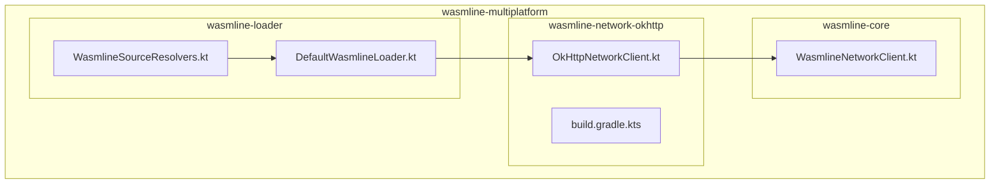
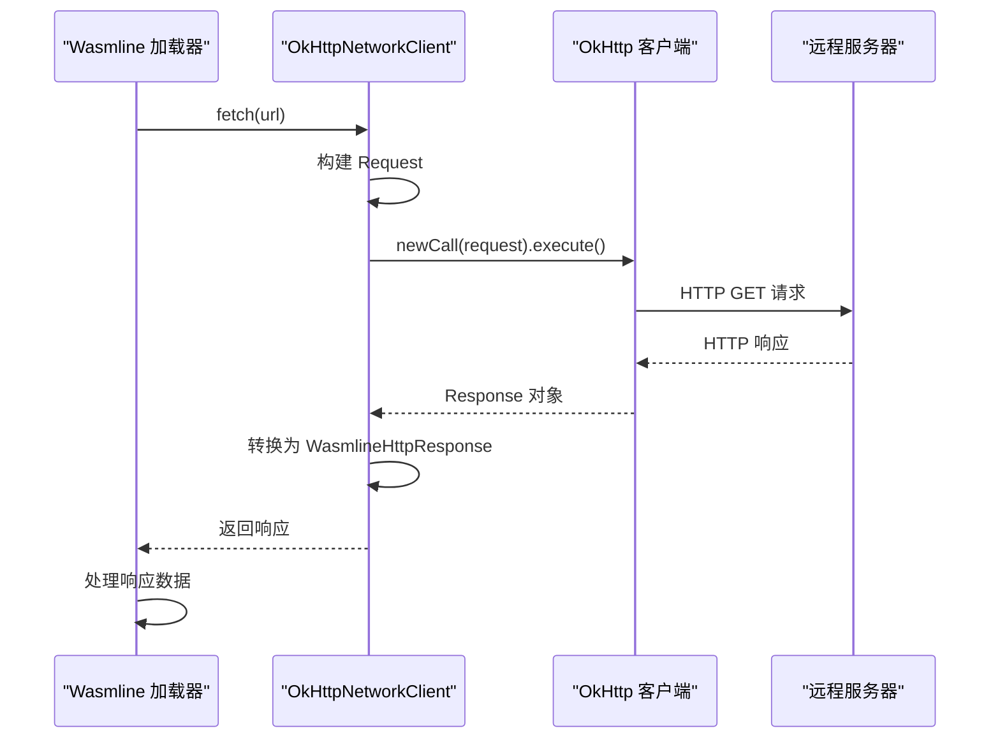
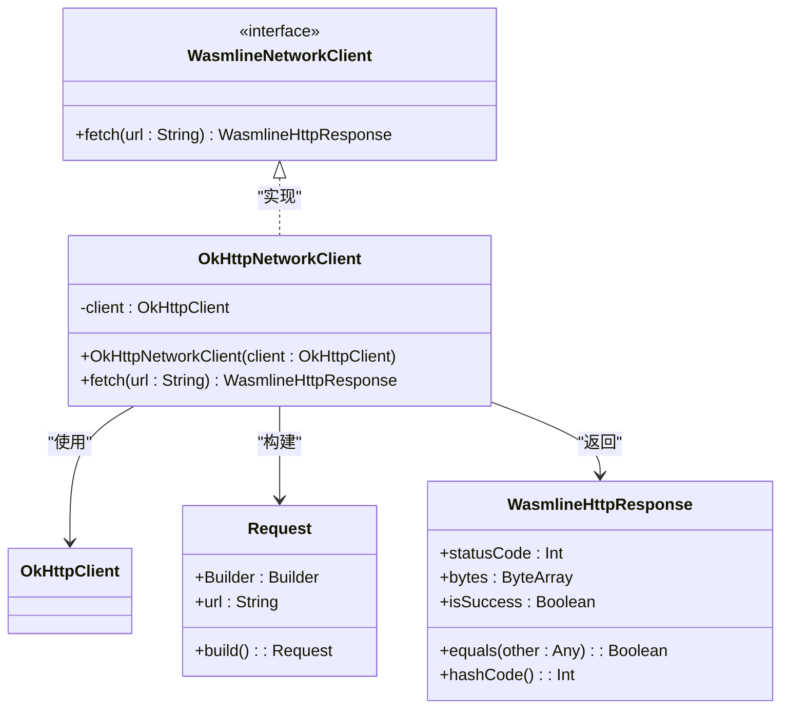
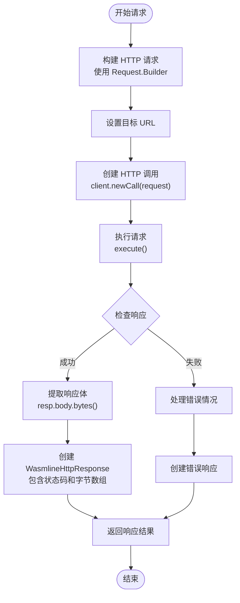
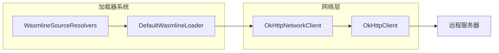
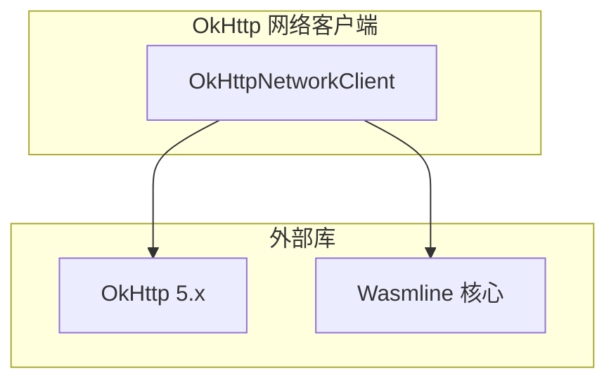

# OkHttp 网络客户端

<cite>
**本文档引用的文件**
- [OkHttpNetworkClient.kt](file://wasmline-multiplatform/wasmline-network-okhttp/src/commonMain/kotlin/crow/wasmline/network/okhttp/OkHttpNetworkClient.kt)
- [WasmlineNetworkClient.kt](file://wasmline-multiplatform/wasmline/src/commonMain/kotlin/crow/wasmline/WasmlineNetworkClient.kt)
- [KtorNetworkClient.kt](file://wasmline-multiplatform/wasmline-network-ktor/src/commonMain/kotlin/crow/wasmline/network/ktor/KtorNetworkClient.kt)
- [WasmlineLoader.kt](file://wasmline-multiplatform/wasmline-loader/src/hostMain/kotlin/crow/wasmline/loader/DefaultWasmlineLoader.kt)
- [WasmlineSourceResolvers.kt](file://wasmline-multiplatform/wasmline-loader/src/commonMain/kotlin/crow/wasmline/loader/WasmlineSourceResolvers.kt)
- [build.gradle.kts](file://wasmline-multiplatform/wasmline-network-okhttp/build.gradle.kts)
</cite>

## 目录
1. [简介](#简介)
2. [项目结构](#项目结构)
3. [核心组件](#核心组件)
4. [架构概览](#架构概览)
5. [详细组件分析](#详细组件分析)
6. [依赖关系分析](#依赖关系分析)
7. [性能考虑](#性能考虑)
8. [故障排除指南](#故障排除指南)
9. [结论](#结论)

## 简介

Wasmline 的 OkHttp 网络客户端是一个基于 OkHttp 5.x 的 HTTP 客户端实现，专门为 Wasmline 多平台框架设计。该客户端提供了简洁的接口来执行阻塞式 HTTP GET 请求，用于远程包加载和资源下载。

OkHttp 网络客户端的主要特点包括：
- 基于 OkHttp 5.x 的现代 HTTP 客户端库
- 支持 JVM 和 Android 平台的原生实现
- 提供阻塞式 API 以满足同步加载需求
- 内置连接池管理和请求拦截器支持
- 简洁的接口设计，易于集成和使用

## 项目结构

OkHttp 网络客户端位于 Wasmline 多平台项目的独立模块中，采用标准的 Kotlin Multiplatform 项目结构：



**图表来源**
- [OkHttpNetworkClient.kt:1-51](file://wasmline-multiplatform/wasmline-network-okhttp/src/commonMain/kotlin/crow/wasmline/network/okhttp/OkHttpNetworkClient.kt#L1-L51)
- [WasmlineNetworkClient.kt:1-42](file://wasmline-multiplatform/wasmline/src/commonMain/kotlin/crow/wasmline/WasmlineNetworkClient.kt#L1-L42)

**章节来源**
- [OkHttpNetworkClient.kt:1-51](file://wasmline-multiplatform/wasmline-network-okhttp/src/commonMain/kotlin/crow/wasmline/network/okhttp/OkHttpNetworkClient.kt#L1-L51)
- [build.gradle.kts](file://wasmline-multiplatform/wasmline-network-okhttp/build.gradle.kts)

## 核心组件

### OkHttpNetworkClient 类

OkHttpNetworkClient 是 Wasmline 网络客户端的核心实现，它实现了 WasmlineNetworkClient 接口并提供了基于 OkHttp 的 HTTP 请求功能。

#### 主要特性

1. **阻塞式 API 设计**: 使用 OkHttp 的阻塞 Call.execute API，确保与 Wasmline 同步加载机制兼容
2. **灵活的客户端配置**: 支持传入预配置的 OkHttpClient 实例，允许自定义连接池、超时设置和拦截器
3. **简洁的接口实现**: 提供单一的 fetch 方法来执行 HTTP GET 请求

#### 关键实现细节

- **客户端实例管理**: 通过构造函数接受可选的 OkHttpClient 参数，默认创建新的客户端实例
- **请求构建**: 使用 Request.Builder 构建 HTTP 请求，支持完整的 URL 指定
- **响应处理**: 自动处理响应体的字节流转换和状态码提取
- **资源管理**: 使用 use 扩展函数确保响应资源的正确释放

**章节来源**
- [OkHttpNetworkClient.kt:27-43](file://wasmline-multiplatform/wasmline-network-okhttp/src/commonMain/kotlin/crow/wasmline/network/okhttp/OkHttpNetworkClient.kt#L27-L43)

### WasmlineNetworkClient 接口

WasmlineNetworkClient 是一个函数式接口，定义了网络客户端的标准行为：

#### 接口规范

- **同步阻塞**: 必须提供阻塞式的 HTTP GET 请求实现
- **统一响应格式**: 返回 WasmlineHttpResponse 对象，包含状态码和响应体字节
- **跨平台兼容**: 为不同平台提供统一的网络访问抽象

**章节来源**
- [WasmlineNetworkClient.kt:39-41](file://wasmline-multiplatform/wasmline/src/commonMain/kotlin/crow/wasmline/WasmlineNetworkClient.kt#L39-L41)

## 架构概览

OkHttp 网络客户端在整个 Wasmline 系统中的位置和交互关系如下：



**图表来源**
- [OkHttpNetworkClient.kt:31-42](file://wasmline-multiplatform/wasmline-network-okhttp/src/commonMain/kotlin/crow/wasmline/network/okhttp/OkHttpNetworkClient.kt#L31-L42)
- [WasmlineNetworkClient.kt:39-41](file://wasmline-multiplatform/wasmline/src/commonMain/kotlin/crow/wasmline/WasmlineNetworkClient.kt#L39-L41)

### 平台特定实现

#### Android 环境

在 Android 平台上，OkHttp 网络客户端直接使用 OkHttp 5.x 的原生实现，无需额外的适配层。Android 特定的配置可以通过传入预配置的 OkHttpClient 实例来实现。

#### JVM 环境

在 JVM 环境下，OkHttp 网络客户端同样使用 OkHttp 5.x 的标准实现，提供完整的连接池管理和线程安全保证。

**章节来源**
- [OkHttpNetworkClient.kt:8-26](file://wasmline-multiplatform/wasmline-network-okhttp/src/commonMain/kotlin/crow/wasmline/network/okhttp/OkHttpNetworkClient.kt#L8-L26)

## 详细组件分析

### OkHttpNetworkClient 类结构分析



**图表来源**
- [OkHttpNetworkClient.kt:27-43](file://wasmline-multiplatform/wasmline-network-okhttp/src/commonMain/kotlin/crow/wasmline/network/okhttp/OkHttpNetworkClient.kt#L27-L43)
- [WasmlineNetworkClient.kt:9-26](file://wasmline-multiplatform/wasmline/src/commonMain/kotlin/crow/wasmline/WasmlineHttpResponse.kt#L9-L26)

### 数据流处理流程



**图表来源**
- [OkHttpNetworkClient.kt:31-42](file://wasmline-multiplatform/wasmline-network-okhttp/src/commonMain/kotlin/crow/wasmline/network/okhttp/OkHttpNetworkClient.kt#L31-L42)

### 配置策略详解

#### 客户端实例管理

OkHttpNetworkClient 支持两种客户端实例管理模式：

1. **默认实例**: 不传入参数时自动创建新的 OkHttpClient 实例
2. **自定义实例**: 传入预配置的 OkHttpClient 实例，允许完全控制客户端行为

#### 连接池优化

通过传入自定义的 OkHttpClient 实例，可以实现以下连接池优化：

- **连接保持时间**: 控制连接在连接池中的存活时间
- **最大空闲连接数**: 限制连接池中空闲连接的数量
- **连接超时设置**: 配置连接建立和读取超时时间

#### 拦截器链配置

自定义 OkHttpClient 允许添加各种类型的拦截器：

- **日志拦截器**: 记录请求和响应的详细信息
- **重试拦截器**: 实现自动重试逻辑
- **认证拦截器**: 处理身份验证和授权
- **缓存拦截器**: 实现 HTTP 缓存策略

**章节来源**
- [OkHttpNetworkClient.kt:24-28](file://wasmline-multiplatform/wasmline-network-okhttp/src/commonMain/kotlin/crow/wasmline/network/okhttp/OkHttpNetworkClient.kt#L24-L28)

### 与加载器系统的协作机制

OkHttp 网络客户端与 Wasmline 加载器系统的集成方式：



**图表来源**
- [WasmlineSourceResolvers.kt](file://wasmline-multiplatform/wasmline-loader/src/commonMain/kotlin/crow/wasmline/loader/WasmlineSourceResolvers.kt)
- [DefaultWasmlineLoader.kt](file://wasmline-multiplatform/wasmline-loader/src/hostMain/kotlin/crow/wasmline/loader/DefaultWasmlineLoader.kt)

**章节来源**
- [WasmlineSourceResolvers.kt](file://wasmline-multiplatform/wasmline-loader/src/commonMain/kotlin/crow/wasmline/loader/WasmlineSourceResolvers.kt)
- [DefaultWasmlineLoader.kt](file://wasmline-multiplatform/wasmline-loader/src/hostMain/kotlin/crow/wasmline/loader/DefaultWasmlineLoader.kt)

## 依赖关系分析

### 外部依赖

OkHttp 网络客户端的外部依赖关系：



**图表来源**
- [OkHttpNetworkClient.kt:3-7](file://wasmline-multiplatform/wasmline-network-okhttp/src/commonMain/kotlin/crow/wasmline/network/okhttp/OkHttpNetworkClient.kt#L3-L7)

### 内部依赖关系

```mermaid
graph TD
OKHTTP_CLIENT[OkHttpNetworkClient] --> HTTP_RESPONSE[WasmlineHttpResponse]
OKHTTP_CLIENT --> NETWORK_INTERFACE[WasmlineNetworkClient]
OKHTTP_CLIENT --> OKHTTP_CALL[OkHttp Call]
OKHTTP_CLIENT --> REQUEST_BUILDER[Request.Builder]
HTTP_RESPONSE --> STATUS_CODE[状态码]
HTTP_RESPONSE --> BYTE_ARRAY[字节数组]
OKHTTP_CALL --> EXECUTE[execute()]
REQUEST_BUILDER --> BUILD[build()]
```

**图表来源**
- [OkHttpNetworkClient.kt:31-42](file://wasmline-multiplatform/wasmline-network-okhttp/src/commonMain/kotlin/crow/wasmline/network/okhttp/OkHttpNetworkClient.kt#L31-L42)
- [WasmlineNetworkClient.kt:9-26](file://wasmline-multiplatform/wasmline/src/commonMain/kotlin/crow/wasmline/WasmlineHttpResponse.kt#L9-L26)

**章节来源**
- [build.gradle.kts](file://wasmline-multiplatform/wasmline-network-okhttp/build.gradle.kts)

## 性能考虑

### 连接池优化

OkHttp 的连接池是影响性能的关键因素：

1. **连接复用**: 通过连接池复用 TCP 连接，减少连接建立开销
2. **空闲连接管理**: 合理设置空闲连接的最大数量和存活时间
3. **并发连接控制**: 根据应用需求调整并发连接数

### 缓存机制

虽然当前实现没有内置缓存，但可以通过以下方式实现缓存：

1. **HTTP 缓存头**: 利用 OkHttp 的 HTTP 缓存支持
2. **自定义拦截器**: 实现应用级缓存逻辑
3. **响应时间优化**: 通过合理的缓存策略提升响应速度

### 超时处理

合理的超时配置对于用户体验至关重要：

1. **连接超时**: 控制连接建立的最大等待时间
2. **读取超时**: 设置响应数据读取的超时时间
3. **写入超时**: 配置请求数据发送的超时时间

### 线程安全性

OkHttp 客户端是线程安全的，可以在多线程环境中安全使用：

- **并发请求**: 支持多个线程同时发起 HTTP 请求
- **连接池管理**: 内置的连接池自动处理并发访问
- **资源管理**: 自动管理网络资源的生命周期

## 故障排除指南

### 常见问题及解决方案

#### 连接超时问题

**症状**: 请求长时间无响应或抛出超时异常

**解决方案**:
1. 检查网络连接状态
2. 调整超时配置参数
3. 验证目标服务器的可用性

#### SSL 证书验证失败

**症状**: HTTPS 请求时出现证书验证错误

**解决方案**:
1. 检查服务器证书的有效性
2. 验证主机名匹配
3. 考虑使用自定义 SSL Socket 工厂（谨慎使用）

#### 内存泄漏问题

**症状**: 应用内存使用持续增长

**解决方案**:
1. 确保正确关闭响应资源
2. 检查是否正确使用了 use 扩展函数
3. 验证客户端实例的生命周期管理

### 监控和调试

#### 性能监控指标

1. **请求响应时间**: 监控平均响应时间和 P95/P99 延迟
2. **连接池利用率**: 跟踪连接池的使用情况
3. **错误率统计**: 统计各类错误的发生频率
4. **吞吐量指标**: 测量每秒处理的请求数量

#### 调试技巧

1. **启用 OkHttp 日志**: 使用 HttpLoggingInterceptor 记录详细的请求信息
2. **网络抓包分析**: 使用工具如 Charles 或 Wireshark 分析网络流量
3. **性能分析**: 使用 Android Profiler 或 JVM 分析工具识别性能瓶颈

**章节来源**
- [OkHttpNetworkClient.kt:11-12](file://wasmline-multiplatform/wasmline-network-okhttp/src/commonMain/kotlin/crow/wasmline/network/okhttp/OkHttpNetworkClient.kt#L11-L12)

## 结论

Wasmline 的 OkHttp 网络客户端提供了一个简洁、高效且线程安全的 HTTP 客户端实现。其主要优势包括：

1. **简单易用**: 提供最小化的 API 设计，易于集成和使用
2. **性能优秀**: 基于成熟的 OkHttp 库，具备优秀的性能表现
3. **平台兼容**: 支持 JVM 和 Android 平台的原生实现
4. **可扩展性强**: 通过自定义 OkHttpClient 实例支持各种配置需求

对于开发者而言，OkHttp 网络客户端的最佳实践包括：

- 合理配置连接池参数以优化性能
- 使用适当的超时设置确保良好的用户体验
- 通过拦截器实现必要的功能增强
- 建立完善的监控和调试机制
- 注意资源管理和内存使用优化

通过遵循这些指导原则，开发者可以充分利用 OkHttp 网络客户端的优势，构建高性能的 Wasmline 应用程序。