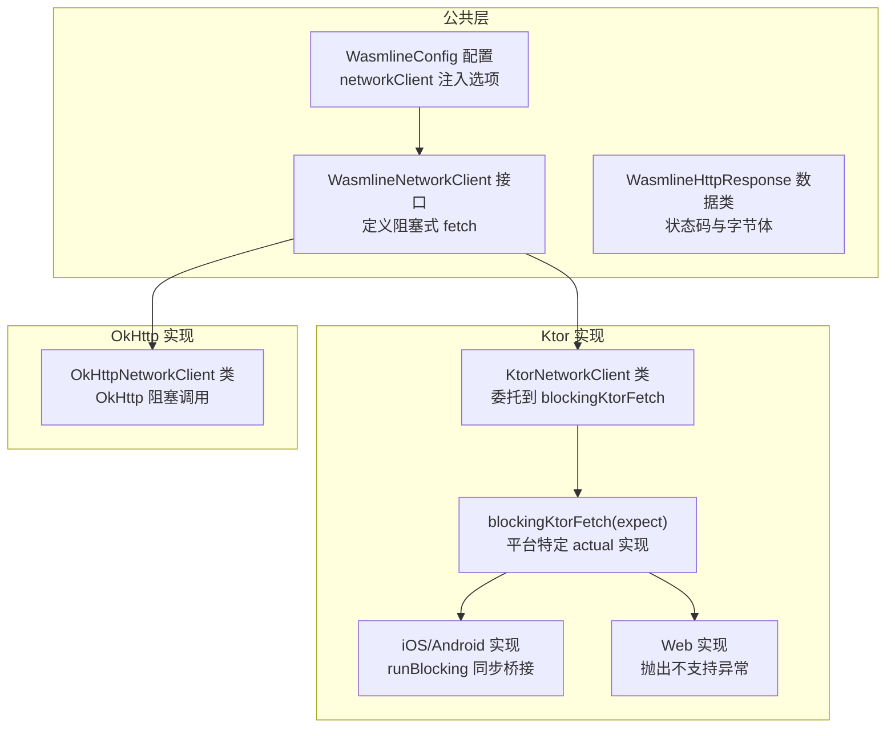
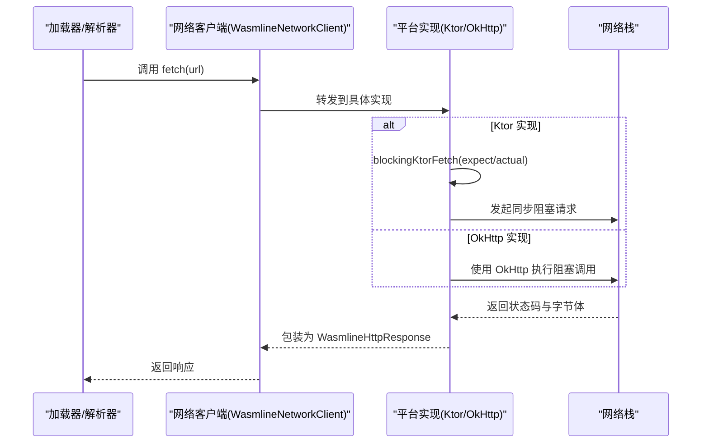
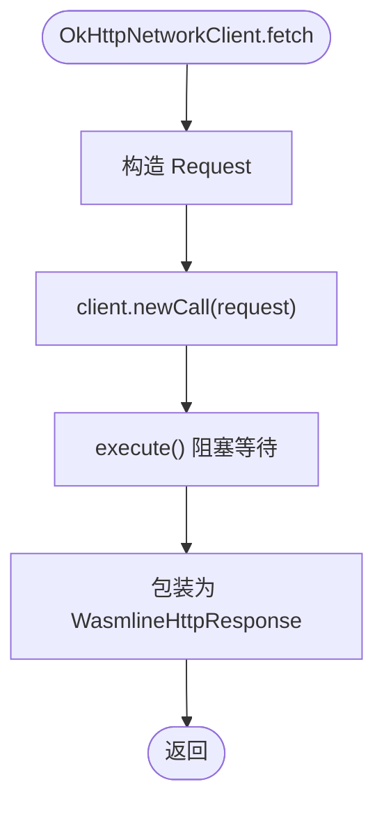
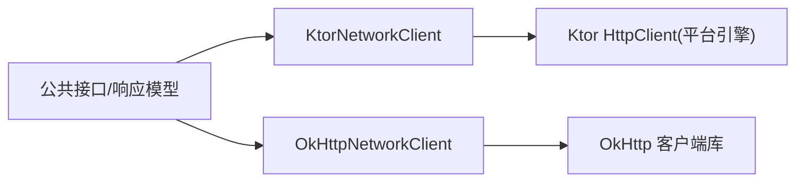

# 平台特定实现

<cite>
**本文引用的文件**
- [WasmlineNetworkClient.kt](file://wasmline-multiplatform/wasmline/src/commonMain/kotlin/crow/wasmline/WasmlineNetworkClient.kt)
- [KtorNetworkClient.kt](file://wasmline-multiplatform/wasmline-network-ktor/src/commonMain/kotlin/crow/wasmline/network/ktor/KtorNetworkClient.kt)
- [OkHttpNetworkClient.kt](file://wasmline-multiplatform/wasmline-network-okhttp/src/commonMain/kotlin/crow/wasmline/network/okhttp/OkHttpNetworkClient.kt)
- [BlockingFetch.ios.kt](file://wasmline-multiplatform/wasmline-network-ktor/src/iosMain/kotlin/crow/wasmline/network/ktor/BlockingFetch.ios.kt)
- [BlockingFetch.jni.kt](file://wasmline-multiplatform/wasmline-network-ktor/src/jniMain/kotlin/crow/wasmline/network/ktor/BlockingFetch.jni.kt)
- [BlockingFetch.js.kt](file://wasmline-multiplatform/wasmline-network-ktor/src/jsMain/kotlin/crow/wasmline/network/ktor/BlockingFetch.js.kt)
- [BlockingFetch.wasmJs.kt](file://wasmline-multiplatform/wasmline-network-ktor/src/wasmJsMain/kotlin/crow/wasmline/network/ktor/BlockingFetch.wasmJs.kt)
- [BlockingFetch.web.kt](file://wasmline-multiplatform/wasmline-network-ktor/src/webMain/kotlin/crow/wasmline/network/ktor/BlockingFetch.web.kt)
- [WasmlineConfig.kt](file://wasmline-multiplatform/wasmline/src/commonMain/kotlin/crow/wasmline/WasmlineConfig.kt)
- [Wasmline.kt](file://wasmline-multiplatform/wasmline/src/hostMain/kotlin/crow/wasmline/Wasmline.kt)
</cite>

## 目录
1. [引言](#引言)
2. [项目结构](#项目结构)
3. [核心组件](#核心组件)
4. [架构总览](#架构总览)
5. [详细组件分析](#详细组件分析)
6. [依赖关系分析](#依赖关系分析)
7. [性能考量](#性能考量)
8. [故障排查指南](#故障排查指南)
9. [结论](#结论)
10. [附录](#附录)

## 引言
本文件聚焦 Wasmline 网络客户端在多平台下的具体实现与差异，覆盖以下场景：
- 浏览器环境：Ktor 的同步桥接限制与替代方案
- 移动平台（iOS/Android）：基于 Ktor 的阻塞桥接与 OkHttp 的直接阻塞调用
- 服务器端（JVM/桌面）：OkHttp 的线程安全阻塞调用
- 跨平台一致性：统一的阻塞式接口设计与平台特定桥接策略
- 错误处理、日志与调试：平台特定异常与日志输出路径
- 适配与扩展：如何选择与自定义网络客户端实现

## 项目结构
围绕网络客户端的关键模块分布如下：
- 抽象与数据模型：位于 commonMain，定义统一的网络接口与响应模型
- Ktor 实现：commonMain 提供跨平台抽象，各平台通过 expect/actual 桥接到阻塞式实现
- OkHttp 实现：commonMain 提供跨平台抽象，直接使用 OkHttp 的阻塞 API
- 配置入口：统一配置对象包含网络客户端注入点



图表来源
- [WasmlineNetworkClient.kt:39-41](file://wasmline-multiplatform/wasmline/src/commonMain/kotlin/crow/wasmline/WasmlineNetworkClient.kt#L39-L41)
- [KtorNetworkClient.kt:22-29](file://wasmline-multiplatform/wasmline-network-ktor/src/commonMain/kotlin/crow/wasmline/network/ktor/KtorNetworkClient.kt#L22-L29)
- [OkHttpNetworkClient.kt:27-43](file://wasmline-multiplatform/wasmline-network-okhttp/src/commonMain/kotlin/crow/wasmline/network/okhttp/OkHttpNetworkClient.kt#L27-L43)
- [BlockingFetch.ios.kt:9-17](file://wasmline-multiplatform/wasmline-network-ktor/src/iosMain/kotlin/crow/wasmline/network/ktor/BlockingFetch.ios.kt#L9-L17)
- [BlockingFetch.web.kt:6-11](file://wasmline-multiplatform/wasmline-network-ktor/src/webMain/kotlin/crow/wasmline/network/ktor/BlockingFetch.web.kt#L6-L11)

章节来源
- [WasmlineNetworkClient.kt:1-42](file://wasmline-multiplatform/wasmline/src/commonMain/kotlin/crow/wasmline/WasmlineNetworkClient.kt#L1-L42)
- [KtorNetworkClient.kt:1-44](file://wasmline-multiplatform/wasmline-network-ktor/src/commonMain/kotlin/crow/wasmline/network/ktor/KtorNetworkClient.kt#L1-L44)
- [OkHttpNetworkClient.kt:1-51](file://wasmline-multiplatform/wasmline-network-okhttp/src/commonMain/kotlin/crow/wasmline/network/okhttp/OkHttpNetworkClient.kt#L1-L51)
- [WasmlineConfig.kt:1-25](file://wasmline-multiplatform/wasmline/src/commonMain/kotlin/crow/wasmline/WasmlineConfig.kt#L1-L25)

## 核心组件
- 统一网络接口：定义阻塞式 HTTP GET，返回状态码与原始字节体，确保加载器解析链保持同步语义
- 响应模型：包含成功判定逻辑与等值/哈希实现，便于缓存与比较
- Ktor 客户端：自动按平台选择引擎（JVM/Android/iOS），并提供 expect/actual 的阻塞桥接
- OkHttp 客户端：直接使用 OkHttp 的阻塞执行 API，线程安全，适合多线程环境
- 配置注入：通过配置对象注入网络客户端实例，支持可选与默认行为

章节来源
- [WasmlineNetworkClient.kt:28-41](file://wasmline-multiplatform/wasmline/src/commonMain/kotlin/crow/wasmline/WasmlineNetworkClient.kt#L28-L41)
- [KtorNetworkClient.kt:7-36](file://wasmline-multiplatform/wasmline-network-ktor/src/commonMain/kotlin/crow/wasmline/network/ktor/KtorNetworkClient.kt#L7-L36)
- [OkHttpNetworkClient.kt:8-43](file://wasmline-multiplatform/wasmline-network-okhttp/src/commonMain/kotlin/crow/wasmline/network/okhttp/OkHttpNetworkClient.kt#L8-L43)
- [WasmlineConfig.kt:18-24](file://wasmline-multiplatform/wasmline/src/commonMain/kotlin/crow/wasmline/WasmlineConfig.kt#L18-L24)

## 架构总览
下图展示跨平台网络客户端的总体交互：公共接口与响应模型在所有平台共享；Ktor 通过 expect/actual 在各平台桥接为阻塞式；OkHttp 在 JVM/Android 等平台直接阻塞调用。



图表来源
- [WasmlineNetworkClient.kt:39-41](file://wasmline-multiplatform/wasmline/src/commonMain/kotlin/crow/wasmline/WasmlineNetworkClient.kt#L39-L41)
- [KtorNetworkClient.kt:26-28](file://wasmline-multiplatform/wasmline-network-ktor/src/commonMain/kotlin/crow/wasmline/network/ktor/KtorNetworkClient.kt#L26-L28)
- [OkHttpNetworkClient.kt:31-42](file://wasmline-multiplatform/wasmline-network-okhttp/src/commonMain/kotlin/crow/wasmline/network/okhttp/OkHttpNetworkClient.kt#L31-L42)

## 详细组件分析

### 组件 A：Ktor 网络客户端（跨平台）
- 设计要点
  - 自动平台引擎选择：JVM 使用 CIO，Android 使用 OkHttp，iOS 使用 Darwin
  - Web 不支持同步：在 JS/WasmJs 平台抛出不支持异常，需由上层提供异步解析器
  - 阻塞桥接：通过 expect/actual 将挂起的 Ktor 请求桥接为阻塞式
- 平台差异
  - iOS/Android/JNI：使用协程 runBlocking 将挂起调用转为阻塞
  - Web（JS/WasmJs）：委托到浏览器专用函数，直接抛出不支持异常
  - JVM：Ktor 自身会根据平台选择引擎，无需额外桥接
- 关键流程

```mermaid
flowchart TD
Start(["进入 blockingKtorFetch"]) --> CheckPlatform{"平台类型？"}
CheckPlatform --> |iOS/Android/JNI| RunBlocking["使用 runBlocking 包裹挂起请求"]
CheckPlatform --> |Web(JS/WasmJs)| ThrowErr["抛出不支持异常"]
CheckPlatform --> |JVM| UseEngine["Ktor 选择引擎并发起请求"]
RunBlocking --> BuildResp["构建 WasmlineHttpResponse"]
UseEngine --> BuildResp
ThrowErr --> End(["结束"])
BuildResp --> End
```

图表来源
- [KtorNetworkClient.kt:43](file://wasmline-multiplatform/wasmline-network-ktor/src/commonMain/kotlin/crow/wasmline/network/ktor/KtorNetworkClient.kt#L43)
- [BlockingFetch.ios.kt:9-17](file://wasmline-multiplatform/wasmline-network-ktor/src/iosMain/kotlin/crow/wasmline/network/ktor/BlockingFetch.ios.kt#L9-L17)
- [BlockingFetch.jni.kt:9-17](file://wasmline-multiplatform/wasmline-network-ktor/src/jniMain/kotlin/crow/wasmline/network/ktor/BlockingFetch.jni.kt#L9-L17)
- [BlockingFetch.js.kt:6-7](file://wasmline-multiplatform/wasmline-network-ktor/src/jsMain/kotlin/crow/wasmline/network/ktor/BlockingFetch.js.kt#L6-L7)
- [BlockingFetch.wasmJs.kt:6-7](file://wasmline-multiplatform/wasmline-network-ktor/src/wasmJsMain/kotlin/crow/wasmline/network/ktor/BlockingFetch.wasmJs.kt#L6-L7)
- [BlockingFetch.web.kt:6-11](file://wasmline-multiplatform/wasmline-network-ktor/src/webMain/kotlin/crow/wasmline/network/ktor/BlockingFetch.web.kt#L6-L11)

章节来源
- [KtorNetworkClient.kt:7-36](file://wasmline-multiplatform/wasmline-network-ktor/src/commonMain/kotlin/crow/wasmline/network/ktor/KtorNetworkClient.kt#L7-L36)
- [BlockingFetch.ios.kt:1-18](file://wasmline-multiplatform/wasmline-network-ktor/src/iosMain/kotlin/crow/wasmline/network/ktor/BlockingFetch.ios.kt#L1-L18)
- [BlockingFetch.jni.kt:1-18](file://wasmline-multiplatform/wasmline-network-ktor/src/jniMain/kotlin/crow/wasmline/network/ktor/BlockingFetch.jni.kt#L1-L18)
- [BlockingFetch.js.kt:1-8](file://wasmline-multiplatform/wasmline-network-ktor/src/jsMain/kotlin/crow/wasmline/network/ktor/BlockingFetch.js.kt#L1-L8)
- [BlockingFetch.wasmJs.kt:1-8](file://wasmline-multiplatform/wasmline-network-ktor/src/wasmJsMain/kotlin/crow/wasmline/network/ktor/BlockingFetch.wasmJs.kt#L1-L8)
- [BlockingFetch.web.kt:1-12](file://wasmline-multiplatform/wasmline-network-ktor/src/webMain/kotlin/crow/wasmline/network/ktor/BlockingFetch.web.kt#L1-L12)

### 组件 B：OkHttp 网络客户端（JVM/Android）
- 设计要点
  - 直接使用 OkHttp 的阻塞执行 API，线程安全，可在后台线程调用
  - 支持连接池、超时、拦截器等 OkHttp 能力
  - 返回统一的响应模型
- 关键流程



图表来源
- [OkHttpNetworkClient.kt:31-42](file://wasmline-multiplatform/wasmline-network-okhttp/src/commonMain/kotlin/crow/wasmline/network/okhttp/OkHttpNetworkClient.kt#L31-L42)

章节来源
- [OkHttpNetworkClient.kt:8-51](file://wasmline-multiplatform/wasmline-network-okhttp/src/commonMain/kotlin/crow/wasmline/network/okhttp/OkHttpNetworkClient.kt#L8-L51)

### 组件 C：响应模型与配置
- 响应模型
  - 包含状态码与字节体，并提供成功判定属性
  - 等值与哈希基于字段计算，便于缓存与比较
- 配置注入
  - 可选的网络客户端实例，未设置则无法进行远程加载
  - 支持序列化配置、并发支持、信任密钥与缓存

章节来源
- [WasmlineNetworkClient.kt:9-26](file://wasmline-multiplatform/wasmline/src/commonMain/kotlin/crow/wasmline/WasmlineNetworkClient.kt#L9-L26)
- [WasmlineConfig.kt:18-24](file://wasmline-multiplatform/wasmline/src/commonMain/kotlin/crow/wasmline/WasmlineConfig.kt#L18-L24)

## 依赖关系分析
- Ktor 客户端依赖 Ktor HttpClient，平台引擎由 Ktor 自动选择
- OkHttp 客户端依赖 OkHttp 客户端库，直接使用阻塞 API
- 共同依赖：统一的网络接口与响应模型，确保上层加载器解析链保持同步



图表来源
- [KtorNetworkClient.kt:5](file://wasmline-multiplatform/wasmline-network-ktor/src/commonMain/kotlin/crow/wasmline/network/ktor/KtorNetworkClient.kt#L5)
- [OkHttpNetworkClient.kt:5](file://wasmline-multiplatform/wasmline-network-okhttp/src/commonMain/kotlin/crow/wasmline/network/okhttp/OkHttpNetworkClient.kt#L5)

章节来源
- [KtorNetworkClient.kt:1-44](file://wasmline-multiplatform/wasmline-network-ktor/src/commonMain/kotlin/crow/wasmline/network/ktor/KtorNetworkClient.kt#L1-L44)
- [OkHttpNetworkClient.kt:1-51](file://wasmline-multiplatform/wasmline-network-okhttp/src/commonMain/kotlin/crow/wasmline/network/okhttp/OkHttpNetworkClient.kt#L1-L51)

## 性能考量
- OkHttp 阻塞调用
  - 优点：线程安全，适合多线程环境；连接池复用，减少握手开销
  - 注意：阻塞调用会占用线程，建议在后台线程或线程池中执行
- Ktor 阻塞桥接
  - iOS/Android/JNI：通过 runBlocking 将挂起调用桥接为阻塞，避免上层复杂化
  - Web：不支持同步，需采用异步解析器或预加载策略
- 缓存与重试
  - 结合配置中的缓存组件与 OkHttp 拦截器，可实现条件请求与重试策略
- 并发控制
  - 通过配置启用并发支持，以获得线程安全的加载路径

## 故障排查指南
- Web 平台同步请求失败
  - 现象：抛出不支持异常
  - 处理：提供自定义异步解析器，或在浏览器侧采用预加载与离线缓存策略
- iOS/Android 阻塞调用卡顿
  - 现象：主线程阻塞导致界面无响应
  - 处理：将阻塞调用移至后台线程或使用协程调度器
- JVM/桌面阻塞调用异常
  - 现象：网络异常、超时、连接失败
  - 处理：检查 OkHttp 客户端配置（超时、拦截器、代理），结合日志定位
- 响应体解析错误
  - 现象：字节体为空或格式不符
  - 处理：确认远端服务返回正确的内容类型与编码，必要时在 OkHttp 拦截器中修正

章节来源
- [BlockingFetch.web.kt:6-11](file://wasmline-multiplatform/wasmline-network-ktor/src/webMain/kotlin/crow/wasmline/network/ktor/BlockingFetch.web.kt#L6-L11)
- [OkHttpNetworkClient.kt:31-42](file://wasmline-multiplatform/wasmline-network-okhttp/src/commonMain/kotlin/crow/wasmline/network/okhttp/OkHttpNetworkClient.kt#L31-L42)

## 结论
- 统一的阻塞式网络接口确保了加载器解析链的同步性
- Ktor 通过 expect/actual 在多平台桥接为阻塞式，Web 平台明确不支持同步
- OkHttp 在 JVM/Android 提供稳定、线程安全的阻塞调用
- 通过配置注入网络客户端，可灵活选择与扩展实现
- 针对不同平台的特性与限制，采取相应的异步或阻塞策略，是实现跨平台一致性的关键

## 附录
- 适配指南
  - 服务器端/桌面：优先使用 OkHttpNetworkClient，充分利用连接池与拦截器
  - 移动端：KtorNetworkClient 自动选择引擎，如需更强可控性可定制 OkHttp
  - 浏览器：不要使用 Ktor 的同步桥接，改用异步解析器或预加载
- 扩展方法
  - 自定义网络客户端：实现 WasmlineNetworkClient 接口，封装任意底层 HTTP 库
  - 平台扩展：在对应平台源集添加 expect/actual 实现，保持阻塞式语义
- 最佳实践
  - 明确各平台能力边界，避免在不支持同步的平台使用阻塞式
  - 在移动端与服务器端合理配置超时与重试
  - 利用缓存与条件请求减少网络负载
  - 为不同平台提供一致的日志与错误上报策略