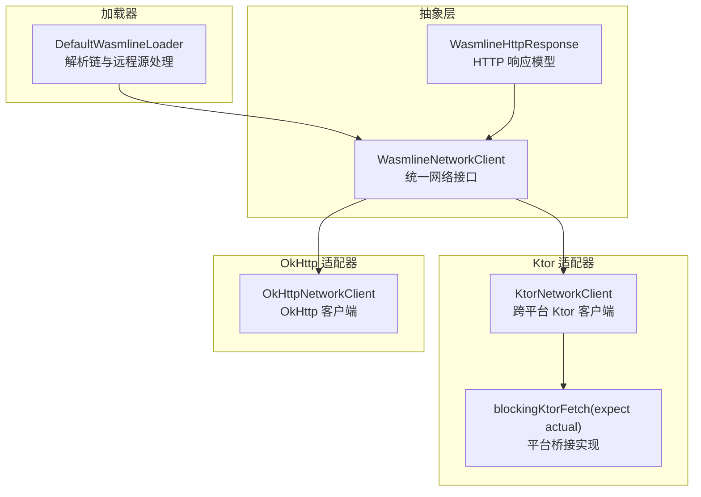
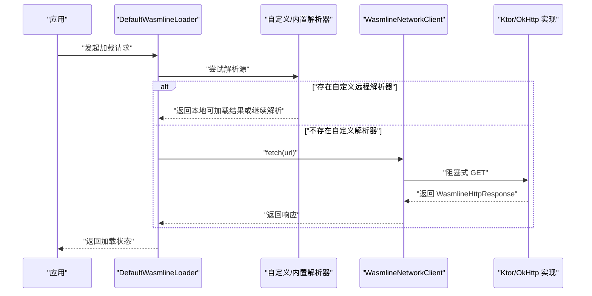
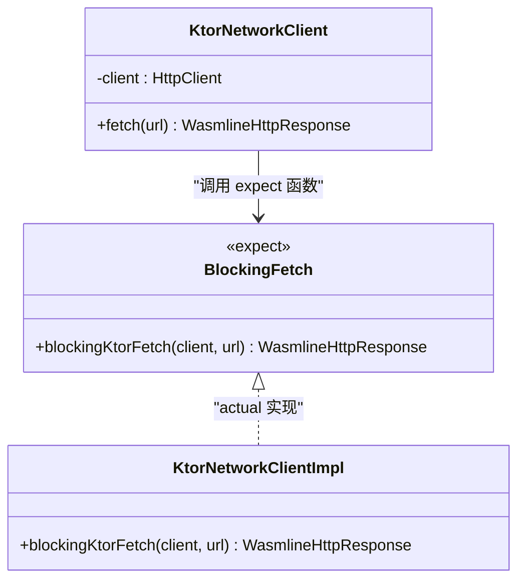
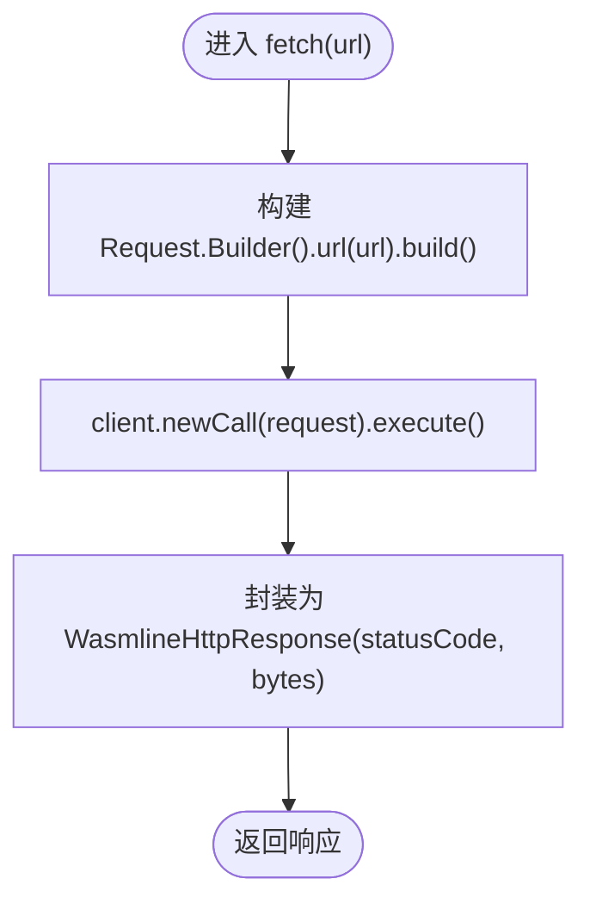
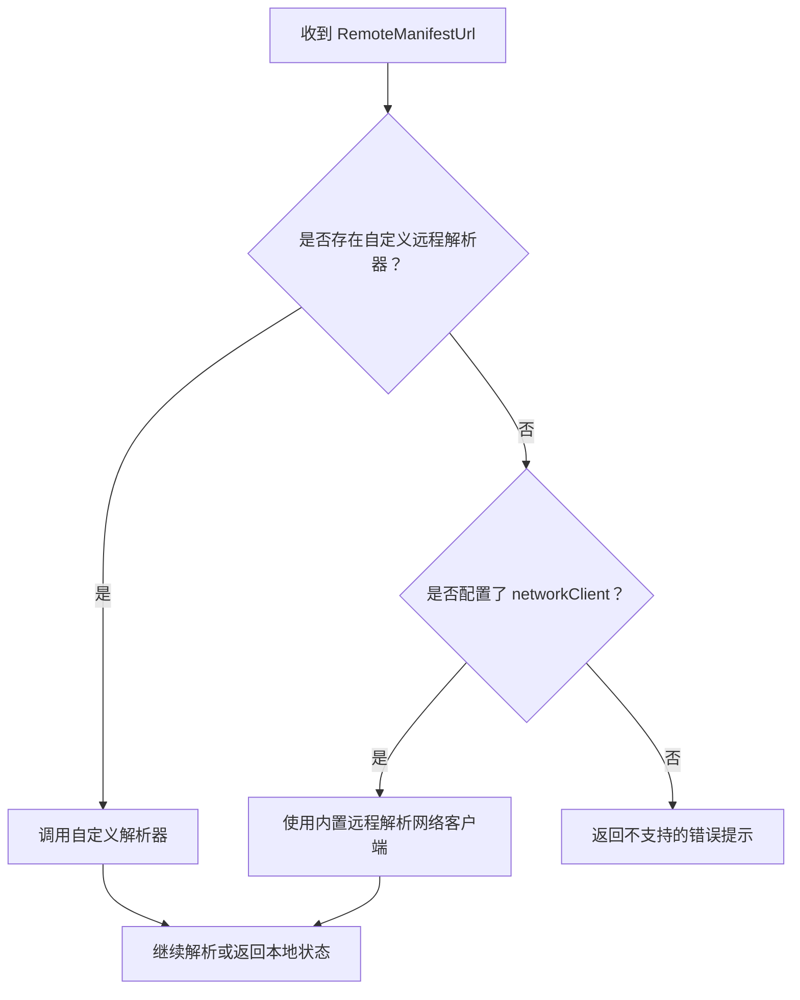
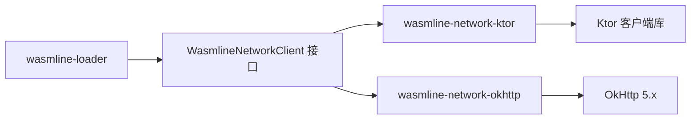

# 网络客户端

<cite>
**本文引用的文件**
- [WasmlineNetworkClient.kt](file://wasmline-multiplatform/wasmline/src/commonMain/kotlin/crow/wasmline/WasmlineNetworkClient.kt)
- [KtorNetworkClient.kt](file://wasmline-multiplatform/wasmline-network-ktor/src/commonMain/kotlin/crow/wasmline/network/ktor/KtorNetworkClient.kt)
- [BlockingFetch.ios.kt](file://wasmline-multiplatform/wasmline-network-ktor/src/iosMain/kotlin/crow/wasmline/network/ktor/BlockingFetch.ios.kt)
- [BlockingFetch.jni.kt](file://wasmline-multiplatform/wasmline-network-ktor/src/jniMain/kotlin/crow/wasmline/network/ktor/BlockingFetch.jni.kt)
- [BlockingFetch.web.kt](file://wasmline-multiplatform/wasmline-network-ktor/src/webMain/kotlin/crow/wasmline/network/ktor/BlockingFetch.web.kt)
- [BlockingFetch.wasmJs.kt](file://wasmline-multiplatform/wasmline-network-ktor/src/wasmJsMain/kotlin/crow/wasmline/network/ktor/BlockingFetch.wasmJs.kt)
- [OkHttpNetworkClient.kt](file://wasmline-multiplatform/wasmline-network-okhttp/src/commonMain/kotlin/crow/wasmline/network/okhttp/OkHttpNetworkClient.kt)
- [DefaultWasmlineLoader.kt](file://wasmline-multiplatform/wasmline-loader/src/hostMain/kotlin/crow/wasmline/loader/DefaultWasmlineLoader.kt)
- [WasmlineRemotePackageResolutionTest.kt](file://wasmline-multiplatform/wasmline-loader/src/jvmTest/kotlin/crow/wasmline/loader/WasmlineRemotePackageResolutionTest.kt)
- [build.gradle.kts（wasmline-network-ktor）](file://wasmline-multiplatform/wasmline-network-ktor/build.gradle.kts)
- [build.gradle.kts（wasmline-network-okhttp）](file://wasmline-multiplatform/wasmline-network-okhttp/build.gradle.kts)
</cite>

## 目录
1. [简介](#简介)
2. [项目结构](#项目结构)
3. [核心组件](#核心组件)
4. [架构总览](#架构总览)
5. [组件详解](#组件详解)
6. [依赖关系分析](#依赖关系分析)
7. [性能考量](#性能考量)
8. [故障排查指南](#故障排查指南)
9. [结论](#结论)
10. [附录：扩展与自定义指南](#附录扩展与自定义指南)

## 简介
本章节面向 Wasmline 网络功能开发者，系统性阐述网络抽象层的设计与实现，覆盖统一网络接口、Ktor 与 OkHttp 两种适配器的集成方式与差异、平台特定实现（含浏览器 Fetch 的桥接限制）、请求配置与错误处理、与加载器系统的集成路径以及数据传输优化建议。目标是帮助你在多平台上以一致的方式完成远程包加载所需的网络访问。

## 项目结构
网络相关代码主要分布在以下模块：
- 抽象层与响应模型：wasmline-multiplatform/wasmline/src/commonMain/kotlin/crow/wasmline/WasmlineNetworkClient.kt
- Ktor 适配器：wasmline-multiplatform/wasmline-network-ktor/src/{commonMain, iosMain, jniMain, webMain, wasmJsMain}/...
- OkHttp 适配器：wasmline-multiplatform/wasmline-network-okhttp/src/commonMain/kotlin/crow/wasmline/network/okhttp/OkHttpNetworkClient.kt
- 加载器与解析链：wasmline-multiplatform/wasmline-loader/src/hostMain/kotlin/crow/wasmline/loader/DefaultWasmlineLoader.kt
- 测试用例（验证网络客户端行为与错误提示）：wasmline-multiplatform/wasmline-loader/src/jvmTest/kotlin/crow/wasmline/loader/WasmlineRemotePackageResolutionTest.kt

图表来源
- [WasmlineNetworkClient.kt:1-42](file://wasmline-multiplatform/wasmline/src/commonMain/kotlin/crow/wasmline/WasmlineNetworkClient.kt#L1-L42)
- [KtorNetworkClient.kt:1-44](file://wasmline-multiplatform/wasmline-network-ktor/src/commonMain/kotlin/crow/wasmline/network/ktor/KtorNetworkClient.kt#L1-L44)
- [OkHttpNetworkClient.kt:1-51](file://wasmline-multiplatform/wasmline-network-okhttp/src/commonMain/kotlin/crow/wasmline/network/okhttp/OkHttpNetworkClient.kt#L1-L51)
- [DefaultWasmlineLoader.kt:1-110](file://wasmline-multiplatform/wasmline-loader/src/hostMain/kotlin/crow/wasmline/loader/DefaultWasmlineLoader.kt#L1-L110)

章节来源
- [WasmlineNetworkClient.kt:1-42](file://wasmline-multiplatform/wasmline/src/commonMain/kotlin/crow/wasmline/WasmlineNetworkClient.kt#L1-L42)
- [KtorNetworkClient.kt:1-44](file://wasmline-multiplatform/wasmline-network-ktor/src/commonMain/kotlin/crow/wasmline/network/ktor/KtorNetworkClient.kt#L1-L44)
- [OkHttpNetworkClient.kt:1-51](file://wasmline-multiplatform/wasmline-network-okhttp/src/commonMain/kotlin/crow/wasmline/network/okhttp/OkHttpNetworkClient.kt#L1-L51)
- [DefaultWasmlineLoader.kt:1-110](file://wasmline-multiplatform/wasmline-loader/src/hostMain/kotlin/crow/wasmline/loader/DefaultWasmlineLoader.kt#L1-L110)

## 核心组件
- 统一网络接口：WasmlineNetworkClient 是最小可用的阻塞式 HTTP GET 抽象，屏蔽底层引擎差异，供加载器在同步解析链中使用。
- 响应模型：WasmlineHttpResponse 封装状态码与字节体，并提供成功判断与相等性/哈希计算。
- Ktor 适配器：KtorNetworkClient 基于 Ktor HttpClient，通过 expect/actual 在各平台桥接到阻塞实现；在 Web 平台抛出不支持异常，要求浏览器侧使用异步解析器。
- OkHttp 适配器：OkHttpNetworkClient 基于 OkHttp 5.x 的阻塞执行 API，适合 JVM/Android 环境。
- 加载器集成：DefaultWasmlineLoader 在无自定义远程解析器时，自动使用配置中的网络客户端进行内置远程解析。

章节来源
- [WasmlineNetworkClient.kt:1-42](file://wasmline-multiplatform/wasmline/src/commonMain/kotlin/crow/wasmline/WasmlineNetworkClient.kt#L1-L42)
- [KtorNetworkClient.kt:1-44](file://wasmline-multiplatform/wasmline-network-ktor/src/commonMain/kotlin/crow/wasmline/network/ktor/KtorNetworkClient.kt#L1-L44)
- [OkHttpNetworkClient.kt:1-51](file://wasmline-multiplatform/wasmline-network-okhttp/src/commonMain/kotlin/crow/wasmline/network/okhttp/OkHttpNetworkClient.kt#L1-L51)
- [DefaultWasmlineLoader.kt:1-110](file://wasmline-multiplatform/wasmline-loader/src/hostMain/kotlin/crow/wasmline/loader/DefaultWasmlineLoader.kt#L1-L110)

## 架构总览
下图展示从加载器到网络客户端的整体调用链，以及 Ktor 在不同平台的桥接策略：

图表来源
- [DefaultWasmlineLoader.kt:48-75](file://wasmline-multiplatform/wasmline-loader/src/hostMain/kotlin/crow/wasmline/loader/DefaultWasmlineLoader.kt#L48-L75)
- [KtorNetworkClient.kt:22-28](file://wasmline-multiplatform/wasmline-network-ktor/src/commonMain/kotlin/crow/wasmline/network/ktor/KtorNetworkClient.kt#L22-L28)
- [OkHttpNetworkClient.kt:27-42](file://wasmline-multiplatform/wasmline-network-okhttp/src/commonMain/kotlin/crow/wasmline/network/okhttp/OkHttpNetworkClient.kt#L27-L42)

## 组件详解

### 统一网络接口与响应模型
- 接口职责：提供阻塞式 fetch(url) 返回 WasmlineHttpResponse，确保加载器解析链保持同步语义。
- 响应模型：包含状态码与字节体，提供 isSuccess 判断与结构化相等/哈希，便于缓存与断言。
- 设计要点：接口最小化，避免引入协程或回调，降低上层复杂度。

章节来源
- [WasmlineNetworkClient.kt:9-26](file://wasmline-multiplatform/wasmline/src/commonMain/kotlin/crow/wasmline/WasmlineNetworkClient.kt#L9-L26)
- [WasmlineNetworkClient.kt:39-41](file://wasmline-multiplatform/wasmline/src/commonMain/kotlin/crow/wasmline/WasmlineNetworkClient.kt#L39-L41)

### Ktor 网络客户端
- 跨平台选择：Ktor 在不同平台自动选择引擎（JVM 使用 CIO，Android 使用 OkHttp，iOS 使用 Darwin），Web 平台不支持同步 Fetch。
- 同步桥接：通过 expect/actual 将 suspend Ktor 调用桥接为阻塞实现；JNI/JVM/iOS 使用 runBlocking 包裹；Web 抛出不支持异常。
- Web 平台限制：明确禁止在浏览器中使用同步 Fetch，需由宿主提供自定义远程解析器并采用异步逻辑。

图表来源
- [KtorNetworkClient.kt:22-43](file://wasmline-multiplatform/wasmline-network-ktor/src/commonMain/kotlin/crow/wasmline/network/ktor/KtorNetworkClient.kt#L22-L43)
- [BlockingFetch.ios.kt:9-17](file://wasmline-multiplatform/wasmline-network-ktor/src/iosMain/kotlin/crow/wasmline/network/ktor/BlockingFetch.ios.kt#L9-L17)
- [BlockingFetch.jni.kt:9-17](file://wasmline-multiplatform/wasmline-network-ktor/src/jniMain/kotlin/crow/wasmline/network/ktor/BlockingFetch.jni.kt#L9-L17)
- [BlockingFetch.web.kt:6-11](file://wasmline-multiplatform/wasmline-network-ktor/src/webMain/kotlin/crow/wasmline/network/ktor/BlockingFetch.web.kt#L6-L11)
- [BlockingFetch.wasmJs.kt:6-7](file://wasmline-multiplatform/wasmline-network-ktor/src/wasmJsMain/kotlin/crow/wasmline/network/ktor/BlockingFetch.wasmJs.kt#L6-L7)

章节来源
- [KtorNetworkClient.kt:1-44](file://wasmline-multiplatform/wasmline-network-ktor/src/commonMain/kotlin/crow/wasmline/network/ktor/KtorNetworkClient.kt#L1-L44)
- [BlockingFetch.ios.kt:1-17](file://wasmline-multiplatform/wasmline-network-ktor/src/iosMain/kotlin/crow/wasmline/network/ktor/BlockingFetch.ios.kt#L1-L17)
- [BlockingFetch.jni.kt:1-17](file://wasmline-multiplatform/wasmline-network-ktor/src/jniMain/kotlin/crow/wasmline/network/ktor/BlockingFetch.jni.kt#L1-L17)
- [BlockingFetch.web.kt:1-11](file://wasmline-multiplatform/wasmline-network-ktor/src/webMain/kotlin/crow/wasmline/network/ktor/BlockingFetch.web.kt#L1-L11)
- [BlockingFetch.wasmJs.kt:1-7](file://wasmline-multiplatform/wasmline-network-ktor/src/wasmJsMain/kotlin/crow/wasmline/network/ktor/BlockingFetch.wasmJs.kt#L1-L7)

### OkHttp 网络客户端
- 阻塞执行：基于 OkHttp 5.x 的 Call.execute，线程安全，可在后台线程调用。
- 可配置性：支持连接池、超时、拦截器等 OkHttp 能力，便于在 JVM/Android 环境定制。
- 使用场景：JVM/Android 最佳选择；Web 平台请改用 Ktor 的异步解析器或自定义实现。

图表来源
- [OkHttpNetworkClient.kt:27-42](file://wasmline-multiplatform/wasmline-network-okhttp/src/commonMain/kotlin/crow/wasmline/network/okhttp/OkHttpNetworkClient.kt#L27-L42)

章节来源
- [OkHttpNetworkClient.kt:1-51](file://wasmline-multiplatform/wasmline-network-okhttp/src/commonMain/kotlin/crow/wasmline/network/okhttp/OkHttpNetworkClient.kt#L1-L51)

### 平台特定实现与差异
- JVM/Android/iOS：Ktor 通过 runBlocking 桥接为阻塞；OkHttp 直接阻塞执行。
- Web/WasmJs：Ktor 不支持同步 Fetch，抛出不支持异常；建议使用自定义远程解析器并采用异步流程。
- 差异总结：
  - Ktor 更易跨平台且自动选择引擎，但 Web 平台需要异步方案。
  - OkHttp 在 JVM/Android 上更直接，且具备成熟的连接池与拦截器生态。

章节来源
- [KtorNetworkClient.kt:10-18](file://wasmline-multiplatform/wasmline-network-ktor/src/commonMain/kotlin/crow/wasmline/network/ktor/KtorNetworkClient.kt#L10-L18)
- [BlockingFetch.web.kt:7-10](file://wasmline-multiplatform/wasmline-network-ktor/src/webMain/kotlin/crow/wasmline/network/ktor/BlockingFetch.web.kt#L7-L10)

### 与加载器系统的集成
- 解析优先级：若提供自定义远程解析器，则优先使用；否则检查是否配置了网络客户端；两者皆无则报错。
- 内置远程解析：当未提供自定义解析器时，加载器内部使用网络客户端拉取清单与工件。
- 错误提示：测试用例验证在缺少网络客户端时的失败信息与错误定位。

图表来源
- [DefaultWasmlineLoader.kt:48-75](file://wasmline-multiplatform/wasmline-loader/src/hostMain/kotlin/crow/wasmline/loader/DefaultWasmlineLoader.kt#L48-L75)

章节来源
- [DefaultWasmlineLoader.kt:48-75](file://wasmline-multiplatform/wasmline-loader/src/hostMain/kotlin/crow/wasmline/loader/DefaultWasmlineLoader.kt#L48-L75)
- [WasmlineRemotePackageResolutionTest.kt:70-79](file://wasmline-multiplatform/wasmline-loader/src/jvmTest/kotlin/crow/wasmline/loader/WasmlineRemotePackageResolutionTest.kt#L70-L79)
- [WasmlineRemotePackageResolutionTest.kt:162-179](file://wasmline-multiplatform/wasmline-loader/src/jvmTest/kotlin/crow/wasmline/loader/WasmlineRemotePackageResolutionTest.kt#L162-L179)

## 依赖关系分析
- Ktor 适配器依赖 Ktor 客户端库；在不同平台通过 expect/actual 引入对应实现。
- OkHttp 适配器依赖 OkHttp 5.x。
- 加载器依赖网络客户端接口，从而解耦具体实现。

图表来源
- [build.gradle.kts（wasmline-network-ktor）:61-83](file://wasmline-multiplatform/wasmline-network-ktor/build.gradle.kts#L61-L83)
- [build.gradle.kts（wasmline-network-okhttp）](file://wasmline-multiplatform/wasmline-network-okhttp/build.gradle.kts)

章节来源
- [build.gradle.kts（wasmline-network-ktor）:61-83](file://wasmline-multiplatform/wasmline-network-ktor/build.gradle.kts#L61-L83)
- [build.gradle.kts（wasmline-network-okhttp）](file://wasmline-multiplatform/wasmline-network-okhttp/build.gradle.kts)

## 性能考量
- 连接复用与池化：优先在 JVM/Android 使用 OkHttp，利用其连接池与拦截器减少握手开销。
- 超时与背压：通过 OkHttp 或 Ktor 的配置设置连接/读写超时，结合加载器并发控制（如下载并发数）避免资源争用。
- 字节流处理：响应体按需读取，避免大对象拷贝；在多平台统一使用 ByteArray 作为通用载体。
- 缓存策略：结合加载器缓存与 HTTP 层缓存头（如 ETag/Last-Modified）提升重复加载性能。

## 故障排查指南
- 缺少网络客户端导致加载失败：当未提供自定义远程解析器且未配置网络客户端时，加载器会返回明确的“不支持”错误提示，指引你提供 request.resolvers.remotePackage 或 request.config.networkClient。
- Web 平台同步 Fetch 不受支持：在浏览器或 Web/WasmJs 平台，Ktor 会抛出不支持异常，需提供自定义远程解析器并采用异步逻辑。
- 清单拉取失败：当网络客户端返回非 2xx 状态码时，加载器会返回“Failed to fetch manifest”类错误，需检查网络连通性、URL 正确性与服务端响应。

章节来源
- [DefaultWasmlineLoader.kt:67-72](file://wasmline-multiplatform/wasmline-loader/src/hostMain/kotlin/crow/wasmline/loader/DefaultWasmlineLoader.kt#L67-L72)
- [WasmlineRemotePackageResolutionTest.kt:70-79](file://wasmline-multiplatform/wasmline-loader/src/jvmTest/kotlin/crow/wasmline/loader/WasmlineRemotePackageResolutionTest.kt#L70-L79)
- [WasmlineRemotePackageResolutionTest.kt:162-179](file://wasmline-multiplatform/wasmline-loader/src/jvmTest/kotlin/crow/wasmline/loader/WasmlineRemotePackageResolutionTest.kt#L162-L179)

## 结论
Wasmline 的网络抽象层以最小接口实现了跨平台阻塞式 HTTP 访问，配合加载器解析链保证了同步语义与一致性。Ktor 适配器提供了多平台统一体验，而 OkHttp 适配器在 JVM/Android 场景具备更强的可控性与成熟生态。对于 Web 平台，应通过自定义远程解析器采用异步方案，避免同步 Fetch 的限制。通过合理的超时、池化与缓存策略，可在多平台上获得稳定高效的远程包加载体验。

## 附录：扩展与自定义指南
- 自定义网络客户端
  - 实现 WasmlineNetworkClient 接口，提供阻塞式 fetch(url)。
  - 在 JVM/Android 可复用 OkHttp；在 iOS/JVM 可复用 Ktor；在 Web 平台请提供自定义远程解析器。
- 自定义远程解析器
  - 提供 request.resolvers.remotePackage，优先于内置网络客户端解析。
  - 在 Web 平台实现异步逻辑并通过 Promise/协程桥接至加载器。
- 请求配置与优化
  - 设置连接/读写超时、连接池大小、拦截器（鉴权、埋点、重试等）。
  - 结合加载器并发参数控制整体下载并发，避免拥塞。
- 错误处理与可观测性
  - 对非 2xx 响应与异常进行分类记录，输出清晰的错误上下文。
  - 在 Web 平台补充跨域、证书与 CSP 相关诊断信息。