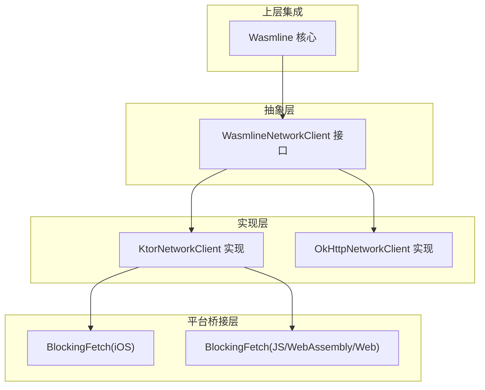
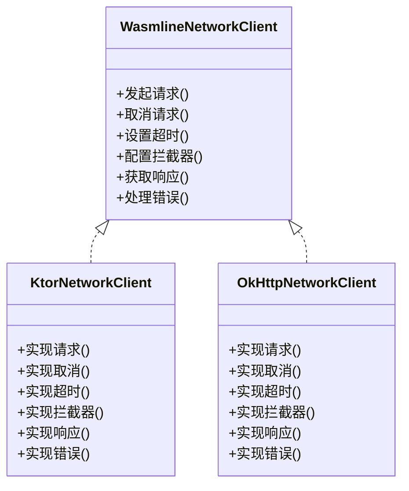
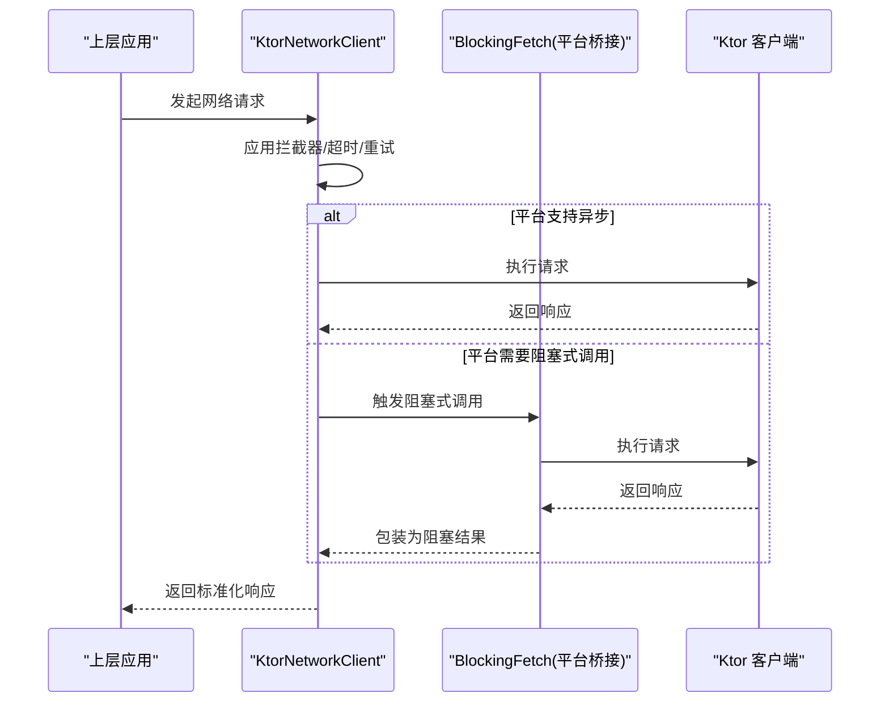
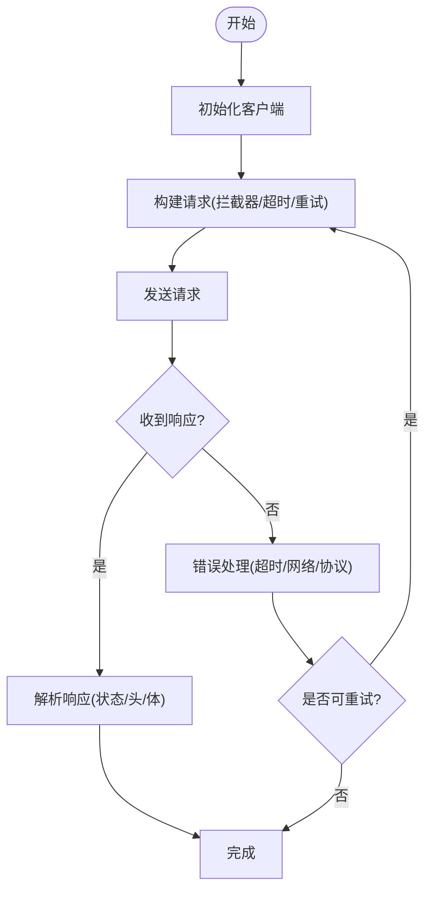
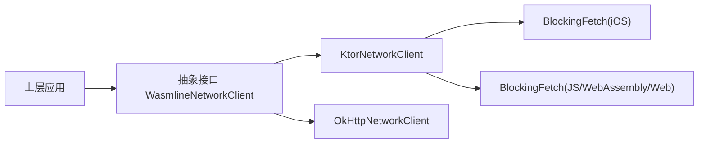

# 网络抽象层

<cite>
**本文引用的文件**
- [WasmlineNetworkClient.kt](file://wasmline-multiplatform/wasmline/src/commonMain/kotlin/crow/wasmline/WasmlineNetworkClient.kt)
- [KtorNetworkClient.kt](file://wasmline-multiplatform/wasmline-network-ktor/src/commonMain/kotlin/crow/wasmline/network/ktor/KtorNetworkClient.kt)
- [BlockingFetch.ios.kt](file://wasmline-multiplatform/wasmline-network-ktor/src/iosMain/kotlin/crow/wasmline/network/ktor/BlockingFetch.ios.kt)
- [BlockingFetch.js.kt](file://wasmline-multiplatform/wasmline-network-ktor/src/jsMain/kotlin/crow/wasmline/network/ktor/BlockingFetch.js.kt)
- [BlockingFetch.wasmJs.kt](file://wasmline-multiplatform/wasmline-network-ktor/src/wasmJsMain/kotlin/crow/wasmline/network/ktor/BlockingFetch.wasmJs.kt)
- [BlockingFetch.web.kt](file://wasmline-multiplatform/wasmline-network-ktor/src/webMain/kotlin/crow/wasmline/network/ktor/BlockingFetch.web.kt)
- [OkHttpNetworkClient.kt](file://wasmline-multiplatform/wasmline-network-okhttp/src/commonMain/kotlin/crow/wasmline/network/okhttp/OkHttpNetworkClient.kt)
</cite>

## 目录
1. [简介](#简介)
2. [项目结构](#项目结构)
3. [核心组件](#核心组件)
4. [架构总览](#架构总览)
5. [详细组件分析](#详细组件分析)
6. [依赖关系分析](#依赖关系分析)
7. [性能考虑](#性能考虑)
8. [故障排查指南](#故障排查指南)
9. [结论](#结论)
10. [附录](#附录)

## 简介
本文件面向 Wasmline 多平台网络抽象层，系统性阐述网络客户端接口的设计理念与抽象层次，覆盖统一网络请求接口定义、错误处理机制、响应格式标准化、跨平台实现差异屏蔽、请求生命周期管理、连接池与资源回收策略、异常处理与超时控制、重试机制、扩展与自定义实现指南，以及最佳实践与性能优化建议。目标是帮助开发者在不同运行环境（Android、iOS、JVM、JS、WebAssembly）中获得一致的网络 API 使用体验。

## 项目结构
网络抽象层由以下关键模块组成：
- 抽象接口层：定义统一的网络客户端契约，屏蔽底层实现差异
- 具体实现层：基于 Ktor 与 OkHttp 的多平台适配实现
- 平台桥接层：针对特定平台（如 iOS、JS、WebAssembly）的阻塞式网络调用封装
- 上层集成：Wasmline 核心通过抽象接口进行网络调用

**图表来源**
- [WasmlineNetworkClient.kt](file://wasmline-multiplatform/wasmline/src/commonMain/kotlin/crow/wasmline/WasmlineNetworkClient.kt)
- [KtorNetworkClient.kt](file://wasmline-multiplatform/wasmline-network-ktor/src/commonMain/kotlin/crow/wasmline/network/ktor/KtorNetworkClient.kt)
- [OkHttpNetworkClient.kt](file://wasmline-multiplatform/wasmline-network-okhttp/src/commonMain/kotlin/crow/wasmline/network/okhttp/OkHttpNetworkClient.kt)
- [BlockingFetch.ios.kt](file://wasmline-multiplatform/wasmline-network-ktor/src/iosMain/kotlin/crow/wasmline/network/ktor/BlockingFetch.ios.kt)
- [BlockingFetch.js.kt](file://wasmline-multiplatform/wasmline-network-ktor/src/jsMain/kotlin/crow/wasmline/network/ktor/BlockingFetch.js.kt)
- [BlockingFetch.wasmJs.kt](file://wasmline-multiplatform/wasmline-network-ktor/src/wasmJsMain/kotlin/crow/wasmline/network/ktor/BlockingFetch.wasmJs.kt)
- [BlockingFetch.web.kt](file://wasmline-multiplatform/wasmline-network-ktor/src/webMain/kotlin/crow/wasmline/network/ktor/BlockingFetch.web.kt)

**章节来源**
- [WasmlineNetworkClient.kt](file://wasmline-multiplatform/wasmline/src/commonMain/kotlin/crow/wasmline/WasmlineNetworkClient.kt)
- [KtorNetworkClient.kt](file://wasmline-multiplatform/wasmline-network-ktor/src/commonMain/kotlin/crow/wasmline/network/ktor/KtorNetworkClient.kt)
- [OkHttpNetworkClient.kt](file://wasmline-multiplatform/wasmline-network-okhttp/src/commonMain/kotlin/crow/wasmline/network/okhttp/OkHttpNetworkClient.kt)

## 核心组件
- 统一网络客户端接口：定义跨平台一致的请求/响应模型、错误类型与生命周期管理约定
- Ktor 实现：基于 Ktor 客户端的多平台网络实现，适配 JVM、Android、iOS、JS、WebAssembly 等
- OkHttp 实现：基于 OkHttp 的多平台网络实现，主要面向 JVM/Android 环境
- 平台阻塞桥接：在不支持异步或需要阻塞式调用的平台上，提供统一的阻塞式网络访问封装
- 上层集成：Wasmline 核心通过注入网络客户端实现进行网络请求

**章节来源**
- [WasmlineNetworkClient.kt](file://wasmline-multiplatform/wasmline/src/commonMain/kotlin/crow/wasmline/WasmlineNetworkClient.kt)
- [KtorNetworkClient.kt](file://wasmline-multiplatform/wasmline-network-ktor/src/commonMain/kotlin/crow/wasmline/network/ktor/KtorNetworkClient.kt)
- [OkHttpNetworkClient.kt](file://wasmline-multiplatform/wasmline-network-okhttp/src/commonMain/kotlin/crow/wasmline/network/okhttp/OkHttpNetworkClient.kt)

## 架构总览
网络抽象层采用“接口 + 多实现 + 平台桥接”的分层设计：
- 抽象接口层负责定义契约，确保上层无需关心具体实现
- 实现层分别对接主流网络栈（Ktor、OkHttp），并利用其多平台能力
- 平台桥接层解决特定平台的异步/阻塞差异，保证统一的调用语义
- 生命周期与资源管理由实现层内部完成，上层仅需关注业务逻辑

**图表来源**
- [WasmlineNetworkClient.kt](file://wasmline-multiplatform/wasmline/src/commonMain/kotlin/crow/wasmline/WasmlineNetworkClient.kt)
- [KtorNetworkClient.kt](file://wasmline-multiplatform/wasmline-network-ktor/src/commonMain/kotlin/crow/wasmline/network/ktor/KtorNetworkClient.kt)
- [OkHttpNetworkClient.kt](file://wasmline-multiplatform/wasmline-network-okhttp/src/commonMain/kotlin/crow/wasmline/network/okhttp/OkHttpNetworkClient.kt)

## 详细组件分析

### 统一网络客户端接口（抽象层）
- 设计目标：为上层提供一致的网络调用 API，屏蔽底层实现差异
- 关键职责：
  - 请求构建与发送
  - 取消与中断
  - 超时与重试策略
  - 错误分类与标准化
  - 响应解析与格式化
  - 生命周期管理与资源回收
- 适用场景：跨平台 SDK、服务编排、模块解耦

**章节来源**
- [WasmlineNetworkClient.kt](file://wasmline-multiplatform/wasmline/src/commonMain/kotlin/crow/wasmline/WasmlineNetworkClient.kt)

### Ktor 网络客户端实现
- 适配范围：JVM、Android、iOS、JS、WebAssembly、Web 等多平台
- 特点：
  - 基于 Ktor 客户端的异步与流式能力
  - 支持连接池、HTTP/2、TLS 等高级特性
  - 针对平台差异提供阻塞式桥接（见下节）
- 生命周期：
  - 初始化阶段建立客户端实例与默认配置
  - 请求阶段执行拦截器链、超时控制、重试策略
  - 响应阶段解析状态码、头部与正文，进行错误映射
  - 清理阶段释放连接与缓冲资源

**图表来源**
- [KtorNetworkClient.kt](file://wasmline-multiplatform/wasmline-network-ktor/src/commonMain/kotlin/crow/wasmline/network/ktor/KtorNetworkClient.kt)
- [BlockingFetch.ios.kt](file://wasmline-multiplatform/wasmline-network-ktor/src/iosMain/kotlin/crow/wasmline/network/ktor/BlockingFetch.ios.kt)
- [BlockingFetch.js.kt](file://wasmline-multiplatform/wasmline-network-ktor/src/jsMain/kotlin/crow/wasmline/network/ktor/BlockingFetch.js.kt)
- [BlockingFetch.wasmJs.kt](file://wasmline-multiplatform/wasmline-network-ktor/src/wasmJsMain/kotlin/crow/wasmline/network/ktor/BlockingFetch.wasmJs.kt)
- [BlockingFetch.web.kt](file://wasmline-multiplatform/wasmline-network-ktor/src/webMain/kotlin/crow/wasmline/network/ktor/BlockingFetch.web.kt)

**章节来源**
- [KtorNetworkClient.kt](file://wasmline-multiplatform/wasmline-network-ktor/src/commonMain/kotlin/crow/wasmline/network/ktor/KtorNetworkClient.kt)
- [BlockingFetch.ios.kt](file://wasmline-multiplatform/wasmline-network-ktor/src/iosMain/kotlin/crow/wasmline/network/ktor/BlockingFetch.ios.kt)
- [BlockingFetch.js.kt](file://wasmline-multiplatform/wasmline-network-ktor/src/jsMain/kotlin/crow/wasmline/network/ktor/BlockingFetch.js.kt)
- [BlockingFetch.wasmJs.kt](file://wasmline-multiplatform/wasmline-network-ktor/src/wasmJsMain/kotlin/crow/wasmline/network/ktor/BlockingFetch.wasmJs.kt)
- [BlockingFetch.web.kt](file://wasmline-multiplatform/wasmline-network-ktor/src/webMain/kotlin/crow/wasmline/network/ktor/BlockingFetch.web.kt)

### OkHttp 网络客户端实现
- 适配范围：JVM/Android 等支持 OkHttp 的平台
- 特点：
  - 基于 OkHttp 的同步/异步 API
  - 内置连接池、缓存、重试与超时控制
  - 与 Retrofit 等生态良好兼容
- 生命周期：
  - 构造阶段配置连接池、超时、拦截器
  - 请求阶段执行拦截器链与重试
  - 响应阶段解析状态码与正文
  - 清理阶段释放连接与缓冲

**章节来源**
- [OkHttpNetworkClient.kt](file://wasmline-multiplatform/wasmline-network-okhttp/src/commonMain/kotlin/crow/wasmline/network/okhttp/OkHttpNetworkClient.kt)

### 平台阻塞式桥接（BlockingFetch）
- 目标：在不支持异步或需要阻塞式调用的平台上，提供统一的阻塞式网络访问
- 适配平台：iOS、JS、WebAssembly、Web
- 行为特征：
  - 将异步请求包装为阻塞式调用
  - 保持与异步版本一致的错误与响应模型
  - 在平台侧进行线程/事件循环调度

**章节来源**
- [BlockingFetch.ios.kt](file://wasmline-multiplatform/wasmline-network-ktor/src/iosMain/kotlin/crow/wasmline/network/ktor/BlockingFetch.ios.kt)
- [BlockingFetch.js.kt](file://wasmline-multiplatform/wasmline-network-ktor/src/jsMain/kotlin/crow/wasmline/network/ktor/BlockingFetch.js.kt)
- [BlockingFetch.wasmJs.kt](file://wasmline-multiplatform/wasmline-network-ktor/src/wasmJsMain/kotlin/crow/wasmline/network/ktor/BlockingFetch.wasmJs.kt)
- [BlockingFetch.web.kt](file://wasmline-multiplatform/wasmline-network-ktor/src/webMain/kotlin/crow/wasmline/network/ktor/BlockingFetch.web.kt)

### 请求生命周期管理
- 初始化：根据平台与配置创建网络客户端实例
- 发送：应用拦截器、超时与重试策略，构建请求
- 响应：解析状态码、头部与正文，进行错误映射
- 取消：支持中途取消请求，释放资源
- 清理：关闭连接、释放缓冲区与临时对象

[此图为概念流程图，不直接对应具体源码文件]

### 连接池管理与资源回收
- 连接池：实现层内部维护连接池，复用 TCP 连接，降低握手开销
- 资源回收：请求完成后及时释放连接、缓冲区与临时对象
- 平台差异：不同平台的连接池参数与行为可能不同，但对外接口一致

**章节来源**
- [KtorNetworkClient.kt](file://wasmline-multiplatform/wasmline-network-ktor/src/commonMain/kotlin/crow/wasmline/network/ktor/KtorNetworkClient.kt)
- [OkHttpNetworkClient.kt](file://wasmline-multiplatform/wasmline-network-okhttp/src/commonMain/kotlin/crow/wasmline/network/okhttp/OkHttpNetworkClient.kt)

### 错误处理、超时控制与重试机制
- 错误处理：
  - 分类：网络错误、协议错误、业务错误、序列化错误等
  - 标准化：将底层错误映射为统一的错误模型
- 超时控制：
  - 连接超时、读取超时、写入超时
  - 平台差异：不同平台的超时实现略有差异，但对外一致
- 重试机制：
  - 基于幂等性与网络瞬时错误的自动重试
  - 最大重试次数与退避策略

**章节来源**
- [KtorNetworkClient.kt](file://wasmline-multiplatform/wasmline-network-ktor/src/commonMain/kotlin/crow/wasmline/network/ktor/KtorNetworkClient.kt)
- [OkHttpNetworkClient.kt](file://wasmline-multiplatform/wasmline-network-okhttp/src/commonMain/kotlin/crow/wasmline/network/okhttp/OkHttpNetworkClient.kt)

### 扩展指南与自定义实现
- 自定义实现步骤：
  - 实现抽象接口：提供请求、取消、超时、拦截器、响应与错误处理
  - 平台适配：针对目标平台选择合适的网络栈（如 OkHttp、Alamofire、Fetch 等）
  - 桥接策略：在需要阻塞式调用的平台提供阻塞式桥接
  - 生命周期：确保资源回收与连接池管理
- 集成方式：
  - 通过配置注入网络客户端实例
  - 在启动阶段注册实现并初始化

**章节来源**
- [WasmlineNetworkClient.kt](file://wasmline-multiplatform/wasmline/src/commonMain/kotlin/crow/wasmline/WasmlineNetworkClient.kt)
- [KtorNetworkClient.kt](file://wasmline-multiplatform/wasmline-network-ktor/src/commonMain/kotlin/crow/wasmline/network/ktor/KtorNetworkClient.kt)
- [OkHttpNetworkClient.kt](file://wasmline-multiplatform/wasmline-network-okhttp/src/commonMain/kotlin/crow/wasmline/network/okhttp/OkHttpNetworkClient.kt)

## 依赖关系分析
- 抽象接口依赖：上层组件仅依赖抽象接口，不直接依赖具体实现
- 实现依赖：Ktor 实现依赖 Ktor 客户端；OkHttp 实现依赖 OkHttp
- 平台桥接依赖：Ktor 实现依赖各平台的阻塞式桥接
- 解耦效果：通过抽象层屏蔽实现差异，便于替换与扩展

**图表来源**
- [WasmlineNetworkClient.kt](file://wasmline-multiplatform/wasmline/src/commonMain/kotlin/crow/wasmline/WasmlineNetworkClient.kt)
- [KtorNetworkClient.kt](file://wasmline-multiplatform/wasmline-network-ktor/src/commonMain/kotlin/crow/wasmline/network/ktor/KtorNetworkClient.kt)
- [OkHttpNetworkClient.kt](file://wasmline-multiplatform/wasmline-network-okhttp/src/commonMain/kotlin/crow/wasmline/network/okhttp/OkHttpNetworkClient.kt)
- [BlockingFetch.ios.kt](file://wasmline-multiplatform/wasmline-network-ktor/src/iosMain/kotlin/crow/wasmline/network/ktor/BlockingFetch.ios.kt)
- [BlockingFetch.js.kt](file://wasmline-multiplatform/wasmline-network-ktor/src/jsMain/kotlin/crow/wasmline/network/ktor/BlockingFetch.js.kt)
- [BlockingFetch.wasmJs.kt](file://wasmline-multiplatform/wasmline-network-ktor/src/wasmJsMain/kotlin/crow/wasmline/network/ktor/BlockingFetch.wasmJs.kt)
- [BlockingFetch.web.kt](file://wasmline-multiplatform/wasmline-network-ktor/src/webMain/kotlin/crow/wasmline/network/ktor/BlockingFetch.web.kt)

**章节来源**
- [WasmlineNetworkClient.kt](file://wasmline-multiplatform/wasmline/src/commonMain/kotlin/crow/wasmline/WasmlineNetworkClient.kt)
- [KtorNetworkClient.kt](file://wasmline-multiplatform/wasmline-network-ktor/src/commonMain/kotlin/crow/wasmline/network/ktor/KtorNetworkClient.kt)
- [OkHttpNetworkClient.kt](file://wasmline-multiplatform/wasmline-network-okhttp/src/commonMain/kotlin/crow/wasmline/network/okhttp/OkHttpNetworkClient.kt)

## 性能考虑
- 连接复用：启用连接池，减少握手与建连开销
- 超时与重试：合理设置超时与退避策略，避免长时间占用资源
- 响应解析：按需解析，避免不必要的数据转换
- 平台差异：针对不同平台调整连接池大小、并发度与缓冲策略
- 监控与采样：记录关键指标（成功率、延迟、重试次数）以便优化

[本节为通用性能建议，不直接分析具体源码文件]

## 故障排查指南
- 常见问题定位：
  - 网络不可达：检查 DNS、代理与防火墙
  - 超时频繁：检查服务器响应时间与客户端超时配置
  - 重试风暴：检查幂等性与重试策略配置
  - 平台差异：确认平台桥接是否正确启用
- 日志与诊断：
  - 启用网络栈日志，捕获请求/响应细节
  - 记录错误分类与堆栈信息
- 快速修复建议：
  - 调整超时与重试参数
  - 切换实现（Ktor/OkHttp）以排除平台问题
  - 核对拦截器与中间件顺序

**章节来源**
- [KtorNetworkClient.kt](file://wasmline-multiplatform/wasmline-network-ktor/src/commonMain/kotlin/crow/wasmline/network/ktor/KtorNetworkClient.kt)
- [OkHttpNetworkClient.kt](file://wasmline-multiplatform/wasmline-network-okhttp/src/commonMain/kotlin/crow/wasmline/network/okhttp/OkHttpNetworkClient.kt)

## 结论
Wasmline 网络抽象层通过清晰的接口契约、多实现与平台桥接，实现了跨平台网络能力的一致性与可扩展性。开发者可在不改变上层逻辑的前提下切换实现或扩展新平台，同时借助连接池、超时与重试机制提升稳定性与性能。

## 附录
- 最佳实践清单：
  - 明确错误分类与统一响应模型
  - 合理配置连接池与超时参数
  - 在需要阻塞式调用的平台启用桥接
  - 通过拦截器实现统一的日志与监控
  - 对关键路径进行性能基准测试与回归验证

[本节为通用实践建议，不直接分析具体源码文件]