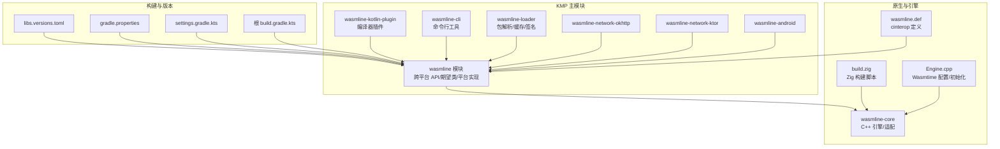
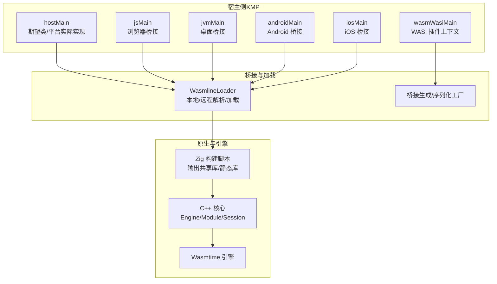
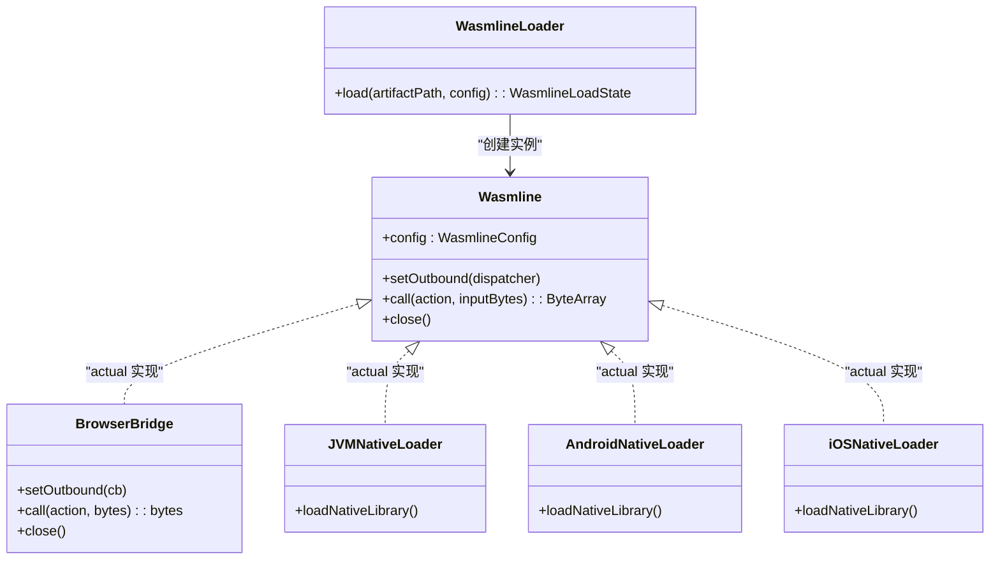
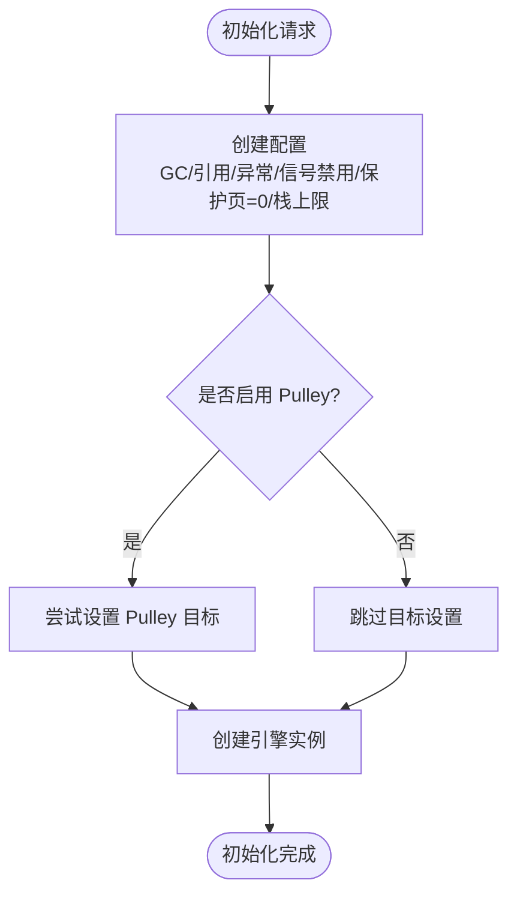
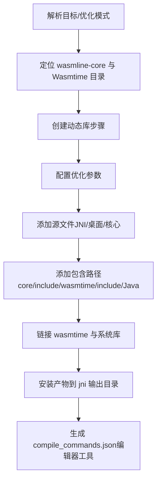
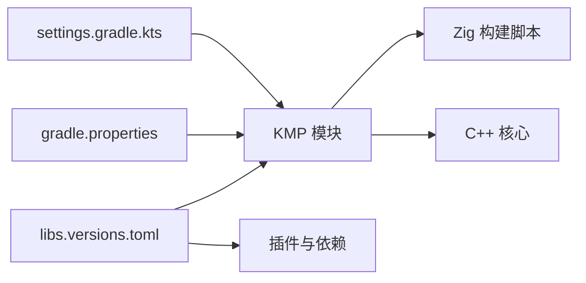

# 技术栈

<cite>
**本文引用的文件**
- [wasmline-multiplatform/gradle/libs.versions.toml](file://wasmline-multiplatform/gradle/libs.versions.toml)
- [wasmline-multiplatform/build.gradle.kts](file://wasmline-multiplatform/build.gradle.kts)
- [wasmline-multiplatform/gradle.properties](file://wasmline-multiplatform/gradle.properties)
- [wasmline-multiplatform/wasmline/build.gradle.kts](file://wasmline-multiplatform/wasmline/build.gradle.kts)
- [wasmline-multiplatform/wasmline/build.zig](file://wasmline-multiplatform/wasmline/build.zig)
- [wasmline-multiplatform/wasmline/src/iosMain/native/cinterop/wasmline.def](file://wasmline-multiplatform/wasmline/src/iosMain/native/cinterop/wasmline.def)
- [wasmline-core/src/Engine.cpp](file://wasmline-core/src/Engine.cpp)
- [wasmline-multiplatform/wasmline-kotlin-plugin/src/main/kotlin/crow/wasmline/kotlin/WasmlineCompilerPluginRegistrar.kt](file://wasmline-multiplatform/wasmline-kotlin-plugin/src/main/kotlin/crow/wasmline/kotlin/WasmlineCompilerPluginRegistrar.kt)
- [wasmline-multiplatform/wasmline-cli/src/main/kotlin/crow/wasmline/cli/Main.kt](file://wasmline-multiplatform/wasmline-cli/src/main/kotlin/crow/wasmline/cli/Main.kt)
- [wasmline-multiplatform/settings.gradle.kts](file://wasmline-multiplatform/settings.gradle.kts)
- [wasmline-multiplatform/wasmline/src/hostMain/kotlin/crow/wasmline/Wasmline.kt](file://wasmline-multiplatform/wasmline/src/hostMain/kotlin/crow/wasmline/Wasmline.kt)
- [wasmline-multiplatform/wasmline/src/hostMain/kotlin/crow/wasmline/WasmlineLoader.kt](file://wasmline-multiplatform/wasmline/src/hostMain/kotlin/crow/wasmline/WasmlineLoader.kt)
- [wasmline-multiplatform/wasmline/src/wasmWasiMain/kotlin/crow/wasmline/Wasmline.wasmWasi.kt](file://wasmline-multiplatform/wasmline/src/wasmWasiMain/kotlin/crow/wasmline/Wasmline.wasmWasi.kt)
- [wasmline-multiplatform/wasmline/src/jsMain/kotlin/crow/wasmline/Wasmline.js.kt](file://wasmline-multiplatform/wasmline/src/jsMain/kotlin/crow/wasmline/Wasmline.js.kt)
- [wasmline-multiplatform/wasmline/src/jvmMain/kotlin/crow/wasmline/extensions/NativeLoaderExt.jvm.kt](file://wasmline-multiplatform/wasmline/src/jvmMain/kotlin/crow/wasmline/extensions/NativeLoaderExt.jvm.kt)
- [wasmline-multiplatform/wasmline/src/androidMain/kotlin/crow/wasmline/extensions/NativeLoaderExt.android.kt](file://wasmline-multiplatform/wasmline/src/androidMain/kotlin/crow/wasmline/extensions/NativeLoaderExt.android.kt)
- [wasmline-multiplatform/wasmline/src/iosMain/kotlin/crow/wasmline/extensions/NativeLoaderExt.ios.kt](file://wasmline-multiplatform/wasmline/src/iosMain/kotlin/crow/wasmline/extensions/NativeLoaderExt.ios.kt)
</cite>

## 目录
1. [引言](#引言)
2. [项目结构](#项目结构)
3. [核心组件](#核心组件)
4. [架构总览](#架构总览)
5. [详细组件分析](#详细组件分析)
6. [依赖分析](#依赖分析)
7. [性能考量](#性能考量)
8. [故障排查指南](#故障排查指南)
9. [结论](#结论)
10. [附录](#附录)

## 引言
本文件系统性梳理 Wasmline 的技术栈与实现要点，围绕 Kotlin Multiplatform、WebAssembly、Wasmtime、Zig 等核心技术展开，解释技术选型理由、模块职责、构建工具链、版本与依赖管理、开发与调试工具，并给出最佳实践与注意事项，帮助开发者快速理解并高效参与项目。

## 项目结构
Wasmline 采用多模块 Gradle 工程组织，核心由以下部分构成：
- wasmline：KMP 主模块，定义跨平台 API、期望类（expect）与各平台实际实现（actual），负责加载与桥接宿主与 Wasm 插件。
- wasmline-core：C++ 核心引擎与适配层，封装 Wasmtime 引擎初始化、配置与生命周期管理。
- wasmline-build-logic：Gradle 构建逻辑与扩展，统一版本与插件配置。
- wasmline-kotlin-plugin：Kotlin 编译器插件，生成桥接代码与导出符号，支持 Wasm/WASI 运行时。
- wasmline-cli：命令行工具，提供编译、打包、下载、密钥生成等能力。
- wasmline-loader：本地/远程包解析、缓存与签名校验等加载流程。
- wasmline-network-*：网络客户端实现（OkHttp、Ktor），用于远程资源获取。
- wasmline-android：Android 平台原生集成与 JNI 适配。
- wasmline-samples：示例应用与多端演示。

**图表来源**
- [wasmline-multiplatform/gradle/libs.versions.toml:1-338](file://wasmline-multiplatform/gradle/libs.versions.toml#L1-L338)
- [wasmline-multiplatform/gradle.properties:1-14](file://wasmline-multiplatform/gradle.properties#L1-L14)
- [wasmline-multiplatform/settings.gradle.kts:1-77](file://wasmline-multiplatform/settings.gradle.kts#L1-L77)
- [wasmline-multiplatform/build.gradle.kts:1-58](file://wasmline-multiplatform/build.gradle.kts#L1-L58)
- [wasmline-multiplatform/wasmline/build.gradle.kts:1-159](file://wasmline-multiplatform/wasmline/build.gradle.kts#L1-L159)
- [wasmline-multiplatform/wasmline/build.zig:1-472](file://wasmline-multiplatform/wasmline/build.zig#L1-L472)
- [wasmline-multiplatform/wasmline/src/iosMain/native/cinterop/wasmline.def:1-2](file://wasmline-multiplatform/wasmline/src/iosMain/native/cinterop/wasmline.def#L1-L2)
- [wasmline-core/src/Engine.cpp:1-138](file://wasmline-core/src/Engine.cpp#L1-L138)

**章节来源**
- [wasmline-multiplatform/settings.gradle.kts:1-77](file://wasmline-multiplatform/settings.gradle.kts#L1-L77)
- [wasmline-multiplatform/build.gradle.kts:1-58](file://wasmline-multiplatform/build.gradle.kts#L1-L58)

## 核心组件
- Kotlin Multiplatform（KMP）
  - 跨平台 API 通过 expect/actual 实现，统一公共逻辑，按平台注入具体实现。
  - 支持 JVM、Android、JS、WasmJS、WasmWASI、iOS 等目标。
- WebAssembly 运行时
  - 使用 Wasmtime 作为宿主引擎，支持 AOT（.cwasm）与 Pulley（.pwasm）两种预编译格式。
  - 在 WasmWASI 中直接作为插件运行，无需显式加载；在浏览器与桌面中通过桥接调用宿主 API。
- Zig 构建与原生桥接
  - 以 Zig 脚本统一编译 C++ 核心库，链接 Wasmtime 库，输出各平台共享库或静态归档。
  - 自动检测并验证 JAVA_HOME，按目标平台输出到对应 jni 目录。
- Kotlin 编译器插件
  - 注册 IR 生成扩展，生成桥接代码与导出符号，支持 WASI 初始化导出开关。
- 命令行工具
  - 提供编译、打包、清单生成、下载与密钥对生成等子命令，便于本地开发与 CI 集成。
- 加载器与网络
  - 统一本地/远程包解析、缓存、签名校验与下载策略；网络层可选 OkHttp 或 Ktor。

**章节来源**
- [wasmline-multiplatform/wasmline/src/hostMain/kotlin/crow/wasmline/Wasmline.kt:1-34](file://wasmline-multiplatform/wasmline/src/hostMain/kotlin/crow/wasmline/Wasmline.kt#L1-L34)
- [wasmline-multiplatform/wasmline/src/wasmWasiMain/kotlin/crow/wasmline/Wasmline.wasmWasi.kt:1-60](file://wasmline-multiplatform/wasmline/src/wasmWasiMain/kotlin/crow/wasmline/Wasmline.wasmWasi.kt#L1-L60)
- [wasmline-multiplatform/wasmline/src/jsMain/kotlin/crow/wasmline/Wasmline.js.kt:1-31](file://wasmline-multiplatform/wasmline/src/jsMain/kotlin/crow/wasmline/Wasmline.js.kt#L1-L31)
- [wasmline-multiplatform/wasmline/src/jvmMain/kotlin/crow/wasmline/extensions/NativeLoaderExt.jvm.kt:1-53](file://wasmline-multiplatform/wasmline/src/jvmMain/kotlin/crow/wasmline/extensions/NativeLoaderExt.jvm.kt#L1-L53)
- [wasmline-multiplatform/wasmline/src/androidMain/kotlin/crow/wasmline/extensions/NativeLoaderExt.android.kt:1-5](file://wasmline-multiplatform/wasmline/src/androidMain/kotlin/crow/wasmline/extensions/NativeLoaderExt.android.kt#L1-L5)
- [wasmline-multiplatform/wasmline/src/iosMain/kotlin/crow/wasmline/extensions/NativeLoaderExt.ios.kt:1-5](file://wasmline-multiplatform/wasmline/src/iosMain/kotlin/crow/wasmline/extensions/NativeLoaderExt.ios.kt#L1-L5)
- [wasmline-multiplatform/wasmline/build.zig:1-472](file://wasmline-multiplatform/wasmline/build.zig#L1-L472)
- [wasmline-core/src/Engine.cpp:1-138](file://wasmline-core/src/Engine.cpp#L1-L138)
- [wasmline-multiplatform/wasmline-kotlin-plugin/src/main/kotlin/crow/wasmline/kotlin/WasmlineCompilerPluginRegistrar.kt:1-45](file://wasmline-multiplatform/wasmline-kotlin-plugin/src/main/kotlin/crow/wasmline/kotlin/WasmlineCompilerPluginRegistrar.kt#L1-L45)
- [wasmline-multiplatform/wasmline-cli/src/main/kotlin/crow/wasmline/cli/Main.kt:1-25](file://wasmline-multiplatform/wasmline-cli/src/main/kotlin/crow/wasmline/cli/Main.kt#L1-L25)

## 架构总览
下图展示 Wasmline 在不同平台上的运行时路径：KMP 期望类在各平台注入实际实现；Wasm 插件在 WasmWASI 中直接可用，在浏览器与桌面通过宿主桥接调用；原生层由 Zig 构建 C++ 核心并链接 Wasmtime。

**图表来源**
- [wasmline-multiplatform/wasmline/src/hostMain/kotlin/crow/wasmline/WasmlineLoader.kt:1-67](file://wasmline-multiplatform/wasmline/src/hostMain/kotlin/crow/wasmline/WasmlineLoader.kt#L1-L67)
- [wasmline-multiplatform/wasmline/src/wasmWasiMain/kotlin/crow/wasmline/Wasmline.wasmWasi.kt:1-60](file://wasmline-multiplatform/wasmline/src/wasmWasiMain/kotlin/crow/wasmline/Wasmline.wasmWasi.kt#L1-L60)
- [wasmline-multiplatform/wasmline/build.zig:1-472](file://wasmline-multiplatform/wasmline/build.zig#L1-L472)
- [wasmline-core/src/Engine.cpp:1-138](file://wasmline-core/src/Engine.cpp#L1-L138)

## 详细组件分析

### Kotlin Multiplatform 与平台桥接
- 期望类与实际实现
  - 期望类定义在 hostMain，各平台（JS/JVM/Android/iOS/WasmWASI）提供 actual 实现。
  - 浏览器端通过 Base64 编解码桥接字节流；桌面端通过系统动态库加载；Android/iOS 通过系统库或框架加载。
- 加载器与本地桥接
  - 加载器负责解析本地/远程包、校验后调用平台桥接进行预编译加载，返回成功状态与 Wasmline 实例。

**图表来源**
- [wasmline-multiplatform/wasmline/src/hostMain/kotlin/crow/wasmline/Wasmline.kt:1-34](file://wasmline-multiplatform/wasmline/src/hostMain/kotlin/crow/wasmline/Wasmline.kt#L1-L34)
- [wasmline-multiplatform/wasmline/src/hostMain/kotlin/crow/wasmline/WasmlineLoader.kt:1-67](file://wasmline-multiplatform/wasmline/src/hostMain/kotlin/crow/wasmline/WasmlineLoader.kt#L1-L67)
- [wasmline-multiplatform/wasmline/src/jsMain/kotlin/crow/wasmline/Wasmline.js.kt:1-31](file://wasmline-multiplatform/wasmline/src/jsMain/kotlin/crow/wasmline/Wasmline.js.kt#L1-L31)
- [wasmline-multiplatform/wasmline/src/jvmMain/kotlin/crow/wasmline/extensions/NativeLoaderExt.jvm.kt:1-53](file://wasmline-multiplatform/wasmline/src/jvmMain/kotlin/crow/wasmline/extensions/NativeLoaderExt.jvm.kt#L1-L53)
- [wasmline-multiplatform/wasmline/src/androidMain/kotlin/crow/wasmline/extensions/NativeLoaderExt.android.kt:1-5](file://wasmline-multiplatform/wasmline/src/androidMain/kotlin/crow/wasmline/extensions/NativeLoaderExt.android.kt#L1-L5)
- [wasmline-multiplatform/wasmline/src/iosMain/kotlin/crow/wasmline/extensions/NativeLoaderExt.ios.kt:1-5](file://wasmline-multiplatform/wasmline/src/iosMain/kotlin/crow/wasmline/extensions/NativeLoaderExt.ios.kt#L1-L5)

**章节来源**
- [wasmline-multiplatform/wasmline/src/hostMain/kotlin/crow/wasmline/Wasmline.kt:1-34](file://wasmline-multiplatform/wasmline/src/hostMain/kotlin/crow/wasmline/Wasmline.kt#L1-L34)
- [wasmline-multiplatform/wasmline/src/hostMain/kotlin/crow/wasmline/WasmlineLoader.kt:1-67](file://wasmline-multiplatform/wasmline/src/hostMain/kotlin/crow/wasmline/WasmlineLoader.kt#L1-L67)
- [wasmline-multiplatform/wasmline/src/jsMain/kotlin/crow/wasmline/Wasmline.js.kt:1-31](file://wasmline-multiplatform/wasmline/src/jsMain/kotlin/crow/wasmline/Wasmline.js.kt#L1-L31)
- [wasmline-multiplatform/wasmline/src/jvmMain/kotlin/crow/wasmline/extensions/NativeLoaderExt.jvm.kt:1-53](file://wasmline-multiplatform/wasmline/src/jvmMain/kotlin/crow/wasmline/extensions/NativeLoaderExt.jvm.kt#L1-L53)
- [wasmline-multiplatform/wasmline/src/androidMain/kotlin/crow/wasmline/extensions/NativeLoaderExt.android.kt:1-5](file://wasmline-multiplatform/wasmline/src/androidMain/kotlin/crow/wasmline/extensions/NativeLoaderExt.android.kt#L1-L5)
- [wasmline-multiplatform/wasmline/src/iosMain/kotlin/crow/wasmline/extensions/NativeLoaderExt.ios.kt:1-5](file://wasmline-multiplatform/wasmline/src/iosMain/kotlin/crow/wasmline/extensions/NativeLoaderExt.ios.kt#L1-L5)

### Wasmtime 引擎与 Android 兼容性
- 关键配置
  - 启用 GC、引用类型、函数引用、异常支持，确保 Kotlin/Wasm 运行时兼容。
  - 禁用基于信号的陷阱，避免与 ART 冲突导致崩溃。
  - 将内存保护页大小设为 0，降低虚拟内存占用，缓解 32 位设备 OOM 风险。
  - 设置最大栈大小（如 512KB），满足移动端逻辑需求。
  - 可选启用 Pulley 目标，提升特定平台性能。
- 生命周期
  - 单例模式管理引擎实例，提供初始化、释放与状态查询接口。

**图表来源**
- [wasmline-core/src/Engine.cpp:58-91](file://wasmline-core/src/Engine.cpp#L58-L91)

**章节来源**
- [wasmline-core/src/Engine.cpp:1-138](file://wasmline-core/src/Engine.cpp#L1-L138)

### Zig 构建与原生桥接
- 构建入口与优化
  - 以标准目标选项与 ReleaseSmall 优化模式构建动态库。
  - 释放构建自动剥离符号、移除未使用段、分离函数/数据段，Windows 使用 LTO 与 LLD。
- 源码与包含路径
  - 添加 JNI、桌面日志、核心源码与扩展文件；包含 wasmline-core 头文件与 Wasmtime 头文件。
- 链接与安装
  - 链接 wasmtime 静态库与系统库（m/dl/pthread 或 Windows 系统库）。
  - 输出到各平台 jni 目录，Windows 需设置 MINGW_PATH 环境变量。
- Java 检测
  - 自动检测 JAVA_HOME，回退至 shell 配置与 java -XshowSettings:properties -version 输出解析。

**图表来源**
- [wasmline-multiplatform/wasmline/build.zig:29-72](file://wasmline-multiplatform/wasmline/build.zig#L29-L72)
- [wasmline-multiplatform/wasmline/build.zig:117-130](file://wasmline-multiplatform/wasmline/build.zig#L117-L130)
- [wasmline-multiplatform/wasmline/build.zig:132-156](file://wasmline-multiplatform/wasmline/build.zig#L132-L156)
- [wasmline-multiplatform/wasmline/build.zig:158-198](file://wasmline-multiplatform/wasmline/build.zig#L158-L198)
- [wasmline-multiplatform/wasmline/build.zig:200-230](file://wasmline-multiplatform/wasmline/build.zig#L200-L230)
- [wasmline-multiplatform/wasmline/build.zig:236-266](file://wasmline-multiplatform/wasmline/build.zig#L236-L266)
- [wasmline-multiplatform/wasmline/build.zig:268-306](file://wasmline-multiplatform/wasmline/build.zig#L268-L306)
- [wasmline-multiplatform/wasmline/build.zig:308-352](file://wasmline-multiplatform/wasmline/build.zig#L308-L352)
- [wasmline-multiplatform/wasmline/build.zig:354-396](file://wasmline-multiplatform/wasmline/build.zig#L354-L396)
- [wasmline-multiplatform/wasmline/build.zig:398-424](file://wasmline-multiplatform/wasmline/build.zig#L398-L424)
- [wasmline-multiplatform/wasmline/build.zig:426-435](file://wasmline-multiplatform/wasmline/build.zig#L426-L435)
- [wasmline-multiplatform/wasmline/build.zig:437-456](file://wasmline-multiplatform/wasmline/build.zig#L437-L456)
- [wasmline-multiplatform/wasmline/build.zig:458-471](file://wasmline-multiplatform/wasmline/build.zig#L458-L471)

**章节来源**
- [wasmline-multiplatform/wasmline/build.zig:1-472](file://wasmline-multiplatform/wasmline/build.zig#L1-L472)

### Kotlin 编译器插件与桥接生成
- 插件注册
  - 支持 K2，注册 IR 生成扩展，可配置 WASI 初始化导出开关。
- 作用
  - 生成桥接代码与导出符号，使 Kotlin/Wasm 服务可被宿主调用或从插件侧发起调用。

**章节来源**
- [wasmline-multiplatform/wasmline-kotlin-plugin/src/main/kotlin/crow/wasmline/kotlin/WasmlineCompilerPluginRegistrar.kt:1-45](file://wasmline-multiplatform/wasmline-kotlin-plugin/src/main/kotlin/crow/wasmline/kotlin/WasmlineCompilerPluginRegistrar.kt#L1-L45)

### 命令行工具与工作流
- 子命令
  - Build、Compile、Manifest、Download、GenerateKeyPair 等，版本号来自 BuildConfig。
- 用途
  - 本地开发、CI 集成、包管理与密钥生成，简化构建与发布流程。

**章节来源**
- [wasmline-multiplatform/wasmline-cli/src/main/kotlin/crow/wasmline/cli/Main.kt:1-25](file://wasmline-multiplatform/wasmline-cli/src/main/kotlin/crow/wasmline/cli/Main.kt#L1-L25)

## 依赖分析
- 版本与依赖管理
  - 版本集中于 libs.versions.toml，统一管理 Kotlin、KSP、Serialization、Coroutines、Ktor、Compose 等。
  - Gradle 属性中声明 wasmline.version 与 wasmtime.version，KMP 模块按需引用。
- 仓库与插件
  - Google、Maven Central、Gradle Plugin Portal、JetBrains KPM 私有仓库。
  - 插件包括 Kotlin Multiplatform、KSP、Compose、Kotlin Serialization、Maven Publish 等。
- 模块自动包含
  - settings.gradle.kts 递归扫描并自动包含子模块，减少手工维护。

**图表来源**
- [wasmline-multiplatform/gradle/libs.versions.toml:1-338](file://wasmline-multiplatform/gradle/libs.versions.toml#L1-L338)
- [wasmline-multiplatform/gradle.properties:1-14](file://wasmline-multiplatform/gradle.properties#L1-L14)
- [wasmline-multiplatform/settings.gradle.kts:1-77](file://wasmline-multiplatform/settings.gradle.kts#L1-L77)
- [wasmline-multiplatform/wasmline/build.gradle.kts:1-159](file://wasmline-multiplatform/wasmline/build.gradle.kts#L1-L159)

**章节来源**
- [wasmline-multiplatform/gradle/libs.versions.toml:1-338](file://wasmline-multiplatform/gradle/libs.versions.toml#L1-L338)
- [wasmline-multiplatform/gradle.properties:1-14](file://wasmline-multiplatform/gradle.properties#L1-L14)
- [wasmline-multiplatform/settings.gradle.kts:1-77](file://wasmline-multiplatform/settings.gradle.kts#L1-L77)

## 性能考量
- 引擎优化
  - ReleaseSmall 优化模式，剥离符号与未使用段，减小体积；Windows 使用 LTO 与 LLD。
  - 禁用信号陷阱与保护页，降低内存占用，提升兼容性。
- 编译器与 IR
  - Kotlin 编译器插件生成桥接代码，减少反射与动态分发开销。
- 平台差异
  - iOS 通过 cinterop 链接静态归档与 Wasmtime，避免额外装载成本。
  - 浏览器端通过 Base64 编解码，注意大消息传输的内存与 CPU 开销。

[本节为通用指导，不直接分析具体文件]

## 故障排查指南
- Android 加载失败
  - 确认系统库已正确加载（System.loadLibrary），检查 so 文件是否存在与架构匹配。
- JVM 加载失败
  - 检查 JAR 内 jni 路径与本机架构映射，确认临时文件提取与加载成功。
- iOS 链接问题
  - 确认 cinterop 定义与头文件路径正确，静态归档与 Wasmtime 链接参数无误。
- Zig 构建错误
  - 检查 JAVA_HOME 是否有效，Windows 需设置 MINGW_PATH；确认 wasmtime 库路径存在。
- Wasmtime 初始化失败
  - 查看日志输出，确认配置项（GC/异常/信号/保护页/栈大小）与目标平台匹配。

**章节来源**
- [wasmline-multiplatform/wasmline/src/androidMain/kotlin/crow/wasmline/extensions/NativeLoaderExt.android.kt:1-5](file://wasmline-multiplatform/wasmline/src/androidMain/kotlin/crow/wasmline/extensions/NativeLoaderExt.android.kt#L1-L5)
- [wasmline-multiplatform/wasmline/src/jvmMain/kotlin/crow/wasmline/extensions/NativeLoaderExt.jvm.kt:1-53](file://wasmline-multiplatform/wasmline/src/jvmMain/kotlin/crow/wasmline/extensions/NativeLoaderExt.jvm.kt#L1-L53)
- [wasmline-multiplatform/wasmline/src/iosMain/native/cinterop/wasmline.def:1-2](file://wasmline-multiplatform/wasmline/src/iosMain/native/cinterop/wasmline.def#L1-L2)
- [wasmline-multiplatform/wasmline/build.zig:158-198](file://wasmline-multiplatform/wasmline/build.zig#L158-L198)
- [wasmline-core/src/Engine.cpp:94-125](file://wasmline-core/src/Engine.cpp#L94-L125)

## 结论
Wasmline 以 Kotlin Multiplatform 为核心，结合 Zig 构建与 Wasmtime 引擎，实现了跨平台的 WebAssembly 插件化运行时。通过编译器插件自动生成桥接代码，配合浏览器与桌面端的实际实现，形成统一的 API 与高效的执行路径。版本与依赖集中管理，构建与发布流程清晰，适合在多端场景下进行高性能、可维护的插件化开发。

[本节为总结，不直接分析具体文件]

## 附录
- 版本与依赖
  - Kotlin 版本、KSP、Serialization、Coroutines、Ktor、Compose、Wasmtime 等版本均在 libs.versions.toml 中集中定义。
- 构建与发布
  - 使用 Maven Publish 插件发布到 Maven Central，自动签名与元数据配置完善。
- 开发与调试
  - 建议优先使用 CLI 工具与 Zig 构建脚本进行本地验证；在 Android/iOS 上通过系统日志与断点定位问题；在浏览器端关注 Base64 编解码性能与内存占用。

**章节来源**
- [wasmline-multiplatform/gradle/libs.versions.toml:1-338](file://wasmline-multiplatform/gradle/libs.versions.toml#L1-L338)
- [wasmline-multiplatform/build.gradle.kts:23-56](file://wasmline-multiplatform/build.gradle.kts#L23-L56)
- [wasmline-multiplatform/wasmline-cli/src/main/kotlin/crow/wasmline/cli/Main.kt:1-25](file://wasmline-multiplatform/wasmline-cli/src/main/kotlin/crow/wasmline/cli/Main.kt#L1-L25)