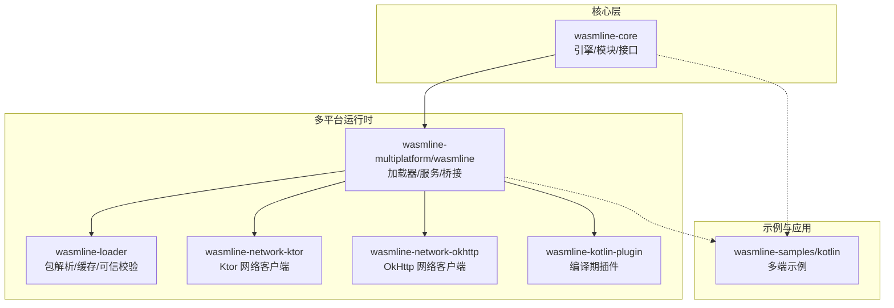
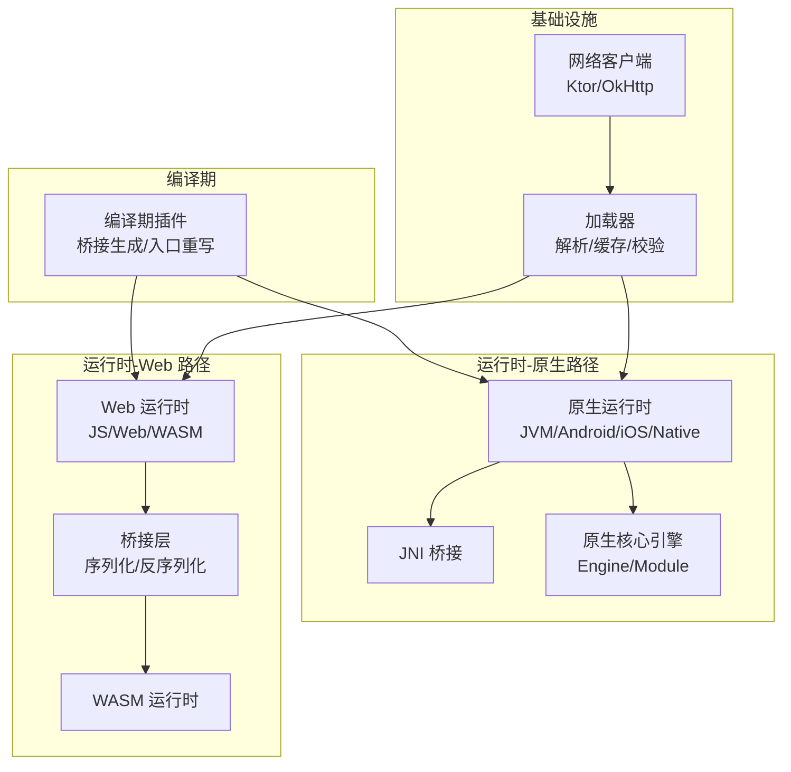
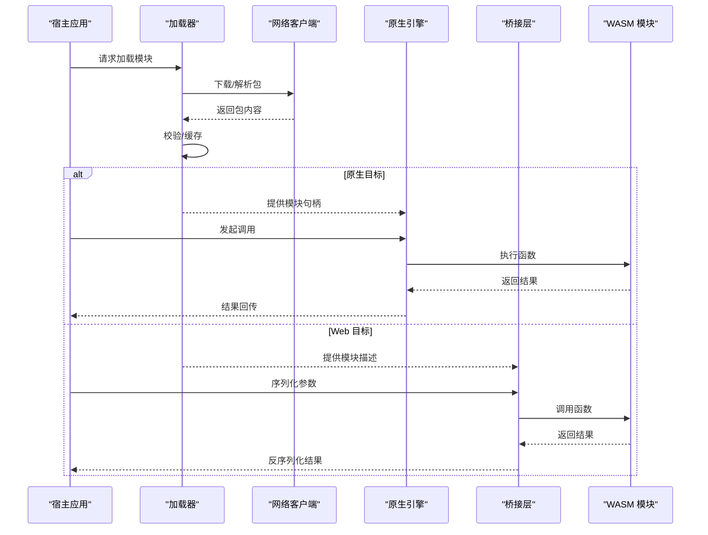
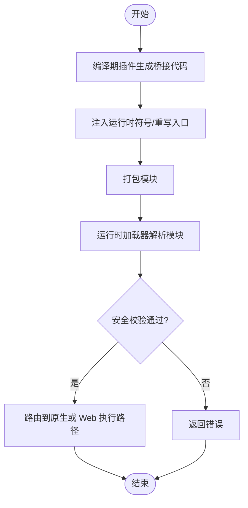
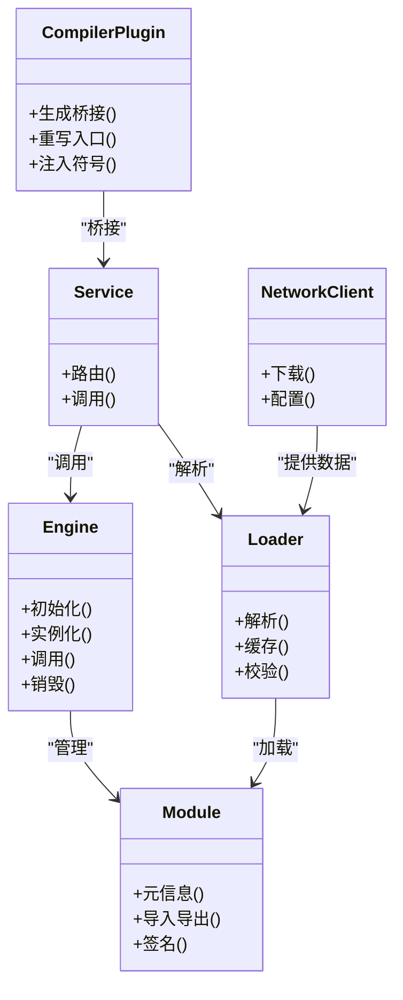
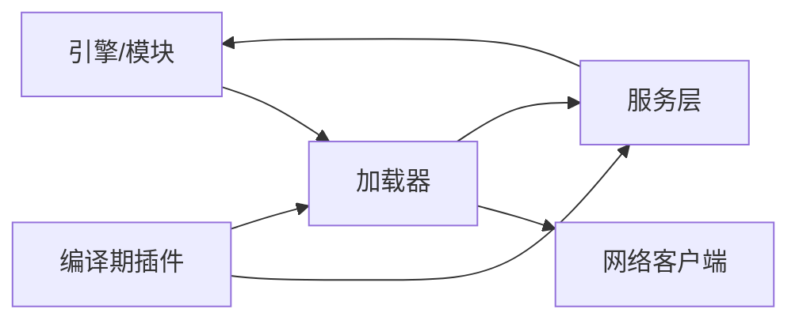

# 架构概览

<cite>
**本文档引用的文件**
- [README.md](file://README.md)
- [README_zh.md](file://README_zh.md)
- [Engine.h](file://wasmline-core/include/Engine.h)
- [Module.h](file://wasmline-core/include/Module.h)
- [Api.h](file://wasmline-core/include/Api.h)
- [WasmlineService.kt](file://wasmline-multiplatform/wasmline/src/commonMain/kotlin/crow/wasmline/WasmlineService.kt)
- [WasmlineLoader.kt](file://wasmline-multiplatform/wasmline/src/hostMain/kotlin/crow/wasmline/WasmlineLoader.kt)
- [DefaultWasmlineLoader.kt](file://wasmline-multiplatform/wasmline-loader/src/hostMain/kotlin/crow/wasmline/loader/DefaultWasmlineLoader.kt)
- [KtorNetworkClient.kt](file://wasmline-multiplatform/wasmline-network-ktor/src/commonMain/kotlin/crow/wasmline/network/ktor/KtorNetworkClient.kt)
- [OkHttpNetworkClient.kt](file://wasmline-multiplatform/wasmline-network-okhttp/src/commonMain/kotlin/crow/wasmline/network/okhttp/OkHttpNetworkClient.kt)
- [WasmlineBridgeGenerator.kt](file://wasmline-multiplatform/wasmline-kotlin-plugin/src/main/kotlin/crow/wasmline/kotlin/WasmlineBridgeGenerator.kt)
- [WasmlineCompilerPluginRegistrar.kt](file://wasmline-multiplatform/wasmline-kotlin-plugin/src/main/kotlin/crow/wasmline/kotlin/WasmlineCompilerPluginRegistrar.kt)
- [WasmMain.kt](file://wasmline-multiplatform/wasmline/src/wasmWasiMain/kotlin/crow/wasmline/WasmMain.kt)
- [Wasmline.wasmWasi.kt](file://wasmline-multiplatform/wasmline/src/wasmWasiMain/kotlin/crow/wasmline/Wasmline.wasmWasi.kt)
- [Wasmline.js.kt](file://wasmline-multiplatform/wasmline/src/jsMain/kotlin/crow/wasmline/Wasmline.js.kt)
- [Wasmline.web.kt](file://wasmline-multiplatform/wasmline/src/webMain/kotlin/crow/wasmline/Wasmline.web.kt)
- [WasmlineNative.cpp](file://wasmline-multiplatform/wasmline/src/hostMain/kotlin/crow/wasmline/native/WasmlineNative.cpp)
- [WasmlineNative.h](file://wasmline-multiplatform/wasmline/src/hostMain/kotlin/crow/wasmline/native/WasmlineNative.h)
- [JniHostHandler.cpp](file://wasmline-multiplatform/wasmline/src/jniMain/kotlin/crow/wasmline/native/JniHostHandler.cpp)
- [JniHostHandler.h](file://wasmline-multiplatform/wasmline/src/jniMain/kotlin/crow/wasmline/native/JniHostHandler.h)
- [build.gradle.kts](file://wasmline-multiplatform/wasmline/build.gradle.kts)
- [settings.gradle.kts](file://wasmline-multiplatform/settings.gradle.kts)
</cite>

## 目录
1. [引言](#引言)
2. [项目结构](#项目结构)
3. [核心组件](#核心组件)
4. [架构总览](#架构总览)
5. [详细组件分析](#详细组件分析)
6. [依赖分析](#依赖分析)
7. [性能考虑](#性能考虑)
8. [故障排除指南](#故障排除指南)
9. [结论](#结论)
10. [附录](#附录)

## 引言
本文件为 Wasmline 项目的架构概览文档，面向希望理解系统高层设计与实现原理的开发者与技术管理者。文档从系统架构、核心组件、双路径执行模型（原生目标 vs Web 目标）、编译时与运行时职责划分、模块化设计、数据流与控制流、架构决策与权衡等方面进行系统性梳理，并提供多类架构图与组件交互图，帮助读者快速建立对 Wasmline 的整体认知。

## 项目结构
Wasmline 采用多模块、多平台的分层组织方式：
- 核心引擎与接口层：位于 wasmline-core，提供跨平台的引擎、模块、API 等基础能力。
- 多平台运行时与桥接层：位于 wasmline-multiplatform/wasmline，覆盖 JVM、Android、iOS、Web、WASM 等平台，提供统一的加载器、服务、网络客户端、桥接生成器等。
- 加载器子系统：位于 wasmline-multiplatform/wasmline-loader，负责包解析、缓存、可信密钥校验、源解析等。
- 网络客户端：位于 wasmline-multiplatform/wasmline-network-ktor 与 wasmline-network-okhttp，提供基于 Ktor 与 OkHttp 的网络实现。
- 编译期插件：位于 wasmline-multiplatform/wasmline-kotlin-plugin，提供桥接代码生成、编译期符号处理、入口导出等功能。
- 示例与样例应用：位于 wasmline-samples/kotlin，覆盖 Android、桌面、Web、WASM 等多端示例。

**图表来源**
- [build.gradle.kts](file://wasmline-multiplatform/wasmline/build.gradle.kts)
- [settings.gradle.kts](file://wasmline-multiplatform/settings.gradle.kts)

**章节来源**
- [README.md](file://README.md)
- [README_zh.md](file://README_zh.md)

## 核心组件
- 引擎（Engine）：提供 WASM 模块生命周期管理、实例化、调用调度等核心能力，是所有运行时的基础。
- 模块（Module）：封装 WASM 模块的元信息、导入导出、版本与签名等，支持跨平台加载与验证。
- API 接口（Api）：定义对外暴露的服务契约与调用规范，确保多平台一致性。
- 加载器（Loader）：负责从本地或远程解析并加载模块，支持缓存、签名校验、目标平台选择。
- 网络客户端：提供统一的网络访问抽象，支持多实现（Ktor、OkHttp），适配不同运行环境。
- 编译期插件：在编译阶段生成桥接代码、重写入口点、注入运行时符号，保证宿主与 WASM 的互操作。
- 运行时服务（WasmlineService）：在多平台运行时中提供统一的服务注册、路由与调用能力。

**章节来源**
- [Engine.h](file://wasmline-core/include/Engine.h)
- [Module.h](file://wasmline-core/include/Module.h)
- [Api.h](file://wasmline-core/include/Api.h)
- [WasmlineService.kt](file://wasmline-multiplatform/wasmline/src/commonMain/kotlin/crow/wasmline/WasmlineService.kt)

## 架构总览
Wasmline 的总体架构围绕“统一 API + 多平台运行时 + 可插拔网络 + 编译期桥接”的设计展开。系统通过加载器完成模块解析与安全校验，通过网络客户端完成远端资源获取，通过编译期插件生成桥接代码以实现宿主与 WASM 的无缝通信。运行时根据目标平台选择不同的执行路径：原生路径（JVM/Android/iOS/Native）与 Web 路径（JS/Web/WASM）。

**图表来源**
- [WasmlineBridgeGenerator.kt](file://wasmline-multiplatform/wasmline-kotlin-plugin/src/main/kotlin/crow/wasmline/kotlin/WasmlineBridgeGenerator.kt)
- [WasmlineLoader.kt](file://wasmline-multiplatform/wasmline/src/hostMain/kotlin/crow/wasmline/WasmlineLoader.kt)
- [DefaultWasmlineLoader.kt](file://wasmline-multiplatform/wasmline-loader/src/hostMain/kotlin/crow/wasmline/loader/DefaultWasmlineLoader.kt)
- [KtorNetworkClient.kt](file://wasmline-multiplatform/wasmline-network-ktor/src/commonMain/kotlin/crow/wasmline/network/ktor/KtorNetworkClient.kt)
- [OkHttpNetworkClient.kt](file://wasmline-multiplatform/wasmline-network-okhttp/src/commonMain/kotlin/crow/wasmline/network/okhttp/OkHttpNetworkClient.kt)
- [WasmlineNative.cpp](file://wasmline-multiplatform/wasmline/src/hostMain/kotlin/crow/wasmline/native/WasmlineNative.cpp)
- [WasmlineNative.h](file://wasmline-multiplatform/wasmline/src/hostMain/kotlin/crow/wasmline/native/WasmlineNative.h)
- [WasmMain.kt](file://wasmline-multiplatform/wasmline/src/wasmWasiMain/kotlin/crow/wasmline/WasmMain.kt)
- [Wasmline.wasmWasi.kt](file://wasmline-multiplatform/wasmline/src/wasmWasiMain/kotlin/crow/wasmline/Wasmline.wasmWasi.kt)
- [Wasmline.js.kt](file://wasmline-multiplatform/wasmline/src/jsMain/kotlin/crow/wasmline/Wasmline.js.kt)
- [Wasmline.web.kt](file://wasmline-multiplatform/wasmline/src/webMain/kotlin/crow/wasmline/Wasmline.web.kt)

## 详细组件分析

### 双路径执行模型
- 原生目标（JVM/Android/iOS/Native）
  - 通过 JNI 或原生绑定与宿主交互，使用原生核心引擎进行模块管理与调用。
  - 关键文件：[WasmlineNative.cpp](file://wasmline-multiplatform/wasmline/src/hostMain/kotlin/crow/wasmline/native/WasmlineNative.cpp)、[WasmlineNative.h](file://wasmline-multiplatform/wasmline/src/hostMain/kotlin/crow/wasmline/native/WasmlineNative.h)、[JniHostHandler.cpp](file://wasmline-multiplatform/wasmline/src/jniMain/kotlin/crow/wasmline/native/JniHostHandler.cpp)、[JniHostHandler.h](file://wasmline-multiplatform/wasmline/src/jniMain/kotlin/crow/wasmline/native/JniHostHandler.h)、[Engine.h](file://wasmline-core/include/Engine.h)、[Module.h](file://wasmline-core/include/Module.h)。
- Web 目标（JS/Web/WASM）
  - 在浏览器或 WebAssembly 环境中运行，通过序列化/反序列化桥接宿主与 WASM，支持 WasmMain 与 wasmWasi 扩展。
  - 关键文件：[WasmMain.kt](file://wasmline-multiplatform/wasmline/src/wasmWasiMain/kotlin/crow/wasmline/WasmMain.kt)、[Wasmline.wasmWasi.kt](file://wasmline-multiplatform/wasmline/src/wasmWasiMain/kotlin/crow/wasmline/Wasmline.wasmWasi.kt)、[Wasmline.js.kt](file://wasmline-multiplatform/wasmline/src/jsMain/kotlin/crow/wasmline/Wasmline.js.kt)、[Wasmline.web.kt](file://wasmline-multiplatform/wasmline/src/webMain/kotlin/crow/wasmline/Wasmline.web.kt)。

**图表来源**
- [WasmlineLoader.kt](file://wasmline-multiplatform/wasmline/src/hostMain/kotlin/crow/wasmline/WasmlineLoader.kt)
- [DefaultWasmlineLoader.kt](file://wasmline-multiplatform/wasmline-loader/src/hostMain/kotlin/crow/wasmline/loader/DefaultWasmlineLoader.kt)
- [KtorNetworkClient.kt](file://wasmline-multiplatform/wasmline-network-ktor/src/commonMain/kotlin/crow/wasmline/network/ktor/KtorNetworkClient.kt)
- [OkHttpNetworkClient.kt](file://wasmline-multiplatform/wasmline-network-okhttp/src/commonMain/kotlin/crow/wasmline/network/okhttp/OkHttpNetworkClient.kt)
- [WasmlineNative.cpp](file://wasmline-multiplatform/wasmline/src/hostMain/kotlin/crow/wasmline/native/WasmlineNative.cpp)
- [WasmMain.kt](file://wasmline-multiplatform/wasmline/src/wasmWasiMain/kotlin/crow/wasmline/WasmMain.kt)
- [Wasmline.js.kt](file://wasmline-multiplatform/wasmline/src/jsMain/kotlin/crow/wasmline/Wasmline.js.kt)

**章节来源**
- [WasmlineNative.cpp](file://wasmline-multiplatform/wasmline/src/hostMain/kotlin/crow/wasmline/native/WasmlineNative.cpp)
- [WasmlineNative.h](file://wasmline-multiplatform/wasmline/src/hostMain/kotlin/crow/wasmline/native/WasmlineNative.h)
- [JniHostHandler.cpp](file://wasmline-multiplatform/wasmline/src/jniMain/kotlin/crow/wasmline/native/JniHostHandler.cpp)
- [JniHostHandler.h](file://wasmline-multiplatform/wasmline/src/jniMain/kotlin/crow/wasmline/native/JniHostHandler.h)
- [WasmMain.kt](file://wasmline-multiplatform/wasmline/src/wasmWasiMain/kotlin/crow/wasmline/WasmMain.kt)
- [Wasmline.wasmWasi.kt](file://wasmline-multiplatform/wasmline/src/wasmWasiMain/kotlin/crow/wasmline/Wasmline.wasmWasi.kt)
- [Wasmline.js.kt](file://wasmline-multiplatform/wasmline/src/jsMain/kotlin/crow/wasmline/Wasmline.js.kt)
- [Wasmline.web.kt](file://wasmline-multiplatform/wasmline/src/webMain/kotlin/crow/wasmline/Wasmline.web.kt)

### 编译时与运行时职责分工
- 编译时（Compiler Plugin）
  - 生成桥接代码，确保宿主与 WASM 的类型与方法签名一致。
  - 重写入口点，注入运行时符号，便于运行时定位与调用。
  - 关键文件：[WasmlineBridgeGenerator.kt](file://wasmline-multiplatform/wasmline-kotlin-plugin/src/main/kotlin/crow/wasmline/kotlin/WasmlineBridgeGenerator.kt)、[WasmlineCompilerPluginRegistrar.kt](file://wasmline-multiplatform/wasmline-kotlin-plugin/src/main/kotlin/crow/wasmline/kotlin/WasmlineCompilerPluginRegistrar.kt)。
- 运行时（Runtime）
  - 加载器负责模块解析、缓存与安全校验；网络客户端负责下载与传输；服务层负责统一 API 路由与调用。
  - 关键文件：[WasmlineLoader.kt](file://wasmline-multiplatform/wasmline/src/hostMain/kotlin/crow/wasmline/WasmlineLoader.kt)、[DefaultWasmlineLoader.kt](file://wasmline-multiplatform/wasmline-loader/src/hostMain/kotlin/crow/wasmline/loader/DefaultWasmlineLoader.kt)、[KtorNetworkClient.kt](file://wasmline-multiplatform/wasmline-network-ktor/src/commonMain/kotlin/crow/wasmline/network/ktor/KtorNetworkClient.kt)、[OkHttpNetworkClient.kt](file://wasmline-multiplatform/wasmline-network-okhttp/src/commonMain/kotlin/crow/wasmline/network/okhttp/OkHttpNetworkClient.kt)、[WasmlineService.kt](file://wasmline-multiplatform/wasmline/src/commonMain/kotlin/crow/wasmline/WasmlineService.kt)。

**图表来源**
- [WasmlineBridgeGenerator.kt](file://wasmline-multiplatform/wasmline-kotlin-plugin/src/main/kotlin/crow/wasmline/kotlin/WasmlineBridgeGenerator.kt)
- [WasmlineCompilerPluginRegistrar.kt](file://wasmline-multiplatform/wasmline-kotlin-plugin/src/main/kotlin/crow/wasmline/kotlin/WasmlineCompilerPluginRegistrar.kt)
- [WasmlineLoader.kt](file://wasmline-multiplatform/wasmline/src/hostMain/kotlin/crow/wasmline/WasmlineLoader.kt)
- [DefaultWasmlineLoader.kt](file://wasmline-multiplatform/wasmline-loader/src/hostMain/kotlin/crow/wasmline/loader/DefaultWasmlineLoader.kt)

**章节来源**
- [WasmlineBridgeGenerator.kt](file://wasmline-multiplatform/wasmline-kotlin-plugin/src/main/kotlin/crow/wasmline/kotlin/WasmlineBridgeGenerator.kt)
- [WasmlineCompilerPluginRegistrar.kt](file://wasmline-multiplatform/wasmline-kotlin-plugin/src/main/kotlin/crow/wasmline/kotlin/WasmlineCompilerPluginRegistrar.kt)
- [WasmlineLoader.kt](file://wasmline-multiplatform/wasmline/src/hostMain/kotlin/crow/wasmline/WasmlineLoader.kt)
- [DefaultWasmlineLoader.kt](file://wasmline-multiplatform/wasmline-loader/src/hostMain/kotlin/crow/wasmline/loader/DefaultWasmlineLoader.kt)

### 模块化架构设计
- 引擎与模块：提供跨平台的模块生命周期与调用能力，作为底层基础设施。
- 加载器子系统：独立于具体平台，负责包解析、缓存、可信密钥校验与源解析。
- 网络客户端：可替换实现，适配不同运行环境与网络栈。
- 编译期插件：与运行时解耦，专注于桥接生成与符号注入。
- 运行时服务：统一 API 路由与调用，屏蔽平台差异。

**图表来源**
- [Engine.h](file://wasmline-core/include/Engine.h)
- [Module.h](file://wasmline-core/include/Module.h)
- [WasmlineLoader.kt](file://wasmline-multiplatform/wasmline/src/hostMain/kotlin/crow/wasmline/WasmlineLoader.kt)
- [DefaultWasmlineLoader.kt](file://wasmline-multiplatform/wasmline-loader/src/hostMain/kotlin/crow/wasmline/loader/DefaultWasmlineLoader.kt)
- [KtorNetworkClient.kt](file://wasmline-multiplatform/wasmline-network-ktor/src/commonMain/kotlin/crow/wasmline/network/ktor/KtorNetworkClient.kt)
- [OkHttpNetworkClient.kt](file://wasmline-multiplatform/wasmline-network-okhttp/src/commonMain/kotlin/crow/wasmline/network/okhttp/OkHttpNetworkClient.kt)
- [WasmlineBridgeGenerator.kt](file://wasmline-multiplatform/wasmline-kotlin-plugin/src/main/kotlin/crow/wasmline/kotlin/WasmlineBridgeGenerator.kt)
- [WasmlineService.kt](file://wasmline-multiplatform/wasmline/src/commonMain/kotlin/crow/wasmline/WasmlineService.kt)

**章节来源**
- [Engine.h](file://wasmline-core/include/Engine.h)
- [Module.h](file://wasmline-core/include/Module.h)
- [WasmlineLoader.kt](file://wasmline-multiplatform/wasmline/src/hostMain/kotlin/crow/wasmline/WasmlineLoader.kt)
- [DefaultWasmlineLoader.kt](file://wasmline-multiplatform/wasmline-loader/src/hostMain/kotlin/crow/wasmline/loader/DefaultWasmlineLoader.kt)
- [KtorNetworkClient.kt](file://wasmline-multiplatform/wasmline-network-ktor/src/commonMain/kotlin/crow/wasmline/network/ktor/KtorNetworkClient.kt)
- [OkHttpNetworkClient.kt](file://wasmline-multiplatform/wasmline-network-okhttp/src/commonMain/kotlin/crow/wasmline/network/okhttp/OkHttpNetworkClient.kt)
- [WasmlineBridgeGenerator.kt](file://wasmline-multiplatform/wasmline-kotlin-plugin/src/main/kotlin/crow/wasmline/kotlin/WasmlineBridgeGenerator.kt)
- [WasmlineService.kt](file://wasmline-multiplatform/wasmline/src/commonMain/kotlin/crow/wasmline/WasmlineService.kt)

## 依赖分析
- 组件内聚与耦合
  - 引擎与模块高度内聚，作为底层基础设施，被加载器与服务层依赖。
  - 加载器与网络客户端松耦合，通过统一接口交互，便于替换实现。
  - 编译期插件与运行时解耦，仅在构建阶段产生影响。
- 外部依赖与集成点
  - 网络客户端支持 Ktor 与 OkHttp，可在不同平台灵活选择。
  - 原生路径依赖 JNI 与原生绑定，Web 路径依赖序列化与运行时桥接。
- 循环依赖风险
  - 当前设计避免了循环依赖：加载器不直接依赖服务层，服务层通过引擎间接使用模块。

**图表来源**
- [Engine.h](file://wasmline-core/include/Engine.h)
- [Module.h](file://wasmline-core/include/Module.h)
- [WasmlineLoader.kt](file://wasmline-multiplatform/wasmline/src/hostMain/kotlin/crow/wasmline/WasmlineLoader.kt)
- [DefaultWasmlineLoader.kt](file://wasmline-multiplatform/wasmline-loader/src/hostMain/kotlin/crow/wasmline/loader/DefaultWasmlineLoader.kt)
- [KtorNetworkClient.kt](file://wasmline-multiplatform/wasmline-network-ktor/src/commonMain/kotlin/crow/wasmline/network/ktor/KtorNetworkClient.kt)
- [OkHttpNetworkClient.kt](file://wasmline-multiplatform/wasmline-network-okhttp/src/commonMain/kotlin/crow/wasmline/network/okhttp/OkHttpNetworkClient.kt)
- [WasmlineService.kt](file://wasmline-multiplatform/wasmline/src/commonMain/kotlin/crow/wasmline/WasmlineService.kt)
- [WasmlineBridgeGenerator.kt](file://wasmline-multiplatform/wasmline-kotlin-plugin/src/main/kotlin/crow/wasmline/kotlin/WasmlineBridgeGenerator.kt)

**章节来源**
- [Engine.h](file://wasmline-core/include/Engine.h)
- [Module.h](file://wasmline-core/include/Module.h)
- [WasmlineLoader.kt](file://wasmline-multiplatform/wasmline/src/hostMain/kotlin/crow/wasmline/WasmlineLoader.kt)
- [DefaultWasmlineLoader.kt](file://wasmline-multiplatform/wasmline-loader/src/hostMain/kotlin/crow/wasmline/loader/DefaultWasmlineLoader.kt)
- [KtorNetworkClient.kt](file://wasmline-multiplatform/wasmline-network-ktor/src/commonMain/kotlin/crow/wasmline/network/ktor/KtorNetworkClient.kt)
- [OkHttpNetworkClient.kt](file://wasmline-multiplatform/wasmline-network-okhttp/src/commonMain/kotlin/crow/wasmline/network/okhttp/OkHttpNetworkClient.kt)
- [WasmlineService.kt](file://wasmline-multiplatform/wasmline/src/commonMain/kotlin/crow/wasmline/WasmlineService.kt)
- [WasmlineBridgeGenerator.kt](file://wasmline-multiplatform/wasmline-kotlin-plugin/src/main/kotlin/crow/wasmline/kotlin/WasmlineBridgeGenerator.kt)

## 性能考虑
- 原生路径
  - 利用 JNI 与原生绑定减少跨语言调用开销，适合高性能计算场景。
  - 建议在频繁调用的路径上复用引擎实例，避免重复初始化。
- Web 路径
  - 通过序列化/反序列化桥接带来额外 CPU 开销，建议批量调用与参数压缩。
  - 合理利用缓存与预热机制，降低首次加载延迟。
- 编译期优化
  - 桥接代码生成应尽量静态化，减少运行时反射与动态绑定。
- 网络与加载
  - 使用多线程下载与分块传输，结合本地缓存提升加载速度。
  - 对模块进行增量更新与差分传输，减少带宽占用。

## 故障排除指南
- 加载失败
  - 检查加载器的解析与校验逻辑，确认签名与可信密钥配置正确。
  - 关注网络客户端的超时与重试策略，确保下载链路稳定。
- 调用异常
  - 原生路径：检查 JNI 参数与返回值类型匹配，避免空指针与越界。
  - Web 路径：检查序列化配置与桥接层的参数映射。
- 编译期问题
  - 确认编译期插件已正确注册，桥接生成与入口重写按预期执行。

**章节来源**
- [DefaultWasmlineLoader.kt](file://wasmline-multiplatform/wasmline-loader/src/hostMain/kotlin/crow/wasmline/loader/DefaultWasmlineLoader.kt)
- [KtorNetworkClient.kt](file://wasmline-multiplatform/wasmline-network-ktor/src/commonMain/kotlin/crow/wasmline/network/ktor/KtorNetworkClient.kt)
- [OkHttpNetworkClient.kt](file://wasmline-multiplatform/wasmline-network-okhttp/src/commonMain/kotlin/crow/wasmline/network/okhttp/OkHttpNetworkClient.kt)
- [WasmlineBridgeGenerator.kt](file://wasmline-multiplatform/wasmline-kotlin-plugin/src/main/kotlin/crow/wasmline/kotlin/WasmlineBridgeGenerator.kt)
- [WasmlineNative.cpp](file://wasmline-multiplatform/wasmline/src/hostMain/kotlin/crow/wasmline/native/WasmlineNative.cpp)
- [JniHostHandler.cpp](file://wasmline-multiplatform/wasmline/src/jniMain/kotlin/crow/wasmline/native/JniHostHandler.cpp)

## 结论
Wasmline 通过“统一 API + 多平台运行时 + 可插拔网络 + 编译期桥接”的架构，在保证跨平台一致性的同时，提供了原生与 Web 两条高效执行路径。模块化设计使各组件职责清晰、耦合度低，便于扩展与维护。编译时与运行时的明确分工进一步提升了系统的可维护性与可演进性。建议在实际落地中重点关注加载与调用性能、序列化开销与网络稳定性，并持续完善编译期桥接与运行时监控体系。

## 附录
- 快速导航
  - 核心接口与引擎：[Engine.h](file://wasmline-core/include/Engine.h)、[Module.h](file://wasmline-core/include/Module.h)、[Api.h](file://wasmline-core/include/Api.h)
  - 多平台运行时：[WasmlineService.kt](file://wasmline-multiplatform/wasmline/src/commonMain/kotlin/crow/wasmline/WasmlineService.kt)、[WasmMain.kt](file://wasmline-multiplatform/wasmline/src/wasmWasiMain/kotlin/crow/wasmline/WasmMain.kt)、[Wasmline.js.kt](file://wasmline-multiplatform/wasmline/src/jsMain/kotlin/crow/wasmline/Wasmline.js.kt)、[Wasmline.web.kt](file://wasmline-multiplatform/wasmline/src/webMain/kotlin/crow/wasmline/Wasmline.web.kt)
  - 加载器与网络：[WasmlineLoader.kt](file://wasmline-multiplatform/wasmline/src/hostMain/kotlin/crow/wasmline/WasmlineLoader.kt)、[DefaultWasmlineLoader.kt](file://wasmline-multiplatform/wasmline-loader/src/hostMain/kotlin/crow/wasmline/loader/DefaultWasmlineLoader.kt)、[KtorNetworkClient.kt](file://wasmline-multiplatform/wasmline-network-ktor/src/commonMain/kotlin/crow/wasmline/network/ktor/KtorNetworkClient.kt)、[OkHttpNetworkClient.kt](file://wasmline-multiplatform/wasmline-network-okhttp/src/commonMain/kotlin/crow/wasmline/network/okhttp/OkHttpNetworkClient.kt)
  - 编译期插件：[WasmlineBridgeGenerator.kt](file://wasmline-multiplatform/wasmline-kotlin-plugin/src/main/kotlin/crow/wasmline/kotlin/WasmlineBridgeGenerator.kt)、[WasmlineCompilerPluginRegistrar.kt](file://wasmline-multiplatform/wasmline-kotlin-plugin/src/main/kotlin/crow/wasmline/kotlin/WasmlineCompilerPluginRegistrar.kt)
  - 原生绑定：[WasmlineNative.cpp](file://wasmline-multiplatform/wasmline/src/hostMain/kotlin/crow/wasmline/native/WasmlineNative.cpp)、[JniHostHandler.cpp](file://wasmline-multiplatform/wasmline/src/jniMain/kotlin/crow/wasmline/native/JniHostHandler.cpp)