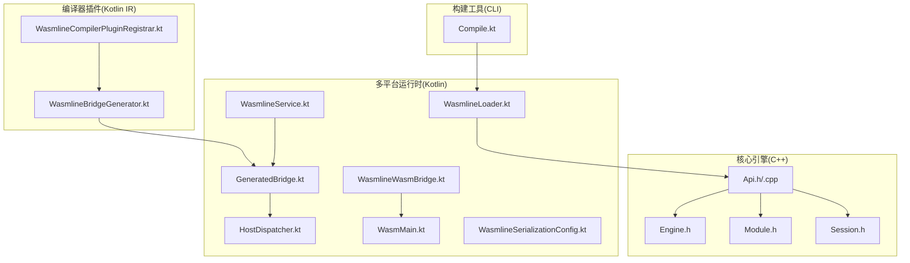
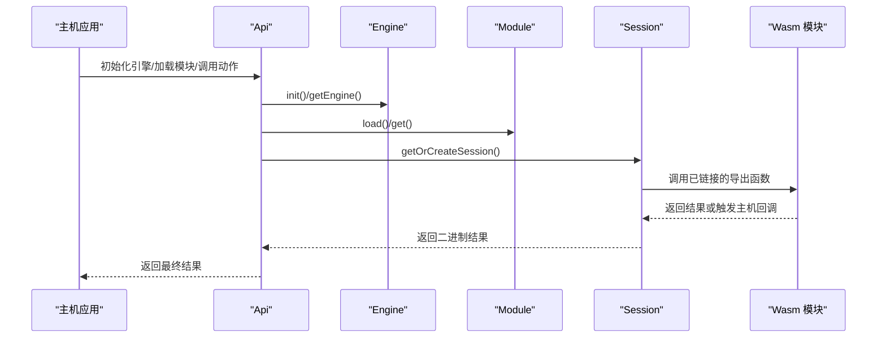
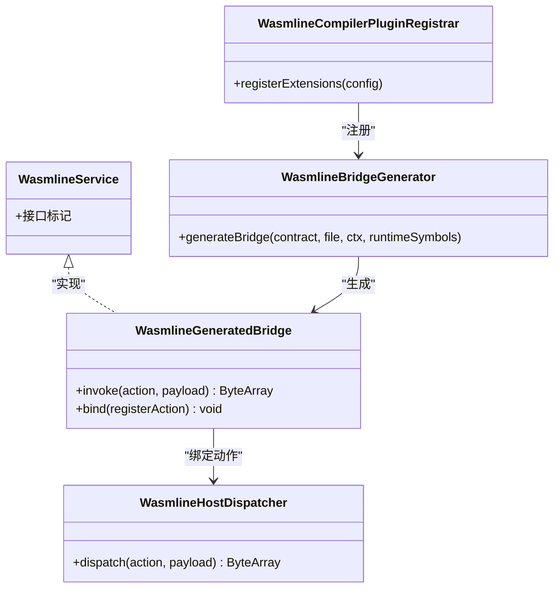
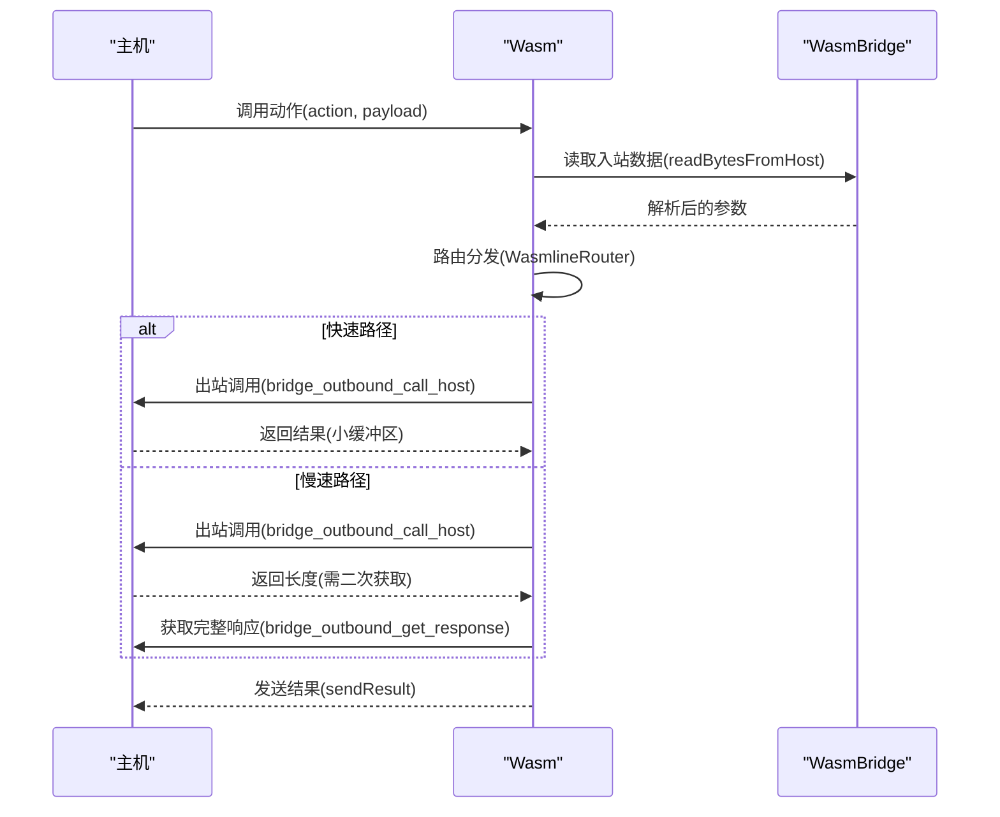
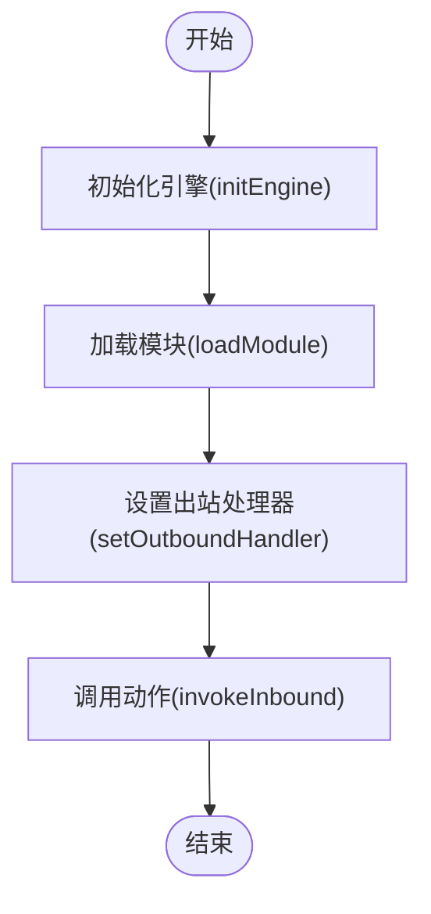
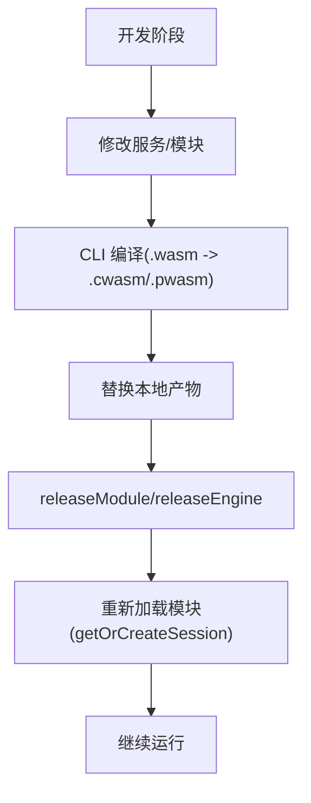
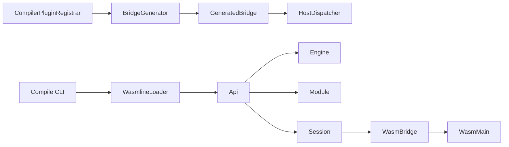

# 核心特性

<cite>
**本文引用的文件**
- [Api.h](file://wasmline-core/include/Api.h)
- [Api.cpp](file://wasmline-core/src/Api.cpp)
- [Engine.h](file://wasmline-core/include/Engine.h)
- [Module.h](file://wasmline-core/include/Module.h)
- [Session.h](file://wasmline-core/include/Session.h)
- [WasmlineService.kt](file://wasmline-multiplatform/wasmline/src/commonMain/kotlin/crow/wasmline/WasmlineService.kt)
- [GeneratedBridge.kt](file://wasmline-multiplatform/wasmline/src/commonMain/kotlin/crow/wasmline/internal/bridge/GeneratedBridge.kt)
- [HostDispatcher.kt](file://wasmline-multiplatform/wasmline/src/commonMain/kotlin/crow/wasmline/internal/bridge/HostDispatcher.kt)
- [WasmlineWasmBridge.kt](file://wasmline-multiplatform/wasmline/src/wasmWasiMain/kotlin/crow/wasmline/WasmlineWasmBridge.kt)
- [WasmMain.kt](file://wasmline-multiplatform/wasmline/src/wasmWasiMain/kotlin/crow/wasmline/WasmMain.kt)
- [WasmlineLoader.kt](file://wasmline-multiplatform/wasmline/src/hostMain/kotlin/crow/wasmline/WasmlineLoader.kt)
- [WasmlineBridgeGenerator.kt](file://wasmline-multiplatform/wasmline-kotlin-plugin/src/main/kotlin/crow/wasmline/kotlin/WasmlineBridgeGenerator.kt)
- [WasmlineCompilerPluginRegistrar.kt](file://wasmline-multiplatform/wasmline-kotlin-plugin/src/main/kotlin/crow/wasmline/kotlin/WasmlineCompilerPluginRegistrar.kt)
- [Compile.kt](file://wasmline-multiplatform/wasmline-cli/src/main/kotlin/crow/wasmline/cli/Compile.kt)
- [WasmlineSerializationConfig.kt](file://wasmline-multiplatform/wasmline/src/commonMain/kotlin/crow/wasmline/serialization/WasmlineSerializationConfig.kt)
</cite>

## 目录
1. [引言](#引言)
2. [项目结构](#项目结构)
3. [核心组件](#核心组件)
4. [架构总览](#架构总览)
5. [详细组件分析](#详细组件分析)
6. [依赖关系分析](#依赖关系分析)
7. [性能考量](#性能考量)
8. [故障排查指南](#故障排查指南)
9. [结论](#结论)
10. [附录](#附录)

## 引言
本文件聚焦 Wasmline 的三大基础不变性与统一 API 表面设计，系统阐述编译时桥接合成、双路径运行时架构、语言无关的插件编写如何协同工作，形成类型安全的服务桥接机制，并在多平台上通过 WASI 执行运行时提供一致的高性能体验。同时覆盖 AOT 编译支持、热重载机制与模块化架构的关键实现要点与使用场景。

## 项目结构
Wasmline 采用“核心引擎 + 多平台运行时 + 编译器插件 + 构建工具”的分层组织：
- 核心引擎（C++）：封装 Wasmtime 引擎生命周期、模块加载与会话管理，提供统一 API。
- 多平台运行时（Kotlin Multiplatform）：定义服务契约、生成桥接代码、实现主机与 Wasm 的双向通信。
- 编译器插件（Kotlin IR）：在编译期生成桥接类与绑定逻辑，确保类型安全与零样板。
- 构建工具（CLI）：提供 AOT/Pulley 预编译产物生成与清单输出，支撑跨平台部署。

**图表来源**
- [Api.h:21-82](file://wasmline-core/include/Api.h#L21-L82)
- [Api.cpp:16-186](file://wasmline-core/src/Api.cpp#L16-L186)
- [Engine.h:16-72](file://wasmline-core/include/Engine.h#L16-L72)
- [Module.h:21-100](file://wasmline-core/include/Module.h#L21-L100)
- [Session.h:20-79](file://wasmline-core/include/Session.h#L20-L79)
- [WasmlineService.kt:20-24](file://wasmline-multiplatform/wasmline/src/commonMain/kotlin/crow/wasmline/WasmlineService.kt#L20-L24)
- [GeneratedBridge.kt:12-44](file://wasmline-multiplatform/wasmline/src/commonMain/kotlin/crow/wasmline/internal/bridge/GeneratedBridge.kt#L12-L44)
- [HostDispatcher.kt:5-8](file://wasmline-multiplatform/wasmline/src/commonMain/kotlin/crow/wasmline/internal/bridge/HostDispatcher.kt#L5-L8)
- [WasmlineWasmBridge.kt:42-144](file://wasmline-multiplatform/wasmline/src/wasmWasiMain/kotlin/crow/wasmline/WasmlineWasmBridge.kt#L42-L144)
- [WasmMain.kt:10-22](file://wasmline-multiplatform/wasmline/src/wasmWasiMain/kotlin/crow/wasmline/WasmMain.kt#L10-L22)
- [WasmlineLoader.kt:16-47](file://wasmline-multiplatform/wasmline/src/hostMain/kotlin/crow/wasmline/WasmlineLoader.kt#L16-L47)
- [WasmlineBridgeGenerator.kt:55-156](file://wasmline-multiplatform/wasmline-kotlin-plugin/src/main/kotlin/crow/wasmline/kotlin/WasmlineBridgeGenerator.kt#L55-L156)
- [WasmlineCompilerPluginRegistrar.kt:27-44](file://wasmline-multiplatform/wasmline-kotlin-plugin/src/main/kotlin/crow/wasmline/kotlin/WasmlineCompilerPluginRegistrar.kt#L27-L44)
- [Compile.kt:42-108](file://wasmline-multiplatform/wasmline-cli/src/main/kotlin/crow/wasmline/cli/Compile.kt#L42-L108)

**章节来源**
- [Api.h:21-82](file://wasmline-core/include/Api.h#L21-L82)
- [Api.cpp:16-186](file://wasmline-core/src/Api.cpp#L16-L186)
- [Engine.h:16-72](file://wasmline-core/include/Engine.h#L16-L72)
- [Module.h:21-100](file://wasmline-core/include/Module.h#L21-L100)
- [Session.h:20-79](file://wasmline-core/include/Session.h#L20-L79)
- [WasmlineService.kt:20-24](file://wasmline-multiplatform/wasmline/src/commonMain/kotlin/crow/wasmline/WasmlineService.kt#L20-L24)
- [GeneratedBridge.kt:12-44](file://wasmline-multiplatform/wasmline/src/commonMain/kotlin/crow/wasmline/internal/bridge/GeneratedBridge.kt#L12-L44)
- [HostDispatcher.kt:5-8](file://wasmline-multiplatform/wasmline/src/commonMain/kotlin/crow/wasmline/internal/bridge/HostDispatcher.kt#L5-L8)
- [WasmlineWasmBridge.kt:42-144](file://wasmline-multiplatform/wasmline/src/wasmWasiMain/kotlin/crow/wasmline/WasmlineWasmBridge.kt#L42-L144)
- [WasmMain.kt:10-22](file://wasmline-multiplatform/wasmline/src/wasmWasiMain/kotlin/crow/wasmline/WasmMain.kt#L10-L22)
- [WasmlineLoader.kt:16-47](file://wasmline-multiplatform/wasmline/src/hostMain/kotlin/crow/wasmline/WasmlineLoader.kt#L16-L47)
- [WasmlineBridgeGenerator.kt:55-156](file://wasmline-multiplatform/wasmline-kotlin-plugin/src/main/kotlin/crow/wasmline/kotlin/WasmlineBridgeGenerator.kt#L55-L156)
- [WasmlineCompilerPluginRegistrar.kt:27-44](file://wasmline-multiplatform/wasmline-kotlin-plugin/src/main/kotlin/crow/wasmline/kotlin/WasmlineCompilerPluginRegistrar.kt#L27-L44)
- [Compile.kt:42-108](file://wasmline-multiplatform/wasmline-cli/src/main/kotlin/crow/wasmline/cli/Compile.kt#L42-L108)

## 核心组件
- 统一 API 外观（Api）：集中管理引擎初始化、模块加载、会话缓存与调用入口，屏蔽底层差异。
- 引擎管理（Engine）：单例封装 Wasmtime 引擎配置与生命周期，支持按产物类型切换后端。
- 模块管理（Module）：线程安全的模块缓存与加载，支持 AOT（.cwasm）与 Pulley（.pwasm）预编译。
- 会话管理（Session）：实例化、链接主机函数、WASI 配置与内存映射，提供双向桥接通道。
- 运行时桥接（GeneratedBridge/HostDispatcher）：编译期生成桥接类，运行时绑定动作到实现，类型安全。
- Wasm 侧桥接（WasmlineWasmBridge/WasmMain）：低层内存拷贝与主机调用，提供快速/慢速路径响应。
- 加载器（WasmlineLoader）：本地预编译产物解析与加载流程，区分后端类型。
- 编译器插件（BridgeGenerator/Registrar）：在 IR 层生成桥接类与绑定逻辑，替换 link/bind 调用点。
- 构建 CLI（Compile）：批量生成 AOT/Pulley 预编译产物，输出清单供加载器消费。

**章节来源**
- [Api.h:21-82](file://wasmline-core/include/Api.h#L21-L82)
- [Api.cpp:41-186](file://wasmline-core/src/Api.cpp#L41-L186)
- [Engine.h:16-72](file://wasmline-core/include/Engine.h#L16-L72)
- [Module.h:21-100](file://wasmline-core/include/Module.h#L21-L100)
- [Session.h:20-79](file://wasmline-core/include/Session.h#L20-L79)
- [WasmlineService.kt:20-24](file://wasmline-multiplatform/wasmline/src/commonMain/kotlin/crow/wasmline/WasmlineService.kt#L20-L24)
- [GeneratedBridge.kt:12-44](file://wasmline-multiplatform/wasmline/src/commonMain/kotlin/crow/wasmline/internal/bridge/GeneratedBridge.kt#L12-L44)
- [HostDispatcher.kt:5-8](file://wasmline-multiplatform/wasmline/src/commonMain/kotlin/crow/wasmline/internal/bridge/HostDispatcher.kt#L5-L8)
- [WasmlineWasmBridge.kt:42-144](file://wasmline-multiplatform/wasmline/src/wasmWasiMain/kotlin/crow/wasmline/WasmlineWasmBridge.kt#L42-L144)
- [WasmMain.kt:10-22](file://wasmline-multiplatform/wasmline/src/wasmWasiMain/kotlin/crow/wasmline/WasmMain.kt#L10-L22)
- [WasmlineLoader.kt:16-47](file://wasmline-multiplatform/wasmline/src/hostMain/kotlin/crow/wasmline/WasmlineLoader.kt#L16-L47)
- [WasmlineBridgeGenerator.kt:55-156](file://wasmline-multiplatform/wasmline-kotlin-plugin/src/main/kotlin/crow/wasmline/kotlin/WasmlineBridgeGenerator.kt#L55-L156)
- [WasmlineCompilerPluginRegistrar.kt:27-44](file://wasmline-multiplatform/wasmline-kotlin-plugin/src/main/kotlin/crow/wasmline/kotlin/WasmlineCompilerPluginRegistrar.kt#L27-L44)
- [Compile.kt:42-108](file://wasmline-multiplatform/wasmline-cli/src/main/kotlin/crow/wasmline/cli/Compile.kt#L42-L108)

## 架构总览
Wasmline 的统一 API 表面将“引擎—模块—会话”与“主机—Wasm 双向桥接”整合为一条清晰的执行链路，既保证了跨平台一致性，又通过编译期合成与运行时桥接实现类型安全与高性能。

**图表来源**
- [Api.cpp:41-186](file://wasmline-core/src/Api.cpp#L41-L186)
- [Engine.h:16-72](file://wasmline-core/include/Engine.h#L16-L72)
- [Module.h:21-100](file://wasmline-core/include/Module.h#L21-L100)
- [Session.h:20-79](file://wasmline-core/include/Session.h#L20-L79)

## 详细组件分析

### 特性一：编译时桥接合成（类型安全的服务桥接）
- 设计理念：通过编译器插件在 IR 层生成桥接类与绑定方法，将 link()/bind() 调用点直接替换为生成的桥接实例，消除运行时反射与动态绑定开销。
- 实现方式：
  - 服务契约接口（WasmlineService）作为编译期约束入口，限制方法签名与参数类型。
  - 生成桥接类包含 invoke(action, payload) 与 bind(registerAction) 两个核心能力，分别用于“调用转发”和“动作注册”。
  - 编译期将每个合约方法转换为“动作名 + 序列化载荷”的调用，返回值自动反序列化。
- 技术优势：
  - 类型安全：编译期校验，避免运行时错误。
  - 零样板：自动生成桥接与绑定逻辑。
  - 易扩展：新增合约方法无需手动桥接，插件自动处理。
- 使用场景：
  - 主机侧定义服务接口，Wasm 侧实现对应动作；通过生成桥接在两端透明通信。
  - 支持多种序列化工厂（原始字节、ProtoBuf 等），由运行时配置选择。

**图表来源**
- [WasmlineService.kt:20-24](file://wasmline-multiplatform/wasmline/src/commonMain/kotlin/crow/wasmline/WasmlineService.kt#L20-L24)
- [GeneratedBridge.kt:12-44](file://wasmline-multiplatform/wasmline/src/commonMain/kotlin/crow/wasmline/internal/bridge/GeneratedBridge.kt#L12-L44)
- [HostDispatcher.kt:5-8](file://wasmline-multiplatform/wasmline/src/commonMain/kotlin/crow/wasmline/internal/bridge/HostDispatcher.kt#L5-L8)
- [WasmlineBridgeGenerator.kt:55-156](file://wasmline-multiplatform/wasmline-kotlin-plugin/src/main/kotlin/crow/wasmline/kotlin/WasmlineBridgeGenerator.kt#L55-L156)
- [WasmlineCompilerPluginRegistrar.kt:27-44](file://wasmline-multiplatform/wasmline-kotlin-plugin/src/main/kotlin/crow/wasmline/kotlin/WasmlineCompilerPluginRegistrar.kt#L27-L44)

**章节来源**
- [WasmlineService.kt:20-24](file://wasmline-multiplatform/wasmline/src/commonMain/kotlin/crow/wasmline/WasmlineService.kt#L20-L24)
- [GeneratedBridge.kt:12-44](file://wasmline-multiplatform/wasmline/src/commonMain/kotlin/crow/wasmline/internal/bridge/GeneratedBridge.kt#L12-L44)
- [HostDispatcher.kt:5-8](file://wasmline-multiplatform/wasmline/src/commonMain/kotlin/crow/wasmline/internal/bridge/HostDispatcher.kt#L5-L8)
- [WasmlineBridgeGenerator.kt:55-156](file://wasmline-multiplatform/wasmline-kotlin-plugin/src/main/kotlin/crow/wasmline/kotlin/WasmlineBridgeGenerator.kt#L55-L156)
- [WasmlineCompilerPluginRegistrar.kt:27-44](file://wasmline-multiplatform/wasmline-kotlin-plugin/src/main/kotlin/crow/wasmline/kotlin/WasmlineCompilerPluginRegistrar.kt#L27-L44)

### 特性二：双路径运行时架构（主机与 Wasm 双向桥接）
- 设计理念：通过“入站/出站”两条通道实现主机与 Wasm 的双向通信，入站从主机写入动作与参数，出站由 Wasm 调用主机并读取响应。
- 实现方式：
  - 入站通道：主机将 action 与 payload 写入 Wasm 线性内存，Wasm 通过导入函数读取并执行路由分发。
  - 出站通道：Wasm 将 action 与 payload 发送至主机，主机根据注册的动作处理器返回结果，Wasm 读取响应。
  - 快速/慢速路径：Wasm 侧预分配小缓冲区进行快速路径，若主机响应过大则走慢速路径二次拷贝。
- 技术优势：
  - 低拷贝：线性内存访问与栈式分配器减少 GC 压力。
  - 双向解耦：动作名与载荷分离，便于扩展与版本兼容。
  - 可靠性：明确的错误处理与未知动作检测。
- 使用场景：
  - 主机侧提供系统能力（文件、网络、日志等），Wasm 侧以服务形式调用。
  - 跨平台一致的桥接语义，统一在不同宿主（Android/JVM/浏览器/WASI）上复用。

**图表来源**
- [WasmlineWasmBridge.kt:42-144](file://wasmline-multiplatform/wasmline/src/wasmWasiMain/kotlin/crow/wasmline/WasmlineWasmBridge.kt#L42-L144)
- [WasmMain.kt:10-22](file://wasmline-multiplatform/wasmline/src/wasmWasiMain/kotlin/crow/wasmline/WasmMain.kt#L10-L22)

**章节来源**
- [WasmlineWasmBridge.kt:42-144](file://wasmline-multiplatform/wasmline/src/wasmWasiMain/kotlin/crow/wasmline/WasmlineWasmBridge.kt#L42-L144)
- [WasmMain.kt:10-22](file://wasmline-multiplatform/wasmline/src/wasmWasiMain/kotlin/crow/wasmline/WasmMain.kt#L10-L22)

### 特性三：语言无关的插件编写（统一 API 表面）
- 设计理念：通过统一 API 表面屏蔽平台差异，使插件开发者仅关注服务契约与序列化策略，不关心底层引擎与桥接细节。
- 实现方式：
  - 统一 API（Api）：提供 initEngine、loadModule、invokeInbound、setOutboundHandler 等跨平台接口。
  - 模块与会话抽象：Engine/Module/Session 分层封装，对外暴露稳定接口。
  - 运行时序列化配置：WasmlineSerializationConfig 支持多种工厂与选项，便于跨语言互通。
- 技术优势：
  - 插件可移植：同一套服务契约可在 JVM/Android/WebAssembly/WASI 等平台复用。
  - 易维护：统一的生命周期与错误处理，降低平台适配成本。
- 使用场景：
  - 在 JVM 上以 Kotlin/Java 开发服务，打包为 .cwasm 或 .pwasm，在 Android/iOS/Web 上直接加载运行。
  - 通过 CLI 一键生成多目标预编译产物，简化发布流程。

**图表来源**
- [Api.h:21-82](file://wasmline-core/include/Api.h#L21-L82)
- [Api.cpp:41-186](file://wasmline-core/src/Api.cpp#L41-L186)

**章节来源**
- [Api.h:21-82](file://wasmline-core/include/Api.h#L21-L82)
- [Api.cpp:41-186](file://wasmline-core/src/Api.cpp#L41-L186)
- [WasmlineSerializationConfig.kt:12-39](file://wasmline-multiplatform/wasmline/src/commonMain/kotlin/crow/wasmline/serialization/WasmlineSerializationConfig.kt#L12-L39)

### 统一 API 表面的设计理念与实现
- 设计理念：以“最小可用接口”暴露核心能力，隐藏引擎、模块、会话与桥接细节，确保跨平台一致性。
- 关键接口：
  - 初始化与释放：initEngine、releaseEngine
  - 模块管理：loadModule/loadModuleUnsafe/releaseModule
  - 会话调用：invokeInbound
  - 出站处理器：setOutboundHandler
- 实现要点：
  - 引擎按产物类型自动切换后端（Pulley/AOT），避免重复初始化。
  - 会话缓存采用读写锁优化并发访问。
  - 模块加载支持锁合并与条件变量协调，提升吞吐。

**章节来源**
- [Api.h:21-82](file://wasmline-core/include/Api.h#L21-L82)
- [Api.cpp:41-186](file://wasmline-core/src/Api.cpp#L41-L186)
- [Engine.h:16-72](file://wasmline-core/include/Engine.h#L16-L72)
- [Module.h:21-100](file://wasmline-core/include/Module.h#L21-L100)
- [Session.h:20-79](file://wasmline-core/include/Session.h#L20-L79)

### 类型安全服务桥接机制的工作原理与技术优势
- 工作原理：
  - 编译期：插件扫描服务契约，生成桥接类与绑定方法，替换 link()/bind() 调用点。
  - 运行期：桥接类负责序列化/反序列化、动作名拼装与结果回传；HostDispatcher 将动作路由到具体实现。
- 技术优势：
  - 零反射：纯静态调用，无反射开销。
  - 易扩展：新增方法自动纳入桥接生成。
  - 可观测：生成桥接类与动作名，便于调试与诊断。

**章节来源**
- [WasmlineBridgeGenerator.kt:55-156](file://wasmline-multiplatform/wasmline-kotlin-plugin/src/main/kotlin/crow/wasmline/kotlin/WasmlineBridgeGenerator.kt#L55-L156)
- [GeneratedBridge.kt:12-44](file://wasmline-multiplatform/wasmline/src/commonMain/kotlin/crow/wasmline/internal/bridge/GeneratedBridge.kt#L12-L44)
- [HostDispatcher.kt:5-8](file://wasmline-multiplatform/wasmline/src/commonMain/kotlin/crow/wasmline/internal/bridge/HostDispatcher.kt#L5-L8)

### 跨平台 WASI 执行运行时的实现细节
- 本地加载桥接：WasmlineLocalArtifactBridge 统一解析本地预编译产物，区分 .cwasm 与 .pwasm 并调用平台实际加载。
- 后端识别：根据文件扩展名自动识别后端代码（AOT/Pulley），并在引擎未初始化或模式不符时重新初始化。
- 入站/出站桥接：WasmMain 与 WasmlineWasmBridge 提供入站读取与出站调用的低层实现，支持快速/慢速路径。

**章节来源**
- [WasmlineLoader.kt:16-47](file://wasmline-multiplatform/wasmline/src/hostMain/kotlin/crow/wasmline/WasmlineLoader.kt#L16-L47)
- [Api.cpp:87-114](file://wasmline-core/src/Api.cpp#L87-L114)
- [WasmMain.kt:10-22](file://wasmline-multiplatform/wasmline/src/wasmWasiMain/kotlin/crow/wasmline/WasmMain.kt#L10-L22)
- [WasmlineWasmBridge.kt:42-144](file://wasmline-multiplatform/wasmline/src/wasmWasiMain/kotlin/crow/wasmline/WasmlineWasmBridge.kt#L42-L144)

### AOT 编译支持与热重载机制
- AOT 编译支持：
  - CLI 编译任务将 .wasm 编译为多目标 .cwasm/.pwasm，输出 compile-result.json 清单。
  - 支持目标别名到标准三元组映射，避免 OS 信息缺失导致的运行时错误。
- 热重载机制：
  - 通过 releaseModule 与 releaseEngine 释放资源，结合会话缓存重建实现“模块级热重载”。
  - 建议在开发阶段配合文件监控与增量编译，结合 CLI 重新生成产物并替换本地缓存。

**图表来源**
- [Compile.kt:158-278](file://wasmline-multiplatform/wasmline-cli/src/main/kotlin/crow/wasmline/cli/Compile.kt#L158-L278)
- [Api.cpp:117-129](file://wasmline-core/src/Api.cpp#L117-L129)
- [Api.cpp:148-185](file://wasmline-core/src/Api.cpp#L148-L185)

**章节来源**
- [Compile.kt:158-278](file://wasmline-multiplatform/wasmline-cli/src/main/kotlin/crow/wasmline/cli/Compile.kt#L158-L278)
- [Api.cpp:117-129](file://wasmline-core/src/Api.cpp#L117-L129)
- [Api.cpp:148-185](file://wasmline-core/src/Api.cpp#L148-L185)

### 模块化架构与跨平台适配
- 模块化：
  - 核心引擎模块（C++）：独立于平台，提供稳定的 API。
  - 运行时模块（Kotlin）：按平台划分 actuals，共享公共逻辑。
  - 插件模块（Kotlin IR）：在编译期注入桥接代码。
  - CLI 模块：统一构建与发布流程。
- 跨平台适配：
  - 通过 WasmlineLoader 的平台实际加载器解析本地产物，自动识别后端类型。
  - 引擎按产物类型切换后端，避免重复初始化与资源浪费。

**章节来源**
- [WasmlineLoader.kt:16-47](file://wasmline-multiplatform/wasmline/src/hostMain/kotlin/crow/wasmline/WasmlineLoader.kt#L16-L47)
- [Api.cpp:87-114](file://wasmline-core/src/Api.cpp#L87-L114)

## 依赖关系分析

**图表来源**
- [WasmlineCompilerPluginRegistrar.kt:27-44](file://wasmline-multiplatform/wasmline-kotlin-plugin/src/main/kotlin/crow/wasmline/kotlin/WasmlineCompilerPluginRegistrar.kt#L27-L44)
- [WasmlineBridgeGenerator.kt:55-156](file://wasmline-multiplatform/wasmline-kotlin-plugin/src/main/kotlin/crow/wasmline/kotlin/WasmlineBridgeGenerator.kt#L55-L156)
- [GeneratedBridge.kt:12-44](file://wasmline-multiplatform/wasmline/src/commonMain/kotlin/crow/wasmline/internal/bridge/GeneratedBridge.kt#L12-L44)
- [HostDispatcher.kt:5-8](file://wasmline-multiplatform/wasmline/src/commonMain/kotlin/crow/wasmline/internal/bridge/HostDispatcher.kt#L5-L8)
- [Api.cpp:41-186](file://wasmline-core/src/Api.cpp#L41-L186)
- [Engine.h:16-72](file://wasmline-core/include/Engine.h#L16-L72)
- [Module.h:21-100](file://wasmline-core/include/Module.h#L21-L100)
- [Session.h:20-79](file://wasmline-core/include/Session.h#L20-L79)
- [WasmlineWasmBridge.kt:42-144](file://wasmline-multiplatform/wasmline/src/wasmWasiMain/kotlin/crow/wasmline/WasmlineWasmBridge.kt#L42-L144)
- [WasmMain.kt:10-22](file://wasmline-multiplatform/wasmline/src/wasmWasiMain/kotlin/crow/wasmline/WasmMain.kt#L10-L22)
- [WasmlineLoader.kt:16-47](file://wasmline-multiplatform/wasmline/src/hostMain/kotlin/crow/wasmline/WasmlineLoader.kt#L16-L47)
- [Compile.kt:158-278](file://wasmline-multiplatform/wasmline-cli/src/main/kotlin/crow/wasmline/cli/Compile.kt#L158-L278)

**章节来源**
- [WasmlineCompilerPluginRegistrar.kt:27-44](file://wasmline-multiplatform/wasmline-kotlin-plugin/src/main/kotlin/crow/wasmline/kotlin/WasmlineCompilerPluginRegistrar.kt#L27-L44)
- [WasmlineBridgeGenerator.kt:55-156](file://wasmline-multiplatform/wasmline-kotlin-plugin/src/main/kotlin/crow/wasmline/kotlin/WasmlineBridgeGenerator.kt#L55-L156)
- [Api.cpp:41-186](file://wasmline-core/src/Api.cpp#L41-L186)
- [WasmlineLoader.kt:16-47](file://wasmline-multiplatform/wasmline/src/hostMain/kotlin/crow/wasmline/WasmlineLoader.kt#L16-L47)
- [Compile.kt:158-278](file://wasmline-multiplatform/wasmline-cli/src/main/kotlin/crow/wasmline/cli/Compile.kt#L158-L278)

## 性能考量
- 锁策略：会话缓存采用 shared_mutex，模块缓存采用 std::mutex 与条件变量，平衡读写性能与一致性。
- 快速路径：Wasm 侧预分配小缓冲区，减少二次分配与拷贝。
- 预编译：AOT/Pulley 预编译显著缩短启动时间，适合移动端与服务器场景。
- 序列化：运行时可选多种序列化工厂，按场景权衡体积与速度。

[本节为通用指导，无需特定文件引用]

## 故障排查指南
- 引擎后端不匹配：当 .cwasm 与 .pwasm 混用时，Api 会自动释放并重新初始化引擎。检查产物扩展名与目标平台是否一致。
- 会话创建失败：确认引擎与模块均已加载成功，必要时调用 releaseEngine 后重新初始化。
- 未知动作：生成桥接在分发时对未知动作抛错，检查服务契约与动作名拼装规则。
- 出站响应过大：遵循快速/慢速路径协议，确保主机正确返回长度与完整响应。

**章节来源**
- [Api.cpp:87-114](file://wasmline-core/src/Api.cpp#L87-L114)
- [Api.cpp:167-181](file://wasmline-core/src/Api.cpp#L167-L181)
- [GeneratedBridge.kt:41-43](file://wasmline-multiplatform/wasmline/src/commonMain/kotlin/crow/wasmline/internal/bridge/GeneratedBridge.kt#L41-L43)
- [WasmlineWasmBridge.kt:129-142](file://wasmline-multiplatform/wasmline/src/wasmWasiMain/kotlin/crow/wasmline/WasmlineWasmBridge.kt#L129-L142)

## 结论
Wasmline 通过“编译时桥接合成 + 双路径运行时架构 + 语言无关的插件编写”，在统一 API 表面下实现了类型安全、高性能与跨平台一致性。结合 AOT/Pulley 预编译与模块化架构，开发者可以专注于业务契约，获得卓越的开发与运行体验。

[本节为总结性内容，无需特定文件引用]

## 附录
- 使用建议：
  - 在开发阶段优先使用 .wasm 进行快速迭代，发布前使用 CLI 生成 .cwasm/.pwasm。
  - 通过 WasmlineSerializationConfig 选择合适的序列化策略，兼顾体积与性能。
  - 利用热重载机制在本地快速验证变更，注意模块释放与会话重建顺序。

[本节为通用指导，无需特定文件引用]