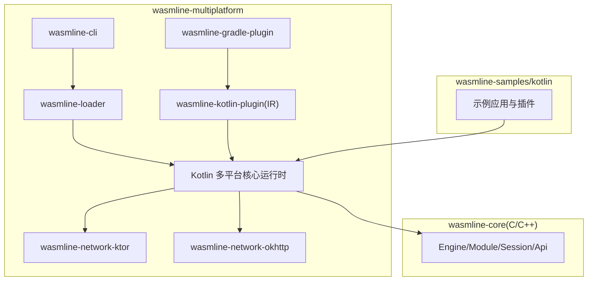
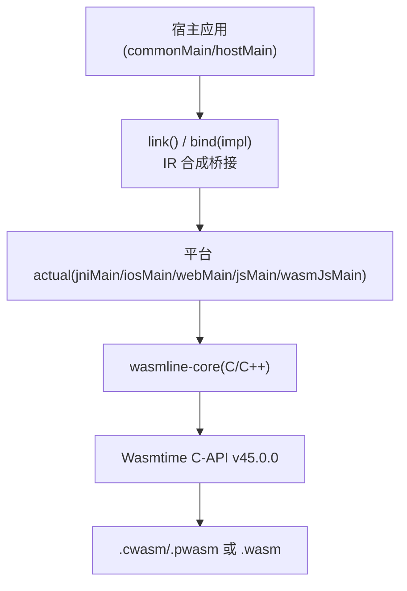
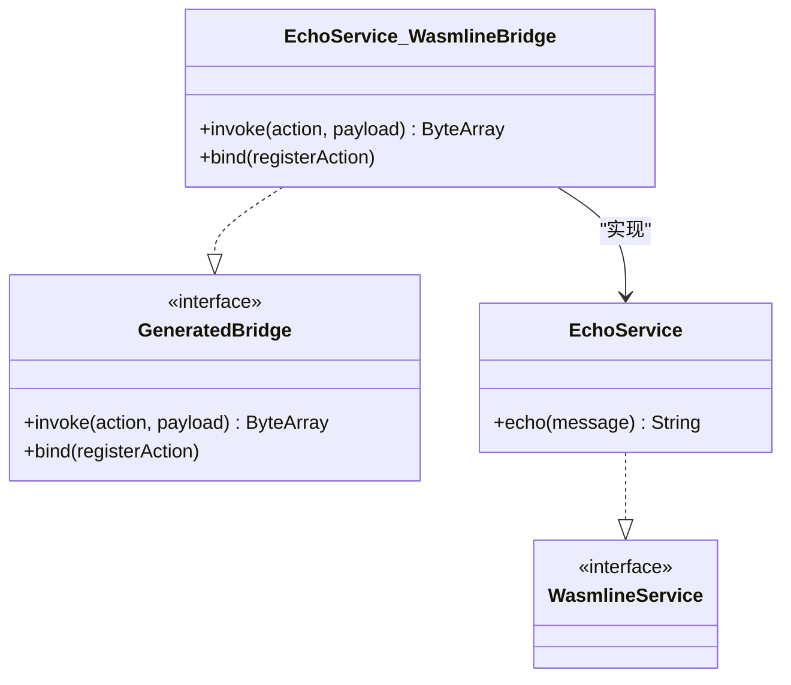
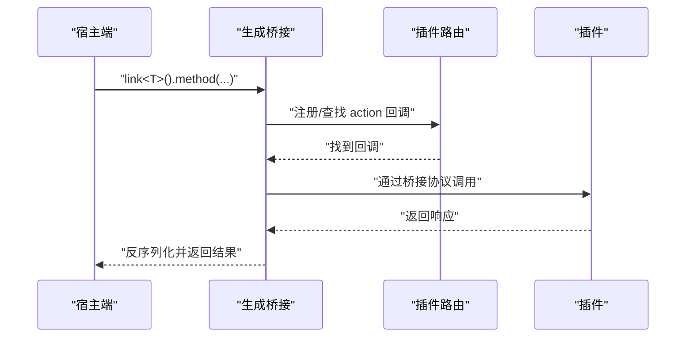
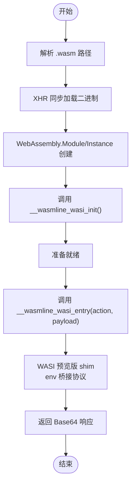
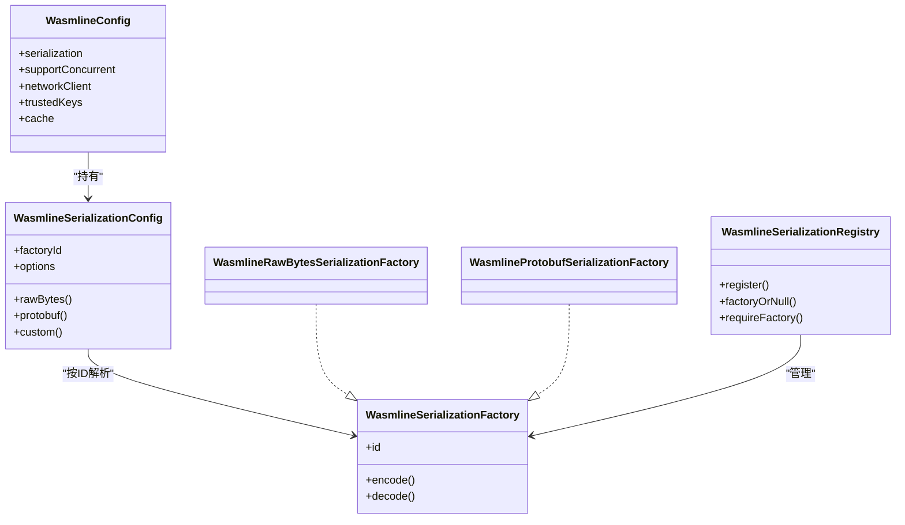
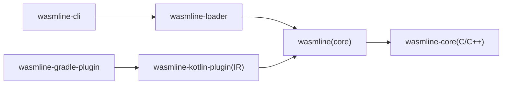

# 项目介绍

<cite>
**本文引用的文件**
- [README.md](file://README.md)
- [WasmlineService.kt](file://wasmline-multiplatform/wasmline/src/commonMain/kotlin/crow/wasmline/WasmlineService.kt)
- [Wasmline.kt](file://wasmline-multiplatform/wasmline/src/hostMain/kotlin/crow/wasmline/Wasmline.kt)
- [WasmlineConfig.kt](file://wasmline-multiplatform/wasmline/src/commonMain/kotlin/crow/wasmline/WasmlineConfig.kt)
- [WasmlineCache.kt](file://wasmline-multiplatform/wasmline/src/commonMain/kotlin/crow/wasmline/WasmlineCache.kt)
- [GeneratedBridge.kt](file://wasmline-multiplatform/wasmline/src/commonMain/kotlin/crow/wasmline/internal/bridge/GeneratedBridge.kt)
- [WasmlineSerializationConfig.kt](file://wasmline-multiplatform/wasmline/src/commonMain/kotlin/crow/wasmline/serialization/WasmlineSerializationConfig.kt)
- [WasmlineSerializationFactory.kt](file://wasmline-multiplatform/wasmline/src/commonMain/kotlin/crow/wasmline/serialization/WasmlineSerializationFactory.kt)
- [WasmlineSerializationRegistry.kt](file://wasmline-multiplatform/wasmline/src/commonMain/kotlin/crow/wasmline/serialization/WasmlineSerializationRegistry.kt)
- [WasmlineLoader.kt](file://wasmline-multiplatform/wasmline/src/hostMain/kotlin/crow/wasmline/WasmlineLoader.kt)
- [WasmlineLoadState.kt](file://wasmline-multiplatform/wasmline/src/hostMain/kotlin/crow/wasmline/WasmlineLoadState.kt)
- [WasmlineRouter.kt](file://wasmline-multiplatform/wasmline/src/wasmWasiMain/kotlin/crow/wasmline/WasmlineRouter.kt)
- [Wasmline.wasmWasi.kt](file://wasmline-multiplatform/wasmline/src/wasmWasiMain/kotlin/crow/wasmline/Wasmline.wasmWasi.kt)
- [Wasmline.web.kt](file://wasmline-multiplatform/wasmline/src/webMain/kotlin/crow/wasmline/Wasmline.web.kt)
</cite>

## 目录
1. [引言](#引言)
2. [项目结构](#项目结构)
3. [核心组件](#核心组件)
4. [架构总览](#架构总览)
5. [详细组件分析](#详细组件分析)
6. [依赖关系分析](#依赖关系分析)
7. [性能考量](#性能考量)
8. [故障排查指南](#故障排查指南)
9. [结论](#结论)
10. [附录](#附录)

## 引言
Wasmline 是一个面向 Kotlin 多平台的 WebAssembly 插件框架，其核心使命是“在统一 API 下，为 Android、iOS、桌面与 Web 等多端提供可加载、可调度的 WASI 兼容插件运行时”。它的愿景是让开发者以最小心智负担，在不同平台上一致地编写、分发与执行插件，同时保证类型安全与跨语言互操作。

项目解决的关键问题包括：
- 简化 WebAssembly 插件开发：通过编译期桥接合成与 IR 层重写，消除运行时反射与手工序列化/反序列化代码，使服务契约仅需定义接口即可。
- 实现跨平台兼容：采用“双路径执行模型”，原生端（Android/iOS/macOS/Linux/Windows）通过 Wasmtime 执行，Web 端通过浏览器原生 WebAssembly 能力与内嵌 JS 运行时执行，统一对外 API。
- 提供类型安全的服务调用：基于 Kotlin 接口定义服务契约，编译期生成桥接层，调用点被重写为直接调用生成的桥接类，确保类型与签名在编译期确定。

发展历程与理念：
- 设计理念根植于三个不变量：编译期桥接合成、双路径运行时架构、语言无关的插件作者体验。
- 项目自下而上构建：从 C/C++ 的 wasmline-core 桥接到 Kotlin 多平台运行时，再到 CLI/Gradle 工具链，形成完整的插件生命周期闭环。
- 核心价值主张：在不牺牲性能的前提下，最大化开发效率与可维护性；在多端一致的 API 下，屏蔽底层差异。

在 WebAssembly 生态中的定位：
- Wasmline 不仅是一个运行时，更是一套“从契约到执行”的全栈方案：服务契约、桥接生成、序列化、加载与调度、以及打包与签名验证。
- 它既可作为宿主侧的模块加载器，也可作为插件侧的路由与桥接环境，贯穿插件的整个生命周期。

主要应用场景与成功案例（来自仓库示例）：
- 多端应用：Android、iOS、桌面与 Web 上的终端/工具集成。
- 构建与命令行：在多平台上复用同一套 WASI 插件进行构建或任务执行。
- 示例模块：参考 wasmline-samples/kotlin 中的 sample-common、sample-plugin、sample-apps/* 等模块，覆盖了服务契约定义、插件实现与多端宿主加载调用。

## 项目结构
仓库采用“多模块 + 多目标”的组织方式，核心模块与职责如下：
- wasmline-core：C/C++ 实现的 Wasmtime 桥接层（Engine/Module/Session/Api），用于原生端加载与执行。
- wasmline-multiplatform/wasmline：Kotlin 多平台核心运行时，包含通用契约、桥接抽象、序列化 SPI、加载器与各平台实际实现（jniMain/iosMain/webMain/jsMain/wasmJsMain/wasmWasiMain）。
- wasmline-loader：解析 .wlm 清单、Ed25519/ECDSA-P256 验签、缓存与远程下载。
- wasmline-cli：插件构建流水线（下载 Wasmtime、编译 cwasm/pwasm、生成清单、打包）。
- wasmline-kotlin-plugin：Kotlin IR 编译插件，负责服务契约发现、校验、桥接合成与调用点重写。
- wasmline-gradle-plugin：将 IR 插件应用到消费方工程。
- wasmline-network-*：网络客户端适配（Ktor/OkHttp）。
- wasmline-samples/kotlin：多端示例与参考实现。

图表来源
- [README.md:415-445](file://README.md#L415-L445)
- [Wasmline.kt:15-34](file://wasmline-multiplatform/wasmline/src/hostMain/kotlin/crow/wasmline/Wasmline.kt#L15-L34)
- [WasmlineLoader.kt:1-67](file://wasmline-multiplatform/wasmline/src/hostMain/kotlin/crow/wasmline/WasmlineLoader.kt#L1-L67)

章节来源
- [README.md:415-445](file://README.md#L415-L445)

## 核心组件
本节聚焦于构成 Wasmline 的关键运行时与契约组件，帮助读者建立对系统“如何工作”的整体认知。

- 服务契约接口：WasmlineService 是所有服务契约的标记接口，约束方法可见性、是否 suspend、泛型、默认参数等，编译期由 IR 插件校验并生成桥接类。
- 运行时句柄：Wasmline（expect 类）代表已加载模块的宿主侧句柄，提供 setOutbound、call、close 等能力，具体实现在各平台 actual 中实现。
- 加载状态：WasmlineLoadState 统一承载加载成功/失败信息，并提供便捷的分支处理扩展。
- 配置与缓存：WasmlineConfig 统一配置序列化策略、并发支持、网络客户端、可信密钥与缓存；WasmlineCache 抽象了键值缓存接口。
- 序列化：WasmlineSerializationConfig/Factory/Registry 提供工厂 ID 与注册机制，内置 raw 与 protobuf 两种工厂，支持自定义工厂。
- 生成桥接：GeneratedBridge 定义生成桥接类的内部接口，包含“调用”与“绑定注册”两个角色，并提供未链接/未实现/未知动作的快速失败策略。
- 插件路由：WasmlineRouter 在插件侧维护 action 到回调的映射，配合插件侧 Wasmline 对宿主发起同步回调。
- Web 运行时：Wasmline.web.kt 内嵌 JS 运行时，通过 js() 与浏览器 WebAssembly API 交互，提供 WASI 预览版 shim 与 Wasmline 桥接协议。

章节来源
- [WasmlineService.kt:1-25](file://wasmline-multiplatform/wasmline/src/commonMain/kotlin/crow/wasmline/WasmlineService.kt#L1-L25)
- [Wasmline.kt:15-34](file://wasmline-multiplatform/wasmline/src/hostMain/kotlin/crow/wasmline/Wasmline.kt#L15-L34)
- [WasmlineLoadState.kt:13-32](file://wasmline-multiplatform/wasmline/src/hostMain/kotlin/crow/wasmline/WasmlineLoadState.kt#L13-L32)
- [WasmlineConfig.kt:18-24](file://wasmline-multiplatform/wasmline/src/commonMain/kotlin/crow/wasmline/WasmlineConfig.kt#L18-L24)
- [WasmlineCache.kt:10-23](file://wasmline-multiplatform/wasmline/src/commonMain/kotlin/crow/wasmline/WasmlineCache.kt#L10-L23)
- [WasmlineSerializationConfig.kt:12-39](file://wasmline-multiplatform/wasmline/src/commonMain/kotlin/crow/wasmline/serialization/WasmlineSerializationConfig.kt#L12-L39)
- [WasmlineSerializationFactory.kt:16-67](file://wasmline-multiplatform/wasmline/src/commonMain/kotlin/crow/wasmline/serialization/WasmlineSerializationFactory.kt#L16-L67)
- [WasmlineSerializationRegistry.kt:3-21](file://wasmline-multiplatform/wasmline/src/commonMain/kotlin/crow/wasmline/serialization/WasmlineSerializationRegistry.kt#L3-L21)
- [GeneratedBridge.kt:12-44](file://wasmline-multiplatform/wasmline/src/commonMain/kotlin/crow/wasmline/internal/bridge/GeneratedBridge.kt#L12-L44)
- [WasmlineRouter.kt:10-17](file://wasmline-multiplatform/wasmline/src/wasmWasiMain/kotlin/crow/wasmline/WasmlineRouter.kt#L10-L17)
- [Wasmline.wasmWasi.kt:15-60](file://wasmline-multiplatform/wasmline/src/wasmWasiMain/kotlin/crow/wasmline/Wasmline.wasmWasi.kt#L15-L60)
- [Wasmline.web.kt:10-80](file://wasmline-multiplatform/wasmline/src/webMain/kotlin/crow/wasmline/Wasmline.web.kt#L10-L80)

## 架构总览
Wasmline 的“双路径执行模型”将统一 API 与差异化实现解耦：
- 原生路径（Android/iOS/macOS/Linux/Windows）：通过 wasmline-core（C/C++）与 Wasmtime C-API 交互，实现 AOT/Pulley 预编译模块加载与隔离执行。
- Web 路径（Kotlin/JS 与 Kotlin/WasmJS）：通过浏览器原生 WebAssembly API 与内嵌 JS 运行时，提供 WASI 预览版 shim 与 Wasmline 桥接协议，不依赖 Wasmtime。

图表来源
- [README.md:340-403](file://README.md#L340-L403)
- [Wasmline.kt:15-34](file://wasmline-multiplatform/wasmline/src/hostMain/kotlin/crow/wasmline/Wasmline.kt#L15-L34)
- [Wasmline.web.kt:24-80](file://wasmline-multiplatform/wasmline/src/webMain/kotlin/crow/wasmline/Wasmline.web.kt#L24-L80)

章节来源
- [README.md:340-403](file://README.md#L340-L403)

## 详细组件分析

### 服务契约与桥接生成
- 契约约束：接口、public 函数、非 suspend、最多一个常规参数、无泛型、无默认参数/可变参数/扩展成员等。
- 生成桥接：每个 WasmlineService 契约会生成一个 *_WasmlineBridge，承担“出站代理（link）”与“入站分发（bind）”双重职责。
- 调用点重写：IR 插件将 link<T>() / bind(...) 调用重写为对生成桥接的直接调用，避免运行时反射与手工编组。

图表来源
- [WasmlineService.kt:20-24](file://wasmline-multiplatform/wasmline/src/commonMain/kotlin/crow/wasmline/WasmlineService.kt#L20-L24)
- [GeneratedBridge.kt:12-17](file://wasmline-multiplatform/wasmline/src/commonMain/kotlin/crow/wasmline/internal/bridge/GeneratedBridge.kt#L12-L17)

章节来源
- [WasmlineService.kt:4-24](file://wasmline-multiplatform/wasmline/src/commonMain/kotlin/crow/wasmline/WasmlineService.kt#L4-L24)
- [GeneratedBridge.kt:12-44](file://wasmline-multiplatform/wasmline/src/commonMain/kotlin/crow/wasmline/internal/bridge/GeneratedBridge.kt#L12-L44)

### 插件侧路由与宿主回调
- 插件侧：WasmlineRouter 维护 action 到回调的映射；插件通过 Wasmline 调用宿主，经由桥接协议返回响应。
- 宿主侧：生成桥接作为入站分发器，将 action 映射到已绑定的实现；出站调用则通过宿主端桥接转发至插件。

图表来源
- [WasmlineRouter.kt:10-17](file://wasmline-multiplatform/wasmline/src/wasmWasiMain/kotlin/crow/wasmline/WasmlineRouter.kt#L10-L17)
- [Wasmline.wasmWasi.kt:24-33](file://wasmline-multiplatform/wasmline/src/wasmWasiMain/kotlin/crow/wasmline/Wasmline.wasmWasi.kt#L24-L33)

章节来源
- [WasmlineRouter.kt:10-17](file://wasmline-multiplatform/wasmline/src/wasmWasiMain/kotlin/crow/wasmline/WasmlineRouter.kt#L10-L17)
- [Wasmline.wasmWasi.kt:15-42](file://wasmline-multiplatform/wasmline/src/wasmWasiMain/kotlin/crow/wasmline/Wasmline.wasmWasi.kt#L15-L42)

### Web 路径执行流程
- 宿主加载：通过 Wasmline.web.kt 的 BrowserWasmlineRuntime 将 .wasm 文件加载为 WebModule。
- 内嵌 JS 运行时：通过 js() 注入的 WASI 预览版 shim 与 Wasmline 桥接协议，完成内存读写、随机数、时间、宿主回调等。
- 数据边界：Kotlin 与 JS 线性内存之间的数据以 Base64 字符串传递，避免外部 JS 依赖。

图表来源
- [Wasmline.web.kt:24-80](file://wasmline-multiplatform/wasmline/src/webMain/kotlin/crow/wasmline/Wasmline.web.kt#L24-L80)
- [Wasmline.web.kt:176-367](file://wasmline-multiplatform/wasmline/src/webMain/kotlin/crow/wasmline/Wasmline.web.kt#L176-L367)

章节来源
- [Wasmline.web.kt:24-80](file://wasmline-multiplatform/wasmline/src/webMain/kotlin/crow/wasmline/Wasmline.web.kt#L24-L80)
- [Wasmline.web.kt:176-367](file://wasmline-multiplatform/wasmline/src/webMain/kotlin/crow/wasmline/Wasmline.web.kt#L176-L367)

### 序列化与配置
- 配置：WasmlineConfig 支持选择序列化工厂、并发支持、网络客户端、可信密钥与缓存。
- 工厂：内置 raw 与 protobuf 工厂，支持自定义工厂注册；通过工厂 ID 与选项在运行时解析。
- 注册表：WasmlineSerializationRegistry 维护工厂注册与查找。

图表来源
- [WasmlineConfig.kt:18-24](file://wasmline-multiplatform/wasmline/src/commonMain/kotlin/crow/wasmline/WasmlineConfig.kt#L18-L24)
- [WasmlineSerializationConfig.kt:12-39](file://wasmline-multiplatform/wasmline/src/commonMain/kotlin/crow/wasmline/serialization/WasmlineSerializationConfig.kt#L12-L39)
- [WasmlineSerializationFactory.kt:16-67](file://wasmline-multiplatform/wasmline/src/commonMain/kotlin/crow/wasmline/serialization/WasmlineSerializationFactory.kt#L16-L67)
- [WasmlineSerializationRegistry.kt:3-21](file://wasmline-multiplatform/wasmline/src/commonMain/kotlin/crow/wasmline/serialization/WasmlineSerializationRegistry.kt#L3-L21)

章节来源
- [WasmlineConfig.kt:18-24](file://wasmline-multiplatform/wasmline/src/commonMain/kotlin/crow/wasmline/WasmlineConfig.kt#L18-L24)
- [WasmlineSerializationConfig.kt:12-39](file://wasmline-multiplatform/wasmline/src/commonMain/kotlin/crow/wasmline/serialization/WasmlineSerializationConfig.kt#L12-L39)
- [WasmlineSerializationFactory.kt:16-67](file://wasmline-multiplatform/wasmline/src/commonMain/kotlin/crow/wasmline/serialization/WasmlineSerializationFactory.kt#L16-L67)
- [WasmlineSerializationRegistry.kt:3-21](file://wasmline-multiplatform/wasmline/src/commonMain/kotlin/crow/wasmline/serialization/WasmlineSerializationRegistry.kt#L3-L21)

## 依赖关系分析
- 模块依赖：wasmline-cli → wasmline-loader → wasmline（核心运行时）；wasmline-core 通过 JNI/C Interop 与运行时对接。
- 编译期依赖：wasmline-gradle-plugin 应用 wasmline-kotlin-plugin，后者在 IR 阶段完成契约发现、校验、桥接合成与调用点重写。
- 平台依赖：各平台 actual 通过本地桥接（JNI/C Interop/内嵌 JS）连接到统一的运行时 API。

图表来源
- [README.md:404-414](file://README.md#L404-L414)

章节来源
- [README.md:404-414](file://README.md#L404-L414)

## 性能考量
- 预编译与隔离：原生端使用 AOT（.cwasm）或 Pulley（.pwasm）预编译，减少加载时编译开销；每次调用在独立 Session 中隔离线性内存，避免共享状态带来的锁竞争。
- Web 路径优化：内嵌 JS 运行时零外部依赖，XHR 同步拉取 .wasm，避免额外网络层；内存读写与 Base64 编解码在必要范围内进行。
- 序列化选择：根据场景选择 raw 或 protobuf，raw 适合字节数组/Unit，protobuf 适合复杂对象；通过工厂 ID 与选项在运行时解析，降低运行时成本。
- 并发与缓存：配置 WasmlineConfig.supportConcurrent 可启用线程安全加载；通过 WasmlineCache 缓存清单与工件，减少重复下载与解析。

## 故障排查指南
- 加载失败：检查 WasmlineLoadState.Failure 的错误码与原因字符串；确认工件类型（.cwasm/.pwasm 用于原生，.wasm 用于 Web）、路径存在性与权限。
- 未链接桥接：若出现“未链接传输端点”错误，通常表示编译期 IR 插件未正确替换 link()/bind() 调用点，请确认已应用 wasmline-gradle-plugin。
- 未绑定实现：若生成桥接提示“未绑定实现”，请确认在宿主侧通过 bind(...) 正确注册了实现。
- 未知动作：若出现“未知 Wasmline 动作”错误，检查插件侧 WasmlineRouter 是否正确注册了该 action。
- Web 路径限制：浏览器仅支持 .wasm，不接受 .cwasm/.pwasm；并发加载在浏览器中尚未支持。

章节来源
- [WasmlineLoadState.kt:13-32](file://wasmline-multiplatform/wasmline/src/hostMain/kotlin/crow/wasmline/WasmlineLoadState.kt#L13-L32)
- [GeneratedBridge.kt:21-43](file://wasmline-multiplatform/wasmline/src/commonMain/kotlin/crow/wasmline/internal/bridge/GeneratedBridge.kt#L21-L43)
- [Wasmline.web.kt:30-80](file://wasmline-multiplatform/wasmline/src/webMain/kotlin/crow/wasmline/Wasmline.web.kt#L30-L80)

## 结论
Wasmline 以“编译期合成 + 双路径运行时 + 类型安全契约”为核心，为 Kotlin 多平台生态提供了统一、高效且可扩展的 WebAssembly 插件解决方案。它不仅降低了插件开发与集成的门槛，还在多端一致性、安全性与性能之间取得了平衡。对于希望在 Android、iOS、桌面与 Web 上复用能力、构建可插拔系统的团队而言，Wasmline 提供了清晰、稳健的基础设施与实践路径。

## 附录
- 快速上手建议：先阅读 README 的“安装与前置条件”“集成参考”“CLI 参考”，再对照 wasmline-samples/kotlin 的示例模块逐步实践。
- 版本与兼容：关注 Kotlin/Wasm 运行时提案支持（GC、函数引用、异常处理等）与 Wasmtime 版本耦合关系，避免降级导致的加载失败或未定义行为。