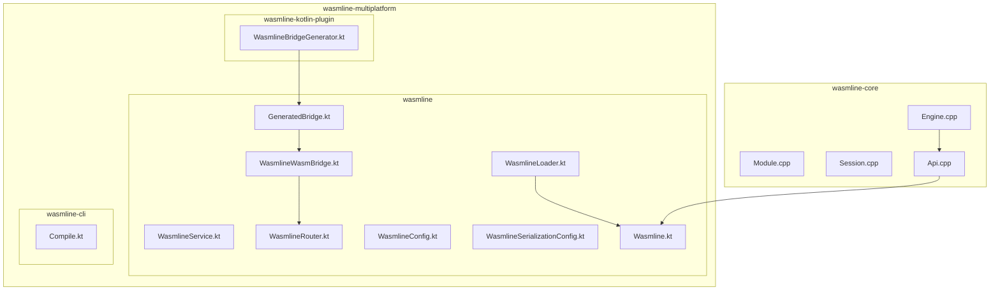
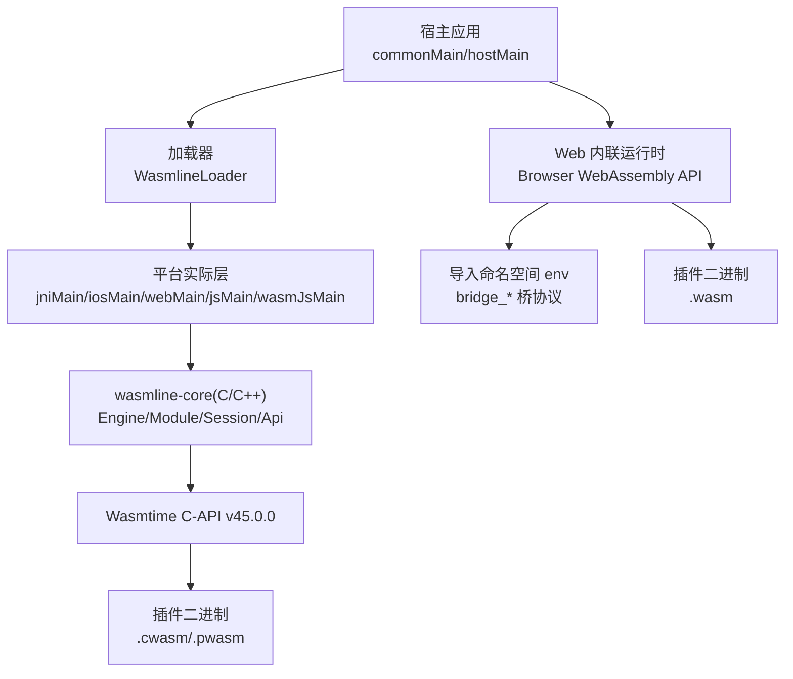
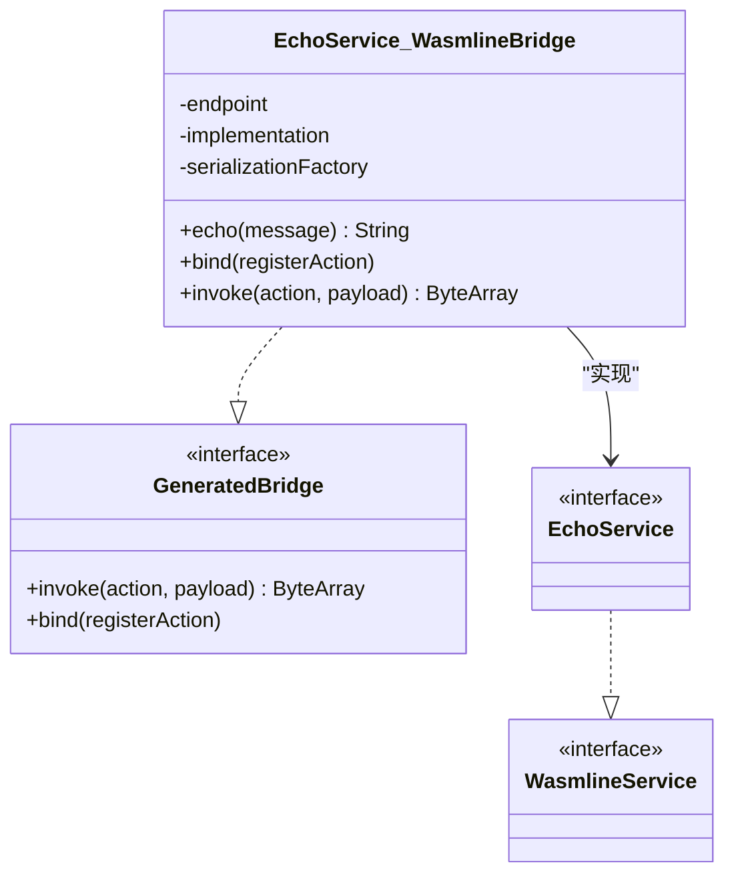
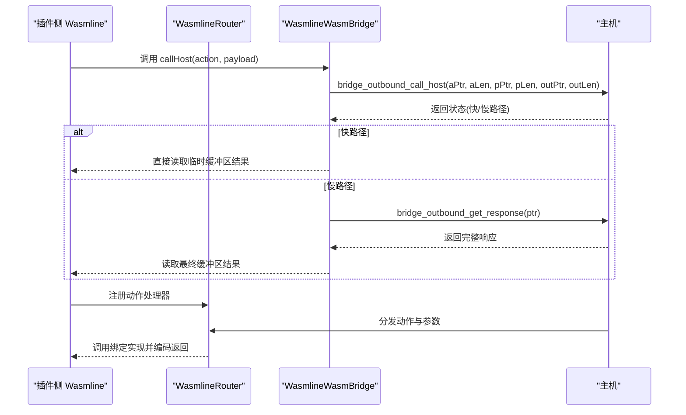
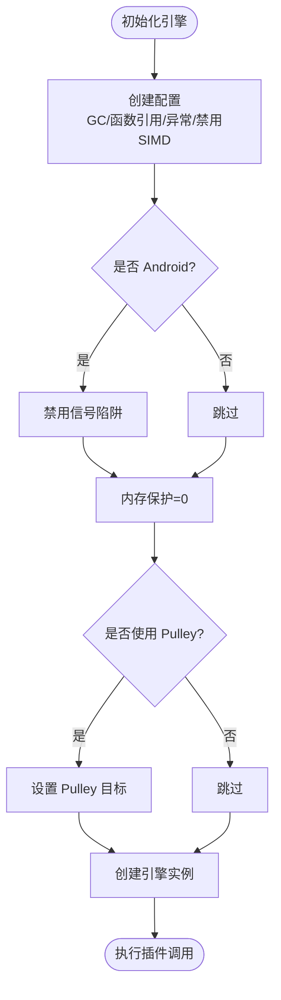
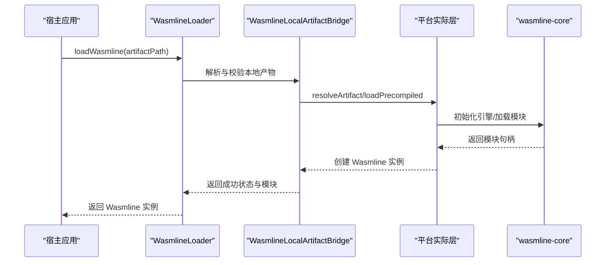
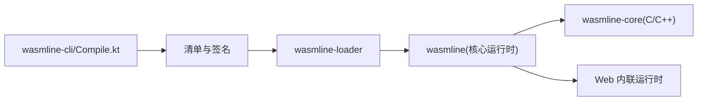

# 项目概述

<cite>
**本文档引用的文件**
- [README.md](file://README.md)
- [Engine.cpp](file://wasmline-core/src/Engine.cpp)
- [WasmlineService.kt](file://wasmline-multiplatform/wasmline/src/commonMain/kotlin/crow/wasmline/WasmlineService.kt)
- [Wasmline.kt](file://wasmline-multiplatform/wasmline/src/hostMain/kotlin/crow/wasmline/Wasmline.kt)
- [GeneratedBridge.kt](file://wasmline-multiplatform/wasmline/src/commonMain/kotlin/crow/wasmline/internal/bridge/GeneratedBridge.kt)
- [WasmlineRouter.kt](file://wasmline-multiplatform/wasmline/src/wasmWasiMain/kotlin/crow/wasmline/WasmlineRouter.kt)
- [WasmlineWasmBridge.kt](file://wasmline-multiplatform/wasmline/src/wasmWasiMain/kotlin/crow/wasmline/WasmlineWasmBridge.kt)
- [WasmlineSerializationConfig.kt](file://wasmline-multiplatform/wasmline/src/commonMain/kotlin/crow/wasmline/serialization/WasmlineSerializationConfig.kt)
- [WasmlineLoader.kt](file://wasmline-multiplatform/wasmline/src/hostMain/kotlin/crow/wasmline/WasmlineLoader.kt)
- [WasmlineConfig.kt](file://wasmline-multiplatform/wasmline/src/commonMain/kotlin/crow/wasmline/WasmlineConfig.kt)
- [WasmError.kt](file://wasmline-multiplatform/wasmline/src/wasmWasiMain/kotlin/crow/wasmline/model/WasmError.kt)
- [Compile.kt](file://wasmline-multiplatform/wasmline-cli/src/main/kotlin/crow/wasmline/cli/Compile.kt)
- [WasmlineBridgeGenerator.kt](file://wasmline-multiplatform/wasmline-kotlin-plugin/src/main/kotlin/crow/wasmline/kotlin/WasmlineBridgeGenerator.kt)
</cite>

## 目录
1. [引言](#引言)
2. [项目结构](#项目结构)
3. [核心组件](#核心组件)
4. [架构总览](#架构总览)
5. [详细组件分析](#详细组件分析)
6. [依赖关系分析](#依赖关系分析)
7. [性能考量](#性能考量)
8. [故障排查指南](#故障排查指南)
9. [结论](#结论)
10. [附录](#附录)

## 引言
Wasmline 是一个面向 Kotlin 多平台的 WebAssembly 插件框架，专注于在 Android、iOS、桌面与 Web 等多端统一加载与调度符合 WASI 规范的插件。其核心目标是通过“编译时桥接合成”“双路径运行时架构”“语言无关的插件编写”三大不变性，提供统一、类型安全且高性能的插件化执行环境。

- 统一 API 表面：在 commonMain/hostMain 提供一致的加载、绑定与调用接口，屏蔽不同平台的差异。
- 跨平台 WASI 执行运行时：原生平台通过 Wasmtime C-API 执行，Web 平台通过浏览器原生 WebAssembly 容器与内嵌的轻量级 WASI 桥协议运行。
- 类型安全的服务桥接：基于 Kotlin IR 的编译期桥接合成，自动为服务契约生成序列化、分发与桥接代码，避免运行时反射与手工编组。

## 项目结构
仓库采用模块化组织，核心模块包括：
- wasmline-core：C/C++ 实现的 Wasmtime 桥接层（Engine/Module/Session/Api）
- wasmline-multiplatform：Kotlin 多平台核心运行时与工具链（wasmline、loader、cli、gradle-plugin、kotlin-plugin）
- wasmline-samples：示例应用与插件，覆盖 Android、桌面、Compose Multiplatform 与 Web

**图表来源**
- [Engine.cpp:1-138](file://wasmline-core/src/Engine.cpp#L1-L138)
- [WasmlineService.kt:1-25](file://wasmline-multiplatform/wasmline/src/commonMain/kotlin/crow/wasmline/WasmlineService.kt#L1-L25)
- [GeneratedBridge.kt:1-45](file://wasmline-multiplatform/wasmline/src/commonMain/kotlin/crow/wasmline/internal/bridge/GeneratedBridge.kt#L1-L45)
- [WasmlineRouter.kt:1-17](file://wasmline-multiplatform/wasmline/src/wasmWasiMain/kotlin/crow/wasmline/WasmlineRouter.kt#L1-L17)
- [WasmlineWasmBridge.kt:1-145](file://wasmline-multiplatform/wasmline/src/wasmWasiMain/kotlin/crow/wasmline/WasmlineWasmBridge.kt#L1-L145)
- [WasmlineConfig.kt:1-25](file://wasmline-multiplatform/wasmline/src/commonMain/kotlin/crow/wasmline/WasmlineConfig.kt#L1-L25)
- [WasmlineSerializationConfig.kt:1-40](file://wasmline-multiplatform/wasmline/src/commonMain/kotlin/crow/wasmline/serialization/WasmlineSerializationConfig.kt#L1-L40)
- [WasmlineLoader.kt:1-67](file://wasmline-multiplatform/wasmline/src/hostMain/kotlin/crow/wasmline/WasmlineLoader.kt#L1-L67)
- [Wasmline.kt:1-34](file://wasmline-multiplatform/wasmline/src/hostMain/kotlin/crow/wasmline/Wasmline.kt#L1-L34)
- [Compile.kt:1-350](file://wasmline-multiplatform/wasmline-cli/src/main/kotlin/crow/wasmline/cli/Compile.kt#L1-L350)
- [WasmlineBridgeGenerator.kt:1-591](file://wasmline-multiplatform/wasmline-kotlin-plugin/src/main/kotlin/crow/wasmline/kotlin/WasmlineBridgeGenerator.kt#L1-L591)

**章节来源**
- [README.md: 48-124:48-124](file://README.md#L48-L124)
- [README.md: 415-445:415-445](file://README.md#L415-L445)

## 核心组件
- 服务契约接口：以扩展标记接口的方式声明插件与宿主间的服务边界，编译期由 IR 插件校验并生成桥接类。
- 编译时桥接合成：IR 插件在编译阶段为每个服务契约生成桥接类，重写 link()/bind() 调用点，实现类型安全的代理与分发。
- 双路径运行时：原生平台通过 JNI/C-Interop 调用 wasmline-core，Web 平台通过浏览器 WebAssembly 容器与内嵌 JS 桥协议运行。
- 类型安全序列化：通过可配置的序列化工厂（默认 Protobuf）在桥接两侧进行参数与返回值的编解码。
- 加载与生命周期：统一的加载器负责本地/远程包解析、签名验证、缓存与模块实例化；宿主侧提供预热与关闭能力。

**章节来源**
- [WasmlineService.kt: 4-24:4-24](file://wasmline-multiplatform/wasmline/src/commonMain/kotlin/crow/wasmline/WasmlineService.kt#L4-L24)
- [WasmlineBridgeGenerator.kt: 52-156:52-156](file://wasmline-multiplatform/wasmline-kotlin-plugin/src/main/kotlin/crow/wasmline/kotlin/WasmlineBridgeGenerator.kt#L52-L156)
- [GeneratedBridge.kt: 5-45:5-45](file://wasmline-multiplatform/wasmline/src/commonMain/kotlin/crow/wasmline/internal/bridge/GeneratedBridge.kt#L5-L45)
- [WasmlineSerializationConfig.kt: 5-40:5-40](file://wasmline-multiplatform/wasmline/src/commonMain/kotlin/crow/wasmline/serialization/WasmlineSerializationConfig.kt#L5-L40)
- [WasmlineLoader.kt: 8-67:8-67](file://wasmline-multiplatform/wasmline/src/hostMain/kotlin/crow/wasmline/WasmlineLoader.kt#L8-L67)
- [Wasmline.kt: 7-34:7-34](file://wasmline-multiplatform/wasmline/src/hostMain/kotlin/crow/wasmline/Wasmline.kt#L7-L34)

## 架构总览
Wasmline 将“统一 API 表面”与“双路径执行模型”解耦：上层通过 commonMain/hostMain 的统一接口抽象，下层根据目标平台路由到不同的引擎栈。

**图表来源**
- [README.md: 340-403:340-403](file://README.md#L340-L403)
- [Engine.cpp: 58-91:58-91](file://wasmline-core/src/Engine.cpp#L58-L91)
- [WasmlineWasmBridge.kt: 13-36:13-36](file://wasmline-multiplatform/wasmline/src/wasmWasiMain/kotlin/crow/wasmline/WasmlineWasmBridge.kt#L13-L36)

**章节来源**
- [README.md: 318-403:318-403](file://README.md#L318-L403)

## 详细组件分析

### 服务契约与编译时桥接
- 契约定义：服务接口继承标记接口，编译期由 IR 插件收集并校验约束，随后为每个契约生成桥接类。
- 桥接类职责：既作为外部调用的类型化代理（link<T>()），也作为内部分发器（bind() 注册动作处理器）。
- 调用重写：link()/bind() 在 IR 阶段被替换为对生成桥接类的直接构造与调用，确保零反射与零样板代码。

**图表来源**
- [WasmlineService.kt: 20-24:20-24](file://wasmline-multiplatform/wasmline/src/commonMain/kotlin/crow/wasmline/WasmlineService.kt#L20-L24)
- [GeneratedBridge.kt: 12-17:12-17](file://wasmline-multiplatform/wasmline/src/commonMain/kotlin/crow/wasmline/internal/bridge/GeneratedBridge.kt#L12-L17)
- [WasmlineBridgeGenerator.kt: 52-156:52-156](file://wasmline-multiplatform/wasmline-kotlin-plugin/src/main/kotlin/crow/wasmline/kotlin/WasmlineBridgeGenerator.kt#L52-L156)

**章节来源**
- [WasmlineBridgeGenerator.kt: 52-156:52-156](file://wasmline-multiplatform/wasmline-kotlin-plugin/src/main/kotlin/crow/wasmline/kotlin/WasmlineBridgeGenerator.kt#L52-L156)
- [GeneratedBridge.kt: 5-45:5-45](file://wasmline-multiplatform/wasmline/src/commonMain/kotlin/crow/wasmline/internal/bridge/GeneratedBridge.kt#L5-L45)

### Web 插件侧桥接与路由
- 插件上下文：插件侧通过运行时句柄访问桥接设施，并可配置序列化工厂。
- 桥接协议：通过 env 命名空间的导入函数完成入参复制、响应设置与主机回调。
- 路由分发：插件侧维护动作到回调的映射表，接收主机调用后按动作分发至已绑定实现。

**图表来源**
- [WasmlineWasmBridge.kt: 87-144:87-144](file://wasmline-multiplatform/wasmline/src/wasmWasiMain/kotlin/crow/wasmline/WasmlineWasmBridge.kt#L87-L144)
- [WasmlineRouter.kt: 10-17:10-17](file://wasmline-multiplatform/wasmline/src/wasmWasiMain/kotlin/crow/wasmline/WasmlineRouter.kt#L10-L17)

**章节来源**
- [WasmlineWasmBridge.kt: 1-L145:1-145](file://wasmline-multiplatform/wasmline/src/wasmWasiMain/kotlin/crow/wasmline/WasmlineWasmBridge.kt#L1-L145)
- [WasmlineRouter.kt: 1-L17:1-17](file://wasmline-multiplatform/wasmline/src/wasmWasiMain/kotlin/crow/wasmline/WasmlineRouter.kt#L1-L17)

### 原生平台引擎与会话隔离
- 引擎配置：针对 Kotlin/Wasm 支持启用 GC、函数引用、异常处理等特性；在 Android 上禁用信号陷阱并设置内存保护为 0，降低 OOM 风险。
- 会话隔离：每次调用在独立的线性内存区域中执行，插件无法访问宿主进程内存、文件系统或网络，除非显式授权。

**图表来源**
- [Engine.cpp: 58-91:58-91](file://wasmline-core/src/Engine.cpp#L58-L91)
- [Engine.cpp: 16-36:16-36](file://wasmline-core/src/Engine.cpp#L16-L36)

**章节来源**
- [Engine.cpp: 58-131:58-131](file://wasmline-core/src/Engine.cpp#L58-L131)

### 加载流程与模块生命周期
- 本地资产桥：统一解析本地预编译产物（.cwasm/.pwasm），校验后交由平台实际层加载。
- 平台适配：各平台通过 JNI 或 C-Interop 访问 wasmline-core，返回宿主侧模块句柄。
- 生命周期：提供预热（warmup）、加载（load）、关闭（close）等低层操作，通常由加载器封装。

**图表来源**
- [WasmlineLoader.kt: 16-47:16-47](file://wasmline-multiplatform/wasmline/src/hostMain/kotlin/crow/wasmline/WasmlineLoader.kt#L16-L47)
- [Wasmline.kt: 15-34:15-34](file://wasmline-multiplatform/wasmline/src/hostMain/kotlin/crow/wasmline/Wasmline.kt#L15-L34)

**章节来源**
- [WasmlineLoader.kt: 1-L67:1-67](file://wasmline-multiplatform/wasmline/src/hostMain/kotlin/crow/wasmline/WasmlineLoader.kt#L1-L67)
- [Wasmline.kt: 1-L34:1-34](file://wasmline-multiplatform/wasmline/src/hostMain/kotlin/crow/wasmline/Wasmline.kt#L1-L34)

### 序列化配置与错误模型
- 序列化配置：支持原始字节与 Protobuf 等工厂，可在宿主侧配置并传递给模块。
- 错误模型：插件侧通过序列化数据类承载错误消息，便于跨边界传播。

**章节来源**
- [WasmlineSerializationConfig.kt: 1-L40:1-40](file://wasmline-multiplatform/wasmline/src/commonMain/kotlin/crow/wasmline/serialization/WasmlineSerializationConfig.kt#L1-L40)
- [WasmError.kt: 1-L7:1-7](file://wasmline-multiplatform/wasmline/src/wasmWasiMain/kotlin/crow/wasmline/model/WasmError.kt#L1-L7)

## 依赖关系分析
- 工具链链路：CLI 负责下载 Wasmtime、编译与打包；加载器负责解析清单与验证签名；核心运行时提供统一 API。
- 编译期依赖：Kotlin IR 插件在编译阶段生成桥接类并重写调用点，无运行时依赖。
- 运行时依赖：原生平台依赖 wasmline-core 与 Wasmtime；Web 平台依赖浏览器 WebAssembly 与内嵌 JS 桥协议。

**图表来源**
- [Compile.kt: 24-108:24-108](file://wasmline-multiplatform/wasmline-cli/src/main/kotlin/crow/wasmline/cli/Compile.kt#L24-L108)
- [WasmlineLoader.kt: 1-L67:1-67](file://wasmline-multiplatform/wasmline/src/hostMain/kotlin/crow/wasmline/WasmlineLoader.kt#L1-L67)

**章节来源**
- [README.md: 404-414:404-414](file://README.md#L404-L414)
- [Compile.kt: 1-L350:1-350](file://wasmline-multiplatform/wasmline-cli/src/main/kotlin/crow/wasmline/cli/Compile.kt#L1-L350)

## 性能考量
- 原生平台优化：启用 Pulley 目标（跨平台字节码）或 AOT（平台特定机器码）以提升吞吐；Android 上禁用信号陷阱与内存保护为 0，降低虚拟内存占用。
- Web 平台优化：内嵌 JS 桥协议，避免外部依赖；快/慢路径响应策略减少额外拷贝。
- 编译期优化：IR 插件在编译阶段生成桥接代码，避免运行时反射与动态查找。

**章节来源**
- [Engine.cpp: 58-91:58-91](file://wasmline-core/src/Engine.cpp#L58-L91)
- [WasmlineWasmBridge.kt: 87-144:87-144](file://wasmline-multiplatform/wasmline/src/wasmWasiMain/kotlin/crow/wasmline/WasmlineWasmBridge.kt#L87-L144)
- [README.md: 639-655:639-655](file://README.md#L639-L655)

## 故障排查指南
- 插件未加载：检查本地产物类型（原生平台仅支持 .cwasm/.pwasm；Web 仅支持 .wasm）与路径有效性。
- 编译期错误：确认服务契约满足静态约束（接口、公开可见、非 suspend、无泛型等），否则 IR 插件会报错并阻止生成。
- 运行时异常：若未应用 IR 插件，link()/bind() 调用会在运行时报不支持的操作异常；检查构建脚本与插件应用。
- Web 平台问题：确认使用 .wasm 而非 .cwasm/.pwasm；检查内联 JS 桥协议是否正确注入。

**章节来源**
- [WasmlineLoader.kt: 16-67:16-67](file://wasmline-multiplatform/wasmline/src/hostMain/kotlin/crow/wasmline/WasmlineLoader.kt#L16-L67)
- [README.md: 639-655:639-655](file://README.md#L639-L655)
- [README.md: 682-691:682-691](file://README.md#L682-L691)

## 结论
Wasmline 通过“编译时桥接合成”“双路径运行时架构”“语言无关的插件编写”三大不变性，实现了 Kotlin 多平台下的统一、类型安全与高性能插件化执行。其核心价值在于：
- 以统一 API 抹平多端差异，简化集成复杂度；
- 以编译期 IR 生成替代运行时反射，提升安全性与性能；
- 以双路径执行模型兼顾原生与 Web 场景，最大化生态兼容性。

## 附录
- 平台支持矩阵与运行时架构详见项目自述文件中的表格与说明。
- 示例应用与参考实现位于 samples 目录，涵盖 Android、桌面、Compose Multiplatform 与 Web。

**章节来源**
- [README.md: 48-124:48-124](file://README.md#L48-L124)
- [README.md: 318-403:318-403](file://README.md#L318-L403)