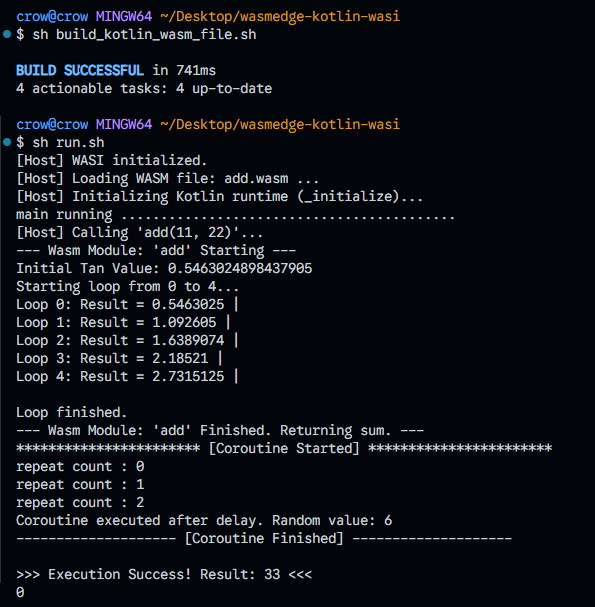

# WasmEdge on Windows: Installation and Development Workflow

This document outlines the steps for installing WasmEdge on a Windows system and the subsequent workflow for building a Wasm module using Kotlin/WASI.

## 1. WasmEdge Installation

To set up WasmEdge on your Windows machine, run the following shell script (git bash).

### Installation Command:

```bash
sh install_wasmedge.sh
```

## 2. Running WasmEdge Examples/Tests

After installation is complete, you can execute the main runtime script to verify the setup or run related examples.

### Execution Command:

```bash
sh run.sh
```

## 3. Building a Kotlin/WASI Wasm Module

If you need to generate a new WebAssembly (`.wasm`) file from the Kotlin source code, follow the steps below. This process involves modifying the source code and then executing the build script.

### Source Code Modification

First, modify the content of the main Kotlin plugin file:

- **File Path:** `wasmedge-core/wasmedge-plugin/src/wasmWasiMain/kotlin/crow/wasmedge/wasmline/Plugin.kt`

### Wasm Module Generation

After modifying the file, return to the root directory of the project and execute the build script.

### Build Command:

```bash
sh build_kotlin_wasm_file.sh
sh run.sh
```

### Generated File Description

Upon successful execution, a Wasm module will be created with the following characteristics:

> **Generated Module:** `add.wasm`
>
> This file was created using **Kotlin/WASI** and includes support for **Kotlin Coroutines**.


### Sample Result
**A screenshot of the successful execution of the sample application, demonstrating the output from C, and Kotlin.**

