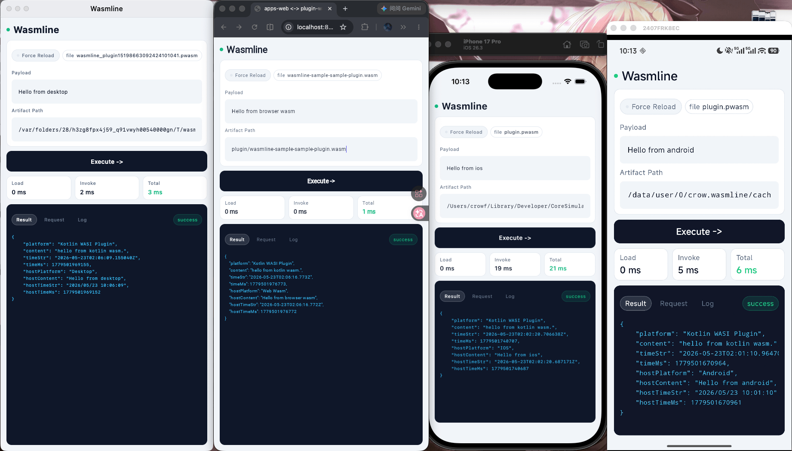
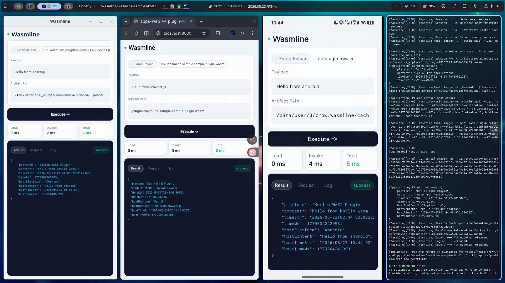
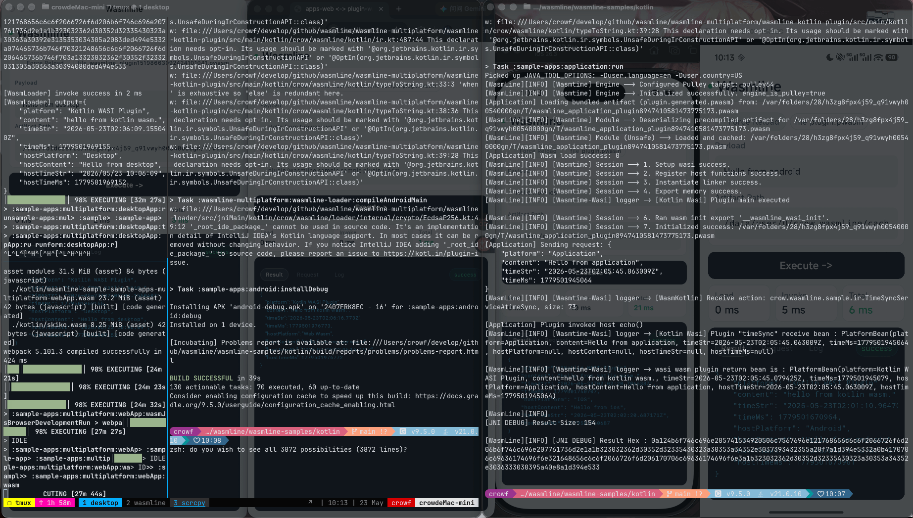
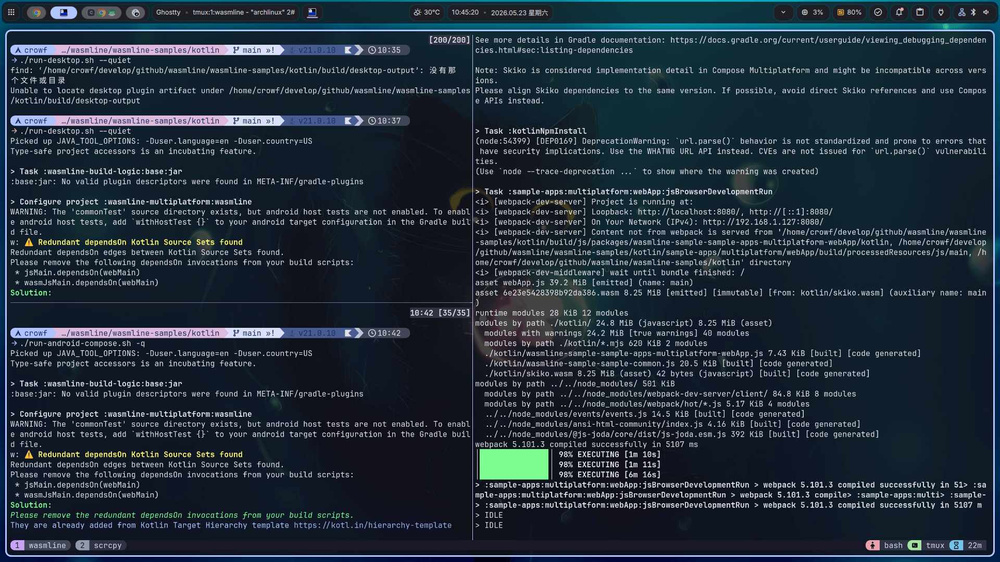

<div align="center">

<!-- Logo asset: replace src with actual path -->
<!--  -->

# Wasmline

**Kotlin Multiplatform WebAssembly Plugin Framework · Cross-Platform WASI Execution Runtime**

[](LICENSE)
[](https://kotlinlang.org)
[](https://wasmtime.dev)
[](https://developer.android.com/build/releases/gradle-plugin)
[](#platform-support)
[](https://wasi.dev)

[中文文档](README_zh.md) · [English](README.md) · [Documentation](docs/) · [Samples](#sample-applications)

</div>

---

## Introduction

Wasmline is a **Kotlin Multiplatform WebAssembly plugin framework** for loading and dispatching
WASI-compliant plugins across Android, iOS, Desktop, and Web targets.

Core design decisions:

**Compile-time bridge synthesis.** Service contracts are expressed as Kotlin `interface` types
extending `WasmlineService`. The Kotlin IR compiler plugin synthesizes all serialization, dispatch,
and bridge infrastructure at build time, without runtime reflection, annotation processing, or
manual marshalling code.

**Dual-path runtime architecture.** Native targets (Android, iOS, macOS, Linux, Windows) execute
plugins through **Wasmtime v45.0.6 (C-API)** via the Zig 0.15.1-compiled `wasmline-core` native
bridge, accessed over JNI or Kotlin/Native C Interop. Web targets (Kotlin/JS, Kotlin/WasmJS) execute
plugins through the browser's native `WebAssembly.Module` / `WebAssembly.Instance` containers via a
inline JavaScript runtime — Wasmtime is not present in the browser
execution path.

**Language-agnostic plugin authoring.** Plugin binaries may be produced by any toolchain targeting
WASI — including Kotlin, Rust, C/C++, Go, and AssemblyScript.

---

## Platform Support

### Runtime Architecture Matrix

| Platform          | Target Triple     | Runtime Engine            | Bridge Technology           | Artifact Support    | Module Loader           |
|-------------------|-------------------|---------------------------|-----------------------------|---------------------|-------------------------|
| Android           | `arm64-v8a`       | Wasmtime v45.0.6 C-API    | JNI (Zig 0.15.1 compiled)   | `.cwasm` / `.pwasm` | `wasmline-core` Session |
| iOS               | `arm64`           | Wasmtime v45.0.6 C-API    | C Interop (`.def` cinterop) | `.pwasm`            | `wasmline-core` Session |
| macOS             | `arm64`           | Wasmtime v45.0.6 C-API    | JNI (Zig 0.15.1 compiled)   | `.cwasm` / `.pwasm` | `wasmline-core` Session |
| Linux             | `x86_64`          | Wasmtime v45.0.6 C-API    | JNI (Zig 0.15.1 compiled)   | `.cwasm` / `.pwasm` | `wasmline-core` Session |
| Windows           | `x86_64`          | Wasmtime v45.0.6 C-API    | JNI (Zig 0.15.1 compiled)   | `.cwasm` / `.pwasm` | `wasmline-core` Session |
| Web - Kotlin/Js   | Browser JS engine | Browser `WebAssembly` API | Inline JS (`js()` interop)  | Raw `.wasm` only    | Synchronous XHR fetch   |
| Web - Kotlin/Wasm | Browser JS engine | Browser `WebAssembly` API | Inline JS (`js()` interop)  | Raw `.wasm` only    | Synchronous XHR fetch   |

> [!IMPORTANT]
> **Web targets operate independently of Wasmtime.** The browser execution path instantiates plugin
> binaries exclusively through the browser-native `WebAssembly.Module` / `WebAssembly.Instance`
> containers. A WASI shim layer — encompassing `fd_write`, `random_get`,
`clock_time_get`, and the Wasmline bridge protocol — is embedded as inline Kotlin JS interop (
`js()`), producing no external JavaScript files, no native library binaries, and no npm
> dependencies. Payload data crosses the Kotlin–JS linear memory boundary as Base64-encoded strings.

> [!WARNING]
> AOT compilation artifacts (`.cwasm`, `.pwasm`) produced by the CLI pipeline are **not valid inputs
** for Web targets. The Web runtime accepts only raw `.wasm` binaries.

---

## Sample Applications

<details>
<summary><strong>Application Screenshots</strong></summary>

<table>
  <tr>
    <th align="center">macOS — Apps</th>
    <th align="center">Arch Linux — Apps</th>
  </tr>
  <tr>
    <td align="center">
      
      <br><em>Desktop · iOS · Android · Terminal · Web (Wasm)</em>
    </td>
    <td align="center">
      
      <br><em>Desktop · Android · Terminal · Web (JS)</em>
    </td>
  </tr>
  <tr>
    <th align="center">macOS — Build Terminals</th>
    <th align="center">Arch Linux — Build Terminals</th>
  </tr>
  <tr>
    <td align="center">
      
      <br><em>Build commands: Desktop · iOS · Android · Web (Wasm)</em>
    </td>
    <td align="center">
      
      <br><em>Build commands: Desktop · Android · Web (JS)</em>
    </td>
  </tr>
</table>

</details>

Reference implementations are located under `wasmline-samples/kotlin/`:

| Module                      | Description                                                                                         |
|-----------------------------|-----------------------------------------------------------------------------------------------------|
| `sample-common`             | Shared service contract interface definitions: `EchoService`, `TimeSyncService`, `WebBridgeService` |
| `sample-plugin`             | Kotlin/WasmWasi plugin — registers implementations via `bind()`, invokes host services via `link()` |
| `sample-apps/android`       | Android host — loads `.pwasm` artifact, registers host callbacks, invokes plugin services           |
| `sample-apps/application`   | JVM headless desktop host                                                                           |
| `sample-apps/multiplatform` | Compose Multiplatform application — Android and Desktop                                             |
| `sample-apps/web`           | Web host — Kotlin/JS and Kotlin/WasmJS targets                                                      |

---

## Installation & Prerequisites

### System Requirements

| Component                        | Required Version                                                                                        | Applicable Scope                                           |
|----------------------------------|---------------------------------------------------------------------------------------------------------|------------------------------------------------------------|
| JDK / JBR                        | **21** ([JBR 21](https://github.com/JetBrains/JetBrainsRuntime/releases) mandatory for Compose Desktop) | All Gradle operations                                      |
| Kotlin                           | **2.4.0** minimum                                                                                   | Wasm GC, function references, exception-handling proposals |
| Android Studio                   | **LTS**                                                                                                 | AGP 9.2.1 compatibility                                    |
| Zig                              | **0.15.1**                                                                                              | `wasmline-core` JNI shared library compilation             |
| Bash / Python 3.9+ / Node.js 18+ | Any one                                                                                                 | Platform runtime asset initialization                      |

> [!NOTE]
> When building or running project commands manually, a `local.properties` file is required in the
> project root. Open the project in Android Studio — it will generate `local.properties`
> automatically. Ensure this file exists before invoking any Gradle commands outside the IDE.

> [!WARNING]
> Gradle must not be invoked prior to confirming the active JVM environment. Execute the repository
> preflight check before each build session:
> ```bash
> bash ./scripts/doctor.sh
> ```
> The script verifies JBR 21 availability, reports desktop Zig/JNI-native status, and reports WARNINGs for missing Wasmtime platform/architecture
> assets under `build/platforms/`.

### Platform Runtime Asset Initialization

> Asset initialization is required only for native target builds (Android, iOS, Desktop). Web-only
> builds do not require Wasmtime min C-API assets.

Wasmtime min C-API headers and pre-built libraries must be present under `build/platforms/` before
native target compilation proceeds. Execute one of the following equivalent scripts:

```bash
sh ./scripts/init.sh          # Bash — requires curl and tar/unzip
python3 ./scripts/init.py     # Python 3.9+ — no third-party dependencies
node ./scripts/init.mjs       # Node.js 18+  — no third-party dependencies
```

All three scripts support interactive platform/architecture selection, configurable download
concurrency, and an optional HTTP proxy as the first positional argument (e.g., `127.0.0.1:7890`).

---

## Integration Reference

### Service Contract Definition

A service contract is a Kotlin `interface` extending `WasmlineService`, declared in shared source (
`commonMain`). The contract defines the binary protocol boundary between host and plugin; method
signatures are the basis for SHA-256 action identifier derivation.

```kotlin
// shared/src/commonMain/kotlin/com/example/EchoService.kt
import crow.wasmline.WasmlineService

interface EchoService : WasmlineService {
    fun echo(message: String): String
}
```

### Plugin Implementation — WASI Target

The plugin binary registers service implementations through `Wasmline.current.bind(impl)`. The IR
compiler plugin rewrites this call site to register the implementation into the generated
`*_WasmlineBridge` at the IR level:

```kotlin
// plugin/src/wasmWasiMain/kotlin/Main.kt
import crow.wasmline.Wasmline
import crow.wasmline.bind

val wasmline = Wasmline.current

fun main() {
    wasmline.bind(object : EchoService {
        override fun echo(message: String): String {
            return "Response from WASI plugin: $message"
        }
    })
}
```

### Host-Side Module Loading and Service Invocation

The host loads a compiled plugin artifact through `loadWasmline`, registers host-side service
implementations accessible to the plugin via `bind(impl)`, and obtains typed proxies for plugin-side
services via `link<T>()`:

```kotlin
import crow.wasmline.WasmlineLoadState
import crow.wasmline.link
import crow.wasmline.bind
import crow.wasmline.loader.loadWasmline

Wasmline.bootstrap()

// Optional: eager warmup for the backend you know you will use first
Wasmline.warmup(WasmlineWarmupMode.PULLEY)

val state = loadWasmline(artifactPath = "/data/plugin.pwasm")

when (state) {
    is WasmlineLoadState.Failure -> error("Plugin load failed: ${state.cause}")
    is WasmlineLoadState.Success -> {
        val module = state.wasmline

        module.bind(object : HostNotificationService {
            override fun notify(event: String) { /* host-side handler */
            }
        })

        val result = module.link<EchoService>().echo("ping")

        module.close()
    }
}
```

> [!IMPORTANT]
> `link<T>()` and `bind(impl)` are **Kotlin IR compiler plugin rewrite targets**. The IR plugin
> replaces each call site with a direct invocation of the synthesized `*_WasmlineBridge`. If the
`wasmline-kotlin-plugin` is not applied to the compilation unit, these functions throw
`UnsupportedOperationException` at runtime.

---

## CLI Reference

The `wasmline-cli` module implements the complete plugin build pipeline. All commands are dispatched
via Gradle from `wasmline-multiplatform/`:

```bash
cd wasmline-multiplatform
./gradlew :wasmline-cli:run --args="<command> [options]"
```

### Command Set

| Command             | Description                                                                                             |
|---------------------|---------------------------------------------------------------------------------------------------------|
| `download`          | Download Wasmtime release binaries for one or more target platforms                                     |
| `generate-key-pair` | Generate an Ed25519 signing key pair                                                                    |
| `compile`           | Compile a raw `.wasm` binary to platform-specific `.cwasm` artifacts and a portable `.pwasm` image      |
| `manifest`          | Generate a cryptographically signed `.wlm` manifest (Protobuf + Ed25519) from the compiled artifact set |
| `build`             | Execute the complete pipeline: `compile → manifest → zip packaging`                                     |

### Pipeline Execution

```bash
cd wasmline-multiplatform

# Download Wasmtime min toolchain binaries
./gradlew :wasmline-cli:run --args="download -v v45.0.0"

# Generate Ed25519 signing key pair
./gradlew :wasmline-cli:run --args="generate-key-pair --save"

# Execute the full build pipeline
./gradlew :wasmline-cli:run --args="build \
  -i plugin.wasm \
  -wt build/wasmline/wasmtime/wasmtime-v45.0.6-aarch64-macos \
  --key build/wasmline/keys/ed25519_private.key"
```

### Build Output Layout

```text
build/wasmline/
├── output/{name}-{version}/
│   ├── manifest.wlm                      # Signed manifest (Protobuf + Ed25519 signature)
│   ├── {name}-pulley64.pwasm             # Pulley portable bytecode — all native Wasmtime targets
│   ├── {name}-aarch64-android.cwasm      # AOT — Android arm64-v8a
│   ├── {name}-aarch64-macos.cwasm        # AOT — macOS Apple Silicon
│   ├── {name}-aarch64-ios.cwasm          # AOT — iOS arm64
│   ├── {name}-x86_64-linux.cwasm         # AOT — Linux x86_64
│   ├── {name}-x86_64-windows.cwasm       # AOT — Windows x86_64
│   └── debug/
│       ├── compile-result.json
│       └── manifest.json
├── dist/
│   └── {name}-{version}.zip
└── keys/
    ├── ed25519_private.key
    └── ed25519_public.key
```

---

## Architecture Overview

<details>
<summary><strong>Architecture Mind Map</strong></summary>

<table>
  <tr>
    <th align="center">English</th>
    <th align="center">中文</th>
  </tr>
  <tr>
    <td align="center">
      
    </td>
    <td align="center">
      
    </td>
  </tr>
</table>

</details>

### Dual-Path Execution Model

Wasmline exposes a single API from `commonMain` / `hostMain`, routing execution through distinct engine stacks per target category.

#### Native Target Stack — Android · iOS · macOS · Linux · Windows

```
Host Application  (commonMain / hostMain)
        │
        │  module.link<T>()      — IR-synthesized typed outbound proxy
        │  module.bind(impl)     — IR-synthesized inbound dispatch registration
        │
        ▼
Platform actual  (jniMain / iosMain)
        │  JNI external declarations          — Android, macOS, Linux, Windows
        │  Kotlin/Native C Interop (.def)     — iOS
        ▼
wasmline-core  (C/C++ · Zig 0.15.1)
        │  Engine.cpp   — Wasmtime Engine singleton; global init / shutdown
        │  Module.cpp   — AOT / Pulley module compilation; keyed module cache
        │  Session.cpp  — Per-invocation isolated linear memory region; execution context
        │  Api.cpp      — JNI / C Interop surface (load, invoke, setOutbound, release)
        ▼
Wasmtime C-API  v45.0.6
        │  Sandboxed execution; hardware-accelerated AOT; per-session memory isolation
        ▼
Plugin binary  (.cwasm — platform-specific AOT  |  .pwasm — Pulley portable bytecode)
```

#### Web Target Stack — Kotlin/JS · Kotlin/WasmJS

```
Host Application  (commonMain / hostMain)
        │
        │  module.link<T>()      — IR-synthesized proxy (same IR pipeline as native)
        │  module.bind(impl)     — dispatch registration (same IR pipeline as native)
        │
        ▼
webMain / jsMain / wasmJsMain  actual
        │  BrowserWasmlineRuntime · WasmlineWebModuleRegistry · WasmlineWebModule
        ▼
Inline JS runtime  (Kotlin js() interop — no external .js files emitted)
        │
        ▼
Browser WebAssembly API  (WebAssembly.Module + WebAssembly.Instance)
        │
        ├── Import namespace: wasi_snapshot_preview1
        │     fd_write         — console.log (fd=1) / console.error (fd=2)
        │     random_get       — globalThis.crypto.getRandomValues
        │     clock_time_get   — Date.now() * 1_000_000  (nanosecond resolution)
        │     proc_exit        — throws JS Error
        │     all others       — ENOSYS stub
        │
        └── Import namespace: env  (Wasmline bridge protocol)
              bridge_inbound_copy_params     — write action + payload into Wasm linear memory
              bridge_inbound_set_response    — extract response bytes from Wasm linear memory
              bridge_outbound_call_host      — synchronous plugin-to-host dispatch callback
              bridge_outbound_get_response   — copy oversized outbound response to caller buffer
        │
        ▼
Plugin binary  (raw .wasm — synchronous XMLHttpRequest; binary string decoding)
```

### Module Dependency Graph

```
wasmline-cli  ──────►  wasmline-loader  ──────►  wasmline  (core runtime)
                                                       ▲
                               wasmline-core  (C/C++) ─┘  (JNI / C Interop)

wasmline-kotlin-plugin   (compile-time only; no runtime artifact)
wasmline-gradle-plugin  ──►  wasmline-kotlin-plugin
```

### Repository Structure

```text
wasmline/
├── wasmline-core/                      # C/C++ Wasmtime bridge (Engine, Module, Session, Api)
├── wasmline-multiplatform/
│   ├── wasmline/                       # Core Kotlin runtime — loading, dispatch, serialization SPI
│   │   ├── commonMain/                 # Platform-agnostic contracts and bridge abstractions
│   │   ├── hostMain/                   # Host API: Wasmline, WasmlineLoadState, link<T>(), bind()
│   │   ├── jniMain/                    # JVM / Android actual — JNI external declarations
│   │   ├── iosMain/                    # iOS actual — Kotlin/Native C Interop
│   │   ├── webMain/                    # Web actual — BrowserWasmlineRuntime + inline JS bridge
│   │   ├── jsMain/                     # Kotlin/JS delegation → webMain
│   │   ├── wasmJsMain/                 # Kotlin/WasmJS delegation → webMain
│   │   └── wasmWasiMain/               # Plugin-side runtime — WasmlineRouter, WasmBridge
│   ├── wasmline-loader/                # WasmlineLoader, .wlm manifest parsing, Ed25519/ECDSA-P256
│   ├── wasmline-cli/                   # CLI: download, compile, manifest, build, generate-key-pair
│   ├── wasmline-android/               # Android native bindings (CMake / JNI C++)
│   ├── wasmline-kotlin-plugin/         # Kotlin IR compiler plugin — bridge synthesis, call-site rewriting
│   ├── wasmline-gradle-plugin/         # Applies the IR plugin to consumer Gradle projects
│   └── wasmline-build-logic/           # Shared Gradle convention plugins
├── wasmline-samples/
│   └── kotlin/
│       ├── sample-common/              # Shared service contract interface definitions
│       ├── sample-plugin/              # Kotlin/WasmWasi WASI plugin implementation
│       └── sample-apps/               # Android, JVM desktop, Compose Multiplatform, and Web hosts
├── wasmline-ci/                        # CI automation scripts
├── scripts/                            # Asset initialization: init.sh / init.py / init.mjs
├── build/                              # Root build outputs, including build/platforms/ Wasmtime min C-API assets
└── docs/                               # Documentation site (Next.js + Fumadocs)
```

---

## Kotlin/Wasm Compatibility

<!-- Compatibility matrix placeholder -->


Wasmline requires **Kotlin 2.4.0** or later. The Kotlin/WasmWasi compiler backend must provide
complete implementations of the following WebAssembly proposals:

| Proposal                | Requirement | Rationale                                                       |
|-------------------------|-------------|-----------------------------------------------------------------|
| GC (garbage collection) | Mandatory   | Kotlin managed-object allocation within Wasm linear memory      |
| Function References     | Mandatory   | Interface vtable dispatch and closure representation            |
| Exception Handling      | Mandatory   | Kotlin exception propagation across the Wasm execution boundary |
| Tail Call Optimization  | Recommended | Stack overflow prevention in deep recursive call chains         |

> [!IMPORTANT]
> Downgrading the `kotlin` entry in `wasmline-multiplatform/gradle/libs.versions.toml` below
`2.4.0` may produce incomplete Wasm binaries. Absent GC or exception-handling support manifests
> as plugin load failures or undefined behavior at the `Session.invoke` boundary.

---

## Developer Guide & Toolchain Setup

### Environment Preflight

The JBR 21 environment must be verified before initiating any Gradle operation:

```bash
bash ./scripts/doctor.sh
```

### Version Sync

Shared documentation and duplicated config version strings are synchronized from `scripts/versions.json`:

```bash
python3 scripts/sync_versions.py --check
python3 scripts/sync_versions.py --set wasmtime_version=<new-version>
```

### Gradle Build Reference

All operations are executed from `wasmline-multiplatform/`:

```bash
cd wasmline-multiplatform

# Full project build
./gradlew build

# wasmline-loader module tests (manifest parsing, cryptographic verification)
./gradlew :wasmline-loader:jvmTest

# wasmline-cli module tests
./gradlew :wasmline-cli:test

# Kotlin/WasmWasi plugin sample compilation
./gradlew :wasmline-sample:plugin:compileProductionLibraryKotlinWasmWasiOptimize

# IR compiler plugin — regenerate test runners from testData fixtures
./gradlew :wasmline-kotlin-plugin:generateTests

# IR compiler plugin — box test execution
./gradlew :wasmline-kotlin-plugin:test \
  --tests 'crow.wasmline.kotlin.runners.JvmBoxTestGenerated'

# IR compiler plugin — diagnostic validation tests
./gradlew :wasmline-kotlin-plugin:test \
  --tests 'crow.wasmline.kotlin.runners.JvmDiagnosticsTestGenerated'
```

### Native Library Build (Zig 0.15.1)

The JNI shared library for JVM-based native targets is compiled by the Zig build system. The `-p`
flag redirects installation to `src/jvmMain/resources/jni/`:

```bash
cd wasmline-multiplatform/wasmline

zig build --release=small -p src/jvmMain/resources   # Release (size-optimized)
zig build -p src/jvmMain/resources                    # Debug
```

> [!WARNING]
> Files under `zig-out/` are intermediate Zig build artifacts and must not be committed. The
`-p src/jvmMain/resources` flag is required to redirect JNI library installation to the correct
> classpath resource directory.

---

## Compiler Constraints & Validation

### IR Transformation Pipeline

The `wasmline-kotlin-plugin` operates at the **Kotlin IR compilation phase** — not through
annotation processing (KSP) or source-level code generation. The transformation pipeline executes in
four sequential steps:

| Step                    | Class                              | Operation                                                                                                                                                        |
|-------------------------|------------------------------------|------------------------------------------------------------------------------------------------------------------------------------------------------------------|
| 1 — Discovery           | `WasmlineIrGenerationExtension`    | Traverses all `IrDeclarationContainer` nodes; collects `IrClass` declarations with `WasmlineService` in the supertype hierarchy                                  |
| 2 — Validation          | `WasmlineServiceContractValidator` | Validates each contract against the static constraint set; emits typed `WasmlineIrDiagnostics` on violation; aborts IR generation on any error                   |
| 3 — Bridge synthesis    | `WasmlineBridgeGenerator`          | Synthesizes one `internal class {Contract}_WasmlineBridge : WasmlineGeneratedBridge` per validated contract; injects the class directly into the parent `IrFile` |
| 4 — Call-site rewriting | `WasmlineTypedEntryPointRewriter`  | Locates all `link<T>()`, `bind(contract, impl)`, and `bind(impl)` call sites; replaces each with a direct bridge instantiation expression                        |

### Static Contract Constraints

The following constraints are enforced at compile time. Any violation is reported as a **compiler
error** and prevents successful IR generation:

| Constraint               | Requirement                                                                               |
|--------------------------|-------------------------------------------------------------------------------------------|
| Declaration kind         | Contract must be an `interface`; abstract classes, sealed types, and objects are rejected |
| Member visibility        | All functions must be declared `public`                                                   |
| Suspendability           | `suspend` modifier is not permitted on any contract function                              |
| Parameter arity          | At most one regular value parameter per function                                          |
| Generic type parameters  | Not permitted on the contract interface declaration                                       |
| Method name uniqueness   | Overloaded method names within a single contract are not supported                        |
| `vararg` parameters      | Not permitted                                                                             |
| Default parameter values | Not permitted                                                                             |
| Extension receivers      | Extension functions and properties are not supported as contract members                  |

### SignatureHash — Action Identifier Derivation

Each service method is assigned a stable action identifier computed as the **SHA-256 hash of its
fully-qualified method signature**:

```
Input:  com.example.EchoService#echo(kotlin.String)
Output: <lowercase hex SHA-256 digest>
```

The identifier remains stable across package reorganizations provided the fully-qualified class name
and method signature are unchanged. It is embedded in the generated bridge dispatch table and must
correspond to the `WasmlineRouter.register(action, handler)` invocation in the plugin binary.

### IR Box Test Workflow

Box test fixtures reside in `wasmline-kotlin-plugin/testData/box/`. Each fixture consists of a
source file with a `fun box(): String` entry point returning `"OK"` on successful execution:

```bash
cd wasmline-multiplatform

# 1. Author or modify a fixture in testData/box/{name}.kt
# 2. Regenerate the test runner
./gradlew :wasmline-kotlin-plugin:generateTests

# 3. Execute — FIR and IR snapshots are generated on the first run
./gradlew :wasmline-kotlin-plugin:test \
  --tests 'crow.wasmline.kotlin.runners.JvmBoxTestGenerated'

# 4. Review generated *.fir.txt and *.fir.ir.txt before committing
```

> [!WARNING]
> The following files are **auto-generated build artifacts** and must never be edited manually:
`test-gen/**`, `testData/box/*.fir.txt`, `testData/box/*.fir.ir.txt`,
`testData/diagnostics/*.fir.txt`. Manual edits result in test failures on the subsequent generation
> pass.

---

## Contributing Guidelines

All contributions must satisfy the following requirements prior to pull request submission:

1. **Branch strategy** — all changes must originate from a dedicated feature or fix branch based on
   `main`.
2. **Preflight verification** — JBR 21 availability must be confirmed via `./scripts/doctor.sh`
   before executing any Gradle task.
3. **Module boundary adherence** — each change must be scoped to the appropriate module.
   Consult [Repository Structure](#repository-structure) and `.github/skills/wasmline/SKILL.md` for
   module routing before modifying source files.
4. **Generated artifact integrity** — IR snapshots, `test-gen/` sources, `build/platforms/` assets, and
   all `build/` directories must not be committed or modified manually.
5. **Test coverage** — behavioral changes to the IR compiler plugin must be accompanied by a
   corresponding box test fixture or diagnostic test update.
6. **Apple platform scope** — changes specific to macOS or iOS code paths require validation in a
   macOS build environment; cross-compiled or otherwise unverified Apple platform changes must not
   be marked complete.
7. **Architectural proposals** — changes of architectural significance require an issue-level
   discussion prior to implementation.

---

## Frequently Asked Questions

<details>
<summary><strong>How does the browser execution path instantiate plugins without Wasmtime?</strong></summary>

The Web target implementation (`webMain` / `jsMain` / `wasmJsMain`) invokes `WebAssembly.Module` and
`WebAssembly.Instance` directly through the browser's native WebAssembly runtime. A JavaScript
runtime layer is embedded via Kotlin `js()` interop — no external JS files are emitted during
compilation.

The runtime layer provides:

- **`wasi_snapshot_preview1` shims**: `fd_write` (stdout/stderr to `console.log`/`console.error`),
  `random_get` (`crypto.getRandomValues`), `clock_time_get` (`Date.now()` at nanosecond resolution)
- **Wasmline bridge protocol** (`env` namespace): `bridge_inbound_copy_params`,
  `bridge_inbound_set_response`, `bridge_outbound_call_host`, `bridge_outbound_get_response`

Payload data crosses the Kotlin–JS linear memory boundary as Base64-encoded strings (
`BrowserPayloadEncoding`). AOT-compiled artifacts (`.cwasm`, `.pwasm`) are not accepted.

</details>

<details>
<summary><strong>What distinguishes <code>.cwasm</code> from <code>.pwasm</code> artifacts — and why not raw <code>.wasm</code>?</strong></summary>

All three artifact types involve Wasmtime, but they differ fundamentally in when compilation happens and what the compilation target is:

| Artifact | Compiled | Execution | Version coupling |
|---|---|---|---|
| `.wasm` | At load time (JIT) by the host Wasmtime | Cranelift → native or Pulley, depending on configuration | **None** — portable across all Wasmtime versions |
| `.cwasm` | Ahead-of-time by `wasmtime compile` via Cranelift | Directly on native hardware (e.g., arm64 machine code) | Coupled to the Wasmtime version that compiled it |
| `.pwasm` | Ahead-of-time by `wasmtime compile` via Cranelift | Wasmtime **Pulley** interpreter | Coupled to the Wasmtime version that compiled it |

**`.cwasm` (platform-specific AOT)** produces native machine code for a particular target triple (e.g., `aarch64-android`). Maximum throughput; requires one artifact per platform.

**`.pwasm` (Pulley AOT)** is compiled through the same Cranelift pipeline as `.cwasm`, but targets Wasmtime's **Pulley** bytecode ISA instead of native machine code. The Pulley interpreter then executes it at runtime. Critically, `.pwasm` is **not** a raw `.wasm` file being fed to an interpreter — it is a fully pre-compiled, Cranelift-produced artifact, identical in compilation path to `.cwasm`, only targeting a different backend. A single `.pwasm` artifact runs across all native Wasmtime targets because the Pulley ISA is platform-independent.

Because `.wasm` is compiled at load time by whatever Wasmtime version the host uses, it carries no version dependency. Both `.cwasm` and `.pwasm` are pre-compiled outputs of a specific Wasmtime release — upgrading Wasmtime invalidates them and requires recompilation.

While the Pulley interpreter can also load and JIT-compile raw `.wasm` at runtime, `.pwasm` is preferred in memory-constrained environments such as Android: that in-process compilation step incurs substantially higher memory overhead.

> [!IMPORTANT]
> Both `.cwasm` and `.pwasm` are **version-coupled to the Wasmtime compiler** that produced them. Upgrading the Wasmtime version invalidates all previously compiled artifacts — they must be recompiled. This version coupling is why every non-Web native target uses pre-compiled `.cwasm` or `.pwasm` rather than raw `.wasm`. The Web target is the sole exception, relying on the browser's own WebAssembly runtime with raw `.wasm` files.

</details>

<details>
<summary><strong>Is the Kotlin IR compiler plugin mandatory for host integration?</strong></summary>

The compiler plugin is not mandatory. The low-level `Wasmline.call(action, bytes): ByteArray` API is
always available for manual dispatch. Without the `wasmline-kotlin-plugin` applied — typically via
the `wasmline-gradle-plugin` — `link<T>()` and `bind(impl)` call sites throw
`UnsupportedOperationException` at runtime.

</details>

<details>
<summary><strong>What is the plugin execution isolation model?</strong></summary>

On native targets, each plugin invocation executes within a dedicated `Session` instance maintaining
its own Wasm linear memory region. Plugins have no access to host process memory, the host
filesystem, or the network unless the host explicitly provisions WASI capabilities through the
Wasmtime preopened-directory or socket-capability model. On Web targets, equivalent memory isolation
is enforced by the browser's native WebAssembly sandbox.

</details>

---

## References

| Resource                                                                                                                                                                              | Description                                                          |
|---------------------------------------------------------------------------------------------------------------------------------------------------------------------------------------|----------------------------------------------------------------------|
| [wasm-kotlin-exploration](https://github.com/crowforkotlin/wasm-kotlin-exploration)                                                                                                   | Research repository — WebAssembly and Kotlin integration experiments |
| [Embedding Wasmtime on Android via JNI](https://crowforkotlin.github.io/2025/11/27/Wasm/Android%E4%BD%BF%E7%94%A8JNI%E5%B5%8C%E5%85%A5Wasmtime/)                                      | Technical reference for the JNI bridge integration                   |
| [WebAssembly vs. WASI — Architecture and Lifecycle](https://crowforkotlin.github.io/2025/11/25/Wasm/Wasm%E5%92%8CWasi%E5%8C%BA%E5%88%AB%E5%92%8C%E7%94%9F%E5%91%BD%E5%91A8%E5%BA%86/) | Architecture differentiation between WebAssembly and WASI            |
| [Wasmtime Documentation](https://docs.wasmtime.dev/)                                                                                                                                  | Official Wasmtime runtime documentation                              |
| [WebAssembly Specification](https://webassembly.github.io/spec/)                                                                                                                      | W3C WebAssembly core specification                                   |
| [WASI Specification](https://github.com/WebAssembly/WASI)                                                                                                                             | WebAssembly System Interface specification                           |

---

## License

Wasmline is distributed under the **Apache License, Version 2.0**. See [LICENSE](LICENSE) for the
complete license text.

---

<div align="center">

[Back to top](#wasmline)

</div>
