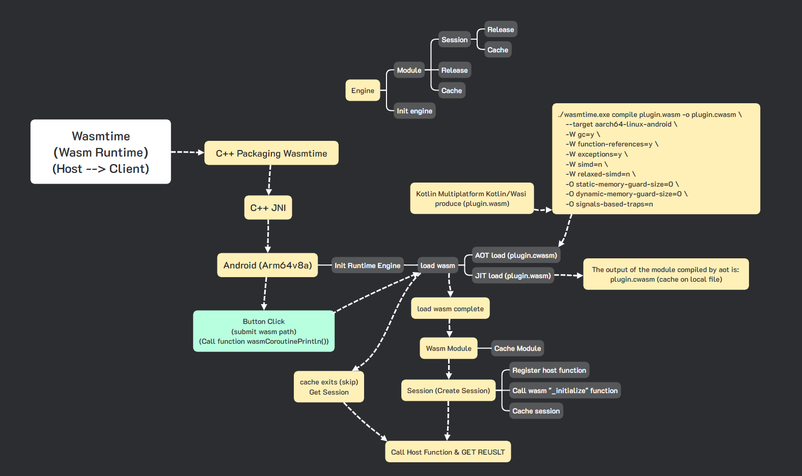
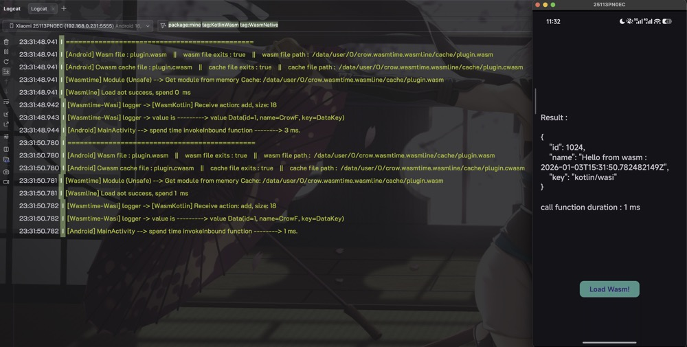
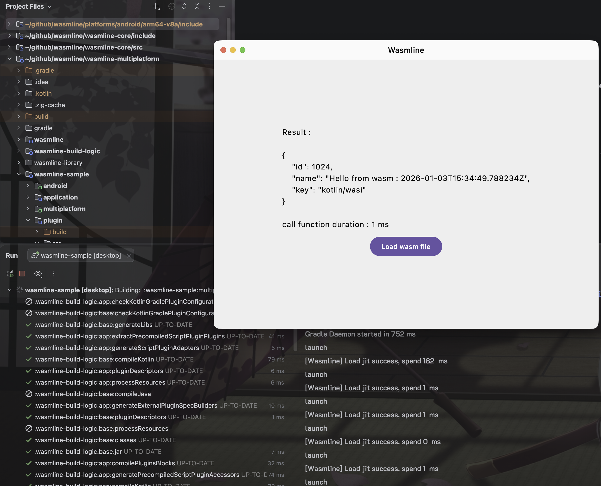

[中文文档](README_zh.md) | [English](README.md)

---

# Wasmline

A **Kotlin Multiplatform** plugin framework powered by [Wasmtime](https://wasmtime.dev/), enabling **WebAssembly (WASI)** plugin loading, packaging, and execution across Android, iOS, Desktop (macOS / Windows / Linux), and, in the future, Web.

Plugins can be developed in **any language** that compiles to WASI — Kotlin, Rust, C/C++, Go, AssemblyScript, and more.

## Platform Support

| Platform | Architecture | Runtime | Status |
|----------|-------------|---------|--------|
| Android  | arm64-v8a   | Wasmtime (JNI) | :white_check_mark: Supported |
| iOS      | arm64       | Wasmtime (C Interop) | :white_check_mark: Supported |
| macOS    | arm64       | Wasmtime (JNI/Zig) | :white_check_mark: Supported |
| Linux    | x86_64      | Wasmtime (JNI/Zig) | :white_check_mark: Supported |
| Windows  | x86_64      | Wasmtime (JNI/Zig) | :white_check_mark: Supported |
| Web      | wasm32-wasi | Kotlin/Wasi | :construction: Planned |

## Architecture



_Wasmline architecture overview_

### Module Structure

```text
wasmline-multiplatform/
├── wasmline/              # Core runtime — WASM module loading & execution
├── wasmline-loader/       # Crypto & manifest — Ed25519/ECDSA-P256 signing, manifest serialization
├── wasmline-cli/          # CLI toolchain — build, compile, manifest, download, key generation
├── wasmline-android/      # Android native bindings (CMake / JNI C++)
├── wasmline-kotlin-plugin/# Kotlin compiler plugin — IR-oriented typed glue generation
├── wasmline-gradle-plugin/# Gradle integration for the Kotlin plugin and tooling
├── wasmline-sample/       # Sample applications (plugin, Android, Desktop, Multiplatform Compose)
└── wasmline-build-logic/  # Shared Gradle convention plugins
```

**Dependency flow**: `wasmline-cli` → `wasmline-loader` → `wasmline` (core)

### Key Technologies

- **Kotlin Multiplatform** with custom source set hierarchy
- **Wasmtime 41.0.1** as the underlying WASM runtime
- **kotlinx.serialization** for JSON and Protobuf payloads
- **Ed25519 / ECDSA-P256** for manifest signing and verification
- **Clikt** for the CLI experience
- **AOT compilation** — `.wasm` → `.cwasm` / `.pwasm`
- **Kotlin compiler plugin (IR phase one)** for generated `Definition / Proxy / Adapter` glue

## Getting Started

### Prerequisites

- **Java 21** or later for general builds; use **JBR 21** for Gradle tasks covered by `./.github/skills/wasmline/scripts/skill_preflight.sh` (especially Compose Desktop / desktop samples)
- **Zig 0.15.1** (for native library builds)
- a locally prepared Wasmtime toolchain when building AOT artifacts

### Initialization

Initialize the required platform assets:

```zsh
sh ./scripts/init.sh
```

### Build

All Gradle commands run from the `wasmline-multiplatform/` directory:

Before running Gradle, verify the current shell with:

```zsh
bash ./.github/skills/wasmline/scripts/skill_preflight.sh
```

```zsh
cd wasmline-multiplatform

# Build everything
./gradlew build

# Run loader tests (manifest, crypto, verification, etc.)
./gradlew :wasmline-loader:jvmTest

# Run CLI tests
./gradlew :wasmline-cli:test

# Compile the WASM plugin sample
./gradlew :wasmline-sample:plugin:compileProductionLibraryKotlinWasmWasiOptimize

# Run compiler-plugin IR box tests
./gradlew :wasmline-kotlin-plugin:test --tests 'crow.wasmline.kotlin.runners.JvmBoxTestGenerated'
```

### Native (Zig) Build

Outputs JNI native libraries for the host platform:

```zsh
cd wasmline-multiplatform/wasmline

zig build --release=small -p src/jvmMain/resources
zig build -p src/jvmMain/resources
```

## CLI Toolchain

Wasmline provides a CLI for the full plugin build pipeline. All commands run through Gradle:

```zsh
cd wasmline-multiplatform
./gradlew :wasmline-cli:run --args="<command> [options]"
```

| Command | Description |
|---------|-------------|
| `download` | Download Wasmtime releases for target platforms |
| `generate-key-pair` | Generate signing key pairs |
| `compile` | Compile `.wasm` to AOT artifacts (`.cwasm` / `.pwasm`) |
| `manifest` | Generate a signed manifest (`.wlm`) from compile output |
| `build` | Full pipeline: compile → manifest → zip packaging |

### Example: Full Build Pipeline

```zsh
cd wasmline-multiplatform

# 1. Download Wasmtime
./gradlew :wasmline-cli:run --args="download -v v41.0.1"

# 2. Generate signing keys
./gradlew :wasmline-cli:run --args="generate-key-pair --save"

# 3. Build plugin (compile → sign → package)
./gradlew :wasmline-cli:run --args="build -i plugin.wasm -wt build/wasmline/wasmtime/wasmtime-v41.0.1-aarch64-macos --key build/wasmline/keys/ed25519_private.key"
```

### Build Output

```text
build/wasmline/
├── output/{name}-{version}/
│   ├── manifest.wlm                # Signed manifest (Protobuf)
│   ├── {name}-pulley64.pwasm       # Pulley portable bytecode
│   ├── {name}-aarch64-android.cwasm
│   ├── {name}-aarch64-macos.cwasm
│   ├── {name}-aarch64-ios.cwasm
│   ├── {name}-x86_64-linux.cwasm
│   ├── {name}-x86_64-windows.cwasm
│   └── debug/
│       ├── compile-result.json
│       └── manifest.json           # Human-readable manifest
├── dist/
│   └── {name}-{version}.zip        # Distributable package
└── keys/
    ├── ed25519_private.key
    └── ed25519_public.key
```

See `wasmline-multiplatform/wasmline-cli` for command-level documentation.

## Samples



_Android sample_



_Compose Desktop (macOS)_

Sample code lives in `wasmline-multiplatform/wasmline-sample`, including:

- a WASI plugin sample
- Android host sample
- desktop sample
- multiplatform shared sample

## Kotlin/Wasi Compatibility


_Kotlin/Wasi runtime support status_

Wasmline currently expects **Kotlin 2.3.20-Beta1** or later for reliable Kotlin/Wasi support. Earlier versions or different runtimes may fail or miss required Wasm features such as GC, function references, and exception handling.

## For Developers

If you are working on Wasmline itself, the most useful entry points are:

- `wasmline-core` — native Wasmtime bridge
- `wasmline-multiplatform/wasmline` — runtime SPI and public API
- `wasmline-multiplatform/wasmline-kotlin-plugin` — Kotlin compiler plugin
- `wasmline-multiplatform/wasmline-kotlin-plugin/testData/box/README_en.md` — IR box testData guide
- `.github/skills/wasmline/SKILL.md` — repository workflow, preflight, and module routing guide
- `structs/ir-plan.md` — current IR plan and implementation notes

## Resources

- [wasm-kotlin-exploration](https://github.com/crowforkotlin/wasm-kotlin-exploration) — Wasm + Kotlin research and test cases
- [Wasmtime on Android (JNI)](https://crowforkotlin.github.io/2025/11/27/Wasm/Android%E4%BD%BF%E7%94%A8JNI%E5%B5%8C%E5%85%A5Wasmtime/) — Embedding Wasmtime on Android via JNI
- [Wasm vs. Wasi Deep Dive](https://crowforkotlin.github.io/2025/11/25/Wasm/Wasm%E5%92%8CWasi%E5%8C%BA%E5%88%AB%E5%92%8C%E7%94%9F%E5%91%BD%E5%91%A8%E5%BA%86/) — Differences between Wasm and Wasi, and their lifecycles

## License

See [LICENSE](LICENSE) for details.
