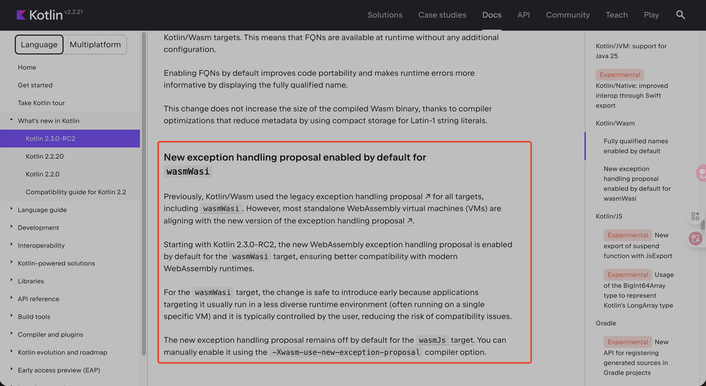
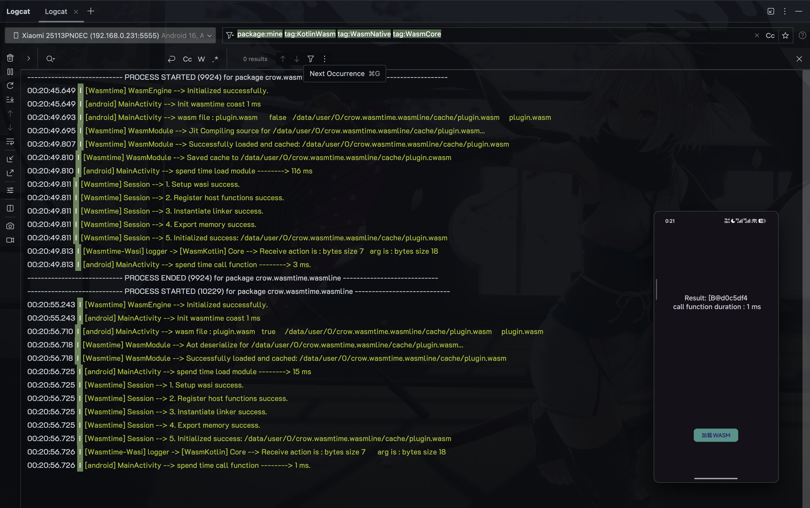
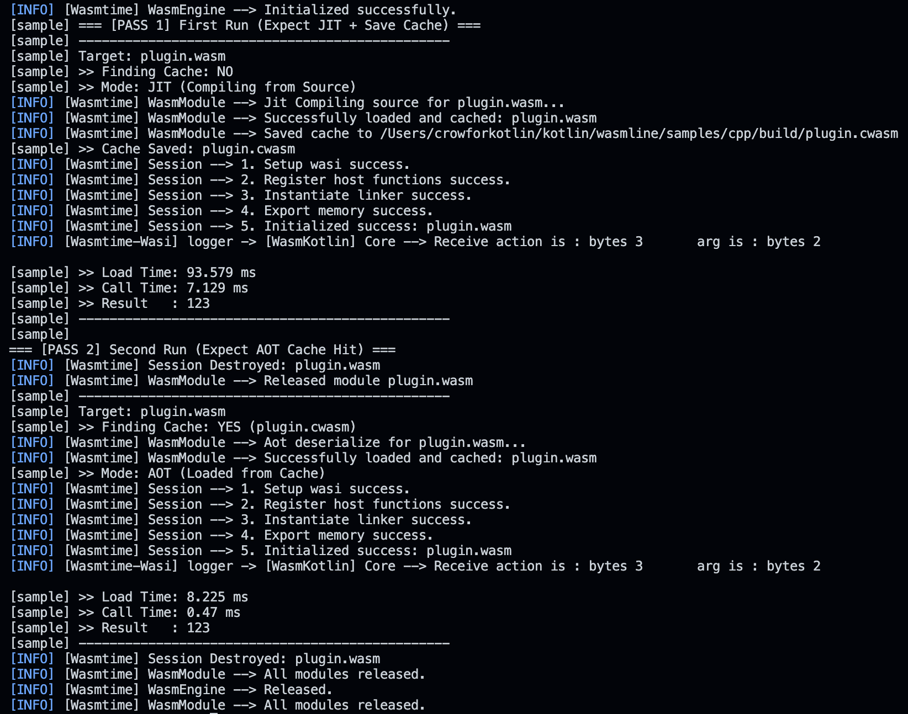

[中文文档](README_zh.md) | [English](README.md)

---

# WasmLine

## 🚀 WasmLine 支持与主要发现

> WasmLine 旨在提供跨多个平台的兼容性：**Windows**、**Ubuntu**、**MacOS** 和 **Android**。它以 **Kotlin Multiplatform** 为基础构建，同时支持使用**任何编程语言**来开发 Wasi 兼容的插件。

### ✨ 功能支持 (未来探索)
-   **IOS** (需要研究和测试, 计划使用Kotlin Native)
-   **Web**

### ⚠️ 重要运行时说明 (Kotlin/Wasi)

截至 **2025 年 12 月 4 日**，对多个主流运行时的测试表明，Kotlin/Wasi 存在一个关键的兼容性问题：
> 目前，只有 **Kotlin 2.3.0-RC** 提供了可靠的支持。所有其他运行时要么抛出错误，要么无法完全支持所需的最新 Wasm 特性。

## 📚 相关资源

详细的发现，包括 **Wasmtime** 在 Android 上的配置和特定的 Kotlin-Wasi 支持说明，都记录在以下资源中：

*   **Wasm/Kotlin 探索:** [wasm-kotlin-exploration](https://github.com/crowforkotlin/wasm-kotlin-exploration)
*   **Wasmtime 在 Android 上 (JNI):** [wasmtime-android-issue-blog](https://crowforkotlin.github.io/2025/11/27/Wasm/Android%E4%BD%BF%E7%94%A8JNI%E5%B5%8C%E5%85%A5Wasmtime/) (Wasntime 使用 JNI 嵌入 Android)
*   **Wasm 与 Wasi 深度解析:** [understand wasm and wasi diff](https://crowforkotlin.github.io/2025/11/25/Wasm/Wasm%E5%92%8CWasi%E5%8C%BA%E5%88%AB%E5%92%8C%E7%94%9F%E5%91%BD%E5%91%A8%E5%BA%86/) (Wasm 与 Wasi 的区别及其生命周期)

---

## 🖼️ 架构与可视化

### Kotlin 支持状态
<table>
	<tr>
		<td align="center"></td>
	</tr>
    <tr>
		<td align="center">Kotlin 支持</td>
	</tr>
</table>   

### 架构概览
<table>
	<tr>
		<td align="center"></td>
	</tr>
    <tr>
		<td align="center">架构</td>
	</tr>
</table>

---

## 🛠️ 预构建设置

### 初始化
要初始化所需的平台库，请执行以下脚本：

```bash
sh ./scripts/init.sh
```
***

## ✨ 示例

### 运行示例

要在支持的平台上运行示例应用程序：

```bash
sh ./scripts/samples/run.sh
```

### 示例演示
<table>
	<tr>
		<td align="center"></td>
		<td align="center"></td>
	</tr>
    <tr>
		<td align="center">Android</td>
		<td align="center">Macos</td>
	</tr>
</table>

---

## ⚙️ AOT 编译 (compile cwasm)

- 使用以下配置配合 `wasmtime compile` 对 Android 目标 (`aarch64-linux-android`) 执行提前编译 (AOT)，以启用垃圾回收 (`gc=y`) 和函数引用等关键特性：

- Kotlin 需要对特定功能的支持。`simd`、`relaxed-simd` 和内存保护的设置是经过在 Android 上持续测试后添加的必要条件。

```bash

wasmtime compile plugin.wasm -o plugin.cwasm \
    --target aarch64-linux-android \
    -W gc=y \
    -W function-references=y \
    -W exceptions=y \
    -W simd=n \
    -W relaxed-simd=n \
    -O static-memory-guard-size=0 \
    -O dynamic-memory-guard-size=0 \
    -O signals-based-traps=n \
    -O opt-level=2 \
    -C cranelift-debug-verifier=no
```